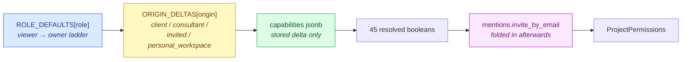
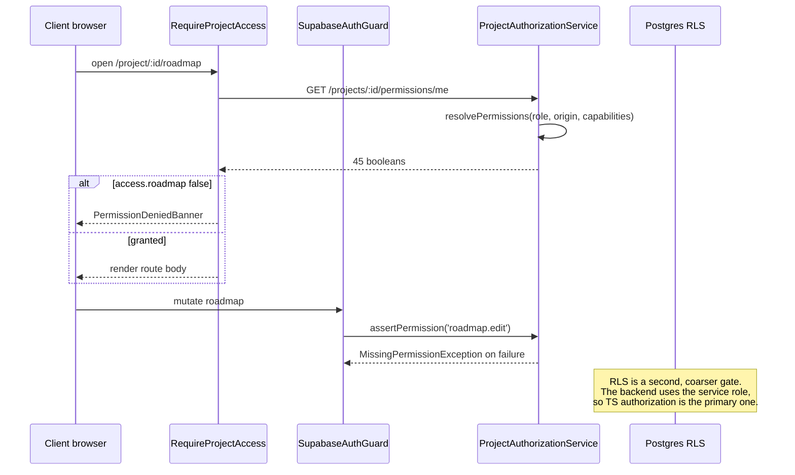

# Client Access and Permissions

> **Last updated:** 2026-08-07 · **Status:** current

A client's 45 permissions are never stored. They are recomputed on every check from three
layers, and only the *delta* from the baseline is persisted — so role templates can evolve
without a backfill. This page walks the resolution, gives the resolved matrix for the two
configurations a client is actually created in, and documents a non-obvious property of the
current code: **the client origin delta changes nothing except at `owner` role.**

## The resolution

```
resolvePermissions(role, origin, capabilities)
  = ROLE_DEFAULTS[role]      // coarse baseline for the rank
  ⊕ ORIGIN_DELTAS[origin]    // patch by grant source, regardless of rank
  ⊕ capabilities             // per-member overrides; flat paths win
```

— [`project-permissions.ts:515`](../../../backend/src/modules/projects/permissions/project-permissions.ts)



Each layer overwrites the previous one path-by-path. `capabilities` holds only what differs
from the `(role, origin)` baseline — `diffCapabilities()` computes that minimal set on write.

## The client origin delta

```ts
client: {
  'chat.message_freelancers': false,
  // They fund the work, so the billing surfaces stay open to them — but
  // not Time, which is the delivery team's cost side.
},
```

That is the entire delta — one path. Compare the consultant delta, which adds four
capabilities *additively regardless of role*:

| Origin | Delta |
| --- | --- |
| `client` | `chat.message_freelancers: false` |
| `consultant` | `chat.message_freelancers`, `members.manage`, `teams.manage`, `time.view_team_logs` → all `true` |
| `invited` | `{}` — pure role baseline |
| `personal_workspace` | every path → `true` |

> **⚠️ The client delta is a no-op below `owner`.** `chat.message_freelancers` is never
> granted by `ROLE_DEFAULTS` at `viewer`, `commenter`, `editor`, or `admin` — only
> `allTrue()` at `owner` sets it. So setting it `false` changes the outcome **only** when a
> client holds the owner role. At every other rank the delta re-denies something already
> denied. Soft isolation below owner is enforced by the role baselines, not by the origin.
> This is defence-in-depth and correct, but do not read the delta as the mechanism.

## How a client actually gets created

Two paths, both in `ProjectsService.createProject`:

| `creation_mode` | Role granted | Origin | Notes |
| --- | --- | --- | --- |
| `'client'` (**default**) | `admin` | `client` | No owner exists until a consultant joins |
| `'consultant'` | `owner` | `consultant` | Requires `is_consultant_verified`; forces `status: 'draft'` |

A client invited to an existing project instead gets whatever `project_invites.default_role`
says, with `origin` set by the grant call — see [user-flows.md](./user-flows.md).

## Resolved matrix

The two configurations that actually occur. `admin + client` is the project creator in the
default mode; `viewer + client` is a typical invited stakeholder.

| Path | `viewer` + client | `admin` + client | `owner` + client |
| --- | --- | --- | --- |
| `access.roadmap` / `work_items` / `team` / `chat` / `resources` / `time` | ✅ | ✅ | ✅ |
| `access.project_settings` | ❌ | ✅ | ✅ |
| `roadmap.view` / `roadmap.export` | ✅ | ✅ | ✅ |
| `roadmap.comment` | ❌ | ✅ | ✅ |
| `roadmap.edit` / `assign` / `edit_metadata` / `create_tasks` / `edit_tasks` / `share` | ❌ | ✅ | ✅ |
| `roadmap.promote` / `view_internal` / `dev_mode` | ❌ | ✅ | ✅ |
| `members.view` / `teams.view` | ✅ | ✅ | ✅ |
| `members.manage` / `edit_permissions` / `edit_position` / `teams.manage` | ❌ | ✅ | ✅ |
| `project.settings` / `edit_content` / `view_internal_content` | ❌ | ✅ | ✅ |
| `chat.view_channels` | ✅ | ✅ | ✅ |
| `chat.send_messages` / `mention_members` / `start_dm` / `send_dm` | ❌ | ✅ | ✅ |
| `chat.share_files` / `create_channels` / `manage_channels` / `view_internal_channels` | ❌ | ✅ | ✅ |
| `chat.message_clients` / `chat.message_consultants` | ✅ | ✅ | ✅ |
| **`chat.message_freelancers`** | ❌ | ❌ | **❌ ← the delta bites here** |
| `resources.view` | ✅ | ✅ | ✅ |
| `resources.upload` / `resources.delete` | ❌ | ✅ | ✅ |
| `logs.view` | ✅ | ✅ | ✅ |
| `logs.view_sensitive` | ❌ | ✅ | ✅ |
| `time.view_team_logs` | ❌ | ✅ | ✅ |

Derived from `buildRoleDefault()` and `ORIGIN_DELTAS` in
[`project-permissions.ts`](../../../backend/src/modules/projects/permissions/project-permissions.ts).
Regenerate rather than transcribe if the file changes.

> **On money and time.** A client at `admin` sees `time.view_team_logs` because *admin*
> grants it, not because they are a client. The comment in `buildRoleDefault` — "the client
> origin re-opens the billing three" — describes intent that the `client` delta no longer
> implements; billing visibility comes from the role and from the separate
> consultant-gated `/finance` surface. Treat the comment as aspirational, the table as real.

## Two paths that are deliberately not permissions

- **`mentions.invite_by_email`** is folded in *after* resolution by
  `ProjectsService.getMyPermissions`, and is absent from `PERMISSION_PATHS` on purpose — so
  `allTrue()` cannot fabricate it for an owner and an admin cannot hand it to a viewer. It
  gates on a **role comparison** plus a feature switch, because the enforcing service uses
  `assertRole('admin')` while `ORIGIN_DELTAS` hands `members.manage` to client and consultant
  origins regardless of rank. The two would disagree if it used the permission.
- **`assertRole` vs `assertPermission`.** They are not interchangeable. `roleSatisfies` compares
  ranks; `members.manage` is granted by origin. An editor-role consultant holds
  `members.manage` while `assertRole('admin')` refuses them. Anything that must agree with
  enforcement has to compare roles.

## Dependencies

`PERMISSION_DEPENDENCIES` declares prerequisites (e.g. `roadmap.edit` requires `roadmap.view`
and `access.roadmap`; `resources.delete` requires `resources.upload`). `validateDependencies()`
returns the unmet set so the permission editor can refuse an incoherent grant rather than
persisting one.

## The web mirrors

Three files mirror the backend model **by hand** and must be updated in the same change:

| File | Holds |
| --- | --- |
| [`permissionCatalog.ts`](../../../web/src/components/project/permissions/permissionCatalog.ts) | The path list and human labels for the permission editor |
| [`roleTemplates.ts`](../../../web/src/components/project/permissions/roleTemplates.ts) | Preset builders + `detectPreset()` |
| [`project.service.ts`](../../../web/src/services/project.service.ts) | The `ProjectPermissions` TypeScript shape |

> **⚠️** Nothing checks mirror parity at build time — unlike the activity vocabulary, which
> `npm run check:activity-actions` guards. Drift here is silent and shows up as a permission
> checkbox that does nothing.

## Enforcement layers



The frontend gate is a UX affordance, not a security boundary — it stops a blank screen, not
a determined caller. Every mutation re-checks server-side.

## See also

- [client-surfaces.md](./client-surfaces.md) — which gate guards which route.
- [Backend → auth & guards](../../03-backend/auth-and-guards.md) — the guard inventory.
- [Data → RLS and security](../../07-data-and-db/rls-and-security.md) — why RLS is secondary.
