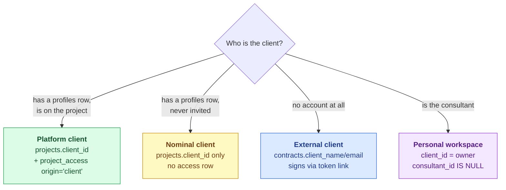
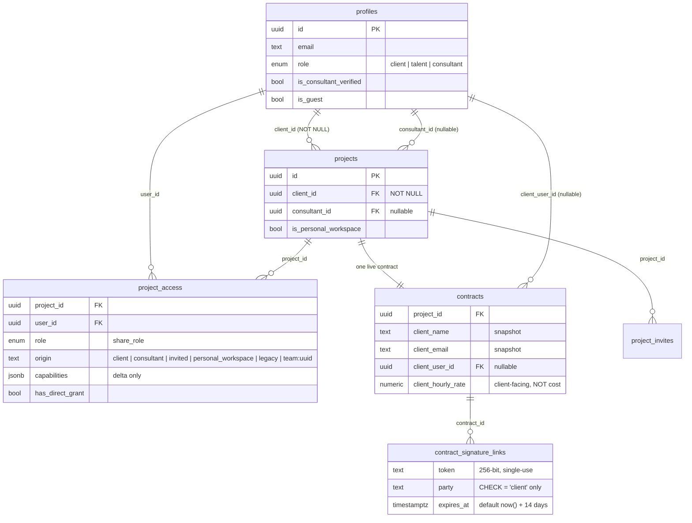

# Client Structure

> **Last updated:** 2026-08-09 · **Status:** current

There is no `clients` table. Proyekto now records `profiles.role='client'` as durable
account identity, but that identity does not grant project access or identify a contract
counterparty. The retired switchable `persona_type` was dropped in
`20260804170019_remove_active_persona.sql`; `account_role` deliberately restores identity,
not an “acting as” mode. Three project/contract facts still answer narrower questions and
can disagree with the account role.

## The three kinds of client

### 1. Platform client

The full case: a `profiles` row, named on the project, and holding a `project_access` row
with `origin = 'client'`. This is the only kind that can log in and see the project.

### 2. Nominal client

`projects.client_id` is `NOT NULL`, so **every project names a client profile** — including
projects where that person has never been invited and has no access row. A consultant who
creates a project on a client's behalf produces exactly this state. The `client_id` is a
pointer, not a grant.

> **⚠️** `client_id` being set does **not** mean the client can see the project. Access comes
> only from `project_access`. Never infer visibility from `client_id`.

### 3. External client

A counterparty who never signs up. They exist only as snapshotted strings on the contract:
`client_name`, `client_contact_name`, `client_address`, `client_tin`, `client_email`, and a
nullable `client_user_id` that links to a profile when one happens to exist. They reach
exactly one surface in the entire product — the tokenized signing page. See
[user-flows.md](./user-flows.md#external-client-signing).

The activation checklist accepts either kind: `ProjectActivationService` treats the
`client_identified` item as satisfied by a platform client **or** a client named on the
contract.

### 4. Personal workspace (the client is you)

A `projects` row with `is_personal_workspace = true`, auto-provisioned on first login. The
invariant, from `20260503000020_add_personal_workspace_to_projects.sql`: `client_id = owner`,
`consultant_id IS NULL`, at most one per user (partial unique index). The owner holds
`origin = 'personal_workspace'`, whose delta grants **every** permission path.

## Tables that touch the client

## `project_access` — the authorization source of truth

**Exactly one row per `(project_id, user_id)`.** `origin` used to be part of the uniqueness
key — a user held one direct row plus one per attached team — but
`20260507000130_collapse_project_access_single_row.sql` collapsed that, folding multi-row
pairs into one by taking the max role and OR-unioning capabilities. The current comments:

> **Table:** One row per (project, user). The single source of truth for role + capabilities
> + origin label. Team curations are tracked structurally in `project_team_members`; an access
> row stays alive while either `has_direct_grant` is true or any `project_team_members` row
> exists for the pair.
>
> **`origin`:** Primary-source label for the grant. **Not part of the uniqueness key** —
> descriptive hint consumed by `ORIGIN_DELTAS` in `project-permissions.ts`.
>
> — `20260507000130_collapse_project_access_single_row.sql`

> **⚠️** The older table comment in `20260507000020` still describes the multi-row model and
> is **superseded**. Read the newest migration that touches a comment, never the one that
> created the table.

Consequences worth internalizing:

- **Origin is a descriptive label, not a role and not an identity.** It never changes rank; it
  patches which permissions the holder gets. `grant()` deliberately preserves the existing
  origin on conflict, treating it as the original primary-source label — so a client who is
  later curated onto a team **keeps** `origin='client'` and keeps the client delta.
- **Access is additive and never demotes.** `grant()` sets the stored role to
  `max(existing, incoming)` and OR-unions capabilities.
- **A row outlives either of its two supports.** `has_direct_grant` and the existence of
  `project_team_members` rows are independent; the trigger deletes the access row only when
  both are gone.
- **Team-derived origins are normalized away.** `normalizeOrigin()` returns `null` for
  anything starting with `team:`, so a legacy team-origin row resolves as a plain role
  baseline with no delta.
- **The union in the resolver is now vestigial.** `ProjectAuthorizationService.resolvePermissions`
  still loops and OR-unions across rows; under the current unique constraint that loop can only
  ever see one row. It is harmless defence-in-depth, not live behaviour.

## Why there is no `clients` table

Three reasons, all still valid:

1. **Account identity is not a relationship.** `profiles.role='client'` says what kind of
   account was created; a project's client and permissions still require `projects` and
   `project_access`. A `clients` table would duplicate that relationship data.
2. **The external case has no identity to key on.** An email-only counterparty cannot have a
   row in a table that foreign-keys to `profiles`, and giving them shadow profiles was
   rejected when `contract_signature_links` was designed.
3. **`persona_type` proved the cost of a switchable mode.** `account_role` is server-owned
   and non-switchable, so it avoids the “acting as what?” branch while supporting signup
   identity and role-aware capability checks.

What *is* missing is a **parent** for projects — the ability to say "these four projects all
belong to ImHereTravels." That is a different problem from "who is the client on this
project," and it is designed in
[13-proposals/organizations-and-services.md](../../13-proposals/organizations-and-services.md).

## See also

- [access-and-permissions.md](./access-and-permissions.md) — what the client origin actually
  grants and denies.
- [Product → roles and capabilities](../../01-product/personas.md) — the four participant roles.
- [Data → schema overview](../../07-data-and-db/schema-overview.md) — the whole schema.
