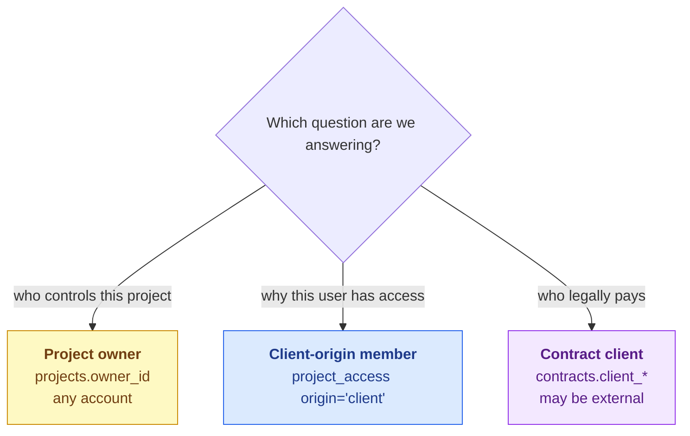
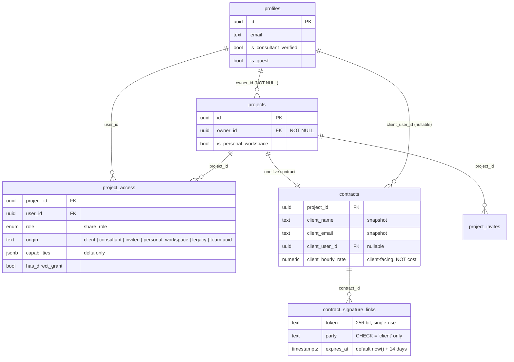

# Client Structure

> **Last updated:** 2026-08-11 · **Status:** current

There is no `clients` table — and no client *account* of any kind. Proyekto stores no
account role: the switchable `persona_type` was dropped in
`20260804170019_remove_active_persona.sql`, and the short-lived durable
`profiles.role` was dropped in `20260810160000_drop_profiles_role.sql` (rationale in
[13-proposals/identity-and-enrollment.md](../../13-proposals/identity-and-enrollment.md)).
"Client" is a **position on a project and its contract**: project ownership, access
origin, and contract counterparty each answer a narrower question and can disagree
with one another.

## Identity, ownership, access, and billing

There is deliberately **no account-level client fact** — no column says "this account
is a client." An account is a client *of a project* by holding one of the positions
below.

### 1. Project owner

`projects.owner_id` is `NOT NULL`, so every project has one controlling profile. Any
account may own a project; owning one implies nothing else about the account.
Authorization continues to come from `project_access`.

> **⚠️** `owner_id` being set does **not** by itself define a client relationship. Access comes
> only from `project_access`. Never infer visibility from `owner_id`.

### 2. Contract client

A billing counterparty is snapshotted on the contract. They may link to a profile through
`client_user_id` or never sign up at all. The contract stores
`client_name`, `client_contact_name`, `client_address`, `client_tin`, `client_email`, and a
nullable `client_user_id`. An external client reaches exactly one surface in the product —
the tokenized signing page. See
[user-flows.md](./user-flows.md#external-client-signing).

The activation checklist keeps the stable `client_identified` key. Today it accepts either
a project owner distinct from the consultant-of-record (`project_access.origin='consultant'`)
or a client named on the contract; the owner fallback is role-neutral compatibility behavior.

### 3. Personal workspace

A `projects` row with `is_personal_workspace = true`, auto-provisioned on first login. The
invariant, from `20260503000020_add_personal_workspace_to_projects.sql`: `owner_id` is the
workspace user and there is at most one per user (partial unique index). The owner holds
`origin = 'personal_workspace'`, whose delta grants **every** permission path.

## Tables that touch the client

## `project_access` — the authorization source of truth

**Exactly one row per `(project_id, user_id)`.** `origin` used to be part of the uniqueness
key — a user held one direct row plus one per attached team — but
`20260507000130_collapse_project_access_single_row.sql` collapsed that, folding multi-row
pairs into one by taking the max role and OR-unioning capabilities. The current comments:

> **Table:** One row per (project, user). The single source of truth for role + capabilities
> + origin label. Team curations are tracked structurally in `project_team_members`; an access
> row stays alive while either `has_direct_grant` is true or any `project_team_members` row
> exists for the pair.
>
> **`origin`:** Primary-source label for the grant. **Not part of the uniqueness key** —
> descriptive hint consumed by `ORIGIN_DELTAS` in `project-permissions.ts`.
>
> — `20260507000130_collapse_project_access_single_row.sql`

> **⚠️** The older table comment in `20260507000020` still describes the multi-row model and
> is **superseded**. Read the newest migration that touches a comment, never the one that
> created the table.

Consequences worth internalizing:

- **Origin is a descriptive label, not a role and not an identity.** It never changes rank; it
  patches which permissions the holder gets. `grant()` deliberately preserves the existing
  origin on conflict, treating it as the original primary-source label — so a client who is
  later curated onto a team **keeps** `origin='client'` and keeps the client delta.
- **Access is additive and never demotes.** `grant()` sets the stored role to
  `max(existing, incoming)` and OR-unions capabilities.
- **A row outlives either of its two supports.** `has_direct_grant` and the existence of
  `project_team_members` rows are independent; the trigger deletes the access row only when
  both are gone.
- **Team-derived origins are normalized away.** `normalizeOrigin()` returns `null` for
  anything starting with `team:`, so a legacy team-origin row resolves as a plain role
  baseline with no delta.
- **The union in the resolver is now vestigial.** `ProjectAuthorizationService.resolvePermissions`
  still loops and OR-unions across rows; under the current unique constraint that loop can only
  ever see one row. It is harmless defence-in-depth, not live behaviour.

## Why there is no `clients` table

Three reasons, all still valid:

1. **Being a client is a relationship, not an attribute.** A project's client and
   their permissions are already expressed by `projects` and `project_access`. A
   `clients` table — like the deleted `profiles.role` — would duplicate that
   relationship data at the account level, where it answers no authorization question.
2. **The external case has no identity to key on.** An email-only counterparty cannot have a
   row in a table that foreign-keys to `profiles`, and giving them shadow profiles was
   rejected when `contract_signature_links` was designed.
3. **Both account-level role experiments failed.** The switchable `persona_type` created an
   “acting as what?” branch; the durable `account_role` created an identity wall that
   contradicted per-contract positions and was deleted the day after it landed. The rule
   now is **gate on capabilities and positions, never declared identity** — see
   [13-proposals/identity-and-enrollment.md](../../13-proposals/identity-and-enrollment.md).

What *is* missing is a **parent** for projects — the ability to say "these four projects all
belong to ImHereTravels." That is a different problem from "who is the client on this
project," and it is designed in
[13-proposals/organizations-and-services.md](../../13-proposals/organizations-and-services.md).

## See also

- [access-and-permissions.md](./access-and-permissions.md) — what the client origin actually
  grants and denies.
- [Product → roles and capabilities](../../01-product/personas.md) — the participant positions.
- [Data → schema overview](../../07-data-and-db/schema-overview.md) — the whole schema.
