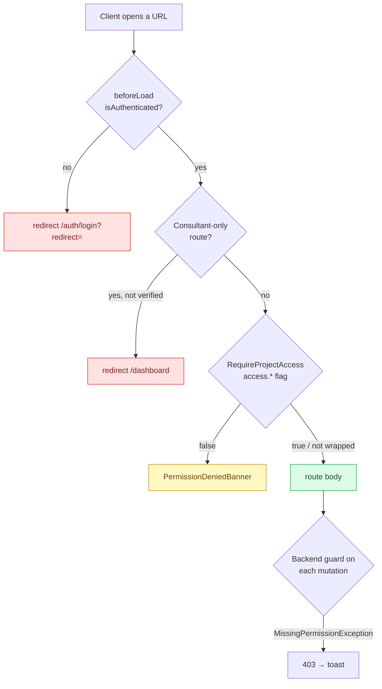

# Client Surfaces

> **Last updated:** 2026-08-10 · **Status:** current

There is **no client route subtree**. Every surface a client reaches is a shared route
that renders differently, or hides entirely, based on resolved permissions. This page is the
complete inventory, with the gate on each — including the three project tabs that are not
gated by `RequireProjectAccess` at all.

> **⚠️** `web/src/routes/client/` does not exist. Older notes in `web/CLAUDE.md` and
> `docs/04-web/routing-and-personas.md` describing it as "empty" were stale; the directory was
> removed, not emptied.

## Gate layers

51 route files carry a `beforeLoad` auth guard. The `projectId === "n"` sentinel deliberately
bypasses it so anonymous guests can build a roadmap.

## Project tabs

`web/src/routes/project/$projectId/` — the layout wraps children in `ProtectedRoute`
(authentication only).

| Route | Gate | Client at `viewer` | Client at `admin` |
| --- | --- | --- | --- |
| `overview.tsx` | **none** beyond auth + membership | ✅ | ✅ |
| `roadmap.tsx` (+ `roadmap/$roadmapId`, `roadmap/create`) | `RequireProjectAccess access="roadmap"` | ✅ read-only | ✅ |
| `work-items.tsx` (+ `work-items/$roadmapId`) | `RequireProjectAccess access="work_items"` | ✅ | ✅ |
| `resources.tsx` | `RequireProjectAccess access="resources"` | ✅ read-only | ✅ |
| `chat/$chatRef.tsx` | `RequireProjectAccess access="chat"` | ✅ view only | ✅ |
| `time.tsx` | `RequireProjectAccess access="time"` | ✅ **own logs only** | ✅ team logs |
| `logs.tsx` | **inline** `permissions.logs.view` | ✅ | ✅ + sensitive |
| `team/{index,catalog,invites,permissions,teams}` | **none** — relies on backend 403s | ✅ | ✅ |
| `settings/{index,general,permissions,team,teams,time}` | **none** in the route; `access.project_settings` gates the UI | ❌ | ✅ |

Two notes on the exceptions:

- **`logs.tsx` is gated inline on purpose.** `RequireProjectAccess`'s `access` prop is typed to
  the `access.*` section, which has no `logs` key, and six other routes depend on that
  contract. The route reads `permissions.logs.view` directly instead.
- **`team/*` and `settings/*` are not wrapped.** They render and let backend 403s surface as
  toasts. That is a UX gap, not a security hole — every mutation re-checks server-side — but a
  viewer-role client can open the settings shell and see empty panels.

> **Time is asymmetric.** `access.time` is `true` from `viewer` up, so every client can open
> the Time tab — but they see **only their own logs**. Seeing the team's time is
> `time.view_team_logs`, granted at `admin` and to the consultant origin. The delivery team's
> cost side stays closed by default.

## Top-level routes

| Route | Available to a client? | Gate |
| --- | --- | --- |
| `/dashboard` | ✅ | auth |
| `/invites` | ✅ | auth — the canonical invite inbox; `/freelancer/invites` redirects here |
| `/inbox`, `/notifications` | ✅ | auth |
| `/meetings` | ✅ | auth |
| `/work-items` | ✅ | auth (cross-project) |
| `/settings/{appearance,notifications,mcp-tokens}` | ✅ | auth |
| `/profile/$profileId` | ✅ | auth |
| `/finance/*` | ❌ **effectively no** | Backend `@UseGuards(SupabaseAuthGuard, ConsultantOnlyGuard)` on `/api/finance` — the page loads but every query 403s |
| `/consultant/{marketplace,templates}` | ❌ | `beforeLoad` redirects unless vetting is complete (`isActiveConsultant`: `is_consultant_verified`) |
| `/project-posting` | ✅ | auth — this is how a client posts a project |
| `/contract/sign/$token` | ✅ **no account needed** | Bearer token only; service-role read |
| `/admin/*` | ❌ | `adminMe` query in the layout → "Access Denied" |

> **⚠️ The billing gap.** `docs/01-product/personas.md` says the Client "tracks project
> health, funds delivery", and `buildRoleDefault` comments claim the client origin "re-opens
> the billing three (contract/invoices/financials)". In the shipped code the whole `/finance`
> surface is `ConsultantOnlyGuard`, so a client cannot reach contracts, invoices, or
> financials in-app at all. Client-facing billing is delivered **out of band** — invoice PDFs
> by email, contracts by signing link. Treat any doc claiming otherwise as aspirational.

## What a client sees of an invoice

Invoices are consultant-authored and delivered as attached PDFs; the in-app notification
returns the client to the project overview rather than to a finance page. Two protections are
worth restating because they are client-visibility rules:

- Approved hours are priced at the **contract's client rate**, never at
  `task_time_logs.rate_snapshot` — that is the member's internal cost and must never be shown
  to or billed to a client.
- `invoices.hours_detail_level` (`none` / `summary` / `detailed`) controls how much time
  detail appears. Member identity never appears on an invoice.

See [Product → invoice lifecycle](../../01-product/invoice-lifecycle.md).

## Navigation

`ProjectSidebar.tsx` and `ProjectBottomNav.tsx` hide items whose `access.*` flag is false, so a
viewer-role client sees a shorter sidebar rather than a wall of denied banners. New route paths
must also be registered in `Header.tsx` `validPaths` or the header breaks on them.

## See also

- [access-and-permissions.md](./access-and-permissions.md) — what each flag resolves to.
- [Web → routing and personas](../../04-web/routing-and-personas.md) — the full route inventory.
