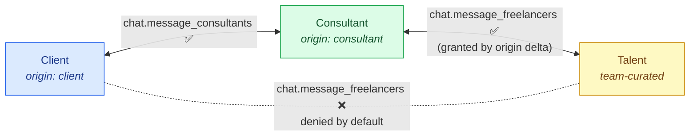
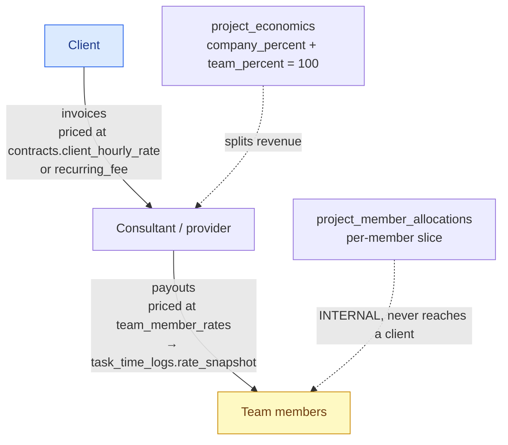

# Client ↔ Consultant Interaction

> **Last updated:** 2026-08-09 · **Status:** current

The Consultant layer is Proyekto's differentiator: a vetted project lead sitting between the
Client and Talent, so a freelance hire becomes managed delivery. This page documents
what that separation actually enforces, how money flows through it, and answers the standing
question about inviting an individual contractor who belongs to no team.

## Soft isolation

The intent is that a client talks to their consultant, not to the delivery pool. Three
mechanisms carry it, with very different strengths.

| Mechanism | Strength |
| --- | --- |
| `ROLE_DEFAULTS` never grant `chat.message_freelancers` below `owner` | **Strong** — this is what actually enforces it |
| `ORIGIN_DELTAS.client` sets `chat.message_freelancers: false` | **Weak** — a no-op except at `owner` role (see [access-and-permissions.md](./access-and-permissions.md#the-client-origin-delta)) |
| `ORIGIN_DELTAS.consultant` grants it `true` regardless of role | **Strong** — an editor-role consultant can still reach everyone |

> **⚠️ It is called *soft* isolation for a reason.** It is a default, not a wall. An admin can
> grant `chat.message_freelancers` to any member through the capabilities override, and a
> client curated onto a delivery team picks up whatever that team's role grants. Do not treat
> it as a confidentiality boundary.



## The billing chain

Money moves in two independent halves that never share a rate. This is the invariant that
matters most, because leaking one into the other bills a client at cost or pays a member at
the client price.



| Rate | Whose | Ever shown to a client? |
| --- | --- | --- |
| `contracts.client_hourly_rate` | What the client pays | ✅ — it is the invoice price |
| `contracts.recurring_fee` | Retainer amount | ✅ |
| `team_member_rates.hourly_rate` | The member's internal cost | ❌ **never** |
| `task_time_logs.rate_snapshot` | Cost at time of logging | ❌ **never** |
| `project_member_allocations` | Each member's slice of the team pool | ❌ — "INTERNAL — never reaches a client" |

Automated invoicing drafts one invoice per contract per closed billing period and notifies the
consultant. **Nothing is sent to a client automatically** — issuing is always a human action.

## Activation: where the client becomes load-bearing

Flipping a project to `active` runs `ProjectActivationService.buildChecklist()`, seven derived
items gating the billing flip. Two concern the client directly.

**`client_identified`** — severity `blocker`. Satisfied by *either*:

```ts
clientIdentified  = project.client_id && project.client_id !== project.consultant_id
clientOnContract  = contract.client_user_id || contract.client_email || contract.client_name
ok = clientIdentified || clientOnContract
```

Note the `!==` guard: a project where the client *is* the consultant (a personal workspace, or
a consultant testing) does **not** count as having a client. An external client named only on
the contract does.

**`contract_signed`** — a fully signed contract with usable commercial terms. The client's
signature can arrive through the app or through a tokenized link.

The checklist deliberately gates only the *billing* flip. Its own doc comment explains why:
activating without these "produces invoices with no price and payouts with no rate." Anything
that does not produce that failure does not belong in the blocker set.

## Can we invite an individual contractor who is not on a team?

**Yes — it already works, and nothing new needs building.**

`project_invites` plus `project_access.origin = 'invited'` is exactly "one person, one
project, no team." `ORIGIN_DELTAS.invited` is `{}` — a pure role baseline with no extra
capabilities. This has shipped and is the path behind
[`/invites`](../../../web/src/routes/invites.tsx).

> **⚠️ But there is a silent footgun.** A directly-invited person has no `project_team_members`
> row. `ProjectActivationService.getCuratedMembers()` reads *only* `project_team_members`, so
> that person:
>
> - never appears in the `member_rates_set` or `hour_limits_set` checklist items,
> - therefore has no `team_member_rates` row,
> - therefore appears in **no payout**.
>
> They will do work and not get paid, and nothing in the product says so.

**Recommendation.** Use direct invites for *collaborators* — client stakeholders, reviewers,
an auditor, a designer billed outside the platform. Require a team for anyone who gets **paid**.
`teams.is_personal` already exists, so "invite an individual and pay them" can be modelled as
attaching their personal team; it is heavier, but it keeps rates and payouts working.

**Do not add `origin = 'contractor'`.** A new origin means a new `ORIGIN_DELTAS` entry, a new
arm in both hand-maintained web mirrors, and a permanent branch in `resolvePermissions` — to
express something `invited` plus a rate already expresses.

A `warning`-severity checklist item surfacing unbilled direct members is proposed in
[13-proposals/client-access-handover.md](../../13-proposals/client-access-handover.md#related-activation-warnings).

## Guarantees and asymmetries

| Guarantee | Enforced? |
| --- | --- |
| The consultant cannot be removed from a project | ✅ `revoke()` compares against `projects.consultant_id` |
| The last owner cannot be removed | ✅ `countOwners()` must exceed 1 |
| The client cannot be removed | ❌ **no guard** — removing them leaves `client_id` dangling |
| A client cannot see internal cost rates | ✅ by role defaults + the separate `/finance` consultant guard |
| A client cannot DM freelancers | ⚠️ default only; overridable per member |

## See also

- [user-flows.md](./user-flows.md) — the invite and revocation mechanics.
- [teams-and-time.md](../teams-and-time.md) — curation → access fan-out and rates.
- [Product → project lifecycle](../../01-product/project-lifecycle.md) — activation in context.
