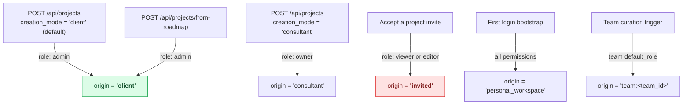
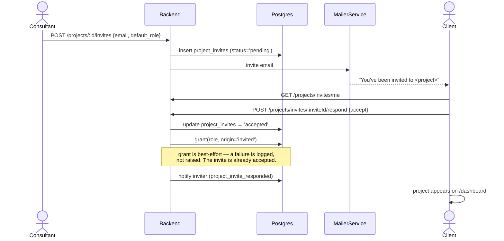
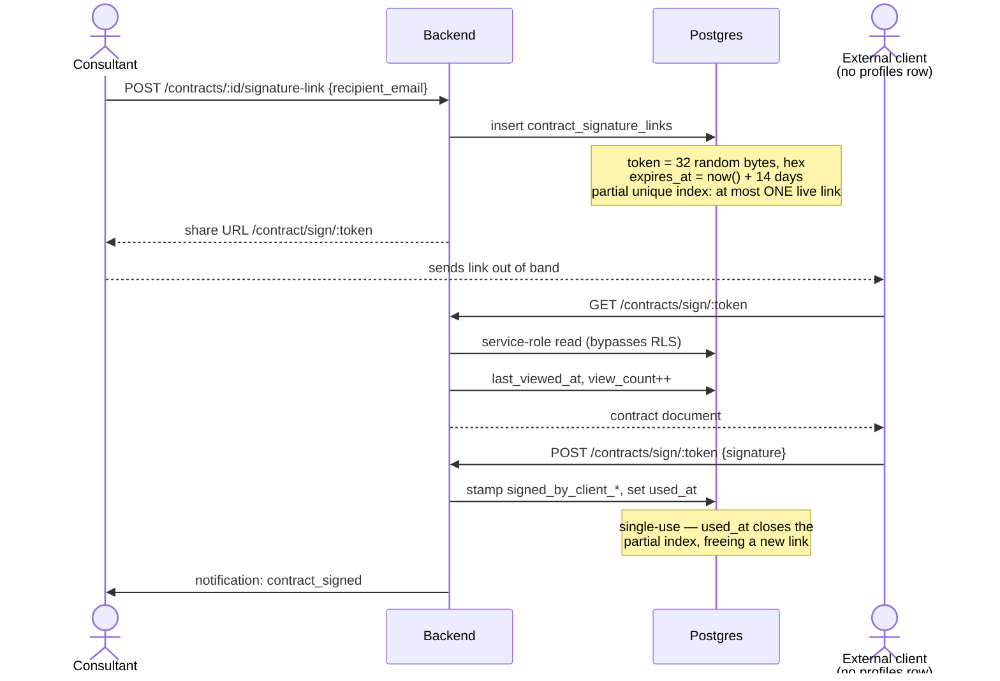

# Client User Flows

> **Last updated:** 2026-08-10 · **Status:** current

Four paths bring a client into contact with a project: they create it, they are invited to
it, they sign its contract from outside the product, or they arrive as a guest and convert.
The paths do not converge — in particular, **being invited to a project never makes you a
`client` origin**, which is the single most surprising thing on this page.

## Where `origin = 'client'` comes from

> **⚠️ Only the project creator is ever a `client` origin.** `ProjectsService.respondInvite`
> hardcodes `origin: 'invited'`. There is no code path that grants `origin: 'client'` to
> someone who was invited. A client invited to a consultant-created project therefore gets
> the `invited` delta (`{}`, i.e. nothing) and **not** the client delta — so the soft-isolation
> rule described in [consultant-interaction.md](./consultant-interaction.md) does not apply
> to them via origin. Below `owner` this changes nothing in practice (see
> [access-and-permissions.md](./access-and-permissions.md#the-client-origin-delta)), but it
> means `origin` cannot be used to answer "is this person the client?"

## 1. Invite → accept → access

Details that matter:

- **`default_role` is effectively binary.** `respondInvite` computes
  `default_role === 'viewer' ? 'viewer' : 'editor'`. Any other stored value — `commenter`,
  `admin`, `owner` — collapses to **`editor`**. The full ladder is not reachable through
  invites; promote afterwards from the People surface.
- **The grant is best-effort.** If `grant()` throws, the error is logged and swallowed
  because the invite row has already flipped to `accepted`. The result is an accepted invite
  with no access row — recoverable from the project's team settings UI.
- **Uniqueness** is `(project_id, invitee_id)`, so re-inviting an existing invitee updates
  rather than duplicates.
- The invitee-side surface is [`/invites`](../../../web/src/routes/invites.tsx);
  `/freelancer/invites` redirects there. The login round-trip preserves `?inviteId=`.

## 2. External client signing

The only flow in the product that serves someone with **no account at all**.

Security properties, quoted from `20260730093000_contract_signature_links.sql`:

> The token is a **BEARER CAPABILITY**: whoever holds the URL can sign as the client. It is
> therefore 256 bits, single-use, short-lived and revocable.

- **Hex, not base64.** `roadmap_shares.share_token` uses base64, which emits `+` and `/` —
  both URL-unsafe. Do not copy that pattern.
- **`party` is `CHECK (party IN ('client'))`.** Only the client side is shareable; the
  provider signs from inside the app.
- **No anon policy grants anything.** The public read/sign path runs through the service-role
  client in the backend. The RLS policies exist so that even a direct anon query could not
  enumerate tokens.
- **At most one live link per contract** (partial unique index on `used_at IS NULL AND
  revoked_at IS NULL`), so a link the consultant believes they revoked cannot still sign.

## 3. Guest → project

An anonymous visitor builds a roadmap before signing up, identified by an `x-guest-user-id`
header against a `profiles` row with `is_guest = true`. On signup the roadmap migrates to the
real account; converting it to a project grants the creator `admin` + `origin='client'`
on that project. This project-scoped origin is independent of whether signup selected the
Client, Talent, or Consultant account role. Guests are blocked from
`POST /projects/from-roadmap` and `POST /roadmaps/migrate` until they have an account. See
[Guests](../guests/README.md).

## 4. Leaving a project

Revocation is `ProjectAuthorizationService.revoke()`, with three modes and two hard refusals.

| `origin` argument | Effect |
| --- | --- |
| `undefined` | Full removal — drops `project_team_members` curations **and** the access row |
| `'team:<id>'` | Drops just that team's curation; the trigger decides whether the access row survives |
| anything else | Revokes the direct grant (`has_direct_grant = false`); deletes the row only if no team curations remain |

Two guards refuse regardless of caller:

- **The consultant cannot be removed** from a project — a product guarantee, enforced by
  comparing against `projects.consultant_id`.
- **The last owner cannot be removed.** `countOwners()` must exceed 1.

There is no equivalent guard for the project owner's access row: removing it leaves the
role-neutral `projects.owner_id` pointer intact while the owner may no longer be able to see
the project. See [client-structure.md](./client-structure.md#2-project-owner).

## See also

- [client-surfaces.md](./client-surfaces.md) — where each flow lands in the UI.
- [Product → invoice lifecycle](../../01-product/invoice-lifecycle.md) — what happens after signing.
- [Notifications and Push](../notifications/README.md) — the email and push fan-out.
