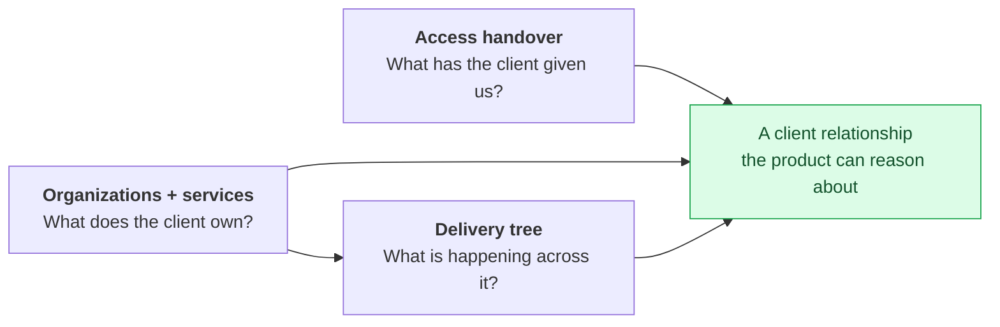

# Proposals

> **Last updated:** 2026-08-10 · **Status:** draft

Designs that have been reviewed but **not built**. Everything else in `docs/` describes
shipped behaviour and is verified against source; this section is the one place where that
guarantee is deliberately suspended, so that speculative work has somewhere to live without
being mistaken for reality.

If you only read one page, read
[organizations-and-services.md](./organizations-and-services.md) — the other two depend on it.

## The rules of this section

1. **Every page opens with `> **⚠️ Proposed — not built.**`** No exceptions. A reader who
   lands mid-page from a search result must be able to tell within one screen.
2. **Status is `draft` until it ships.** Never `current`.
3. **When a proposal ships, it moves.** The page is rewritten as current-state documentation
   under the section that owns it (usually [11-domains](../11-domains/README.md)) and
   **deleted from here**. This section never accumulates stale designs — that is the failure
   mode it exists to avoid.
4. **Proposals cite source.** A design that contradicts the current code must say so and point
   at the file, so the cost of the change is visible.

> **⚠️ Diagram exception.** [STYLE.md](../STYLE.md) mandates ASCII diagrams. This section and
> [11-domains/clients](../11-domains/clients/README.md) use **Mermaid** — these pages carry ER
> diagrams, state machines, and multi-actor sequences that ASCII renders badly. GitHub renders
> Mermaid natively. The rest of `docs/` stays ASCII.

## Documentation index

| Doc | What's in it |
| --- | --- |
| [client-access-handover.md](./client-access-handover.md) | Feature 1 — a tracked checklist for the external-system access a client must grant at onboarding |
| [organizations-and-services.md](./organizations-and-services.md) | Feature 2a — an Organization tier above projects, a real `services` table, and the resolution of `1 Roadmap = 1 Service` vs. `roadmaps.project_id UNIQUE` |
| [delivery-tree-visualization.md](./delivery-tree-visualization.md) | Feature 2b — a zoomable Org → Project → Service → Roadmap tree |
| [pricing-tiers-and-add-ons.md](./pricing-tiers-and-add-ons.md) | Monetization — 4-tier per-seat pricing for the Execution and Marketplace platforms, Shopify-style add-ons (Time/Finance), entitlement architecture, edge cases E1–E14 |

## Why these three

They come from one observation: Proyekto models *delivery* well and *the client relationship*
barely at all. There is no client parent, no record of what a client has handed over, and no
way to see a client's whole engagement at once.

The access handover is independent and can ship first. The tree depends on organizations and
services existing.

## Sequencing

Each database phase is **expand-only**. Nothing is dropped until a separate, explicitly-scoped
contract migration long after the readers have moved.

| Phase | Lands | Flag | User-visible |
| --- | --- | --- | --- |
| **P1** | Access handover: 3 migrations, `client-onboarding` module, UI | `CLIENT_ONBOARDING_ENABLED` | yes |
| **P1.5** | Handover email activation (a one-line `UPDATE`) | `email_eligible` | yes |
| **P2** | `services` table + dual-write from `ContractsService` | — | no |
| **P3** | `roadmaps.service_id`, partial unique indexes, `projects.primary_roadmap_id` | `MULTI_ROADMAP_ENABLED=false` | no |
| **P4** | `organizations`, members, invites, nullable project/team columns | `ORGANIZATIONS_ENABLED=false` | no |
| **P5** | `project_access.has_org_grant` + fan-out trigger; org admin UI | on internally | internal |
| **P6** | Multi-roadmap navigation | `MULTI_ROADMAP_ENABLED` per project | yes |
| **P7** | Delivery tree | `ORG_TREE_ENABLED` | yes |

This follows the repo's staged-rollout rule: user-visible features ship dark behind flags and
activate in phases. Prod migrations go through the Supabase MCP `apply_migration` tool —
**never** `supabase db push`, which fails with SASL.

## Terminology reserved by these proposals

Checked against the whole tree before choosing. Words already spent elsewhere and therefore
**avoided**:

| Rejected | Because it already means |
| --- | --- |
| **Workspace** | `projects.is_personal_workspace` — a project row |
| **Portfolio** | `user_portfolios` (profile showcase) **and** the Finance portfolio (`/api/finance/portfolio`) |
| **Resources** | `project_resource_folders` / `project_resource_links` + the project Resources tab |
| **Agency** (as a table name) | describes only the provider side; a table named `agencies` holding a client company would be a lie |

Chosen: **Organization** (zero prior occurrences in `docs/`) with a `kind` enum, and **Access
Handover** for the checklist.

## See also

- [11-domains/clients](../11-domains/clients/README.md) — what exists today, and the gaps these
  proposals close.
- [Architecture → system overview](../02-architecture/system-overview.md) — the six units these
  designs touch.
