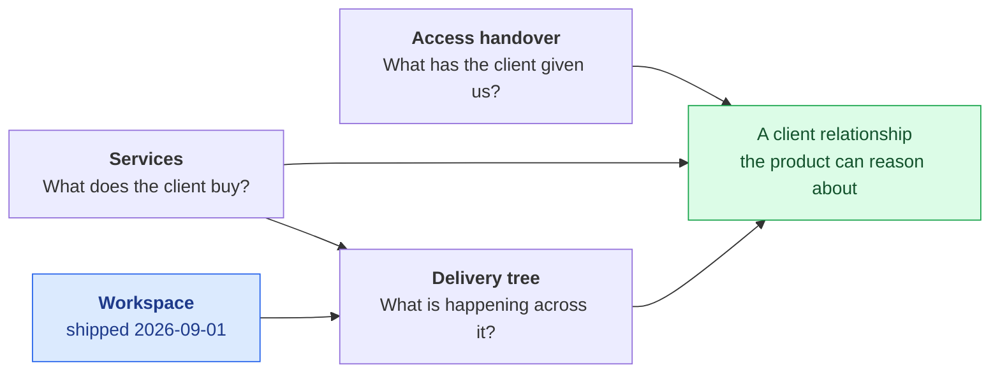

# Proposals

> **Last updated:** 2026-09-01 · **Status:** draft

Designs that have been reviewed but **not built**. Sections `00`–`12` describe shipped
behaviour and are verified against source. This section holds general proposals;
[`14-engagement`](../14-engagement/README.md) is the dedicated draft reference for P4b's
applied schema and not-yet-built runtime.

> **⚠️ The organization tier shipped on 2026-09-01 — as "Workspace".** *Organizations and
> Services* is split: its org half is now current-state documentation at
> [11-domains/workspaces](../11-domains/workspaces/README.md), and what remains unbuilt lives in
> [services-and-multi-roadmap.md](./services-and-multi-roadmap.md).

If you only read one page, read
[services-and-multi-roadmap.md](./services-and-multi-roadmap.md) first — it carries the record
of what shipped, what did not, and which decision product reversed. The
[Engagements](../14-engagement/README.md) design deliberately leaves that future party
expansion additive.

## The rules of this section

1. **Every page opens with `> **⚠️ Proposed — not built.**`** No exceptions. A reader who
   lands mid-page from a search result must be able to tell within one screen.
2. **Status is `draft` until it ships.** Never `current`.
3. **When a proposal ships, it moves.** The page is rewritten as current-state documentation
   under the section that owns it (usually [11-domains](../11-domains/README.md)) and
   **deleted from here**. This section never accumulates stale designs — that is the failure
   mode it exists to avoid.
4. **Proposals cite source.** A design that contradicts the current code must say so and point
   at the file, so the cost of the change is visible.

> **⚠️ Diagram exception.** [STYLE.md](../STYLE.md) mandates ASCII diagrams. This section uses
> **Mermaid** — these pages carry ER diagrams, state machines, and multi-actor sequences that
> ASCII renders badly. GitHub renders Mermaid natively. The rest of `docs/` stays ASCII.

## Documentation index

| Doc | What's in it |
| --- | --- |
| [client-access-handover.md](./client-access-handover.md) | Feature 1 — a tracked checklist for the external-system access a client must grant at onboarding |
| [services-and-multi-roadmap.md](./services-and-multi-roadmap.md) | Feature 2a — a real `services` table and the resolution of `1 Roadmap = 1 Service` vs. project-scoped roadmap uniqueness; plus the record of the org tier that shipped as Workspace |
| [delivery-tree-visualization.md](./delivery-tree-visualization.md) | Feature 2b — a zoomable Workspace → Project → Service → Roadmap tree (its top level now exists) |
| [identity-and-enrollment.md](./identity-and-enrollment.md) | Feature 3 — deleting `profiles.role`, role-free execution, and three opt-in marketplace enrollment tables; the identity foundation of the marketplace/execution split |
| [pricing-tiers-and-add-ons.md](./pricing-tiers-and-add-ons.md) | Monetization — 4-tier per-seat pricing for the Execution and Marketplace platforms, Shopify-style add-ons (Time/Finance), entitlement architecture, edge cases E1–E14 |

## Why these five

They come from one observation: Proyekto models *delivery* well and *the client relationship*
barely at all. There was no client parent, no record of what a client has handed over, and no
way to see a client's whole engagement at once.

The client parent shipped as the [Workspace](../11-domains/workspaces/README.md) tier. The access
handover is independent and can ship first. The tree still depends on `services` existing.

The fourth proposal answers a different question — *who is anyone?* — and cuts the other
way: [identity-and-enrollment.md](./identity-and-enrollment.md) deletes the `account_role`
identity that the 2026-08-09 organizations reconciliation noted, replacing it with
marketplace enrollment tables. Enrollment remains progressive, opt-in, and auto-provisions
nothing — the organizational container no longer does. Role deletion, enrollment, and P4a's
contract-seat correctness slice are shipped; P4b's expand schema is applied but its runtime
is not built.

P4b's locked design now has its own scenario-driven reference in
[Engagements](../14-engagement/README.md). Its runtime remains inactive and is clearly
marked as draft there.

The fifth, [pricing-tiers-and-add-ons.md](./pricing-tiers-and-add-ons.md), is the
monetization layer over both platforms. It was drafted against the pre-deletion
`profiles.role` state and needs a reconciliation pass against identity-and-enrollment
(its hooks table and edge case E14 still cite `profiles.role`).

## Sequencing

Each database phase is **expand-only**. Nothing is dropped until a separate, explicitly-scoped
contract migration long after the readers have moved.

| Phase | Lands | Flag | User-visible |
| --- | --- | --- | --- |
| **P1** | Access handover: 3 migrations, `client-onboarding` module, UI | `CLIENT_ONBOARDING_ENABLED` | yes |
| **P1.5** | Handover email activation (a one-line `UPDATE`) | `email_eligible` | yes |
| **P2** | `services` table + dual-write from `ContractsService` | — | no |
| **P3** | `roadmaps.service_id`, partial unique indexes, `projects.primary_roadmap_id` | `MULTI_ROADMAP_ENABLED=false` | no |
| ~~**P4**~~ | ~~`organizations`, members, invites, nullable project/team columns~~ | **Superseded** — shipped 2026-09-01 as [Workspaces](../11-domains/workspaces/README.md), on by default, no flag | yes |
| ~~**P5**~~ | ~~`project_access.has_org_grant` + fan-out trigger~~ | **Dropped** — workspace membership grants no project access, by design | — |
| **P6** | Multi-roadmap navigation | `MULTI_ROADMAP_ENABLED` per project | yes |
| **P7** | Delivery tree | `ORG_TREE_ENABLED` | yes |

P4 also shipped *without* a flag, which is the standing exception to the repo's staged-rollout
rule for new user-visible features. Prod migrations go through the Supabase MCP `apply_migration`
tool — **never** local `supabase db push`.

## Terminology

> **⚠️ Inverted on 2026-09-01.** This section used to **reject** "Workspace" — the word was
> held by `personal_workspaces` — and chose "Organization" instead. Product went the other
> way: the shipped tier is called **Workspace**, and the old holder was renamed to
> `personal_projects` (`20260902090500`) to free the word. "Organization" is now the
> *unused* term, and prose that says "organization tier" means the Workspace tier.

| Term | Status |
| --- | --- |
| **Workspace** | **Taken — by the shipped org tier** (`workspaces`, `workspace_members`, `workspace_subscriptions`, `workspace_invites`). Do not use it for anything else |
| **Personal project** | The renamed `personal_projects` one-to-one identity link. Note the `project_access.origin = 'personal_workspace'` **literal was not renamed** and still reads the old way |
| **Organization** | Free again — deliberately unused in schema and UI. Reads as a synonym for Workspace in older prose |
| **Portfolio** | Spent: `user_portfolios` (profile showcase) **and** the Finance portfolio (`/api/finance/portfolio`) |
| **Resources** | Spent: `project_resource_folders` / `project_resource_links` + the project Resources tab |
| **Agency** (as a table name) | Avoided: describes only the provider side; a table named `agencies` holding a client company would be a lie |
| **Access Handover** | Reserved by [client-access-handover.md](./client-access-handover.md) for the checklist |
| **Enrollment** | Reserved by [identity-and-enrollment.md](./identity-and-enrollment.md) for the opt-in marketplace capability rows — deliberately not "role", "persona", or "profile type", all of which are spent (and burned) elsewhere |

> **⚠️ One collision survives the rename.** `profiles.settings.workspace_defaults` — written by
> `PATCH /api/teams/preferences/defaults` — predates this tier and means the sidebar's default
> team/project, **not** a workspace preference. `web/src/stores/workspaceStore.ts` deliberately
> persists the open-workspace selection to `localStorage` instead, to avoid overloading it.

## See also

- [11-domains/](../11-domains/README.md) — what exists today, and the gaps these
  proposals close.
- [Architecture → system overview](../02-architecture/system-overview.md) — the six units these
  designs touch.
