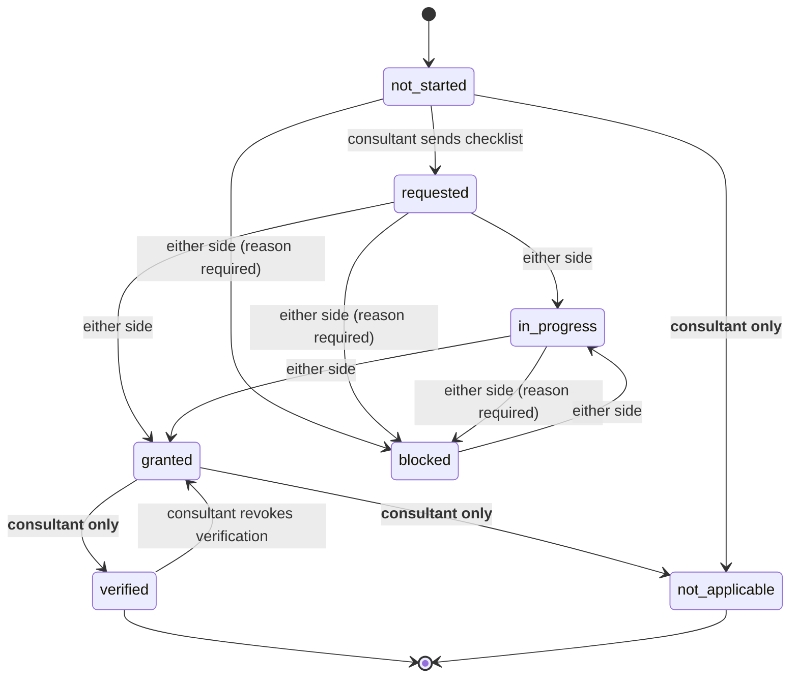
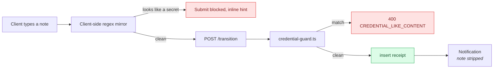

# Client Access Handover

> **⚠️ Proposed — not built.**

> **Last updated:** 2026-08-07 · **Status:** draft

When a consultant starts work, the client has to hand over access to a pile of external
systems: the Canva brand kit, Google Drive, GA4, Google Tag Manager, Search Console, the
domain registrar, WordPress admin, Meta Business Suite, Instagram. Today that negotiation
happens in project chat, nobody can answer "what are we still waiting on?", and the answer
degrades into scrollback archaeology. This proposes a tracked, two-sided checklist that makes
the handover a first-class object — and, critically, one that **never stores a credential**.

> **Naming.** Called *Access Handover*, never "Resources". `project_resource_links` and the
> project **Resources** tab already own that word — see
> [13-proposals/README.md](./README.md#terminology-reserved-by-these-proposals).

## Why stored, not derived

The obvious move is to copy `ProjectActivationService.buildChecklist()`, which computes seven
items on every read with no table behind them. That works there because every activation item
is a **predicate over data that already exists** — `contract.service_start_date != null`,
`rates.size > 0`. Nothing about it is authored.

Access grants are the opposite in every respect:

| Property | Activation checklist | Access handover |
| --- | --- | --- |
| Where the truth lives | Another table | **This table — nothing else records it** |
| Who authors the item set | Nobody (fixed list of 7) | The consultant, per project |
| Client-editable state | None | Notes, blocked reasons, share URLs |
| Needs transition history | No | Yes — "who marked this granted, and when?" |
| Due dates / assignment | No | Yes |

A derived model would need a shadow table for exactly that state, which is the stored model
with extra steps. **Stored.**

## Schema

Three migrations, all additive.

### `20260808090000_client_onboarding_catalog.sql`

```sql
access_grant_categories
  id uuid PK, slug text UNIQUE, name text, description text,
  icon text, position int, is_active bool DEFAULT true
  -- seeded: branding, seo, website, social-media, advertising,
  --         analytics, ecommerce, email-marketing, other

access_grant_catalog_items
  id uuid PK,
  category_id → access_grant_categories ON DELETE RESTRICT,
  slug text, name text, platform_url text NULL,
  default_instructions text,          -- "Settings → Users → Add user"
  default_grant_method text CHECK IN
    ('invite_email','add_user','share_link','transfer','api_connection','other'),
  position int, is_active bool DEFAULT true,
  UNIQUE (category_id, slug)
  -- ~40 seeded rows: canva, google-drive, figma | google-tag-manager, ga4,
  --   search-console, ahrefs, semrush | domain-registrar, hosting,
  --   wordpress-admin, cdn | instagram, meta-business-suite, tiktok, linkedin
```

**The catalog is flat and unversioned.** `roadmap_public_templates` carries versions,
checksums, moderation, and ratings because it is *user-generated marketplace content*. This is
a ~40-row platform-curated list edited by us in migrations, and instantiation **snapshots**
into project rows — so the snapshot *is* the version. Copying the marketplace shape costs
three tables and buys nothing. A later phase can add `owner_id` for consultant-authored custom
catalog entries; that is purely additive.

### `20260808090100_client_onboarding_checklists.sql`

```sql
CREATE TYPE public.access_grant_state AS ENUM
  ('not_started','requested','in_progress','granted','verified','blocked','not_applicable');

project_onboarding_checklists
  id uuid PK,
  project_id uuid NOT NULL UNIQUE → projects ON DELETE CASCADE,
  title text DEFAULT 'Client access setup',
  status text CHECK IN ('draft','sent','in_progress','complete','archived'),
  grantee_email text,                 -- who access should be granted TO
  grantee_user_id uuid → profiles ON DELETE SET NULL,
  blocks_activation bool NOT NULL DEFAULT false,
  sent_at, completed_at, created_by, created_at, updated_at

project_access_grant_items
  id uuid PK,
  checklist_id → project_onboarding_checklists ON DELETE CASCADE,
  project_id uuid NOT NULL → projects ON DELETE CASCADE,   -- denormalized for RLS
  category_id → access_grant_categories ON DELETE RESTRICT,
  catalog_item_id → access_grant_catalog_items ON DELETE SET NULL,  -- NULL = custom
  label text NOT NULL CHECK (char_length(btrim(label)) > 0),
  instructions text CHECK (char_length(instructions) <= 4000),
  grant_method text,
  state access_grant_state NOT NULL DEFAULT 'not_started',
  is_required bool NOT NULL DEFAULT true,
  position int NOT NULL DEFAULT 0,
  due_at timestamptz,
  -- WHAT WAS GRANTED. Never HOW TO GET IN:
  granted_to_email text,
  share_url text CHECK (share_url IS NULL OR share_url ~* '^https?://'),
  client_note text CHECK (char_length(client_note) <= 1000),
  blocked_reason text CHECK (char_length(blocked_reason) <= 1000),
  requested_at, granted_at, granted_by,
  verified_at, verified_by,
  promoted_resource_link_id uuid → project_resource_links ON DELETE SET NULL,
  UNIQUE (checklist_id, category_id, position)

project_access_grant_events
  id uuid PK, item_id → project_access_grant_items ON DELETE CASCADE,
  project_id uuid NOT NULL,
  from_state access_grant_state NULL, to_state access_grant_state NOT NULL,
  actor_id uuid → profiles ON DELETE SET NULL,
  actor_side text CHECK IN ('client','provider','system'),
  note text, created_at
```

The `share_url` CHECK is copied verbatim from `project_resource_links_url_http_https`
(`^https?://`) so `otpauth://` and free text cannot land there.

**RLS:** `SELECT` via `public.is_project_member(project_id, auth.uid())`, mirroring
`20260320120000_project_resources_hyperlinks.sql`. **No INSERT/UPDATE/DELETE policies** — every
write goes through the backend's service-role client with TypeScript authorization, the same
reasoning written into `contract_signature_links`. This keeps the table out of the
RLS-recursion class that has bitten `project_access` five times.

Wrap the enum in the `DO $$ ... EXCEPTION WHEN duplicate_object` idiom used by
`20260714100000`, and reuse `public.update_updated_at_column()` for the touch triggers.

### `20260808090200_client_onboarding_notification_types.sql`

```sql
INSERT INTO public.notification_types (name, category, priority) VALUES
  ('onboarding_access_requested',   'specific', 'high'),
  ('onboarding_item_granted',       'specific', 'medium'),
  ('onboarding_item_blocked',       'specific', 'high'),
  ('onboarding_checklist_complete', 'specific', 'medium')
ON CONFLICT (name) DO NOTHING;
```

> **⚠️ This migration is not optional.** `notifications.type_id` is `ON DELETE RESTRICT`
> against `notification_types` — without the seed, every `createNotification` call 500s.

`email_eligible` defaults to `false`, so this lands **inert**: rows exist, no email sends.
Activation later is a one-line `UPDATE` in its own migration — the same lever
`20260804120000_activate_mention_email.sql` pulled for mention invites.

## The state machine



| Transition | Consultant (`onboarding.manage`) | Client (`onboarding.respond`) |
| --- | --- | --- |
| `→ requested` | ✅ | ✗ |
| `→ in_progress`, `→ granted` | ✅ | ✅ |
| `→ blocked` (reason required) | ✅ | ✅ |
| `granted → verified` | ✅ **only** | ✗ |
| `verified → granted` | ✅ **only** | ✗ |
| `→ not_applicable`, reset | ✅ **only** | ✗ |

> **The asymmetry is the feature.** The client *claims* access was granted; the consultant
> *confirms it by actually logging in*. Without that, the checklist is a to-do list that lies —
> everything reads "done" while half the logins fail.

Implement as a pure, dependency-free `canTransition(from, to, side)` in
`access-grant-state.ts` with a co-located `.spec.ts` — the same shape as `roleSatisfies` in
`project-permissions.ts`, which lives beside its type precisely so it can be unit-tested
without a module cycle.

## Non-goal: Proyekto never stores credentials

An item is a **receipt** — "access was granted to `august@…` on GA4 on 7 Aug" — not a vault.
No passwords, API keys, recovery codes, or 2FA seeds, ever.

Four enforcement points:

1. **Schema.** No column could hold one, plus
   `COMMENT ON TABLE public.project_access_grant_items IS 'Access-grant receipts. NEVER stores
   credentials. Any column added here must be safe to email.'`
2. **`share_url` CHECK** — `^https?://` only.
3. **`credential-guard.ts`** — a pure heuristic scanner run over `client_note`, `instructions`,
   `blocked_reason`, and `share_url` on every write. Rejects with
   `400 { code: 'CREDENTIAL_LIKE_CONTENT' }` on `-----BEGIN … KEY`, `password:`/`api_key=`
   style assignments, `sk_live_…` / `pk_live_…`, `AKIA[0-9A-Z]{16}`, `ghp_[A-Za-z0-9]{36}`, and
   unbroken base64-ish runs ≥ 40 chars. Deliberately noisy-but-cheap; the 400 message teaches
   rather than scolds. A client-side mirror blocks submit before the round trip.
4. **Blast radius.** Grant notes are excluded from notification payloads — they would otherwise
   ride into FCM `data` and outbound email. The new activity actions go into
   `SENSITIVE_ACTIONS` and **not** `INDEXABLE_ACTIONS`, so nothing reaches the vector index.



## Permissions

Three new paths, taking the catalogue from 45 to 48.

| Path | `ROLE_DEFAULTS` | `ORIGIN_DELTAS` |
| --- | --- | --- |
| `onboarding.view` | `true` from **viewer** up | — |
| `onboarding.manage` | `true` at **admin** | `consultant: true` |
| `onboarding.respond` | **no role grants it** | `client: true` ← the entire point |

`PERMISSION_DEPENDENCIES`: `onboarding.manage → [onboarding.view]`,
`onboarding.respond → [onboarding.view]`. `personal_workspace` gets all three free, since its
delta is every path `true`.

> **⚠️ Two traps.**
>
> 1. **`onboarding.respond` must stay out of every preset** in `roleTemplates.ts`. It is
>    origin-driven, not rank-driven, so including it makes `detectPreset()` report "custom" for
>    every client and confuses admins reading the permission editor. Add a comment saying so.
> 2. **`origin='client'` is only ever granted to the project creator** — `respondInvite`
>    hardcodes `origin: 'invited'` (see
>    [clients/user-flows.md](../11-domains/clients/user-flows.md#where-origin--client-comes-from)).
>    So an *invited* client would get no `onboarding.respond` from the origin delta. Either the
>    invite path must learn to grant `origin='client'`, or the checklist must additionally
>    grant `respond` to `projects.client_id`. **This is an open design question and must be
>    resolved before P1.**

No `access.onboarding` path is proposed. The `access.*` section is a legacy page-gate duplicate;
`onboarding.view` can gate the sidebar directly. This deviates from the `resources` precedent
(which has both) deliberately — flag it if you want symmetry, it is one extra path.

Update all three hand-maintained web mirrors in the same change: `permissionCatalog.ts`,
`roleTemplates.ts`, and the `ProjectPermissions` type in `project.service.ts`.

## Backend

A new module `backend/src/modules/client-onboarding/` — not an extension of `projects`
(already 2,215 lines) and not of `contracts` (which owns billing readiness).

| Method | Path | Guard |
| --- | --- | --- |
| `GET` | `/api/onboarding/catalog` | auth only |
| `GET` | `/api/projects/:projectId/onboarding` | `onboarding.view` |
| `POST` | `/api/projects/:projectId/onboarding` | `onboarding.manage` |
| `POST` | `/api/projects/:projectId/onboarding/send` | `onboarding.manage` |
| `POST` | `/api/projects/:projectId/onboarding/items` | `onboarding.manage` |
| `PATCH` | `/api/projects/:projectId/onboarding/items/:itemId` | `onboarding.manage` |
| `POST` | `/api/projects/:projectId/onboarding/items/:itemId/transition` | `respond` **or** `manage` |
| `POST` | `/api/projects/:projectId/onboarding/items/:itemId/promote-resource` | `manage` + `resources.upload` |
| `DELETE` | `/api/projects/:projectId/onboarding/items/:itemId` | `onboarding.manage` |
| `GET` | `/api/projects/:projectId/onboarding/summary` | `onboarding.view` |

Authorization uses the existing `ProjectAuthorizationService.assertPermission(callerId,
projectId, path)` — **not** `assertRole`, because origin deltas make role and permission
diverge exactly here.

DTOs must declare every field: the global `ValidationPipe` runs `whitelist +
forbidNonWhitelisted`, so an undeclared field 400s the request. Controllers return raw data;
`ResponseInterceptor` wraps.

The response shape deliberately parallels `ActivationChecklist` so the web helpers transfer:

```ts
interface OnboardingChecklist {
  project_id: string;
  status: 'draft' | 'sent' | 'in_progress' | 'complete' | 'archived';
  grantee_email: string | null;
  progress: { done: number; total: number; required_total: number;
              blocked: number; percent: number };
  categories: Array<{ id; slug; name; icon; items: AccessGrantItem[] }>;
}
```

## Relationship to `project_resource_links`

**Separate tables, with an explicit one-way promotion.** A `verified` item that has a
`share_url` offers a consultant-triggered "Add to Resources" which creates the link row and
records `promoted_resource_link_id`.

Not auto-created, for four concrete reasons:

- `project_resource_links` carries `UNIQUE (project_id, folder_id, position)` and a second
  partial unique index for uncategorized links. Auto-inserting on every state change fights
  position allocation and needs a retry loop.
- Most grant items have **no URL at all** — "added you as an admin in GA4" is not a link.
  Auto-promotion would manufacture empty rows.
- Deleting a resource link must not corrupt the grant item; `ON DELETE SET NULL` on the
  back-reference keeps them independent.
- Lifecycles differ: a resource is a permanent library entry, a grant item is a transient
  onboarding artifact that archives with the checklist.

Promotion creates the link inside a lazily-created folder named **"Client Access"** and
requires both `onboarding.manage` and `resources.upload`.

## Web

Route `web/src/routes/project/$projectId/onboarding.tsx`, wrapped in `RequireProjectAccess`,
added to `ProjectSidebar.tsx` under Collaborate and mirrored in `ProjectBottomNav.tsx`. The
path must also go into `Header.tsx` `validPaths` or the header breaks on it.

| Component | Mirrors |
| --- | --- |
| `OnboardingChecklist.tsx` | `ActivationGuide.tsx` — same `mode: 'compact' \| 'full'` prop driving header pill, Overview widget, and tab from one implementation |
| `onboardingProgress.ts` | `sortChecklistItems()` / `checklistProgress()` — pure, exported, unit-tested |
| `OnboardingItemRow.tsx` | the `<li>` block of `ActivationGuide.tsx` |
| `OnboardingItemDrawer.tsx` | new — instructions, transitions, note field, event history |
| `AccessRequestBuilder.tsx` | new — consultant picks categories/items from the catalog |
| `OnboardingProgressPill.tsx` | `ActivationHeaderPill.tsx` |
| `NoCredentialsBanner.tsx` | new — persistent, above every input |

`useOnboardingChecklist.ts` copies `useActivationChecklist.ts`, including the `enabled` gating
that stops non-permitted callers 403-storming.

`ActivationGuide.tsx` contains a `ChecklistLink` that splits a `fixPath` into TanStack Router's
separate `to` and `search` props. Extract it to `web/src/components/common/DeepLink.tsx` and
have both call it rather than duplicating.

## Progress and activation

`done = state ∈ {granted, verified, not_applicable}`; `percent` weights only `is_required`
items; `blocked` surfaces separately in amber, because a blocked item is not "not yet" — it is
"someone must act".

**It does not block project activation.** `assertActivationReady()` guards the *billing* flip,
and its own comment says why: activating without those inputs "produces invoices with no price
and payouts with no rate." A missing Instagram grant produces neither. Blocking billing on it
would generate support tickets and teach consultants to route around the gate.

Instead, add one `warning`-severity item to the existing `buildChecklist()`:

```
key:      'client_access_granted'
severity: 'warning'
detail:   '4 of 11 access items outstanding (2 blocked).'
fixPath:  /project/${projectId}/onboarding
```

Escape hatch for whoever disagrees: `project_onboarding_checklists.blocks_activation`, per
project, default `false`. When `true` the item computes to `'blocker'`. No migration to flip.

### Related activation warnings

While touching `buildChecklist()`, add a second `warning` item for the payout footgun
documented in
[clients/consultant-interaction.md](../11-domains/clients/consultant-interaction.md#can-we-invite-an-individual-contractor-who-is-not-on-a-team):

```
key:      'unbilled_direct_members'
severity: 'warning'
detail:   '2 members have project access but no team or rate — they will not appear in payouts.'
fixPath:  /project/${projectId}/settings/teams
```

## Activity and notifications

New action family in `backend/src/modules/audit/activity-actions.ts`:
`onboarding.checklist_created`, `.checklist_sent`, `.item_added`, `.item_removed`,
`.item_state_changed`, `.item_verified`, `.item_blocked`, `.promoted_to_resource`.
`ACTIVITY_ENTITY_TYPES` gains `onboarding_item` and `onboarding_checklist`.
`SENSITIVE_ACTIONS` gains `item_verified` and `item_state_changed` — they narrate who holds
access to what. `INDEXABLE_ACTIONS` gains nothing.

Mirror by hand in `web/src/components/project/logs/activityCatalog.ts`, then run
`npm run check:activity-actions` from `backend/` — it fails the build on drift.

Notification recipients: `requested` → the client; `granted` / `blocked` → consultant and
project owner; `complete` → both sides.

## Phasing

| Phase | Scope |
| --- | --- |
| **P1** | 3 migrations, module, permissions, the project tab. Behind `CLIENT_ONBOARDING_ENABLED`; email dark. |
| **P1.5** | Flip `email_eligible`; add the dashboard "Action needed" card. |
| **P3 (later)** | External-client response without an account — mint `project_onboarding_links` copying `contract_signature_links` exactly (32-byte hex, one live row per checklist via partial unique index, expiry, revocation, service-role-only read) behind a public `onboarding/respond/$token` route. **Do not attempt this in P1.** |

`CLIENT_ONBOARDING_ENABLED` must be registered in `backend/src/config/env.validation.ts`
**and** in the secrets list in `.github/workflows/backend-deploy.yml` — Cloud Run
full-replaces secrets, so a var missing from the workflow silently disappears on the next
deploy.

## Open questions

1. **How does an invited client get `onboarding.respond`?** See the permissions trap above.
   Blocking for P1.
2. **Should a `not_applicable` item count toward `done`?** Proposed yes, so a checklist can
   reach 100%. Alternative: exclude from both numerator and denominator.
3. **Custom catalog items per consultant** — deferred; additive when wanted.

## See also

- [11-domains/clients](../11-domains/clients/README.md) — the client model this extends.
- [organizations-and-services.md](./organizations-and-services.md) — the other half of the
  client structure work.
