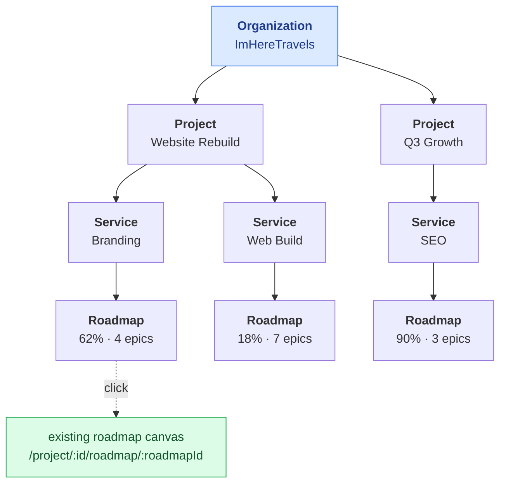
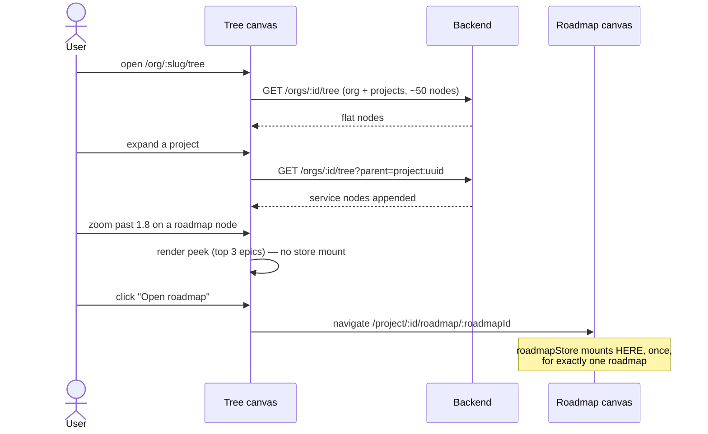

# Delivery Tree Visualization

> **⚠️ Proposed — not built.**

> **Last updated:** 2026-08-07 · **Status:** draft

Once projects have a parent and services have roadmaps, there is a shape worth seeing: an
organization's entire delivery, from the client at the top down to individual roadmaps, on one
canvas that you zoom into rather than navigate through. This proposes that view — a semantic-zoom
tree over `Org → Project → Service → Roadmap` that hands off to the existing roadmap canvas
rather than trying to replace it.

**Depends on** [organizations-and-services.md](./organizations-and-services.md). Without
`organizations` and `services` there is no tree to draw.

## The levels



## Build it with XYFlow — and finally use dagre

`@xyflow/react` v12 is already a dependency and the team knows it from the roadmap canvas.

`dagre` is declared in `web/package.json` with `@types/dagre` and is **imported nowhere in
`web/src`** — the roadmap canvas computes fixed coordinates by hand in `RoadmapView.tsx`
(1,944 lines), which was justified there by domain-specific swimlane rules. A generic directed
tree has no such rules; it is precisely what dagre is for. This feature should be dagre's first
real use.

New components live in `web/src/components/org-tree/` — deliberately **not** under
`components/roadmap/`.

> **⚠️ The one non-negotiable boundary: never import `roadmapStore`.** It is a 2,791-line
> Zustand singleton holding exactly one roadmap plus optimistic bookkeeping. Mounting it inside
> a tree that can show ten roadmaps corrupts state. The tree renders **summary nodes only** and
> navigates away to open a real canvas.

## The endpoint

```
GET /api/orgs/:orgId/tree?depth=service&parent=project:<uuid>
```

```ts
type TreeNodeKind = 'org' | 'project' | 'service' | 'roadmap';

interface TreeNode {
  id: string;                 // 'org:uuid' | 'project:uuid' | 'service:uuid' | 'roadmap:uuid'
  kind: TreeNodeKind;
  parent_id: string | null;
  label: string;
  subtitle: string | null;
  status: string | null;
  counts: { children: number; epics?: number; features?: number; tasks?: number };
  progress: { done: number; total: number; percent: number };
  dates: { start: string | null; end: string | null };
  href: string;               // deep link into the existing app
  has_more_children: boolean;
}

interface TreeResponse {
  root_id: string;
  nodes: TreeNode[];          // FLAT, not nested
  truncated: boolean;
  generated_at: string;
}
```

**Flat with `parent_id`, not nested.** It maps 1:1 onto XYFlow's `nodes` / `edges`, memoizes
trivially, and a lazy expand becomes an array append rather than a tree splice.

Aggregates come from **one** Postgres function `public.org_tree_progress(p_org_id uuid)`
returning per-node counts in a single query — not N+1 in Node. Cache with the existing
`cache.rememberJson(...)` helper that `ProjectsService.listDashboardProjects` already uses, 60s
TTL, under a new `REDIS_CACHE_KEYS.orgTree(orgId)`.

### Authorization

The caller must be an `organization_members` row **or** hold `project_access` on at least one
project in the org — in which case the response is **filtered to those projects**.

> **⚠️ Never return an org-wide shape to a single-project viewer.** Node labels leak client
> names, project titles, and progress. A freelancer curated onto one project must not learn the
> org has five others. Filter server-side; do not rely on the client hiding nodes.

## Semantic zoom

Read the zoom scalar with XYFlow's `useStore((s) => s.transform[2])` and swap node renderers by
band. Nodes get less detailed as you pull out, so the canvas stays legible instead of turning
into a wall of unreadable cards.

| Zoom | Deepest visible kind | Node renders |
| --- | --- | --- |
| `< 0.5` | project | name + progress ring |
| `0.5 – 1.0` | service | + status chip, % complete |
| `1.0 – 1.8` | roadmap | + milestone/epic counts, date range |
| `> 1.8` | roadmap "peek" | + top 3 epics and an **Open roadmap** CTA |



Layout runs dagre with `rankdir: 'LR'`, recomputed only when the **visible node set** changes —
not on pan or zoom — memoized on a hash of visible node ids. This mirrors the existing canvas's
`layoutKey` discipline, where layout only recomputes on structural changes, not content edits.

## Performance

Realistic scale: an org has 1–30 projects × 1–6 services × 1 roadmap ⟹ **30–200 nodes at
service depth**. XYFlow handles 1–2k comfortably. This is a lazy-loading discipline problem,
not a rendering one.

- Org + projects returned eagerly (≤ ~50 nodes). Services fetched per expanded project.
- Collapsed below project level by default.
- `nodesDraggable={false}`, `nodesConnectable={false}`, `onlyRenderVisibleElements`,
  `React.memo` on every custom node with an explicit comparator.
- **Hard cap 500 nodes per response.** Overflow becomes a `has_more_children` "+N more" node
  that opens a filtered list view rather than expanding. Log what was dropped — a silent
  truncation reads as "you're seeing everything" when you aren't.
- **No realtime.** A manual refresh button plus the 60s cache. Do not wire this to the
  Cloudflare realtime Worker; a tree of aggregates is not collaborative state.

## Routing

```
web/src/routes/org/$orgSlug.tsx            layout + membership beforeLoad guard
web/src/routes/org/$orgSlug/index.tsx      org home
web/src/routes/org/$orgSlug/tree.tsx       the visualization
web/src/routes/org/$orgSlug/projects.tsx
web/src/routes/org/$orgSlug/members.tsx
web/src/routes/org/$orgSlug/settings.tsx
```

Add `/org` to `Header.tsx` `validPaths` — omitting it breaks the header on those routes.
`routeTree.gen.ts` regenerates itself; never hand-edit it (a hook blocks it).

Entry points: an org switcher in `Header.tsx`, and a "View delivery tree" card on `/dashboard`
for users with org membership.

## Relationship to the roadmap view principles

`docs/01-product/roadmap-and-milestones.md` states five principles, the fourth being **"no
separate roadmap system"** and the fifth **"views are projections, not separate entities."**

This tree does not violate them, but the wording needs care: it is **not a projection of one
roadmap** — it is a projection of the *portfolio above* roadmaps, and it deliberately does not
render roadmap internals. When this ships, that page should gain a sentence distinguishing
*roadmap views* (roadmap / epic / milestones / kanban, all reading `roadmapStore`) from
*portfolio views* (the tree, reading aggregates and mounting nothing).

## Decisions to review

| # | Decision | Rejected alternative |
| --- | --- | --- |
| 1 | XYFlow + dagre in `components/org-tree/` | Reusing `RoadmapView.tsx`; or adding a new graph library |
| 2 | Flat node array, lazily expanded, capped at 500 | A nested tree fetched eagerly |
| 3 | Aggregates from one SQL function, cached 60s | Computing per-node progress in Node |
| 4 | Navigate to the canvas; never embed it | Rendering a live mini-canvas per roadmap node |
| 5 | No realtime | Wiring to the realtime Worker |

## See also

- [organizations-and-services.md](./organizations-and-services.md) — the prerequisite structure.
- [Web → roadmap canvas](../04-web/roadmap-canvas.md) — the existing canvas and its dagre note.
- [Product → roadmap and milestones](../01-product/roadmap-and-milestones.md) — the view principles.
