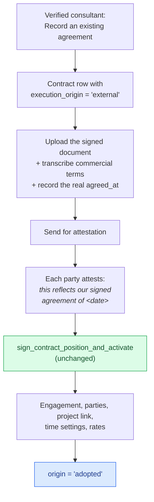

# Off-Platform Engagement Adoption

> **⚠️ Proposed — not built.**

> **Last updated:** 2026-08-28 · **Status:** draft

Today there is exactly one door into the engagement model: draft a contract in Proyekto and
have both parties sign it. That is correct for new work and wrong for the most common way a
real customer arrives — **a project that has been running for months, under an agreement
signed on paper, long before anyone opened Proyekto.**

Those teams currently have no way in. They can create a project and log time, but they have
no engagement, so they are `ineligible` on every contract-gated surface, their finance books
render empty, and their history is invisible to the commercial model. The workaround is to
re-sign an agreement inside Proyekto that both parties already signed elsewhere — which
misrepresents when the deal was struck and which document governs it.

## This is not backfill

The distinction has to be made up front, because the model's locked decisions say
"historical backfill stays rejected at every step" and this proposal must not read as a
reversal.

| | Backfill (rejected) | Adoption (proposed) |
| --- | --- | --- |
| Who asserts the relationship | The system | Both parties, explicitly |
| Evidence | Inference from project membership, team membership, or matching account ids | An uploaded signed document plus two in-product attestations |
| Can it be wrong? | Yes, silently — it can fabricate a legal relationship | Only if both parties assert something false, which is ordinary contracting risk |
| Auditable | No — nothing records why the link was made | Yes — `origin`, the document, both attestation timestamps |

What
[lifecycle-and-edge-cases](../14-engagement/lifecycle-and-edge-cases.md#legacy-boundary)
rejects is *inference*: "Runtime adoption must not guess relationships from project
membership, team membership, or matching account IDs." It does not reject two humans
declaring what they signed. This proposal never guesses.

## The shape: record an existing agreement

Reuse the contract path, so there stays **exactly one writer of engagements**.



The green step is the point of the whole design: **no new activation path.** Every
invariant, guard trigger, typed error token, and idempotency property already tested on the
signing RPC applies unchanged. Adoption is a different *provenance*, not a different
*mechanism*.

### An attestation is not a signature

The parties are not signing a new deal — they already signed one. They are attesting that
the record in Proyekto faithfully represents it. The legal authority remains the uploaded
document; Proyekto holds a transcription plus two statements that the transcription is
accurate.

This distinction must be visible in the product, not just in this page. Every surface that
shows an adopted agreement labels it **"Recorded agreement — signed outside Proyekto on
`<date>`"**, and the attestation UI says what it is asking for. If a user can mistake the
attestation for the signature, the feature has failed regardless of what the schema says.

## Schema

Three additive changes. Expand-only, per the sequencing rule.

```sql
-- contracts
ALTER TABLE public.contracts
  ADD COLUMN execution_origin text NOT NULL DEFAULT 'proyekto'
    CHECK (execution_origin IN ('proyekto', 'external')),
  ADD COLUMN external_agreed_at date,
  ADD COLUMN external_document_id uuid REFERENCES public.finance_documents(id);

-- an external contract must carry both its date and its paper
ALTER TABLE public.contracts
  ADD CONSTRAINT contracts_external_needs_evidence CHECK (
    execution_origin <> 'external'
    OR (external_agreed_at IS NOT NULL AND external_document_id IS NOT NULL)
  );

-- engagements.origin gains a third value
--   (existing: 'contract' | 'legacy')
```

Three deliberate choices:

- **Do not reuse `engagements.origin = 'legacy'`.** It exists, and nothing writes it, so it
  looks free. It is not: its meaning is "a relationship that predates the engagement model",
  and an adopted engagement is the opposite — a relationship deliberately brought *into* the
  model with evidence. Conflating them destroys the ability to ask "which of our engagements
  were adopted?" forever.
- **Reuse `finance_documents` for the uploaded paper**, rather than adding a parallel store.
  It already has the upload path, the presigned fetch, the deny-all RLS, and the snip model.
  Note the dependency: that table ships with the
  [document imports migration](../11-domains/finance/document-imports.md), which is **not
  yet applied to production** — this proposal cannot land before it does.
- **Evidence is required by a CHECK, not by application code.** An external contract with no
  document and no date is a claim, not a record.

## The one dating exception

`sign_contract_position_and_activate` enforces prospective effective dates and refuses past
ones (`AMENDMENT_EFFECTIVE_DATE_PAST`, `AMENDMENT_EFFECTIVE_DATE_NOT_PROSPECTIVE`). That
rule exists so nobody can silently reprice work that has already been performed and paid.

Adoption needs exactly one narrow hole in it, and it must be stated in one place and no
other:

> A backdated `effective_from` is permitted **only** on the *root* contract of an
> `execution_origin = 'external'` family, and only back to its `external_agreed_at`.
> Amendments — including amendments of an adopted agreement — remain strictly prospective.

Everything the original rule protects still holds: an adopted agreement's terms can be
backdated once, to the date both parties attest they agreed them, and never again.

## Why this earns its place

Beyond letting real customers in, adoption pays for itself twice:

- **It retires `grandfathered`.** The eligibility engine currently has three states, one of
  which — `grandfathered` — exists only because enforcement arrived after the users did, and
  is keyed on a hardcoded `2026-08-27T00:00:00Z` cutoff. That constant is a permanent
  liability with no expiry story. Adoption is the principled exit: a grandfathered team
  records its real agreement, becomes `engaged` on the evidence, and the cutoff can
  eventually be retired instead of being carried forever.
- **It composes with document imports rather than duplicating them.** Adoption brings in the
  *relationship*; imports bring in the *money* already invoiced under it. A migrating project
  adopts its agreement, then imports its invoice history against the resulting engagement.
  Neither feature needs to grow the other's capability.

## Edge cases

| Case | Decision |
| --- | --- |
| **The counterparty has no Proyekto account** | Reuse the existing token path. `contract_signature_links` already carries a single-use token for an account-free party; attestation uses the same mechanism with attestation copy. |
| **One party declines to attest** | The contract stays `sent`. No engagement is created. Adoption is never one-sided — a unilateral record of a bilateral agreement is exactly the fabrication the no-backfill rule forbids. |
| **The off-platform agreement is later amended** | Ordinary amendment path, strictly prospective, same contract family. The amendment is a Proyekto-signed document even though its root was not. |
| **The same relationship is adopted twice** | The second attempt is refused. Adoption must check for an existing active engagement between the same two parties with the same `relationship_kind` and scope, and point at it instead of minting a duplicate. |
| **Terms were transcribed wrongly and both parties have attested** | Do not unsign — an activated engagement cannot be unsigned. Amend, or end the engagement and adopt again with correct terms. This is the existing correction rule, unchanged. |
| **What may the Client see?** | Exactly what they see on any client engagement — their own agreement, its billing rates, its invoices. Adoption changes provenance, never redaction. |
| **Work predating the adoption date** | Out of scope. Adoption establishes the relationship from `external_agreed_at` forward; historical *time* is not retro-attributed to the new engagement, because `engagement_assignments` does not exist yet and inference is still rejected. Historical *money* enters through document imports. |

## What this does not do

- It does not create projects, project access, or team membership. An engagement never
  grants execution access, and adoption does not change that.
- It does not attribute existing time logs to the new engagement. `engagement_assignment_id`
  stays NULL on every pre-existing log — that is the explicit legacy-path marker, not a gap.
- It does not let a non-consultant author a contract. Adoption is authored by a verified
  consultant like every other contract.

## Open question: who is the consultant?

A team migrating in may have no verified consultant at all — they were running their own
project, not a managed engagement. Adoption as specified requires one, because
`sign_contract_position_and_activate` re-checks `is_active_consultant` on the consultant
seat and the capacity matrix admits no other shape.

Two candidate answers, neither chosen here:

1. **Require vetting.** The consultant layer is the product's differentiator; an
   unvetted-lead engagement contradicts it. Migrating teams apply for vetting first.
2. **Allow a client↔talent direct engagement kind.** A genuine model change — a third
   `relationship_kind` with its own capacity matrix — and much larger than it looks.

This is a product decision, not a technical one, and it should be settled before build. It
interacts with the **teams-as-parties** constraint: `engagement_parties.user_id` is a
profile FK, so a migrating *company* cannot hold a seat today either — see
[organizations-and-services](./organizations-and-services.md).

## Sequencing

| Phase | Lands | Depends on |
| --- | --- | --- |
| **A0** | Apply `20260826090000_finance_document_imports` to production | nothing — it is already written and merged |
| **A1** | The three schema additions above, expand-only | A0 |
| **A2** | Contract-creation path for `execution_origin='external'`; the narrow dating exception in the RPC | A1 |
| **A3** | Attestation UI (in-app and token), and the "Recorded agreement" labelling everywhere an agreement is shown | A2 |
| **A4** | Retire the `grandfathered` cutoff once adoption has been available long enough to be a real alternative | A3 |

## Related documentation

- [Engagements](../14-engagement/README.md) — the model being adopted into
- [Lifecycle and edge cases](../14-engagement/lifecycle-and-edge-cases.md) — the legacy boundary this respects
- [Action surface](../14-engagement/action-surface.md) — adopted engagements use the same rail
- [Document imports](../11-domains/finance/document-imports.md) — the money side, and the `finance_documents` dependency
- [Authorization axes](../03-backend/authorization-axes.md) — eligibility, and why `grandfathered` needs an exit
