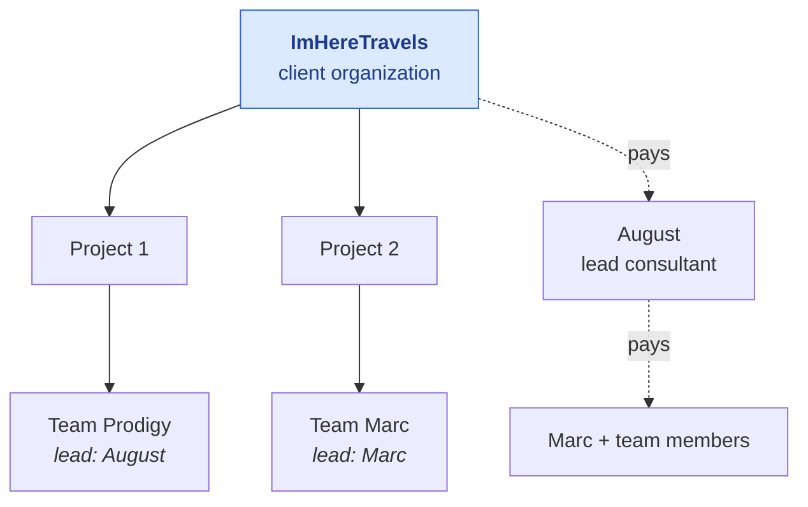
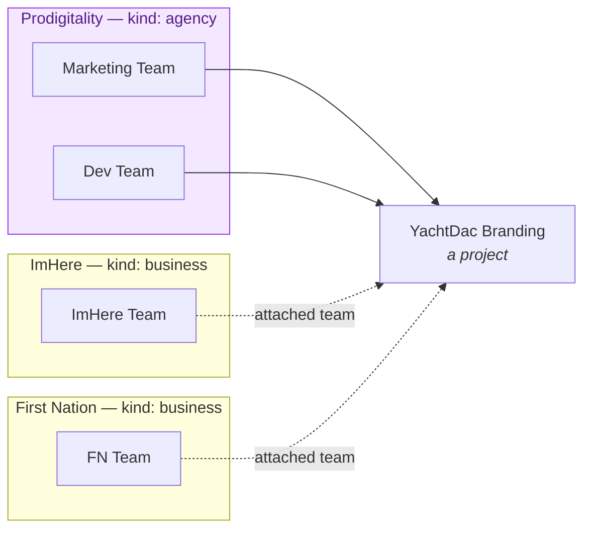
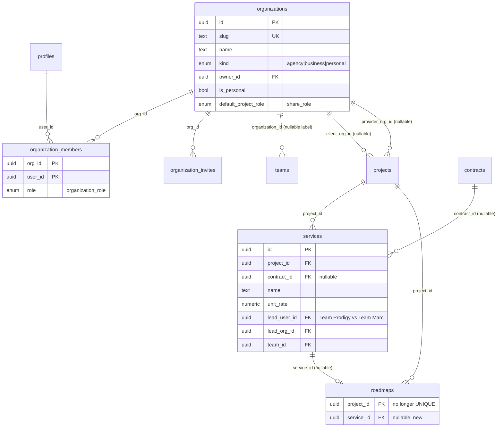
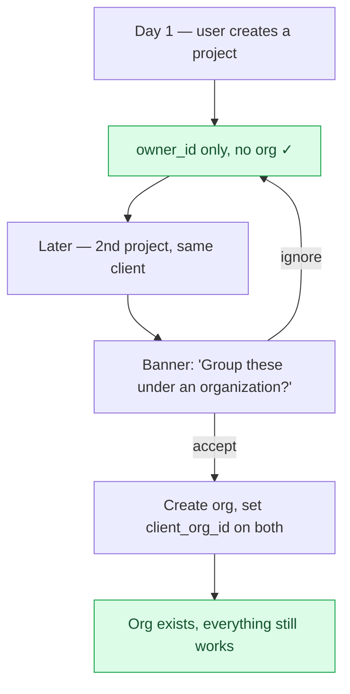
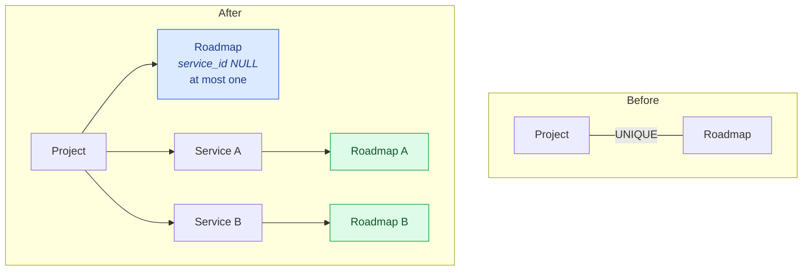

# Organizations and Services

> **⚠️ Proposed — not built.**

> **Last updated:** 2026-08-11 · **Status:** draft

Proyekto has no parent above a project. A client with four engagements is four unrelated
`projects` rows whose client relationship is repeated in access and contract data, and an
agency running delivery for six clients has no container at all. This proposes an
**Organization** tier, promotes contract
services from a jsonb blob into a real table, and resolves the cardinality conflict that
falls out of doing both: the stated rule `1 Roadmap = 1 Service` collides with
`roadmaps.project_id UNIQUE`.

## The structure being modelled

Two whiteboards. The first is a client-parent tree: ImHereTravels is the parent of two
projects, each run by a different consultant with a different team, with a billing chain that
flows client → lead consultant → sub-consultant and team.



The second is Meta-Business-Manager-shaped: an agency organization holding internal
departments that own assets, alongside separate client organizations, with cross-links where
one org's team works another org's asset.



The key insight: **both diagrams are the same model.** An organization is a container of
people and teams; a project names a client org and a provider org; teams from any org can be
attached. No special-casing.

## Terminology: `organizations`, with a `kind`

"Organization" has **zero** prior occurrences in `docs/`. Everything else plausible is taken —
see [README.md](./README.md#terminology-reserved-by-these-proposals).

```sql
CREATE TYPE public.organization_kind AS ENUM ('agency','business','personal');
```

One table, not `agencies` + `clients`. An `agencies` table holding "ImHere Travels" would be a
lie, and the whiteboard needs one container that can be Prodigitality (provider) *and*
ImHereTravels (client) — sometimes both, when an agency subcontracts. The UI is free to label
a `kind='agency'` org "Agency"; **terminology is a rendering concern, not a schema concern.**

## Schema



`organization_invites` mirrors `team_invites` exactly — there is no reason to invent a second
invite shape.

## Organizations are progressive, never required

**A project is created with `owner_id` only, exactly as today.** No org is needed to sign up,
create a project, or deliver work. The app offers to group projects under an organization at
the moment grouping starts to pay: a second project for the same client, or a second person on
the client side.



> **⚠️ Do not auto-provision a personal org for every user.** That is `persona_type` in a new
> costume — a mandatory second identity container, an "acting as which org?" question on every
> request, and a 100%-of-rows backfill, all to make one JOIN uniform.
> `20260804170019_remove_active_persona.sql` deleted exactly that pattern three months ago. The
> `is_personal` flag and its partial unique index exist for users who *do* create one, not as a
> provisioning step.

Likewise there is **no profile-completeness gate** on joining an organization. None exists in
the product today (see
[clients/README.md](../11-domains/clients/README.md#known-gaps)); adding one is separate work.

## Back-compat: `projects.owner_id` stays

`owner_id` is `NOT NULL` and is read by at least five things that must keep working. It is
the role-neutral project owner, not the client organization or billing counterparty:

| Reader | Why it matters |
| --- | --- |
| `projects(owner_id) WHERE is_personal_workspace` partial unique index | the personal-workspace identity |
| `canAccessProject` — owner/access membership resolution | roadmap access |
| `listRoadmapLinkCandidates` | guest-roadmap conversion |
| `ProjectActivationService` `client_identified` | the activation blocker |
| RLS policies across the tree | defence in depth |

**Keep it independent.** Adding `client_org_id` must not rewrite `owner_id` or require the
organization owner to own every engagement. Document that separation on the column itself:

```sql
COMMENT ON COLUMN public.projects.owner_id IS
'The profile that owns the project. Ownership is contextual and independent of account role,
client_org_id, and the contract billing counterparty.';
```

**One resolver, and nothing else branches:**

```ts
type ProjectClient =
  | { kind: 'org';      org_id: string;  name: string; billing_email: string | null }
  | { kind: 'user';     user_id: string; name: string; email: string | null }
  | { kind: 'external'; name: string;    email: string | null };   // contract-only

resolveClient(project, contract?): ProjectClient
```

Every consumer — activation checklist, contract parties step, invoice header, chat filters —
calls this. If `client_org_id` appears in a conditional anywhere else, that is a bug.

## Org → project access

**Materialize into `project_access` via a fan-out trigger. Do not add a permission layer.**

`resolvePermissions` is a pure `(role, origin, capabilities) → 45 booleans` with two
hand-maintained web mirrors, and it is the most security-critical function in the repo. Adding
a fourth layer means an extra DB read on every check and a new dimension in both mirrors.

```sql
ALTER TABLE public.project_access
  ADD COLUMN has_org_grant boolean NOT NULL DEFAULT false;
```

Parallel to the existing `has_direct_grant`. A trigger `tg_organization_members_sync_access`,
modelled on `tg_project_team_members_sync_shares`:

- **INSERT/UPDATE on `organization_members`** → for every project where
  `client_org_id = NEW.org_id`, upsert `project_access(..., origin='client', has_org_grant=true)`;
  where `provider_org_id = NEW.org_id` → `origin='consultant'`.
- **DELETE** → remove the access row only when `has_direct_grant` is false **and** no
  `project_team_members` rows remain **and** no other org grant applies. That is the same
  three-way guard the existing trigger implements — **extend that function rather than writing
  a competing one**, and find its newest definition first (the latest-function-body rule).
- Also fire on `projects` INSERT/UPDATE of `client_org_id` / `provider_org_id`.

Net effect: `origin='client'` keeps its exact meaning, `resolvePermissions` is untouched, and
no new origin value is introduced. Per-org default role comes from
`organizations.default_project_role`, mirroring `project_teams.default_role`.

> **Bonus:** this also fixes the gap noted in
> [clients/user-flows.md](../11-domains/clients/user-flows.md#where-origin--client-comes-from) —
> org members of the client org would finally receive `origin='client'` without being the
> project creator.

## Teams stay user-owned

```sql
ALTER TABLE public.teams ADD COLUMN organization_id uuid NULL
  REFERENCES public.organizations(id) ON DELETE SET NULL;
```

`teams.owner_id` remains `NOT NULL` and authoritative; `organization_id` is a **nullable
label**. Making orgs own teams would require backfilling through `team_member_rates`,
`payouts`, `task_time_logs`, the `project_team_members → project_access` fan-out, and the
personal-team invariant. A nullable label is additive and reversible.

The whiteboard's "agency asset worked by another org's team" then needs no new join table:
`provider_org_id = Prodigitality`, `client_org_id = ImHere`, and a `project_teams` row
attaching a team whose `organization_id` is a third org.

## Services: out of the jsonb

Today `contracts.services` is an ordered jsonb array — `[{id, name, description, unit,
unit_rate, position}]` — modelled on `contracts.clauses`. It works for invoice line-picking and
nothing else. It cannot carry a delivery owner, a status, or a foreign key from a roadmap.

```sql
services
  id uuid PK,
  project_id uuid NOT NULL → projects ON DELETE CASCADE,
  contract_id uuid NULL → contracts ON DELETE SET NULL,
  legacy_json_id text,                    -- the jsonb item's id, for reconciliation
  name text NOT NULL, description text,
  unit text, unit_rate numeric(14,2) NOT NULL DEFAULT 0,
  currency text NOT NULL DEFAULT 'USD',
  position int NOT NULL DEFAULT 0,
  status text CHECK IN ('draft','active','paused','completed','cancelled'),
  -- who delivers THIS service — the whiteboard's Team Prodigy vs Team Marc:
  lead_user_id uuid NULL → profiles ON DELETE SET NULL,
  lead_org_id  uuid NULL → organizations ON DELETE SET NULL,
  team_id      uuid NULL → teams ON DELETE SET NULL,
  UNIQUE (project_id, position)
```

**The jsonb column is kept and dual-written.** It is read by
`web/src/components/finance/ProjectContract.tsx` (2,381 lines, the Services step) and
`InvoiceBuilder.addServiceLine`. Expand → migrate readers → contract, across three separate
changes. Dropping it is out of scope here.

## Resolving `1 Roadmap = 1 Service`

The stated rules compose to a contradiction with the schema:

```
1 Project  = 1 Contract
1 Contract = 1..n Services
1 Service  = 1 Roadmap
────────────────────────
1 Project  = 1..n Roadmaps        but roadmaps.project_id is UNIQUE
```

`roadmaps.project_id UUID UNIQUE NOT NULL` was declared in
`20260111000001_create_roadmap_canvas_schema.sql:80`. It was later made nullable for guest
roadmaps (`20260210000001`), whose migration comment notes the uniqueness check also runs in
the app.

### The move: partial unique indexes

```sql
ALTER TABLE public.roadmaps
  ADD COLUMN service_id uuid NULL REFERENCES public.services(id) ON DELETE SET NULL;

ALTER TABLE public.roadmaps DROP CONSTRAINT roadmaps_project_id_key;

-- The legacy invariant survives, scoped: still exactly one "project roadmap".
CREATE UNIQUE INDEX roadmaps_one_project_scoped
  ON public.roadmaps (project_id) WHERE service_id IS NULL AND project_id IS NOT NULL;

CREATE UNIQUE INDEX roadmaps_one_per_service
  ON public.roadmaps (service_id) WHERE service_id IS NOT NULL;

ALTER TABLE public.projects
  ADD COLUMN primary_roadmap_id uuid NULL REFERENCES public.roadmaps(id) ON DELETE SET NULL;
```

Dropping the constraint outright would let a bug create two "project roadmaps" and silently
break `findByProjectId`, which takes the newest row. The partial index preserves the old
invariant **exactly** for old-shaped rows while opening the service lane.



### Blast radius

Smaller than the fear suggests. The canvas is roadmap-scoped end to end; the single-roadmap
assumption lives almost entirely in **navigation**.

| Surface | Verdict |
| --- | --- |
| `roadmaps.repository.supabase.ts:findByProjectId` | **Already tolerant** — `.order('updated_at').limit(1).maybeSingle()`, not `.single()`. Change: prefer `primary_roadmap_id`, else `service_id IS NULL`, else newest |
| `project/$projectId/roadmap/$roadmapId.tsx` | **Already parameterized — no change** |
| `project/$projectId/roadmap.tsx` | 1 roadmap → redirect (today's behaviour); >1 → render a roadmap index. The `<Outlet/>` is already there |
| `project/$projectId/work-items{,/$roadmapId}.tsx` | Same shape, same fix |
| `ProjectSidebar.tsx` `effectiveRoadmapId` | Point at `primary_roadmap_id`; submenu when >1 |
| `roadmapStore.ts` (2,791 lines) | **Do not refactor.** Holds one roadmap, loaded per `$roadmapId`. Multi-roadmap is fine as long as two canvases never mount at once |
| `upsert_full_roadmap` RPC | Takes a roadmap id; project-agnostic — **no change** |
| `roadmap_ai_sessions`, `roadmap_ai_memories` | Already per-roadmap, so per-service roadmaps get **separate AI memory**. This is desirable, not a cost: Team Marc's SEO context should not leak into Team Prodigy's branding roadmap |
| `LinkRoadmapModal`, `replaceProjectRoadmap`, `listRoadmapLinkCandidates` | Exist *because* of the unique constraint; they operate purely in the `service_id IS NULL` lane — **no change** |
| `project_activity_log.roadmap_id` | Already roadmap-scoped — **no change** |

> **⚠️ Hard constraint for the tree visualization:** `roadmapStore` is a singleton. Anything
> that displays many roadmaps at once must never mount it. See
> [delivery-tree-visualization.md](./delivery-tree-visualization.md).

## Migration sequence

| Order | File | Phase |
| --- | --- | --- |
| 1 | `20260815090000_services_table.sql` | P2 |
| 2 | `20260815090100_roadmaps_service_scope.sql` | P3 |
| 3 | `20260815090200_backfill_primary_roadmap_id.sql` | P3 |
| 4 | `20260820090000_organizations.sql` | P4 |
| 5 | `20260820090100_organization_project_links.sql` | P4 |
| 6 | `20260820090200_project_access_org_grants.sql` | P5 |
| — | *(much later, separate)* `_drop_contracts_services_jsonb.sql` | contract phase |

Every one is expand-only. Apply to prod via the Supabase MCP `apply_migration` tool, then
confirm with `list_migrations` and check `get_advisors`. Follow the `/db-migration` skill.

## Decisions to review

> **2026-08-09 reconciliation:** `account_role` deliberately reverses the removal of
> account identity in `20260804170019`, but not the switchable `persona_type` model
> rejected here. It is a non-switchable profile fact and does not auto-provision an
> organization. The progressive organization design therefore remains compatible.
>
> **2026-08-10 follow-up:** `account_role` is itself being removed by
> [identity-and-enrollment.md](./identity-and-enrollment.md). None of the seven decisions
> below depend on account identity, and enrollment keeps the progressive, no-auto-provision
> philosophy — the organization design is unaffected.

| # | Decision | Rejected alternative |
| --- | --- | --- |
| 1 | One `organizations` table with a `kind` enum | Separate `agencies` + `clients` — duplicates membership/invite/permission machinery |
| 2 | Progressive org creation; no auto-provisioning | A personal org per user — uniform queries, but reintroduces `persona_type` |
| 3 | `owner_id` stays `NOT NULL`, dual-written | Making it nullable — breaks the personal-workspace index, RLS, and 4 readers |
| 4 | Org access via `project_access` fan-out | An org-level `share_role` ladder feeding `resolvePermissions` |
| 5 | `teams.organization_id` is a nullable label | Orgs own teams — needs backfill through rates, payouts, time |
| 6 | Partial unique indexes preserve the 1:1 lane | Dropping `roadmaps_project_id_key` outright |
| 7 | Services promoted to a table, jsonb dual-written | Leaving services in jsonb — cannot carry an FK from `roadmaps` |

## See also

- [delivery-tree-visualization.md](./delivery-tree-visualization.md) — what this structure enables.
- [11-domains/clients/client-structure.md](../11-domains/clients/client-structure.md) — today's model.
- [11-domains/teams-and-time](../11-domains/teams-and-time/README.md) — the fan-out trigger to extend.
