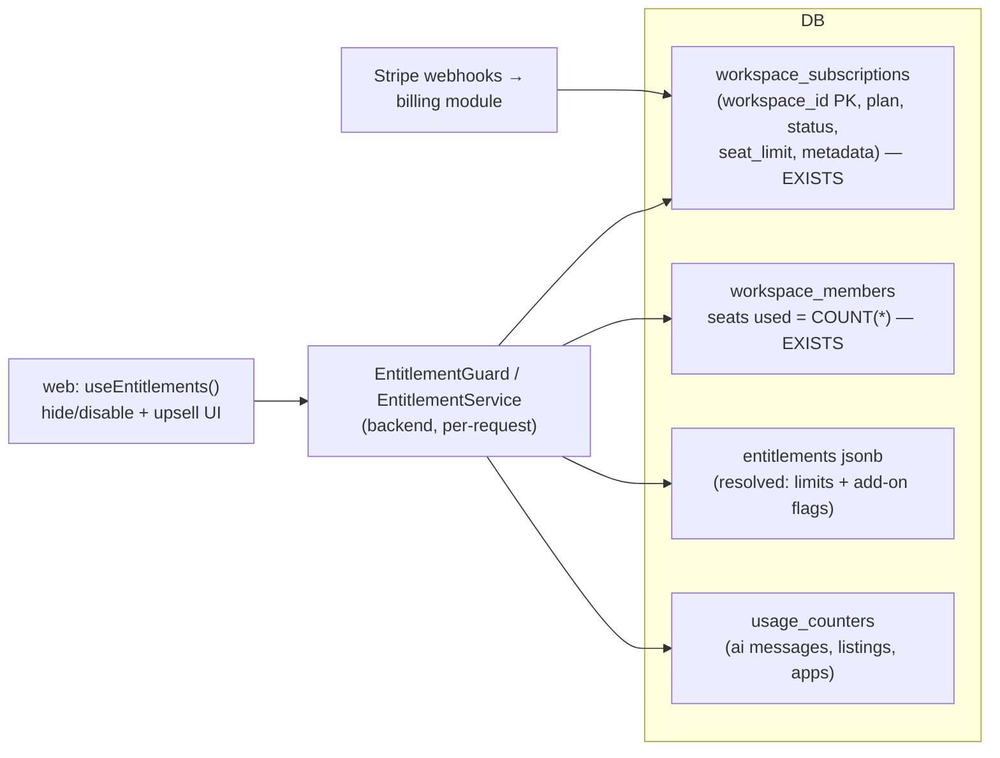

# Pricing Tiers & Add-ons

> **⚠️ Proposed — not built.**

> **Last updated:** 2026-09-22 · **Status:** draft

> **⚠️ Partly built.** Three phases of this design now exist in the repo. **B2** (provider-neutral
> billing) is built — see [Workspaces → Billing](../11-domains/workspaces/README.md#billing).
> **B1 and B3** (entitlements and plan limits) are built in the repo and applied to hosted dev on
> 2026-09-22; **production rollout is pending** — see
> [Workspaces → Plans & limits](../11-domains/workspaces/README.md#plans--limits), which is the
> current-state reference for them. What they built differs from this design in places; the
> [As built](#as-built-b1-and-b3) section below lists where. AI metering (B4), the add-ons (B5) and
> marketplace monetization (B6, B7) are still unbuilt.

> **⚠️ The billing anchor moved.** This page was written when the only candidate container was
> a **team**. The [Workspace](../11-domains/workspaces/README.md) tier shipped on 2026-09-01 and
> is explicitly the billing boundary: `workspace_subscriptions` already exists (plan + status +
> nullable `seat_limit`; `seat_limit` is still enforced nowhere, and plan limits come from the
> `plan_limits` table instead), and seats are `COUNT(workspace_members)`, not
> `team_members`. Read every "team subscription" below as "workspace subscription". The tier
> vocabulary — Free / Professional / Business / Enterprise — is unchanged and is what the shipped
> `plan` CHECK encodes, with `pro` as the stored value for Professional.

When this page was written Proyekto had **no monetization layer at all**: no plans, no
subscriptions, no payment processor, no entitlements, no usage caps. This page designs one, and
parts of it have since been built (see the callout above). It splits the product into
two sellable surfaces — the **Execution platform** (project management: projects, roadmaps,
teams, time, finance, AI, inbox/meetings) and the **Marketplace platform** (posting, bidding,
selling roadmaps, finding work) — and prices both with a 4-tier, per-seat ladder plus
Shopify-style **add-ons**, modeled on Shopify / ClickUp / Linear pricing pages.

Everything here is checked against source. Where the design contradicts current code, the
file is cited so the cost of the change is visible.

## What exists today (verified 2026-08-10; billing-anchor lines re-verified 2026-09-01)

### Nothing that bills a user

> **Updated 2026-09-22.** B1–B3 overtook the first four bullets below. Each keeps its original
> claim, because the rest of the page reasons from it, followed by what is true now.

- **A `workspace_subscriptions` table exists** (`20260902090000`, in both environments since the
  workspace tier shipped). **Since B2** (`20260908120000`) it also carries the payment-provider
  projection. It still has no seat-count column, and `seat_limit` is still enforced nowhere: the
  member cap is the `members` plan limit.
- **No** `plans` / `tiers` / `entitlements` / `usage` table. **Since B1/B3 (repo; schema in dev
  and production, code deploy pending):** `plan_limit_keys` and `plan_limits` hold the limit matrix, and the SQL
  functions `workspace_plan_state` and `workspace_usage_counts` answer the effective plan and the
  usage. There is still no usage-counter table; AI messages are unmetered.
- **No** Stripe/Paddle/etc. SDK anywhere. **Since B2:** the backend depends on `stripe`, used only
  by the Stripe adapter behind the provider-neutral `BillingProvider` interface
  (`backend/src/modules/shared/platform-billing/`). The old payments backend was deleted after its
  `transactions` table had already been dropped; the retained `wallets` table is not platform
  billing. Contract code still uses "billing" for the **contract billing period**
  (`backend/src/modules/marketplace/contracts/billing-period.ts`), which is why the new module is
  named `platform-billing`.
- **No** product caps: no max projects, roadmaps, teams, members, or AI messages — anywhere
  (no DB constraint, no RLS, no backend check). **Since B3 (repo + hosted dev, production
  pending):** members, projects, teams and roadmap nodes per roadmap are capped in the backend.
  AI messages are still uncapped.
- **AI chat is unmetered and unthrottled.** `roadmap-ai.controller.ts` carries only
  `SupabaseAuthGuard`. The Nest `ThrottlerModule` is configured
  (`backend/src/app.module.ts`) but **not bound as a global guard**, so `@Throttle` is inert
  except on the handful of controllers that add `@UseGuards(ThrottlerGuard)` explicitly.
- **Superseded 2026-09-08.** This bullet used to cite a "$TBD/month consultant seat" section on
  `web/src/routes/consultant/index.tsx` as the only pricing artifact in the product. That route no
  longer exists, and `/pricing` — a full four-tier page with a yearly/monthly toggle and a feature
  grid — is now the single published source. Its shape confirms the same intent by other means:
  seats are `workspace_members`, and a client or outside consultant who reaches a project through
  `project_access` consumes no seat and pays nothing.

### Hooks a tier system can reuse

| Existing mechanism | Where | What it proves |
| --- | --- | --- |
| `teams.time_tracking_enabled` boolean, default `false`, enforced in `team-time.service.ts` | `supabase/migrations/20260508000020_teams_time_tracking_enabled.sql` | A per-team feature flag already works end-to-end. **This is literally the "Time add-on" — it just has no price on it.** |
| `ConsultantOnlyGuard` (role + `is_consultant_verified`) | `backend/src/common/guards/consultant-only.guard.ts` | Module-level gating pattern (Finance is fully behind it today). |
| `teams.pay_period_config` jsonb, service-validated, no CHECK | `20260723000010_teams_pay_period_config.sql` | The pattern for per-team config that evolves without migrations — a plan/entitlement column should follow it. |
| `workspace_members` (`UNIQUE(workspace_id, user_id)`) | `20260902090000_workspaces_core.sql` | The **seat-count** table, as shipped. `workspace_subscriptions` deliberately stores no counter, so seats used is always `COUNT(*)` here and cannot drift. |
| `workspace_subscriptions` (`workspace_id` PK, `plan`, `status`, nullable `seat_limit`) | `20260902090000_workspaces_core.sql` | The subscription row this proposal called for, already in the right place — unwired. |
| `team_members` (`UNIQUE(team_id, user_id)`) | `20260507000010_teams_and_curation.sql` | The *previous* seat candidate. Superseded: a person can sit on several teams inside one workspace and must be one seat, not three. |
| `profiles.role` enum (`client\|talent\|consultant`) + guest accounts | `20260809130000_account_role_foundation.sql`, `20260210000000_add_guest_users.sql` | Durable role identity to hang role-scoped pricing on; guests are already a de-facto anonymous free tier. |
| Redis-backed `ThrottlerModule` | `backend/src/app.module.ts`, `backend/src/config/throttler-storage.service.ts` | Rate-limit plumbing exists; per-plan AI limits need only per-user keying and a guard binding. |

### Marketplace reality check

| Pitch-deck feature | Reality |
| --- | --- |
| **Post/bid a project** | **Built 2026-08-26** as client-authored project briefs (`project_postings`), not as bids on a project. See [Marketplace → project briefs](../11-domains/marketplace/project-briefs.md). |
| **Sell a roadmap** | Half exists. The template marketplace (`roadmap_public_templates`, versions, ratings, usages — `20260714100000_...`) has publish (consultant-only), browse, and instantiate — but **no price column, no purchase, no revenue share**. Selling is a monetization layer on an existing distribution surface. |
| **Find & apply to a project** | **Built 2026-08-26.** Verified consultants browse `/marketplace/briefs` and send a lightweight proposal (pitch + indicative rate). Pricing and contract machinery are still out of scope. |

## The two platforms, four tiers

Follow the comparators: 4 tiers, first free, priced per seat, annual toggle. The user-supplied
draft named two tiers (Free For All, Professional); this proposal completes the ladder:

| Tier | Working name | Who it's for | Billing |
| --- | --- | --- | --- |
| 1 | **Free** ("Free For All") | Individuals, guests-turned-users, trials | $0 |
| 2 | **Professional** | A working consultant or talent with one real team | per seat / month |
| 3 | **Business** | An agency running several teams and clients | per seat / month, higher |
| 4 | **Enterprise** | Orgs needing SSO, audit, custom limits | custom / annual |

**Who is a "seat"?** — the single most important decision (see D1 below). **Resolved by the
shipped tier: billable seats = rows in `workspace_members`.** Clients never pay and never count,
and they cannot: a client reaches a project through `project_access`, which is independent of
workspace membership, so a client on a consultant's project consumes no seat by construction
(matches the landing-page promise and the soft-isolation model in
[11-domains/finance](../11-domains/finance/README.md#contract-parties)). The plan is the
**workspace's** plan — `workspace_subscriptions` is 1:1 with `workspaces` — not a team owner's.

### The published tier matrix lives in the database, not here

The limits are the `plan_limits` table (18 keys × 4 plans), which a super admin edits at
`/admin/plans` and the backend enforces. `/pricing` draws prices, copy and the grid layout from
`web/src/lib/pricing.ts`, and every limit on it from `GET /api/plans`, falling back to
`DEFAULT_PLAN_LIMITS` (`web/src/lib/planLimits.ts`, a test-pinned copy of the seed) on the first
frame and during an API outage. The seed values are listed in
[Workspaces → The limit keys](../11-domains/workspaces/README.md#the-limit-keys). The tables that
used to sit here contradicted the published page on every row (they said Free = 3 projects /
1 team / 5 members-per-team; the seed says 2 projects / 2 teams / 10 members). They are
deliberately **not** restated, because rewriting them to match would only recreate the drift.

Two notes:

- The "members per team" ancestor is dead: seats are workspace-level now, so a per-team member cap
  maps to nothing the page sells.
- Free's 10 members is the enforced `members` limit (pending invites count at invite time), and
  the workspace Usage page shows it as a meter. `seat_limit` is still never rendered: it is the
  provider's seat-cap column, not the plan's member limit.

### Add-ons (the Shopify move)

An add-on is bought by the **workspace** (that is where the subscription lives) but *applies* at
the surface the flag already lives on — and both launch candidates are per-team surfaces:

1. **Time add-on** → prices the existing `teams.time_tracking_enabled` flag. The settings toggle
   (`web/src/routes/w/$workspaceSlug/teams/$teamId/settings/time.tsx`) becomes "enable = purchase".
   Since B3 the plan already gates it: the `time_tracking` feature (off on Free, on from Pro up)
   must be on in the **team's** workspace to turn the flag on or to create or change time logs,
   so the add-on would be a way to turn that one key on for a Free workspace.
2. **Finance add-on** → today Finance is free for every verified consultant
   (`finance.controller.ts` class-level `ConsultantOnlyGuard`). Pricing it means the guard
   chain becomes `ConsultantOnlyGuard` **and** `EntitlementGuard('finance')`. Decide the
   grandfathering story before shipping (E7). The Finance domain's table boundary just got
   crisper: `project_economics` → `finance_project_settings` and
   `project_member_allocations` → `finance_member_allocations`
   (`20260810140000_rename_project_finance_tables.sql`), so "what the Finance add-on
   covers" maps cleanly to the `finance_*` tables plus the `finance/` module.

Future add-ons follow the same shape: a named entitlement key resolved from the workspace's
subscription, sold à la carte on lower tiers, included in higher tiers. `workspace_subscriptions`
already carries a `metadata jsonb` column, which is the `pay_period_config` precedent applied one
tier up.

## Architecture: how entitlements are enforced

Rules, in order of importance:

1. **Entitlements are a separate check, not a fourth layer of `resolvePermissions`.**
   `project-permissions.ts` is a pure `(role, origin, capabilities)` function with two
   hand-maintained web mirrors and is the most security-critical code in the repo. The
   shipped workspace tier held this line exactly — it added **no** authorization surface at
   all — so entitlement must not be the thing that breaks it. A tier check is a **guard**
   (`EntitlementGuard`, sibling of `ConsultantOnlyGuard`) plus service-level checks for
   creation limits — permission answers "may this role do this here", entitlement answers
   "has this workspace paid for it". Keep the questions separate.
2. **The subscription hangs off the workspace** — `workspace_subscriptions` already exists,
   1:1 with `workspaces`, and seats are `COUNT(workspace_members)`. Resolving a resource's
   plan means reading `teams.workspace_id` / `projects.workspace_id`, both of which are
   **nullable** (`ON DELETE SET NULL`, permanently): entitlement resolution must define what
   a NULL workspace gets — the safe answer is Free — because guest-converted and
   workspace-orphaned rows legitimately carry one.
3. **Account-level limits (projects, roadmaps created) key off the workspace the resource
   lives in**, not the creating user, now that every write resolves a workspace through
   `WorkspacesService.resolveWorkspaceForWrite`. Where a per-user answer is still needed
   (a user in several workspaces), take the best plan among workspaces where they hold an
   `owner` role.
4. **Enforce limits at creation time in services, not in the DB.** Expand-only schema, no
   CHECK constraints on counts (they can't see across rows anyway). Over-limit after a
   downgrade goes **read-only, never deleted** (E1).
5. **AI metering** = a `usage_counters` table (or Redis with DB snapshot) incremented in
   `roadmap-ai.service.ts`, checked by the guard; plus finally binding `ThrottlerGuard`
   per-user on the AI controllers regardless of tier (today it is abuse-open).
6. **Ship dark, per the repo's staged-rollout rule**: land schema + guard with every workspace
   defaulted to a `legacy_unlimited` tier, flip enforcement per feature behind flags
   (`BILLING_ENFORCEMENT_ENABLED`, per-limit sub-flags). Note the shipped `plan` CHECK is
   `free|pro|business|enterprise` — a `legacy_unlimited` value needs its own expand migration. Prod migrations via Supabase MCP
   `apply_migration`, never `db push`.

### As built: B1 and B3

B1 and B3 are built in the repo; their schema is applied to dev and production (2026-09-22) and
the code deploy is pending. The
current-state reference is [Workspaces → Plans & limits](../11-domains/workspaces/README.md#plans--limits).
Where the build departs from the rules above:

| Rule / edge case | As built |
| --- | --- |
| Rule 1 — guard plus service checks | Service checks only (`EntitlementsService`), each placed after the caller's permission check. Entitlement stays separate from `resolvePermissions`. The only new guard is `SuperAdminGuard`, on the admin writes |
| Architecture diagram | No resolved `entitlements` jsonb and no `usage_counters`: limits are rows in `plan_limits` (one per plan and key, editable at `/admin/plans`), and usage is counted live by SQL functions. AI messages are unmetered (B4) |
| Rule 2 — NULL workspace | Held: an unhomed row gets Free limits. Guest-owned rows with no workspace are exempt (E2 held) |
| Rule 3 — per-user answer | Only the MCP coarse gate needs one, and it accepts **any** workspace the user belongs to, not only owner-role ones |
| Rule 4 / E1 — over-limit goes read-only | Nothing is deleted **or** made read-only. Over-limit data stays editable; only growth is refused, with a grandfather rule for roadmap nodes. The delivery registers are the exception: on a plan without the feature, their writes (deletes included) are refused while reads stay open |
| Rule 6 / E7 — ship dark, `legacy_unlimited` | No flag and no `legacy_unlimited` tier. Every workspace without a live subscription or complimentary plan is on Free the moment the rollout lands. On Free, existing delivery registers become read-only, teams that already have time tracking on can no longer start or create time logs (pause, stop and review stay open), MCP calls answer `PLAN_LIMIT`, activity older than 7 days is hidden (not deleted), and a workspace over a count limit cannot add more. Complimentary plans (`/admin/workspaces`) are the lever for grandfathering particular workspaces |
| E3 — personal projects and teams | Held: never counted |
| E11 — serial workspace creation | Still open: `POST /api/workspaces` has no quota, so creating another workspace resets every per-workspace limit |
| E13 — limit races | Moot for AI until B4. The count limits have the same shape of race: two simultaneous accepts or creates at the cap can over-admit by one |

## Decisions needed (with recommendations)

| # | Decision | Options | Recommendation |
| --- | --- | --- | --- |
| D1 | Who pays? | (a) every user per-seat like ClickUp; (b) providers pay, clients free | **(b)** — matches the landing page promise, the consultant-led model, and removes all client-seat edge cases. Client tier rows in the draft tables become "free, inherited from the paying team". |
| D2 | Subscription anchor | profile vs team vs future organization | **Resolved 2026-09-01: the workspace.** `workspace_subscriptions` shipped as the anchor and `workspace_members` as the seat pool; the "team now, lift to org later" hedge is obsolete and no lift migration is needed. |
| D3 | Tier count | 2 (as drafted) vs 4 (comparators) | **4** — Free / Professional / Business / Enterprise. Enterprise can launch as "Contact sales" with nothing behind it (all three comparators do). |
| D4 | Are Time & Finance add-ons on Pro, or included? | à la carte at every paid tier vs included from Pro up | **Add-ons on Free + Pro, included in Business+.** Preserves the Shopify-style add-on story and gives Business a clean "everything included" pitch. |
| D5 | Marketplace pricing | subscription-gated vs take-rate vs both | **Both**: tiers gate volume/placement; take-rate (start 15–20% on template sales) earns on success. Don't gate *buying* anything. |
| D6 | Payment processor | Stripe vs regional (Paymongo etc.) | **Stripe Billing** for subscriptions (webhooks → `team_subscriptions`); revisit regional rails only for marketplace payouts, where `payout_methods` already models PayPal-style methods. |
| D7 | Free-tier AI limit unit | messages vs tokens vs sessions | **Messages per user per month** — explainable in UI; token accounting stays an internal cost control (`OPENAI_V2_MAX_OUTPUT_TOKENS` etc. already bound per-turn cost). |
| D8 | Sequencing vs the organization tier | billing first vs orgs first | **Moot — the org tier went first.** Workspaces shipped 2026-09-01 with the subscription table already in place, so billing work starts from the anchor rather than migrating onto it. |

## Edge cases (identified now, so they don't ship as incidents)

- **E1 — Downgrade with over-limit resources.** 10 projects, drop to Free (3): projects 4–10
  become **read-only** (banner + upgrade CTA), never deleted, never auto-picked. Same for
  teams over the member cap: existing members stay, adding a 6th is blocked.
- **E2 — Guests.** Guest roadmap building (`create_guest_user()`, 30-day cleanup) is the
  top-of-funnel and must stay outside any limit check; the guest→real migration lands the
  roadmap under Free-tier counting.
- **E3 — Personal teams & personal projects.** `teams.is_personal` and projects linked
  through `personal_projects` (renamed from `personal_workspaces` on 2026-09-01) never count
  toward team/project quotas and can never hold a subscription — otherwise every consultant
  signup instantly consumes the Free team allowance. Note the personal project **does** get
  stamped into the user's default workspace by `provision_personal_project`, so quota
  exclusion has to be an explicit rule, not an accident of a NULL `workspace_id`.
- **E3b — Everyone now owns a workspace.** Signup requires one and
  `provision_default_workspace` back-stops it, so "workspaces created" can never be a
  billable quota and the Free tier must cover the auto-provisioned default. A user who
  belongs to several workspaces holds several plans.
- **E4 — Multi-workspace membership.** A talent in three paid workspaces is **three seats paid
  by three owners** (like Slack workspaces), not one pooled identity. Their *personal*
  capabilities follow their own default workspace's plan.
- **E5 — Client on a paid workspace's project.** Clients ride the workspace's tier for shared
  surfaces. A client who *also* owns their own projects is a Free-tier account for those,
  subject to Free limits. Note the ownership pointer is now `projects.owner_id` — renamed
  from `client_id` (`20260810120000_rename_project_client_to_owner.sql` +
  `20260810130000_drop_project_client_id.sql`) precisely because **any role may own a
  project**. Per-account limits (rule 3 above) count `owner_id`, which makes this
  role-neutral by construction.
- **E6 — External clients (no account).** Contract signing via tokenized link
  (`contract_signature_links`) must never hit an entitlement check — there is no account to
  entitle. Gate Finance for the *consultant* side only.
- **E7 — Grandfathering.** Finance and Time are live and free today for verified
  consultants / enabled teams. Migration: every existing workspace gets `legacy_unlimited` (or
  a 6-month `pro_courtesy`); enforcement flags flip for **new** workspaces first. The
  `20260902090400` backfill already gave every non-guest user a workspace on `free`, so this
  is an `UPDATE`, not a provisioning step.
- **E8 — Workspace ownership transfer.** The subscription belongs to the workspace, but the
  payment method belongs to an owner. Two shipped facts help: a workspace can hold **several**
  `owner` rows, and `assertNotLastOwner` makes an ownerless workspace impossible, so the
  subscription can never be orphaned. `workspaces.created_by` is `ON DELETE SET NULL` and is
  audit metadata only — never read it as the payer. On the last-owner change, enter a
  `past_due`-style grace until a payment method is attached.
- **E9 — Consultant verification ≠ tier.** Verification (vetting) and payment are
  independent axes: an unverified consultant on Business still can't touch Finance
  (capability gate); a verified consultant on Free can — until the Finance add-on ships
  its entitlement gate. Never let a paid tier bypass `is_consultant_verified`.
- **E10 — Seat drift.** Members join/leave mid-cycle (`workspace_invites`, accept/leave/remove).
  Stripe per-seat proration on change, reconciled from the `workspace_members` count on webhook +
  nightly job. This is materially easier than the team-anchored version was: seats live in one
  table with a `UNIQUE (workspace_id, user_id)` key and exactly three mutation paths
  (`respondInvite` accept, `removeMember`, `updateMember`), and `workspace_subscriptions` stores
  no counter to fall out of sync. The team-side removal-path integrity debt (three
  remove-member paths bypass `revoke()`) does **not** propagate here, because team membership
  is no longer the seat.
- **E11 — Free-tier abuse.** "3 projects" per *what*? **Per workspace** — but a user may create
  unlimited workspaces (`POST /api/workspaces` has no quota and no rate limit today), so a
  per-workspace-only limit is trivially reset by serial workspace creation. Either cap
  owner-role memberships or count per account as well. Deleted (archived) projects continue to
  count for 30 days to block create/delete cycling.
- **E12 — Bidding ghost state.** *(Resolved 2026-08-26.)* Project briefs deliberately left `'bidding'` alone: it is still written by client-mode project creation and rendered by three dashboard surfaces, and the brief board reads `project_postings` instead, so old rows cannot leak into the listings surface.
  feature behind it. Building "post/bid" must either adopt it deliberately or leave it
  untouched; don't let old rows with that status leak into a new listings surface.
- **E13 — AI limit race.** Counter increments must be check-and-increment (Redis INCR
  against limit), not read-then-write, or parallel sessions blow past the cap.
- **E14 — Role changes.** `profiles.role` is durable/non-switchable, but talent can become
  a verified consultant (application pipeline). Their existing Free resources and team
  memberships carry over; nothing about tiering may assume role is a tier.

## Sequencing (expand-only, ship-dark)

| Phase | Lands | Flag | User-visible |
| --- | --- | --- | --- |
| **B1** | **Built in the repo 2026-09-22 (schema in dev + prod; code deploy pending)** — entitlement resolution (`EntitlementsService`, no guard) over the existing `workspace_subscriptions`, plus complimentary plans on `workspaces`. No `legacy_unlimited` tier. See [Workspaces → Plans & limits](../11-domains/workspaces/README.md#plans--limits) | — (no flag) | Usage page, admin editors |
| **B2** | **Built 2026-09-22** — provider-neutral billing (Stripe adapter first): checkout + webhooks + seat proration, replacing the billing placeholder at `/w/<slug>/settings/billing`. See [Workspaces → Billing](../11-domains/workspaces/README.md#billing) | — (on wherever a provider is configured) | billing page |
| **B3** | **Built in the repo 2026-09-22 (schema in dev + prod; code deploy pending)** — members, projects, teams and roadmap-node limits, the delivery-register, time-tracking and MCP feature gates, and activity retention, for **every** workspace | — (no flag) | yes |
| **B4** | AI usage metering + per-user throttle binding | `AI_METERING_ENABLED` | yes (limit UI) |
| **B5** | Time & Finance add-on purchase flows (price the existing flags) | per-add-on flags | yes |
| **B6** | Marketplace: sell-a-roadmap (price + checkout + take-rate on templates) | `TEMPLATE_SALES_ENABLED` | yes |
| **B7** | Marketplace: post/bid + find/apply (net-new build; own proposal doc when scoped) | `LISTINGS_ENABLED` | yes |

## See also

- [11-domains/workspaces](../11-domains/workspaces/README.md) — the billing anchor, as shipped:
  the tables, the seat rule, the roles and billing (D2, D8), and the Plans & limits layer that
  B1/B3 built.
- [11-domains/finance](../11-domains/finance/README.md#contract-parties) — who pays and the
  external-client signing path that must stay entitlement-free (E6).
- [11-domains/consultants](../11-domains/consultants/README.md) and
  [11-domains/talent](../11-domains/talent/README.md) — the role domains the tier ladder
  prices (vetting vs payment axes, E9/E14).
- `web/src/lib/pricing.ts` and `web/src/routes/pricing.tsx` — the published plans, prices and
  feature grid. The former is the file to change when a price changes; a limit changes at
  `/admin/plans`.
