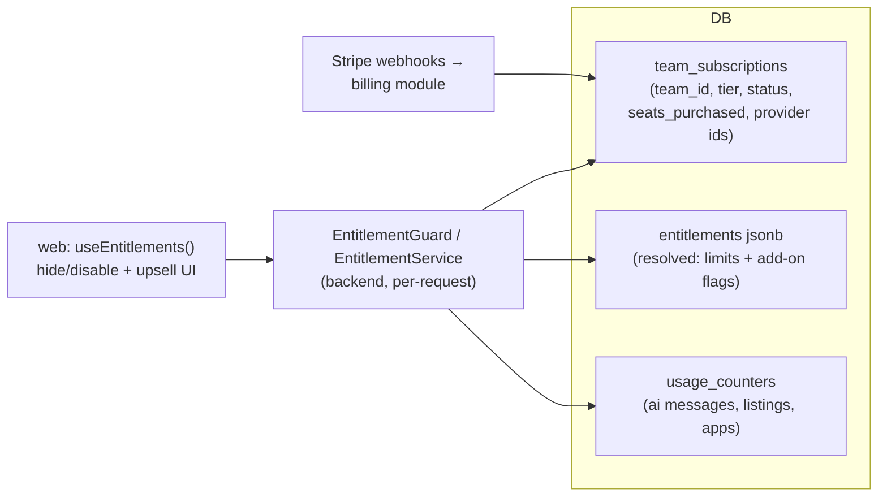

# Pricing Tiers & Add-ons

> **⚠️ Proposed — not built.**

> **Last updated:** 2026-08-10 · **Status:** draft

Proyekto today has **no monetization layer at all**: no plans, no subscriptions, no payment
processor, no entitlements, no usage caps. This page designs one. It splits the product into
two sellable surfaces — the **Execution platform** (project management: projects, roadmaps,
teams, time, finance, AI, inbox/meetings) and the **Marketplace platform** (posting, bidding,
selling roadmaps, finding work) — and prices both with a 4-tier, per-seat ladder plus
Shopify-style **add-ons**, modeled on Shopify / ClickUp / Linear pricing pages.

Everything here is checked against source. Where the design contradicts current code, the
file is cited so the cost of the change is visible.

## What exists today (verified 2026-08-10, after the account-role-foundation merge)

### Nothing that bills a user

- **No** `subscriptions` / `plans` / `tiers` / `entitlements` / `usage` / `seats` table in
  any of the 240 migrations.
- **No** Stripe/Paddle/etc. SDK anywhere. `backend/src/modules/payments/` is the internal
  client-escrow ledger (`wallets`, `transactions`), not platform billing. Every occurrence
  of "billing" in the repo means **contract billing period**
  (`backend/src/modules/contracts/billing-period.ts`), never a platform subscription.
- **No** product caps: no max projects, roadmaps, teams, members, or AI messages — anywhere
  (no DB constraint, no RLS, no backend check).
- **AI chat is unmetered and unthrottled.** `roadmap-ai.controller.ts` carries only
  `SupabaseAuthGuard`. The Nest `ThrottlerModule` is configured
  (`backend/src/app.module.ts`) but **not bound as a global guard**, so `@Throttle` is inert
  except on the handful of controllers that add `@UseGuards(ThrottlerGuard)` explicitly.
- The **only pricing artifact** in the product is the consultant landing page
  (`web/src/routes/consultant/index.tsx`): a "Consultant seat — $TBD/month, per consultant,
  cancel anytime" marketing section with nothing behind it. This is the strongest existing
  signal of intended shape: **providers pay, clients don't**.

### Hooks a tier system can reuse

| Existing mechanism | Where | What it proves |
| --- | --- | --- |
| `teams.time_tracking_enabled` boolean, default `false`, enforced in `team-time.service.ts` | `supabase/migrations/20260508000020_teams_time_tracking_enabled.sql` | A per-team feature flag already works end-to-end. **This is literally the "Time add-on" — it just has no price on it.** |
| `ConsultantOnlyGuard` (role + `is_consultant_verified`) | `backend/src/common/guards/consultant-only.guard.ts` | Module-level gating pattern (Finance is fully behind it today). |
| `teams.pay_period_config` jsonb, service-validated, no CHECK | `20260723000010_teams_pay_period_config.sql` | The pattern for per-team config that evolves without migrations — a plan/entitlement column should follow it. |
| `team_members` (`UNIQUE(team_id, user_id)`) | `20260507000010_teams_and_curation.sql` | The natural **seat-count** table. |
| `profiles.role` enum (`client\|talent\|consultant`) + guest accounts | `20260809130000_account_role_foundation.sql`, `20260210000000_add_guest_users.sql` | Durable role identity to hang role-scoped pricing on; guests are already a de-facto anonymous free tier. |
| Redis-backed `ThrottlerModule` | `backend/src/app.module.ts`, `backend/src/config/throttler-storage.service.ts` | Rate-limit plumbing exists; per-plan AI limits need only per-user keying and a guard binding. |

### Marketplace reality check

| Pitch-deck feature | Reality |
| --- | --- |
| **Post/bid a project** | Does not exist. `'bidding'` was added to the `project_status` enum (`20260216000000_add_bidding_status.sql`) and never used — no `bids` table, no UI. `web/src/routes/project-posting.tsx` is a project-creation wizard, not a public listing. |
| **Sell a roadmap** | Half exists. The template marketplace (`roadmap_public_templates`, versions, ratings, usages — `20260714100000_...`) has publish (consultant-only), browse, and instantiate — but **no price column, no purchase, no revenue share**. Selling is a monetization layer on an existing distribution surface. |
| **Find & apply to a project** | Does not exist in that direction. Today's marketplace module is consultant→freelancer *invites* only (`backend/src/modules/marketplace/`, `project_invites`, `profiles.is_public`). `applications/` is consultant **vetting**, not project applications. |

## The two platforms, four tiers

Follow the comparators: 4 tiers, first free, priced per seat, annual toggle. The user-supplied
draft named two tiers (Free For All, Professional); this proposal completes the ladder:

| Tier | Working name | Who it's for | Billing |
| --- | --- | --- | --- |
| 1 | **Free** ("Free For All") | Individuals, guests-turned-users, trials | $0 |
| 2 | **Professional** | A working consultant or freelancer with one real team | per seat / month |
| 3 | **Business** | An agency running several teams and clients | per seat / month, higher |
| 4 | **Enterprise** | Orgs needing SSO, audit, custom limits | custom / annual |

**Who is a "seat"?** — the single most important decision (see D1 below). Recommended:
**billable seats = rows in `team_members` on a paid team, excluding client-origin
participants**. Clients never pay and never count (matches the landing-page promise and the
soft-isolation model in [11-domains/clients](../11-domains/clients/README.md)). The team
**owner's** plan is the team's plan.

### Execution platform — tier matrix (completed)

Limits marked ⚙ are new enforcement that does not exist today.

| Feature | Free | Professional | Business | Enterprise |
| --- | --- | --- | --- | --- |
| Projects ⚙ | 3 | 25 | Unlimited | Unlimited |
| Roadmaps ⚙ | 3 (1 per project until multi-roadmap ships) | 25 | Unlimited | Unlimited |
| Teams created ⚙ | 1 (+ personal team, which never counts) | 3 | 10 | Unlimited |
| Members per team ⚙ | 5 | 15 | 50 | Custom |
| Roadmap/Project AI chat ⚙ | Limited (e.g. 25 messages / user / month) | Enhanced (e.g. 500/mo) | High (e.g. 2 000/mo) | Custom / pooled |
| Inbox & chat | ✔ | ✔ | ✔ | ✔ + retention controls |
| Meetings | ✔ basic scheduling | ✔ + Google Calendar connect | ✔ + integrations | ✔ |
| Roadmap templates (use) | ✔ | ✔ | ✔ | ✔ |
| **Time section** | **Add-on** | **Add-on** (or bundled — D4) | Included | Included |
| **Finance section** (contracts, invoices, portfolio) | **Add-on** | **Add-on** (or bundled — D4) | Included | Included |
| Payouts / rates / pay-period config | with Time add-on | with Time add-on | Included | Included |
| Guest roadmap builder | ✔ (existing behaviour) | — | — | — |
| SSO / SAML, audit log, data residency | — | — | — | ✔ |

All rows apply to all three roles (consultant / talent / client) as in the draft tables,
with the standing exceptions that already exist in code and are **not** tier questions:
Finance and template-publishing are consultant-capability surfaces
(`ConsultantOnlyGuard`), and clients are read-mostly by `ORIGIN_DELTAS`.

### Marketplace platform — tier matrix (completed)

| Feature | Free | Professional | Business | Enterprise |
| --- | --- | --- | --- | --- |
| Post a project for bidding *(new build)* | 1 active listing (Client) | 5 active | Unlimited | Unlimited |
| Bid on a project *(new build)* | 3 active bids (Consultant) | Unlimited | Unlimited | Unlimited |
| Sell a roadmap template *(new monetization)* | List free templates only | Sell — platform takes X% | Sell — lower % | Negotiated |
| Buy a roadmap template | ✔ | ✔ | ✔ | ✔ |
| Find & apply to a project *(new build)* | 5 applications/mo (Talent/Consultant) | Unlimited | Unlimited | Unlimited |
| Go-live discoverability (existing `is_public`) | ✔ | ✔ + boosted placement | ✔ | ✔ |
| Consultant→freelancer browse & invite (existing) | ✔ (verified consultants) | ✔ | ✔ | ✔ |

Marketplace revenue is **transactional** (take-rate on template sales, possibly on awarded
bids) layered on top of subscription tiers — the tiers gate *volume and placement*, the
take-rate earns on *success*. This mirrors Shopify (subscription + payments cut).

### Add-ons (the Shopify move)

An add-on is a **per-team** purchasable flag, not a per-user one — because its two launch
candidates are already per-team surfaces:

1. **Time add-on** → prices the existing `teams.time_tracking_enabled` flag. Zero new
   enforcement code for the core gate; the settings toggle
   (`web/src/routes/teams/$teamId/settings/time.tsx`) becomes "enable = purchase".
2. **Finance add-on** → today Finance is free for every verified consultant
   (`finance.controller.ts` class-level `ConsultantOnlyGuard`). Pricing it means the guard
   chain becomes `ConsultantOnlyGuard` **and** `EntitlementGuard('finance')`. Decide the
   grandfathering story before shipping (E7). The Finance domain's table boundary just got
   crisper: `project_economics` → `finance_project_settings` and
   `project_member_allocations` → `finance_member_allocations`
   (`20260810140000_rename_project_finance_tables.sql`), so "what the Finance add-on
   covers" maps cleanly to the `finance_*` tables plus the `finance/` module.

Future add-ons follow the same shape: a named entitlement key on the team, sold à la carte
on lower tiers, included in higher tiers.

## Architecture: how entitlements are enforced

Rules, in order of importance:

1. **Entitlements are a separate check, not a fourth layer of `resolvePermissions`.**
   `project-permissions.ts` is a pure `(role, origin, capabilities)` function with two
   hand-maintained web mirrors and is the most security-critical code in the repo; the
   organizations proposal already warns against extending it. A tier check is a **guard**
   (`EntitlementGuard`, sibling of `ConsultantOnlyGuard`) plus service-level checks for
   creation limits — permission answers "may this role do this here", entitlement answers
   "has this team paid for it". Keep the questions separate.
2. **The subscription hangs off the team** (`team_subscriptions` table; or a
   service-validated jsonb column following the `pay_period_config` precedent), because
   both launch add-ons are per-team and `team_members` is the seat table. Personal teams
   (`teams.is_personal`) are always Free and never count against team quotas.
3. **Account-level limits (projects, roadmaps created) key off the creating user's best
   plan** — the highest tier among teams they own. Simple, explains well in UI.
4. **Enforce limits at creation time in services, not in the DB.** Expand-only schema, no
   CHECK constraints on counts (they can't see across rows anyway). Over-limit after a
   downgrade goes **read-only, never deleted** (E1).
5. **AI metering** = a `usage_counters` table (or Redis with DB snapshot) incremented in
   `roadmap-ai.service.ts`, checked by the guard; plus finally binding `ThrottlerGuard`
   per-user on the AI controllers regardless of tier (today it is abuse-open).
6. **Ship dark, per the repo's staged-rollout rule**: land schema + guard with every team
   defaulted to a `legacy_unlimited` tier, flip enforcement per feature behind flags
   (`BILLING_ENFORCEMENT_ENABLED`, per-limit sub-flags). Prod migrations via Supabase MCP
   `apply_migration`, never `db push`.

## Decisions needed (with recommendations)

| # | Decision | Options | Recommendation |
| --- | --- | --- | --- |
| D1 | Who pays? | (a) every user per-seat like ClickUp; (b) providers pay, clients free | **(b)** — matches the landing page promise, the consultant-led model, and removes all client-seat edge cases. Client tier rows in the draft tables become "free, inherited from the paying team". |
| D2 | Subscription anchor | profile vs team vs future organization | **Team now**, with a nullable `organization_id` reserved so the [organizations proposal](./organizations-and-services.md) can lift billing to the org later without a second migration of concepts. |
| D3 | Tier count | 2 (as drafted) vs 4 (comparators) | **4** — Free / Professional / Business / Enterprise. Enterprise can launch as "Contact sales" with nothing behind it (all three comparators do). |
| D4 | Are Time & Finance add-ons on Pro, or included? | à la carte at every paid tier vs included from Pro up | **Add-ons on Free + Pro, included in Business+.** Preserves the Shopify-style add-on story and gives Business a clean "everything included" pitch. |
| D5 | Marketplace pricing | subscription-gated vs take-rate vs both | **Both**: tiers gate volume/placement; take-rate (start 15–20% on template sales) earns on success. Don't gate *buying* anything. |
| D6 | Payment processor | Stripe vs regional (Paymongo etc.) | **Stripe Billing** for subscriptions (webhooks → `team_subscriptions`); revisit regional rails only for marketplace payouts, where `payout_methods` already models PayPal-style methods. |
| D7 | Free-tier AI limit unit | messages vs tokens vs sessions | **Messages per user per month** — explainable in UI; token accounting stays an internal cost control (`OPENAI_V2_MAX_OUTPUT_TOKENS` etc. already bound per-turn cost). |
| D8 | Sequencing vs organizations proposal | billing first vs orgs first | **Billing first, org-compatible** (D2). Billing has direct revenue; orgs P4+ can adopt team subscriptions later. |

## Edge cases (identified now, so they don't ship as incidents)

- **E1 — Downgrade with over-limit resources.** 10 projects, drop to Free (3): projects 4–10
  become **read-only** (banner + upgrade CTA), never deleted, never auto-picked. Same for
  teams over the member cap: existing members stay, adding a 6th is blocked.
- **E2 — Guests.** Guest roadmap building (`create_guest_user()`, 30-day cleanup) is the
  top-of-funnel and must stay outside any limit check; the guest→real migration lands the
  roadmap under Free-tier counting.
- **E3 — Personal teams & personal workspaces.** `teams.is_personal` and
  `projects.is_personal_workspace` never count toward team/project quotas and can never
  hold a subscription — otherwise every consultant signup instantly consumes the Free
  team allowance.
- **E4 — Multi-team membership.** A freelancer in three paid teams is **three seats paid by
  three owners** (like Slack workspaces), not one pooled identity. Their *personal*
  capabilities follow their own plan.
- **E5 — Client on a paid team's project.** Clients ride the team's tier for shared
  surfaces. A client who *also* owns their own projects is a Free-tier account for those,
  subject to Free limits. Note the ownership pointer is now `projects.owner_id` — renamed
  from `client_id` (`20260810120000_rename_project_client_to_owner.sql` +
  `20260810130000_drop_project_client_id.sql`) precisely because **any role may own a
  project**. Per-account limits (rule 3 above) count `owner_id`, which makes this
  role-neutral by construction.
- **E6 — External clients (no account).** Contract signing via tokenized link
  (`contract_signature_links`) must never hit an entitlement check — there is no account to
  entitle. Gate Finance for the *consultant* side only.
- **E7 — Grandfathering.** Finance and Time are live and free today for verified
  consultants / enabled teams. Migration: every existing team gets `legacy_unlimited` (or
  a 6-month `pro_courtesy`); enforcement flags flip for **new** teams first.
- **E8 — Team ownership transfer.** The subscription belongs to the team, but the payment
  method belongs to the owner. On owner change, subscription enters `past_due`-style grace
  until the new owner attaches a payment method. (`owner_id` is `ON DELETE RESTRICT`, so
  deletion can't orphan it silently.)
- **E9 — Consultant verification ≠ tier.** Verification (vetting) and payment are
  independent axes: an unverified consultant on Business still can't touch Finance
  (capability gate); a verified consultant on Free can — until the Finance add-on ships
  its entitlement gate. Never let a paid tier bypass `is_consultant_verified`.
- **E10 — Seat drift.** Members join/leave mid-cycle (`team_invites`, curation flows).
  Stripe per-seat proration on change, reconciled from `team_members` count on webhook +
  nightly job. Removal paths must decrement — note the existing
  removal-path integrity debt (three remove-member paths bypass `revoke()`), which billing
  reconciliation would inherit.
- **E11 — Free-tier abuse.** "3 projects" per *what*? Per account — else serial team
  creation resets limits. Deleted (archived) projects continue to count for 30 days to
  block create/delete cycling.
- **E12 — Bidding ghost state.** The `'bidding'` project status exists in the enum with no
  feature behind it. Building "post/bid" must either adopt it deliberately or leave it
  untouched; don't let old rows with that status leak into a new listings surface.
- **E13 — AI limit race.** Counter increments must be check-and-increment (Redis INCR
  against limit), not read-then-write, or parallel sessions blow past the cap.
- **E14 — Role changes.** `profiles.role` is durable/non-switchable, but talent can become
  a verified consultant (application pipeline). Their existing Free resources and team
  memberships carry over; nothing about tiering may assume role is a tier.

## Sequencing (expand-only, ship-dark)

| Phase | Lands | Flag | User-visible |
| --- | --- | --- | --- |
| **B1** | `team_subscriptions` + entitlement resolution + `EntitlementGuard`; all teams `legacy_unlimited` | — | no |
| **B2** | Stripe Billing integration, checkout + webhooks + seat proration | `BILLING_ENABLED` | pricing page only |
| **B3** | Free-tier limit enforcement (projects/roadmaps/teams/members) for **new** accounts | `BILLING_ENFORCEMENT_ENABLED` | yes |
| **B4** | AI usage metering + per-user throttle binding | `AI_METERING_ENABLED` | yes (limit UI) |
| **B5** | Time & Finance add-on purchase flows (price the existing flags) | per-add-on flags | yes |
| **B6** | Marketplace: sell-a-roadmap (price + checkout + take-rate on templates) | `TEMPLATE_SALES_ENABLED` | yes |
| **B7** | Marketplace: post/bid + find/apply (net-new build; own proposal doc when scoped) | `LISTINGS_ENABLED` | yes |

## See also

- [organizations-and-services.md](./organizations-and-services.md) — the future billing
  anchor above teams (D2, D8).
- [11-domains/clients](../11-domains/clients/README.md) — why clients don't pay and the
  external-client signing path that must stay entitlement-free (E6).
- [11-domains/consultants](../11-domains/consultants/README.md) and
  [11-domains/talent](../11-domains/talent/README.md) — the role domains the tier ladder
  prices (vetting vs payment axes, E9/E14).
- `web/src/routes/consultant/index.tsx` — the existing consultant-seat pricing copy.
