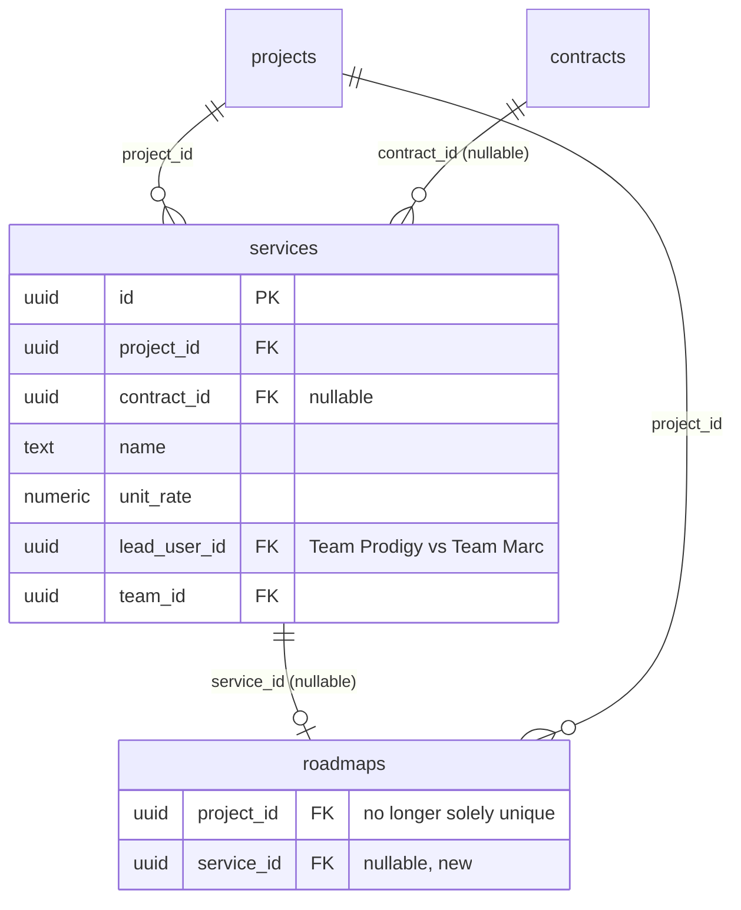
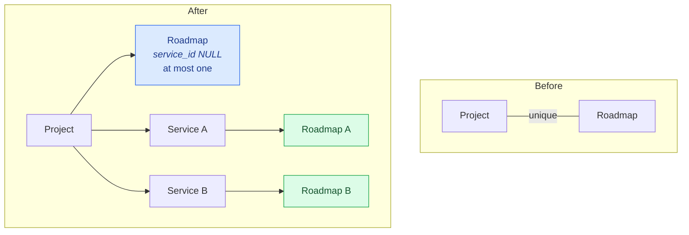

# Services and Multi-Roadmap Projects

> **⚠️ Proposed — not built.**

> **Last updated:** 2026-09-01 · **Status:** draft

Two halves of one design: promote contract **services** from a jsonb blob into a real table, and
resolve the cardinality conflict that falls out of doing so — the stated rule
`1 Roadmap = 1 Service` collides with the `roadmaps.project_id` uniqueness invariant.

> **The organization half of this proposal shipped — as "Workspace", not "Organization".**
> See the [supersession note](#superseded-the-organization-tier-shipped-as-workspace) below
> before reading anything here as unbuilt.

## Superseded: the organization tier shipped as "Workspace"

This page was formerly *Organizations and Services* and proposed an `organizations` tier above
projects. That tier was **built on 2026-09-01** under a different name and with a materially
different provisioning philosophy. It is documented as current state in
[11-domains/workspaces](../11-domains/workspaces/README.md) (built; applied to hosted dev, not yet
in production).

| Proposed here | Shipped as |
| --- | --- |
| `organizations` with a `kind` enum (`agency`/`business`/`personal`) | `workspaces` — **no `kind`, no `slug`, no `owner_id`**; one flat container |
| `organization_members` with an `organization_role` | `workspace_members`, `role` ∈ (`owner`, `admin`, `member`); ownership *is* the `owner` role |
| `organization_invites` mirroring `team_invites` | `workspace_invites` mirroring `team_invites` — this part shipped as designed |
| `projects.client_org_id` + `projects.provider_org_id` | A single `projects.workspace_id` (nullable). The two-sided client/provider modelling did **not** ship |
| `teams.organization_id` as a nullable label | `teams.workspace_id`, nullable, `ON DELETE SET NULL` — shipped as designed |
| `project_access.has_org_grant` + a membership fan-out trigger | **Not built, and deliberately so.** There is no workspace column on `project_access` and no fan-out. Workspace membership grants nothing inside a project |
| `organizations.default_project_role` | Not built — there is no workspace → project role at all |
| A `services` table and `roadmaps.service_id` | **Not built.** That is the remainder of this page |

### The reversed decision

> **⚠️ Decision reversed by product on 2026-09-01.** This page argued that organizations must be
> **progressive, never required**, and warned in the strongest terms against auto-provisioning one
> per user — calling it `persona_type` in a new costume and citing
> `20260804170019_remove_active_persona.sql`.
>
> **The shipped design does the opposite on both counts.** A workspace is **required at signup**
> (the `/welcome` deck's workspace step cannot be completed away, and the team-creation step was
> removed to make room for it), and `provision_default_workspace(uuid)` is a **server-side
> backstop** that provisions one on `PATCH /api/auth/onboarding/complete` whether or not the user
> finishes the deck — plus `20260902090400_backfill_workspaces.sql`, the 100%-of-rows backfill this
> page warned against.
>
> The objection was not disproven; it was **outweighed**. Two things blunt it in the shipped shape:
> the workspace answers no authorization question, so there is no "acting as which workspace?"
> on any request that matters (writes resolve a workspace, reads authorize on `project_access`);
> and there is no `kind`/`is_personal` axis, so a workspace is not a second identity container the
> way `persona_type` was.

### What no longer needs deciding

- **`projects.owner_id` stays `NOT NULL`.** The shipped design never touched it: `workspace_id` was
  added alongside as nullable classification metadata, so the five readers this page catalogued
  (the personal-project junction, `canAccessProject`, `listRoadmapLinkCandidates`, contract/invoice
  snapshots, and RLS) were untouched. The `resolveClient(project, contract?)` resolver was not
  needed and was not built.
- **Teams stay user-owned.** `teams.owner_id` remains authoritative; `workspace_id` is the nullable
  label this page recommended.
- **The `contract_parties` gap this page hoped to close as a bonus is still open** — since no
  fan-out shipped, workspace members of a client's organization still do not receive
  `project_access`. See [11-domains/finance](../11-domains/finance/README.md#contract-parties).

Everything below is the part that did **not** ship.

## Services: out of the jsonb

Today `contracts.services` is an ordered jsonb array — `[{id, name, description, unit,
unit_rate, position}]` — modelled on `contracts.clauses`. It works for invoice line-picking and
nothing else. It cannot carry a delivery owner, a status, or a foreign key from a roadmap.

```sql
services
  id uuid PK,
  project_id uuid NOT NULL → projects ON DELETE CASCADE,
  contract_id uuid NULL → contracts ON DELETE SET NULL,
  legacy_json_id text,                    -- the jsonb item's id, for reconciliation
  name text NOT NULL, description text,
  unit text, unit_rate numeric(14,2) NOT NULL DEFAULT 0,
  currency text NOT NULL DEFAULT 'USD',
  position int NOT NULL DEFAULT 0,
  status text CHECK IN ('draft','active','paused','completed','cancelled'),
  -- who delivers THIS service — the whiteboard's Team Prodigy vs Team Marc:
  lead_user_id uuid NULL → profiles ON DELETE SET NULL,
  team_id      uuid NULL → teams ON DELETE SET NULL,
  UNIQUE (project_id, position)
```

> **Changed from the original draft:** the `lead_org_id` column is dropped. It pointed at
> `organizations`, and the shipped `workspaces` table is an organizational/billing container, not a
> delivery party — a service's delivery owner is a person or a team. If per-workspace delivery
> attribution is ever wanted, it is a separate, argued addition.

**The jsonb column is kept and dual-written.** It is read by
`web/src/components/finance/ProjectContract.tsx` (the Services step) and
`InvoiceBuilder.addServiceLine`. Expand → migrate readers → contract, across three separate
changes. Dropping it is out of scope here.



## Resolving `1 Roadmap = 1 Service`

The stated rules compose to a contradiction with the schema:

```
1 Project  = 1 Contract
1 Contract = 1..n Services
1 Service  = 1 Roadmap
────────────────────────
1 Project  = 1..n Roadmaps        but a project may hold only one roadmap
```

`roadmaps.project_id UUID UNIQUE NOT NULL` was declared in
`20260111000001_create_roadmap_canvas_schema.sql:80`. It was later made nullable for guest
roadmaps (`20260210000001`), whose migration comment notes the uniqueness check also runs in
the app; the constraint today is the partial unique index `uq_roadmaps_project_id_linked`
(unique only when `project_id` is set).

### The move: partial unique indexes

```sql
ALTER TABLE public.roadmaps
  ADD COLUMN service_id uuid NULL REFERENCES public.services(id) ON DELETE SET NULL;

DROP INDEX public.uq_roadmaps_project_id_linked;

-- The legacy invariant survives, scoped: still exactly one "project roadmap".
CREATE UNIQUE INDEX roadmaps_one_project_scoped
  ON public.roadmaps (project_id) WHERE service_id IS NULL AND project_id IS NOT NULL;

CREATE UNIQUE INDEX roadmaps_one_per_service
  ON public.roadmaps (service_id) WHERE service_id IS NOT NULL;

ALTER TABLE public.projects
  ADD COLUMN primary_roadmap_id uuid NULL REFERENCES public.roadmaps(id) ON DELETE SET NULL;
```

Dropping the constraint outright would let a bug create two "project roadmaps" and silently
break `findByProjectId`, which takes the newest row. The partial index preserves the old
invariant **exactly** for old-shaped rows while opening the service lane.



### Blast radius

Smaller than the fear suggests. The canvas is roadmap-scoped end to end; the single-roadmap
assumption lives almost entirely in **navigation**.

| Surface | Verdict |
| --- | --- |
| `roadmaps.repository.supabase.ts:findByProjectId` | **Already tolerant** — `.order('updated_at').limit(1).maybeSingle()`, not `.single()`. Change: prefer `primary_roadmap_id`, else `service_id IS NULL`, else newest |
| `project/$projectId/roadmap/$roadmapId.tsx` | **Already parameterized — no change** |
| `project/$projectId/roadmap.tsx` | 1 roadmap → redirect (today's behaviour); >1 → render a roadmap index. The `<Outlet/>` is already there |
| `project/$projectId/work-items{,/$roadmapId}.tsx` | Same shape, same fix |
| `ProjectSidebar.tsx` `effectiveRoadmapId` | Point at `primary_roadmap_id`; submenu when >1 |
| `roadmapStore.ts` | **Do not refactor.** Holds one roadmap, loaded per `$roadmapId`. Multi-roadmap is fine as long as two canvases never mount at once |
| `upsert_full_roadmap` RPC | Takes a roadmap id; project-agnostic — **no change** |
| `roadmap_ai_sessions`, `roadmap_ai_memories` | Already per-roadmap, so per-service roadmaps get **separate AI memory**. This is desirable, not a cost: Team Marc's SEO context should not leak into Team Prodigy's branding roadmap |
| `LinkRoadmapModal`, `replaceProjectRoadmap`, `listRoadmapLinkCandidates` | Exist *because* of the unique constraint; they operate purely in the `service_id IS NULL` lane — **no change** |
| `project_activity_log.roadmap_id` | Already roadmap-scoped — **no change** |

> **⚠️ Hard constraint for the tree visualization:** `roadmapStore` is a singleton. Anything
> that displays many roadmaps at once must never mount it. See
> [delivery-tree-visualization.md](./delivery-tree-visualization.md).

## Migration sequence

| Order | File | Phase |
| --- | --- | --- |
| 1 | `_services_table.sql` | P2 |
| 2 | `_roadmaps_service_scope.sql` | P3 |
| 3 | `_backfill_primary_roadmap_id.sql` | P3 |
| — | *(much later, separate)* `_drop_contracts_services_jsonb.sql` | contract phase |

Every one is expand-only. Apply to prod via the Supabase MCP `apply_migration` tool, then
confirm with `list_migrations` and check `get_advisors`. Follow the `/db-migration` skill.

## Decisions to review

The five organization decisions this page used to carry are resolved by the shipped Workspace
tier (see the table above). Two remain open:

| # | Decision | Rejected alternative |
| --- | --- | --- |
| 1 | Partial unique indexes preserve the 1:1 lane | Dropping the project-uniqueness index outright |
| 2 | Services promoted to a table, jsonb dual-written | Leaving services in jsonb — cannot carry an FK from `roadmaps` |

## See also

- [11-domains/workspaces](../11-domains/workspaces/README.md) — the organization tier, as shipped.
- [delivery-tree-visualization.md](./delivery-tree-visualization.md) — what this structure enables.
- [11-domains/finance](../11-domains/finance/README.md#contract-parties) — today's model, and the fan-out gap that stayed open.
- [pricing-tiers-and-add-ons.md](./pricing-tiers-and-add-ons.md) — billing now anchors to the workspace.
