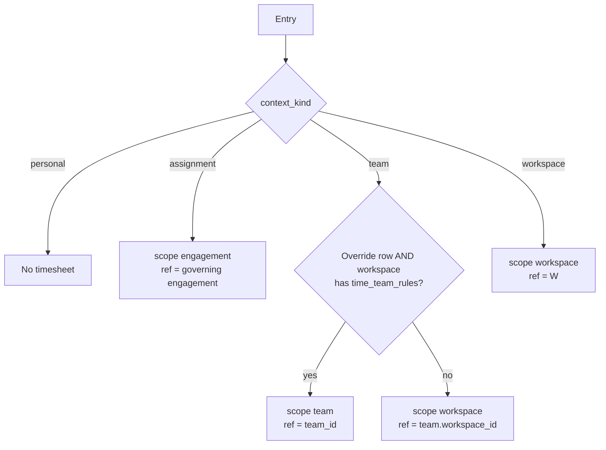
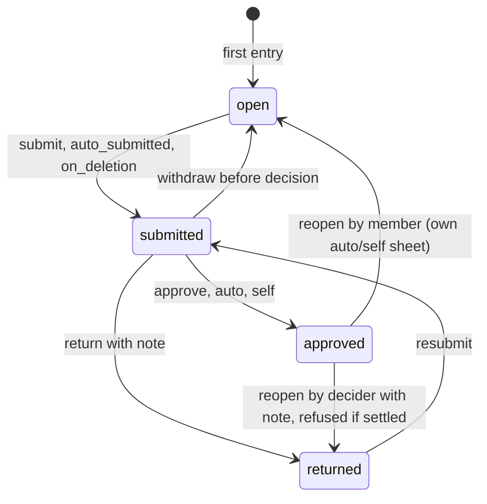

# Time Management Rebuild

> **⚠️ Proposed — not built.**

> **Last updated:** 2026-10-02 · **Status:** draft

Today time tracking belongs to teams: a log quietly picks a team, each log is reviewed alone, every period is UTC, any project viewer can start a timer, and Free turns everything off. This proposal makes a time entry a plain fact (person, project, optional task or preset, interval) logged **For** exactly one context: an agreement (engagement assignment), a team, the workspace, or "Just me" (API name `logging_for`). Approval becomes one model, a **timesheet** per person, sheet scope and period, routed to an approver fixed at submit; approval freezes payable hours and cost per entry's local date. One bare **Time** page at `/time` replaces the four team tabs, reports become filtered views of one ledger, and invoices reserve hours at composition so each entry is billed once, only by the contract it was logged under. `task_time_logs` becomes `time_entries`, the API moves to `/api/time` (alias `/api/team-time` until three retirement conditions hold), and the 414 legacy prod entries are grouped into timesheets by period without ever guessing a contract context.

> **⚠️ No feature flags.** The user's standing rule (new user-visible features ship on by default) overrides the "ship dark" wording in `CLAUDE.md` and the [proposals README](../README.md). Safety is structural: expand → cutover → contract migrations, an API alias, a held-unmerged backend PR, separate backend-only and web-only pushes, verification queries. Prod migrations go only through Supabase MCP `apply_migration`, dev first, compared by name.

## What Exists Today (verified 2026-10-02)

Read-only against the repo, prod (`byvbnkpiselvvulsvxgo`) and dev (`vyiedlwasdwmjbztqznl`).

**`task_time_logs`** (26 columns, same on both DBs) holds 414 prod rows: pending 184, approved 225 (664.17 h), paid 4 (13.01 h), rejected 1 (**744.0 h** alone). Approved + paid = **677.18 h**.

| Area | Today |
|---|---|
| Prod shape | All rows on team Prodigitality (`dc583f8a-7869-47d2-a16d-1d66fa42f3ba`), workspace `d8e9f5c8-4897-43a0-b23f-c63a65ae19c3` (`prodigitality-workspace`, Business comp). No null `team_id`, no `engagement_assignment_id`, 238 without task, none running. PHP 331 / USD 83; 4 person-weeks mix both. All `rate_type_snapshot='hourly'`. |
| Prodigitality settings | Only prod team with `time_tracking_enabled`. `member_rates_enabled`/`payouts_enabled` **false** (all prod teams since the 2026-09-06 default). `retroactive_log_days` **NULL** (no prod team sets it). 289 entries keep a pre-disable `rate_snapshot`; new snapshots are zeroed when rates are off (`team-time.service.ts:2526-2541`). |
| 4 `paid` rows | No `payout_id`; marked paid 2026-05-26 via the pre-payout path, 5 weeks before `payouts` existed. Both prod payouts are void with 0 logs. |
| Dev | 44 logs (12 teamless, 30 on time-off teams); 57 `engagement_time_settings` (required/none 34, optional/none 20, required/provider_submit_hirer_approve 3). Rehearsals hit cases prod lacks. |
| Side tables | `task_time_log_segments` 141 (display), `time_log_comments` 0, `team_member_rates` 19, `payouts` 2 (void). |
| Review | Status per log, per-log review (`team-time.service.ts:1295/1323/2285`), no self-review (`:1307-1308`, `:1348-1349`), no period object. |
| Engagement time (dark) | From `20260814021000_engagement_time.sql`; `engagement_time_approvals`/`_items` 0 rows; `engagement_assignments` 0 rows, nothing writes it. An assignment may carry both `client_engagement_id` and `talent_engagement_id` (`20260814020000_engagement_core.sql:154-172`); uncontracted workers are refused (`UNCONTRACTED_WORKER_REQUIRES_TALENT_ENGAGEMENT`, `:526-533`). Nothing ends assignments with the engagement; `tg_engagement_assignment_running_timer_guard` refuses while a timer runs (`20260814021000:489-508`). `engagement_parties.team_id` exists (`20260923090300`); signing adds `team_members` for the hirer's seat team (`20261001100000:362-366`). |
| Timezones | Only `meetings`/`meeting_series`. Limits, the approval-item guard's `started_at::date` and invoice buckets are UTC; invoice periods filter at `T00:00Z` (`invoice-composition.service.ts:174-189`). |
| Rates and caps | "Current", not "in force": `.is('end_date', null)` (`team-time.service.ts:2503-2513`). Caps (`assertHourCapAllows`, `getWeekWindowUtc`, `:1883-1940`) sum team + project + member per UTC week, blocking only with `overtime_requires_approval`. |
| Pay periods | Monthly only (`validatePayPeriodConfig`, `teams.service.ts:672-730`), unset on every team; all 6 prod contracts are `period_source='team_config'` (`invoice-scheduler.service.ts:178,271`). |
| RLS and grants | No migration enables RLS on `task_time_logs`/`team_member_rates`; the DBs have it on with 0 policies while `anon`/`authenticated` hold full grants. A replay leaves it off. |
| One timer | App-only (`startLog`, `team-time.service.ts:434-449`); `uq_task_time_logs_one_active_per_member_project` is per project. |
| Who logs | Any **viewer** (`assertRole(…,'viewer')`, `:429`; `docs/03-backend/authorization-axes.md:132` says editor, stale). Team pick reads curated `project_team_members` with `project_teams!…(is_primary, attached_at)` (`resolveTeamRate`, `:2453-2462`), falling back to `project_teams ∩ team_members` without curation (`:2481-2499`). Curation creates `project_access` defaulting to `editor`, possibly `viewer` (`project-teams.service.ts:67-76,130`). 354 attached-team × member pairs: 250 uncurated, **224 without `project_access`** (14 users, 23 projects). |
| Exposure | Client-side project admins see cost: `access.time` from viewer (`project-permissions.ts:451`), `time.view_team_logs` at admin (`:503`), client-origin denial removed (`:544-563`), `rate_snapshot` and member `email` in `TIME_LOG_SELECT` (`team-time.service.ts:29-40`, `:37`). |
| Billing | `getBillableHours` (`invoice-composition.service.ts:161-185`) filters project, status, work type only, so each approved hour bills to every client contract; `source_log_id` always null (`:95,:130,:224,:239`). Composition at draft creation (`invoices.service.ts:374,453`; scheduled `:447-455`), issue flips status (`:695-701`), `voidInvoice` copies lines to a replacement (`:1013-1097`), `hours_detail_level` defaults `summary` (`:328`). All 6 prod contracts: retainers, no `engagement_id`, `client_hours_detail_level='none'`. |
| Payouts (`backend/src/modules/marketplace/payouts/`) | `create_payout_and_mark_paid` writes `status='paid'`, `reviewed_*` (`20260907090000:137-143`; latest `:48-147`); `void_payout_and_revert` writes `status='approved'` (`20260701000020:200-206`; latest `:179-214`; `000030` grants only). Totals round once on the sum (`payouts.service.ts:425-447`); owed `until` compares raw `started_at` to a date (`:398-399`); self-payout is allowed, only the notification skips the actor (`:635`). |
| Deletion | `delete_account` tombstones `profiles` (`20260923090200:514-535`); `account_deletion_purge_team` refuses only on payouts (`:70-99`). |
| "Team approver" | TS `assertTeamApprover` (`team-time.service.ts:2576`, `payouts.service.ts:566`): `owner_id` or role `owner`/`admin`. SQL `can_manage_team` (`20260901160000:52-68`): `owner_id` or `admin`. Every prod `owner` row is `teams.owner_id`, so aligning changes nobody; 6 `team_resource_*` policies call it as `authenticated`. |
| Plan | One key `time_tracking` (Free false), seeded `20260922120000_workspace_plan_limits.sql:289-292`, checked on the **team's** workspace (`assertTimeTrackingPlan`, `team-time.service.ts:403-423`); legacy `EntitlementGuard` (`execution/entitlements/entitlement.guard.ts`) reads `teams.time_tracking_enabled`; contract time gated; no team, no timer (`assertResolvedTeamTimeTrackingEnabled`, `:182-195`, `:452`). |
| Web | Team tabs `routes/w/$workspaceSlug/teams/$teamId/time/{my-logs,team-logs,manage-rates,payouts}`; `routes/_execution/project/$projectId/time.tsx`; bare shells `routes/_execution/teams/$teamId/time/**`. No workspace time page; `/inbox` is DM chat. `toWorkspacePath` rewrites only `/dashboard`, `/teams` (not `/teams/me`), `/workspace` (`web/src/lib/workspacePaths.ts:51-78`); `meetings`, `inbox`, `command-center` are bare `_execution`. `/teams` is an `app` surface, prefix-matched (`platformSurfaces.ts:121`). Base for the new list: the uncommitted `TeamMyLogsList.tsx` rewrite (grouped day table, "Needs review", `useVisibleColumns`, `.time-row-in`). |
| Notifications | 643 `time_log_approval_requested` for 414 logs, **361 unread**; 5 Prodigitality approvers (4 admins, 1 owner). Phantom push titles `time_log_marked_paid`/`_marked_rejected` (`notification-push.ts:29-33`). Links point at `/w/<slug>/teams/<id>/time/*`. |
| Looseness | 3 cross-workspace `project_teams`; 8 of 39 team members and 14 of 166 `project_access` rows lack a seat; 12 of 43 profiles have no `workspace_members`. 26 of 39 workspaces and 29 of 54 projects have no team; `teams.is_personal` only on consultant signup (`20260507000040_personal_team.sql`); 13 time-off teams with 4 project links. |
| Mobile and deploy | `native_build_min` filters offered bundles (`mobile-updates.service.ts:92`). `backend-deploy.yml`, `web-deploy.yml`, `mobile-ota-deploy.yml` run on `main` pushes (path filters) and `workflow_dispatch`; OTA gated on `OTA_PUBLISH_ENABLED`. Merging is deploying. |

## The Model

### A Time Entry

| Rule | Detail |
|---|---|
| Fact | **Person + project + optional task or preset + interval**; breaks are segments. Presets: `work_item` Meeting, Review, Admin, Other (with `task_id` NULL the trigger forces `other`); later, from a meeting. Timer, manual entry (`MANUAL_ENTRIES_DISABLED`, `RETROACTIVE_WINDOW`), pause/resume. |
| One timer per person | `uq_time_entries_one_running_per_member (member_user_id) WHERE ended_at IS NULL`; 409 `TIMER_ALREADY_RUNNING`. |
| Long timers (CHANGE-22) | 10 h `timer_running_long`; 24 h cron stop at `started_at + 24h`, `auto_stopped_24h`, `timer_auto_stopped`; assignment/engagement end stops it (`stopped_by_assignment_end`), never refuses. |
| Cost side only | `rate_snapshot`, `amount_snapshot`, `payable_seconds` are cost. Billing price lives on `invoice_time_entries`, set at composition. |

### "For": Four Context Kinds

UI: **For** (header and chip), popover "Who approves this time". `context_kind` is a reporting tag; **sheet scope** picks the timesheet.

| Kind | Who can choose it | Sheet scope | Cost rate |
|---|---|---|---|
| `assignment` | The worker, in the window, governing engagement `active` with settings in force | `engagement` | Talent `cost`/`hour` via `ratesInForceOn`; consultant's own client time `0`, amount NULL |
| `team` | Curated member (`project_team_members` for project, team, caller) | `team` with an active Business override, else `workspace` (`team.workspace_id`) | Rate card in force; 0 without `member_rates_enabled` or `time_team_rules` |
| `workspace` | `workspace_members` of the project's workspace W, **no** team present | `workspace` (W) | 0 |
| `personal` ("Just me") | Anyone with `time.log` when no **available** governed option exists | none | none; never approved, billed or paid |

All kinds need `time.log`. **C1:** `workspace` is its own kind, not a team fallback; phantom teams would pollute team pages, seats and count limits. Since it appears only when no team is present, nobody chooses team vs workspace, and on Pro both land on the **same** workspace sheet.

### Governing Engagement (CHANGE-3)

The governing engagement is the talent engagement, else the client engagement; it sets approval, period, rounding and limits. Billing is priced at composition from the client engagement's billing rates on each entry's local date.

| Assignment carries | Governing | Approval | Cost | Billed by |
|---|---|---|---|---|
| talent only | talent | hirer | talent cost rate | nobody |
| talent + client (placed talent) | talent | hirer | talent cost rate | client contract, `billing`/`hour` in force (L9) |
| client only (consultant) | client | `auto` ("Confirmed") | 0, amount NULL | client contract |

Hirer rights cover only their own talent engagement. `engagement_time_settings` gains nullable `period_kind`, `timezone`, `week_start`; NULL falls back to `policyWorkspaceFor`: `contracts.workspace_id` via `activated_by_contract_id`, else the hirer party team's `teams.workspace_id`, else NULL (platform default). Never `projects.workspace_id` (a sheet spans projects; `contracts.workspace_id` is nullable; `origin='legacy'` engagements lack an activating contract). The policy workspace never gates.

### Timesheets: Person × Sheet Scope × Period (CHANGE-2)

- `policy_workspace_id` = workspace ref, `team.workspace_id`, or `policyWorkspaceFor(engagement)`. Approver scope (`team`, `workspace`, `hirer`, `auto`, `self`) freezes at submit.
- `timesheets_no_overlap EXCLUDE USING gist (member_user_id WITH =, scope_kind WITH =, scope_ref WITH =, daterange(period_start, period_end,'[]') WITH &&)`.
- **C8:** `time_sheet_scope_for` + `time_ensure_timesheet` (policy timezone) via `trg_time_entries_30_timesheet` — one SQL path for old backend, backfill and new backend.
- A Pro member on project A (team, no override) and B (no team) has **one** workspace sheet.

### Resolver (CHANGE-12)

`LoggingContextService.resolve(callerId, projectId, {requested?, at, purpose})`:

| Step | Rule |
|---|---|
| 0 | Guests: 404 on every `TimeModule` route and the alias, overview `can_log:false`. No `project_access` row and not `projects.owner_id`: **404** (CHANGE-17). No `time.log` (editor+): `options: []`, writes 403 `NO_LOGGING_CONTEXT`. |
| 1 | Load the project (`workspace_id`, `owner_id`). |
| 2 | Assignments: caller is worker, `started_at ≤ at < coalesce(ended_at, ∞)` (ended ones count for `purpose='manual'` inside the window); governing engagement `active` with settings in force; `tracking_mode='disabled'` → `unavailable: contract_disabled`. |
| 3 | Teams: in `project_teams` and curated for the caller. Unavailable (`team_time_off \| plan`) still counts as **present**. Order `is_primary DESC, attached_at, team_id`. Suppress a team equal to an assignment's `team_id` or its talent engagement's hirer party team. |
| 4 | Workspace, only with **no team present**: `workspace_members` of W, policy `tracking_enabled`, W has `time_tracking`. |
| 5 | An assignment with `tracking_mode='required'` removes all other options. |
| 6 | "Just me" only if 2–4 left nothing **available**. |
| 7 | `requested` must be an option (else 422 `LOGGING_FOR_INVALID {options}`). Collapse same sheet scope + rate source. One left: read-only chip. Several: 409 `LOGGING_FOR_REQUIRED {options, prefill}` (`time_logging_defaults`, one confirming tap, never silent; resend `remember: true`). None: 403 `NO_LOGGING_CONTEXT`. |
| 8 | Alias calls: remembered default, else first option (today's `resolveTeamRate` pick). |

- Writes resolve uncached; `GET logging-for` and pickers use a 30 s Redis cache per (user, project), evicted on policy writes and assignment create/end (L60: since writes never read the cache, a wider eviction list is unneeded). Pickers and overview never 403.
- **Edits (L2, L58):** task changes keep the context; `context_kind`, `context_ref` and FK change only together via edit, project move (re-resolves) or bulk "Change For…", with both sheets `open`/`returned`; FK `SET NULL` never touches `context_ref`; each change re-snapshots rate, rate type, currency and label, and trg_30 moves the entry. Into an assignment only if `created_at ≥ assignment.created_at` and `started_at ≥ assignment.started_at` (`off-platform-engagement-adoption.md:153,159`).
- **Team detach (E30):** open sheets stay submittable; stopping changes only `ended_at`, unvalidated by `trg_time_entries_10_context`.

### Who Can Log (CHANGE-1)

> Every logging option requires the `time.log` capability (editor and above) on the project. A team, an assignment or ownership of a workspace never stands in for `project_access`. The database refuses an entry whose member has no `project_access` row on the project and is not its owner (`TIME_ENTRY_NO_PROJECT_ACCESS`), and refuses a team entry whose member is not on that attached team (`TIME_ENTRY_NOT_ON_PROJECT_TEAM`).

- **TypeScript** enforces `time.log` and the curated `project_team_members` row (step 3).
- **DB floor** (`trg_time_entries_10_context`, on INSERT or a non-null `project_id`/`member_user_id` change, skipped under `app.time_maintenance`): any `project_access` row or ownership; team entries need `project_teams` (project, team) and `team_members` (team, member). It is viewer-level and curation-free because the old backend's `resolveTeamRate` falls back to `project_teams ∩ team_members` (`team-time.service.ts:2481-2499`); a curated floor would break those users from M1 to step 6. **Deviation from L1.**
- Workspace entries also need `projects.workspace_id = workspace_id` and membership (`TIME_ENTRY_NOT_WORKSPACE_MEMBER`).
- Viewers and commenters (so clients in those roles) lose logging. **The user confirmed this on 2026-10-02.** Curated Prodigitality viewers are counted at apply; L1b fallback loggers are back-filled by M1 (D16, [verification SQL](./migrations-and-rollout.md#verification-sql)). Guests never log. `GET /time/projects/:projectId/work-items` asserts `access.roadmap`.

### Governance (CHANGE-11)

Platform default → workspace policy (`time_policies`, created by `time_ensure_workspace_policy` on first sheet, edit or settings visit) → team override (sheet scope `team`, NULL inherits) → member caps (`team_member_rates`, team entries). Contract terms (`settingsInForceOn` per entry's local date) win per field.

| Rule | Detail |
|---|---|
| Default | Weekly, Monday, `approval_required=true`, `allow_manual_entries=true`, `rounding_minutes=0`, `reminder_days=1`, `tracking_enabled=true` where the plan has `time_tracking`. |
| Timezone | First of: editing admin's browser; earliest owner's `user_time_preferences.timezone`; entry member's; `UTC`. Owners/admins confirm on first visit: "Acme tracks time weekly from Monday in Asia/Manila. [Looks right] [Change]" — a confirmation, not an opt-in. |
| Prodigitality seed (M1) | Workspace `tracking_enabled=false`, weekly, `week_start=1`, `Asia/Manila`, approval on, manual on, rounding 0; team override `approver_scope='team'`, `retroactive_days=NULL`. Its people keep logging for the team, never asked. |
| Overrides | Written on Business only; ignored without `time_team_rules`; a downgrade freezes, never deletes. |
| Rates need approval | `approval_required=false` with `member_rates_enabled=true` → `TEAM_RATES_REQUIRE_APPROVAL`; enabling rates later treats it as true. |
| Provenance, audit | `source: default\|workspace\|team\|contract\|member` per field ("Set by contract"); `time_policy_events` (`actor_user_id`, `changes`). |
| L40 | `policy_snapshot` written at submit; the freeze reads workspace/team from it, contract per entry. Bounds never change; changes apply from the next boundary (E3). The workspace authorizes only via Axis 7. |

### Approvals

States `open | submitted | returned | approved` (CHANGE-15). Approved sublabels "Confirmed", "Self-approved"; Open "Open until Oct 5"; "Paid" is an entry badge; "Paid outside Proyekto" and "Not approved (legacy)" only in entry detail. Personal entries have no sheet.

| `submission_kind` | When | Event |
|---|---|---|
| `manual` | From the period's last day; refused while running or with 0 entries | `submitted` |
| `auto` | Cron, `max(reminder_days,1)` days after period end, `auto`/`self` sheets without a running entry; the invoice cron no longer submits | `auto_submitted` |
| `on_deletion` | `delete_account`, `open`/`returned` sheets, actor NULL | `submitted` |
| `legacy` | M2 import ("Imported from per-entry review") | `legacy_import` |

Other sheets keep manual Submit, `timesheet_reminder` and the welcome-line nudge.

**Routing.** `approver_scope` freezes at submit; `can_decide_timesheet` never checks the plan; the decider is never the member except `self` and legacy. **Cost money exists** when any entry, resolved at submit with the freeze rate rules, carries a cost: a team entry whose team has `member_rates_enabled` **and** whose workspace has `time_team_rules`, or any talent-engagement entry.

| # | Scope / condition | `approver_scope` | Deciders |
|---|---|---|---|
| 1 | `team`, override `approver_scope='team'` | `team` | `can_manage_team(team_id)`: `owner_id`, role `owner`/`admin` |
| 2 | `team`, override otherwise | `workspace` | `can_manage_workspace(policy_workspace_id)` |
| 3 | `workspace` | `workspace` | same |
| 4 | `engagement`, talent-governed (always `provider_submit_hirer_approve`; `none` raises `TALENT_TIME_POLICY_INVALID`, `20260814021000:208-212`) | `hirer` | `engagement_parties.position='hirer'` (`hirerUserIdForEngagement`) |
| 5 | `engagement`, client-governed | `auto` | none ("Confirmed") |
| 6 | no cost money, `approval_required=false` | `auto` | none |
| 7 | no cost money, member is the only decider | `self` | "Self-approved" on submit |
| 8 | `team` with cost money, member is the only team decider | `workspace` | workspace managers minus the member, else waits: "No one else can approve this. Add a workspace admin." |
| 9 | `team`, team deleted (D6) | `workspace` | `can_manage_workspace(policy_workspace_id)` |

**CHANGE-9:** `self`/`auto` only without cost money; no self-payout (`create_payout_and_mark_paid` refuses `p_created_by = p_member_user_id`, `PAYOUT_SELF_NOT_ALLOWED`). **C2 (D1):** on Pro, team time goes to workspace admins; Prodigitality's seeded `team` override sends its imported sheets to team approvers (decision 3). Only one prod team has time on.

| Reopen case | Who | Result |
|---|---|---|
| Approved, `team`/`workspace`/`hirer` scope | decider | note required → `returned`, `reopened` |
| Approved, `auto`/`self` | member | note optional → `open`, `reopened` |
| Approved, other scopes | member | "Ask to reopen" → `reopen_requested` to deciders |
| Entry reserved (draft or issued), with `payout_id`, or `paid_outside` | nobody | `TIMESHEET_HAS_SETTLED_ENTRIES` |
| `legacy_status='rejected'` | decider | allowed |

**Freeze (CHANGE-4)**, per entry for its local start date d in the sheet timezone; workspace/team layers from `policy_snapshot`, contract from `settingsInForceOn`; pre-approval rates are estimates. `TimesheetsService` computes steps 1–4 in TypeScript and passes them to `time_timesheet_transition` as `p_freeze`, which checks the entry ids and applies them under `app.time_freeze`; an auto/self submit without `p_freeze` (account deletion) waits for the cron. Only the legacy freezes (M2, M4) are computed in SQL ([data model](./data-model.md#freeze)).

| Step | Rule |
|---|---|
| 1. Rate | team: `team_member_rates` with `start_date ≤ d ≤ coalesce(end_date, ∞)` (0 without rates or `time_team_rules`); assignment: `ratesInForceOn` talent cost (0 client-governed); workspace: 0 |
| 2. Round | `payable_seconds = round_to(duration_seconds, rounding_minutes)`, nearest, ties up (D14) |
| 3. Cap (L12) | Contract `weekly_limit_minutes` per (worker, governing engagement) across projects, sheet week; team `weekly_limit_hours`/`monthly_limit_hours` per (member, team), sheet-timezone week or month. In `started_at` order, latest cut first, unless `approve_overtime: true` (`timesheets.overtime_approved`). Writes keep warning; `HOUR_CAP_EXCEEDED` blocks only where `overtime_requires_approval` does today. |
| 4. Amount | hourly `round(payable_seconds / 3600 × rate_snapshot, 2)` (display); `month`/`fixed` → `rate_type_snapshot='fixed'`, NULL; consultant client time 0, NULL |
| 5. Totals | `total_seconds`, `payable_seconds` (rejected legacy excluded) |

Legacy entries freeze from the stored `rate_snapshot` (D13), never re-resolved, display gated by `costVisible`. **CHANGE-23:** payout/owed totals `round(sum(payable_seconds/3600 × rate_snapshot), 2)` once; invoice lines `round(bill_seconds_sum/3600 × bill_rate, 2)`, total = sum of lines; payouts refuse `fixed` (`FIXED_RATE_NOT_PAYABLE_BY_ENTRY`). Per-entry review is retired.

| Predicate (CHANGE-5) | Definition |
|---|---|
| Approved | `payable_seconds IS NOT NULL AND legacy_status IS DISTINCT FROM 'rejected'` |
| Paid | `payout_id IS NOT NULL OR legacy_status='paid_outside'` |
| Billed | an `invoice_time_entries` row exists |
| Owed | approved, team context, `payout_id IS NULL`, `legacy_status IS NULL` |
| Totals | always `sum(payable_seconds)`: invoices, `getUncostedHours`, reports, dashboard, sheets, finance books |

**Axis 7 (CHANGE-8).** Workspace owners/admins decide `workspace`-scope sheets of their `policy_workspace_id` and see person, interval, duration and work-item kind; project/task titles and notes only with `access.time`, else "A project you can't open". Same on review, workspace report and exports, cross-workspace teams included. Attach dialog: "Time this team logs here is approved in <team workspace>. Approvers who can't open this project see hours only." No rerouting to team managers. Recorded in `docs/03-backend/authorization-axes.md`.

**Reads (CHANGE-17).** `can_view_timesheet` = member, `can_decide_timesheet`, or `can_manage_team(team_id)` on `team` sheets; entries, segments, comments follow; personal is member-only; misses 404; `approve-bulk` fails the batch on any miss. `ENTRY_SELECT` has no money or `email` (email only in self and team-manager views).

**Identity (CHANGE-7).** Assignment workers are visible only to themselves and provider-side parties (talent hirer and provider, client provider); others see "Delivery team". Clients see approved hours only, at `least(invoice.hours_detail_level, client_hours_detail_level)`, on invoices and Project › Time "Client hours" when not `none`; legacy contracts are `none`.

## Pricing and Plan Keys

Group `team`, sort 120–126, seeded by **M0** `20261003090000_time_plan_keys.sql` before M1 (parity spec).

| Key | Label | Free | Pro | Bus. | Ent. | Enforced at |
|---|---|---|---|---|---|---|
| `time_tracking` (relabelled) | Timesheets and approvals | ✗ | ✓ | ✓ | ✓ | Resolver 3–4 (`unavailable: plan`); team toggle (`teams.service.ts:1123`); default `tracking_enabled`; approval and period writes (timezone, week start free) |
| `time_billable_invoices` | Billable hours on invoices | ✗ | ✓ | ✓ | ✓ | Create/sign of hourly `time_based`/`hybrid` contracts (`BILLING_HOURS_REQUIRES_PLAN`); cut-off editor (or `time_payouts`). Never on composing signed contracts; downgrade never zeroes a draft |
| `time_team_rules` | Team approvers and time rules | ✗ | ✗ | ✓ | ✓ | Team policy writes; override application; team rates at freeze |
| `time_payouts` | Payouts | ✗ | ✗ | ✓ | ✓ | `payouts.service.ts` create and owed; cut-off editor |
| `time_reports_export` | Workspace time reports and export | ✗ | ✗ | ✓ | ✓ | `scope=workspace` reports, `/time/reports/export` |
| `time_approval_chains` | Custom approval chains | ✗ | ✗ | ✗ | ✓ | `enforced:false` (reserved) |
| `time_audit_export` | Time audit export | ✗ | ✗ | ✗ | ✓ | `/time/reports/audit-export` |

| Rule | Detail |
|---|---|
| Plan subject | team → `team.workspace_id` (`resolveScopeForTeam`); workspace → W; assignment → none (**contract time never gated**); personal → none |
| Ungated (CHANGE-21) | Stop, pause, resume, submit, withdraw, approve, return, reopen (today's split, `team-time.service.plan-gate.spec.ts`); personal, contract, own reads |
| Free | "Just me" + Time page; popover "Your workspace's plan doesn't include timesheets; this time is just for you." No workspace option (D10) |
| Downgrade | New entries see `unavailable: plan`; existing sheets finish and decide; overrides ignored, kept |
| Cut-offs (L14) | `pay_period_config` stays in Team › Settings › Time as "Billing and pay cut-offs", team owner, with `time_billable_invoices` or `time_payouts`; not under Payouts (`team_config` contracts derive periods from it) |
| SQL style | keys `ON CONFLICT (key) DO UPDATE SET label, description, …` (not `kind`); limits `ON CONFLICT (plan, limit_key) DO NOTHING` |
| Old backend | Steps 1–7: the 6 new keys show as `unknown_to_code` drift (`enforced:false`, `entitlements.logic.ts:151-175`), old pages show the relabelled key. Cosmetic |
| **PR-1** (backend-only, with M0) | `shared/entitlements/entitlement-keys.ts`, test-kit `buildSeedLimitRows`/`buildSeedKeyRows`, `entitlement-keys.migration-parity.spec.ts`, `workspace-usage.service.spec.ts` |
| **Web PR** | `planLimits.ts`, `pricing.ts` (`:152,436`), `WorkspaceUsagePage.tsx`, `/admin/plans`, their Vitest files (`entitlements`, `planLimits`, `pricing`, `PlanLimitNotice`, `WorkspaceUsagePage`), help docs (tier names only; no prices, "per user", "/month" or pricing links). One commit across both would break L5 |

**Prod impact:** Prodigitality keeps team approvers via the seed, payouts moot (rates and payouts off), workspace `tracking_enabled=false` keeps the team context. Invoices: 0 (retainers, no `engagement_id`, `none` detail). Curated viewers lose logging; fallback loggers are back-filled (D16). `payouts` was never plan-checked before.

## Decided (2026-10-02)

User decisions, not reopened; review conditions are added.

| # | Decision | Conditions (ledger) |
|---|---|---|
| 1 | **Full rename:** `time_entries`, `time_entry_segments`, `time_entry_comments` (`log_id` → `entry_id`); `/api/time` with the alias until `native_build_min` moves past it; compat views; function bodies rebuilt from their latest migration. | L18, all three: `native_build_min` ≥ first native build baking `/api/time`; 30 days of 0 alias hits (telemetry, not a flag); `ota-stat` shows no pre-`/api/time` device. Then 410 `APP_UPDATE_REQUIRED` stub. Views and `status` drop in M5 after L19. |
| 2 | **Period:** workspace weekly (default), biweekly, semi-monthly, monthly, plus timezone and week start (ISO 1–7); team override on Business; contract wins. | No UTC fallback with a hint (CHANGE-11); governing engagement per local date; nullable settings columns → `policyWorkspaceFor`; keyed by sheet scope (CHANGE-2). |
| 3 | **Legacy:** per-person periods; approved → approved sheets, pending → submitted to the team approver; 4 paid → `paid_outside`; no inferred contracts. | `submission_kind='legacy'`; M2 marks `time_log_approval_requested` read; M4 `timesheets_imported` digest per decider; logger banner; decider check skipped, `decided_by` may be NULL; current period `open` (D3); D12; D13; never billed (`time_billing_floor`). |
| 4 | **Pricing:** Free personal timer and My time; Pro timesheets, approvals, billable hours; Business overrides, payouts, workspace reports/export; Enterprise chains, audit export. Contract time ungated; plan on the context's workspace; key split. | "Just me" editor+ everywhere (D2 → b); `time_billable_invoices` only at create/sign and the cut-off editor; team rates need `time_team_rules`; cross-workspace sheets stay with workspace admins under Axis 7. |
| 5 | **Rollout:** no flags; expand → cutover → contract; MCP `apply_migration`, dev first, by name. | CHANGE-13: PR-0 (heal no-op); M0 → M1; PR-1 **held unmerged** until M2+M3 verified on both DBs; backend-only push; separate web-only push. That `web/**` merge triggers `web-deploy.yml` and `mobile-ota-deploy.yml` together (`:25-29`): with `OTA_PUBLISH_ENABLED` the OTA publishes in that run (no extra dispatch, or a duplicate bundle ships; dispatch only for a non-default `native_build_min`); unset, nothing publishes (`:51` gates both), shells stay on the alias, and L18 cannot pass until OTA is enabled or a native release ships. No commit spans `backend/**` and `web/**`. Each file: `SET LOCAL lock_timeout='5s'`, invariant precheck, `NOTIFY pgrst, 'reload schema'`, committed after both DBs apply it; never `sync_supabase_dev.mjs apply`. |
| 6 | **Engagement approval tables** (0 rows) replaced by timesheets. | Dropped in M3 after a 0-row precheck, with `tg_engagement_time_approvals_guard` and `tg_engagement_time_approval_items_guard`. |

## Design Decisions (D1–D16, decided 2026-10-02)

Every design decision below was put to the user on 2026-10-02, and each recommended option was accepted. None is open.

| # | Question | Decided |
|---|---|---|
| D1 | Who approves team time on Pro? | **Workspace owners and admins.** Team approvers come with the Business team override (Decision 4 read literally). Revisit if Pro customers with teams object. |
| D2 | Who gets "Just me"? | **Editor and above** (L31), on every plan. This closes the Free multi-member dead end. |
| D3 | Current-period legacy sheets | **Stay `open`.** Counts are recomputed on the apply date; periods that have ended by then are imported as submitted. |
| D4 | Links and page location | **Bare paths** (CHANGE-10): `/time` and `/time/timesheets/<id>`. Only `/w/<slug>/settings/time` and `/w/<slug>/teams/<id>/time` carry a slug. |
| D5 | `teams.contract_enforcement` | **Dropped in M5.** No prod team uses it, and `tracking_mode='required'` covers the intent. |
| D6 | A deleted team's sheets | **Decided by the admins of `policy_workspace_id`** (routing row 9). |
| D7 | Talent (engagement) payouts | **Deferred.** `payouts.team_id` stays NOT NULL; fixed and monthly cost is recorded as a manual payout. |
| D8 | Contract period and timezone authoring | **Later**, in `ProjectContract.tsx:1360-1701`. NULL falls back to `policyWorkspaceFor`, then the platform default. |
| D9 | Where presets are hidden | **Workspace level only.** |
| D10 | Workspace context on Free | **Not offered.** Free gets "Just me" (D2). |
| D11 | Alias retirement threshold | **The L18 three-condition rule**, then the 410 `APP_UPDATE_REQUIRED` stub. |
| D12 | The legacy week with the rejected 744 h entry | **Imported approved.** The entry is marked `legacy_status='rejected'` and counts 0 payable. Reopen stays allowed. |
| D13 | Legacy amounts while rates are off (289 entries) | **Frozen from the stored `rate_snapshot`** (historical truth). Display stays gated by `member_rates_enabled` through `costVisible`. |
| D14 | Rounding direction | **Nearest increment, ties up**, per entry, before the cap. |
| D15 | Native shells below build 7000 after alias retirement | **A forced-update screen ships in a native release before retirement.** |
| D16 | Uncurated team loggers (the `project_teams ∩ team_members` fallback, `team-time.service.ts:2481-2499`) | **Back-filled.** M1 inserts `project_team_members` for (project, team, member) pairs that already have team entries but no curated row, so they keep the team option at step 6. The L1b query in the [verification SQL](./migrations-and-rollout.md#verification-sql) counts them before and after. |

**Confirmed behaviour change (2026-10-02).** Logging needs the `time.log` capability (editor and above). Viewers and commenters, and so clients in those roles, can only read their own past entries.

## Reading Order

| Page | What's in it |
|---|---|
| [data-model.md](./data-model.md) | Tables, constraints, triggers, RLS and grants, SQL functions, renames |
| [migrations-and-rollout.md](./migrations-and-rollout.md) | Principles, apply/deploy sequence, M0–M5, legacy grouping, compatibility windows, rollback, gates, the only verification SQL |
| [backend.md](./backend.md) | Modules, resolver, policy, authz, redaction, endpoints and alias, DTOs, plan gating, state machine, notifications, invoices, payouts, finance, assignments |
| [ux.md](./ux.md) | Personas, Time page, For chip, submit/return/reopen, approvals, dashboard, settings, reports, routes, chrome, mobile, copy |
| [edge-cases-and-tests.md](./edge-cases-and-tests.md) | Edge cases E#, per-unit test plan, docs to update |
| [pressure-test-log.md](./pressure-test-log.md) | Every review finding (L-n, CHANGE-n) and its resolution |

## See Also

[Proposals](../README.md) · [Pricing tiers and add-ons](../pricing-tiers-and-add-ons.md) · [Off-platform engagement adoption](../off-platform-engagement-adoption.md) · [Engagements](../../14-engagement/README.md) · [Teams and time](../../11-domains/teams-and-time/README.md) · [Finance](../../11-domains/finance/README.md) · [Authorization axes](../../03-backend/authorization-axes.md)
