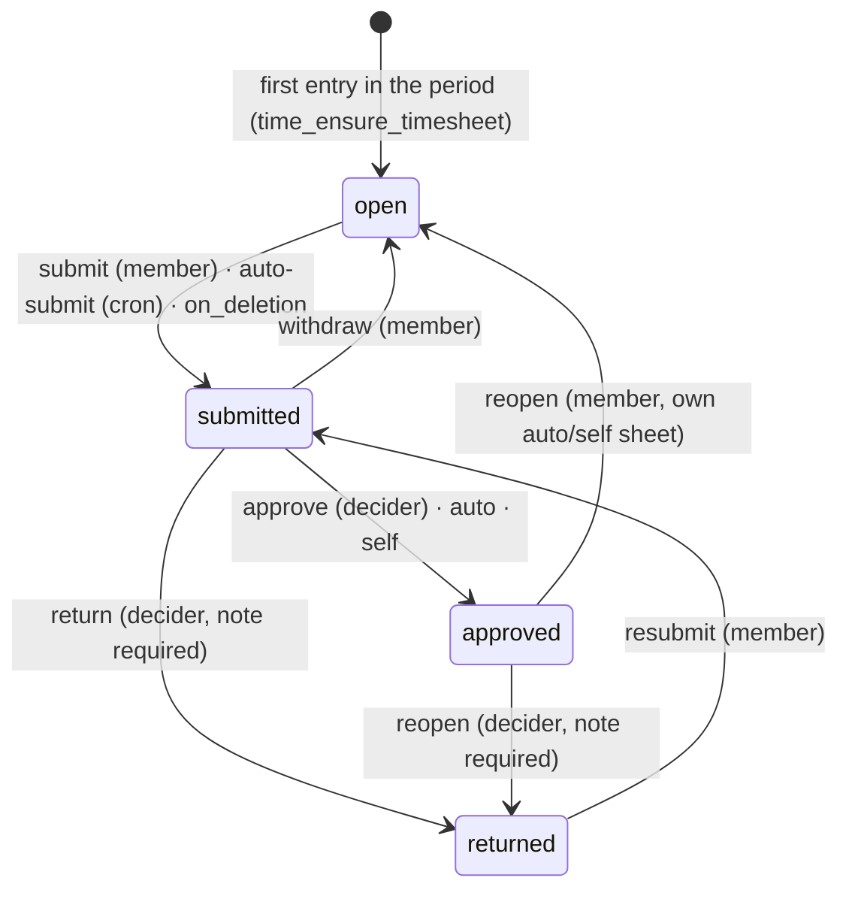

# Backend

> **⚠️ Proposed — not built.**

> **Last updated:** 2026-10-02 · **Status:** draft

A `TimeModule` under `/api/time` replaces the 2,673-line `team-time.service.ts`. Four rules shape it: one resolver picks each entry's **For** context; one layered resolver answers every policy field; SQL predicates answer every authority question and TypeScript only calls them; money, content and identity are redacted by choosing a different select, never by a serializer. `/api/team-time` survives as an alias until telemetry shows no shell calls it. File:line references were re-checked read-only on 2026-10-02; ledger ids (L-n, CHANGE-n, D#, E#) are explained in the [pressure-test log](./pressure-test-log.md).

Part of the [time management proposal](./README.md).

## Module Layout

`backend/src/modules/execution/team-time/` → `backend/src/modules/execution/time/`. Line refs in "Replaces" are `team-time.service.ts` unless named.

| File | Responsibility | Replaces |
|---|---|---|
| `time.module.ts` | imports Supabase, Authorization, Notifications, Workspaces, EntitlementsCore, `EngagementsModule` (`forwardRef` only on a cycle); replaces `TeamTimeModule` in `app.module.ts` | `team-time.module.ts`; drops `EngagementEligibilityModule`, `EntitlementGuard` |
| `controllers/time-entries.controller.ts` | `@Controller('time')`: logging-for, policy, work-items, entries, timer, segments, comments, `me/*` | log routes |
| `controllers/timesheets.controller.ts` | timesheets, transitions, approvals | `logs/:id/review*` |
| `controllers/time-reports.controller.ts` | ledger by scope, export, audit export | `teams/:id/logs*`, `projects/:id/logs*` |
| `controllers/time-policies.controller.ts` | workspace and team policy CRUD | time fields of team settings |
| `controllers/time-cron.controller.ts` | `POST /time/cron/run` (`@Public` + `CronSecretGuard`, `common/guards/cron-secret.guard.ts`) | — |
| `controllers/team-time-legacy.controller.ts` | `@Controller('team-time')` alias | old controller |
| `controllers/team-time-retired.controller.ts` | `410 APP_UPDATE_REQUIRED` after retirement | alias, once L18 passes |
| `logging-context.service.ts` | For resolver | team pick in `resolveTeamRate` (`:2453-2462`), `healOrphanedTeamIds` (`:335`), `assertResolvedTeamTimeTrackingEnabled` (`:182-195`, called `:452`), `applyContractGate` (`:239`) |
| `time-policy.service.ts` | `time_resolve_policy` + `time_ensure_workspace_policy`, then contract layer (`settingsInForceOn`) and member caps | scattered `teams.*` reads, limit windows `:1611-1852` |
| `time-rates.service.ts` | rate estimate at write; per-entry re-resolution at freeze (L10) | rate half of `resolveTeamRate` (`:2503-2541`) |
| `time-entries.service.ts` | start/stop/pause/resume/manual/edit/context change/delete, retroactive window, caps, `stopRunningForProject` | `stopRunningLogsForProject` (`:654`, called `projects.service.ts:1317`) |
| `timesheets.service.ts` | freeze payloads, `time_timesheet_transition`, queue, bulk approve, approver-mode probe | per-log review (`:1295/1323/2285`) |
| `time-authority.service.ts` | `canViewTimesheet`, `canDecide` (RPCs), `costVisible`, `contentVisible` (L21), `identityVisible` (L22), `approversFor` | `assertTeamApprover` (`:2576`), `assertCanViewFetchedLog` (`:2374-2397`), `listTeamApproverRecipientIds` |
| `time-reports.service.ts` | one ledger builder for scope me/team/project/workspace/engagement + export column classes | `listProjectLogs`, `logsSummary` (`:1163-1193`, `:2138`), calendar |
| `time-notifications.service.ts` | one notification per transition; skips tombstones (L39) | `notifyApprovalRequested`, `computeDaySummaryForLog` (`:2031-2050`) |
| `time-periods.ts` | pure `date-fns-tz` period math, local dates, UTC ranges; parity-tested against `time_period_for` | UTC windows `:1611-1852` |
| `time-entry.select.ts` | `ENTRY_SELECT`, `ENTRY_COST_SELECT` | `TIME_LOG_SELECT` (`:29-40`) |
| `dto/*.dto.ts` | [DTOs](#dtos) | `dto/team-time.dto.ts` |

**Shared changes**

| Where | Change |
|---|---|
| `execution/teams/team-authority.ts` (new) | `isTeamManager(supabase, teamId, userId)` → `rpc('can_manage_team')`, the `common/auth/consultant-capability.ts` pattern. Used by `TeamsService.assertCanManageTeam` (`teams.service.ts:1183`), `PayoutsService` (replacing `assertTeamApprover`, `payouts.service.ts:566-606`), `TimeAuthority`. Flags and plan keys are checked separately, never in the predicate. |
| `execution/projects/permissions/project-permissions.ts` | new **`time.log`**: `PermissionPath` union (near `:227`), path list (near `:285`), editor block of `buildRoleDefault` (`:478-492`), dependency `['access.time']` (near `:605`). Mirrored in web `permissionCatalog.ts`, `roleTemplates.ts`; `project-permissions.spec.ts`, `effective-permissions.spec.ts` snapshots. |
| `marketplace/engagements/engagements.service.ts` | new exports `listActiveAssignmentsForWorker`, `hirerUserIdForEngagement`, `hirerPartyTeamId`, `providerPartyTeamId` (L7b), `isParty`, `settingsInForceOn`, `assignmentIdsForClientEngagement`, `policyWorkspaceFor`; existing `ratesInForceOn` (`:129`). Only this module reads engagement tables (`authorization-axes.md:160`). |
| `marketplace/engagements/engagement-assignments.service.ts` (new) | [assignment slice](#assignment-creation) |
| `execution/workspaces/workspace-paths.ts` | `timePath(sub)` → `/time`, `/time/timesheets/<id>`, `/time?entry=<id>`; `teamTimePath` (`:16`) stays only for `…/teams/<id>/time/{payouts,manage-rates}` |
| `shared/account/account.service.ts` (`:55-90`) | blockers `TEAM_HAS_OPEN_TIME` ("This team has time waiting for approval or payment. Hand it to another member instead of deleting it.") and `WORKSPACE_HAS_OPEN_TIME`, `status: 'conflict'` |

**Removals.** `heal-orphaned-logs` in **PR-0** before M1 (handler `team-time.controller.ts:52-58` returns `{healed:0}`, Scheduler job paused; the alias keeps the no-op). `entitlement.guard.ts` in PR-1 (its only key `time_tracking` read only `teams.time_tracking_enabled`, `:44-72`). `applyContractGate`, `getProjectContractStatus`, `flagIfContractLapsed` (`:239/275/302`) in PR-1; `teams.contract_enforcement` drops in M5 (C12/D5). `EngagementEligibilityService` time call sites go; the service stays, with a table rename (`engagement-eligibility.service.ts:139`).

- PostgREST embeds use column hints (`profiles!member_user_id`, `roadmap_tasks!task_id`, `projects!project_id`) from PR-1, so M5 constraint renames break nothing.
- **Commit rule (L5):** no commit touches `backend/**` and `web/**` together; PR-1 stays unmerged until M2 and M3 are verified on both databases ([rollout](./migrations-and-rollout.md)).

## For Resolver

`LoggingContextService.resolve(callerId, projectId, {requested?, at, purpose: 'timer'|'manual'|'edit'|'alias'})`:

```ts
{ options: LoggingOption[]; selected: LoggingOption | null;
  prefill: LoggingOption | null;            // remembered default awaiting one tap (L38)
  reason?: 'required' | 'confirm' | 'none';
  personal_reason?: 'plan' | 'no_governed_option';
  unavailable: { kind; id; label; reason: 'team_time_off' | 'plan' | 'contract_disabled' | 'engagement_inactive' | 'no_settings' }[] }

LoggingOption = { kind: 'assignment' | 'team' | 'workspace' | 'personal'; id: uuid | null;
  label: string;                            // "Rico for Pixel", "Design team", "Acme", "Just me"
  sheet_scope: { kind: 'engagement' | 'team' | 'workspace'; ref: uuid } | null;   // CHANGE-2
  rate_source: 'team_member_rates' | 'engagement_cost' | 'none';
  workspace_tag: string | null;             // project workspace ≠ governing workspace (L57)
  approver_hint: 'team' | 'workspace' | 'hirer' | 'auto' | 'self' | null }
```

| Step (CHANGE-12) | Rule |
|---|---|
| 0 | Guests: no options, 404 on every route but `me/overview` (L44). No `project_access` row and not `projects.owner_id` → **404**. No **`time.log`** (editor+) → `options: []`, `reason: 'none'`, for every kind incl. assignments and personal (CHANGE-1). |
| 1 | Load `projects.workspace_id`, `owner_id`. |
| 2 | **Assignments** (L37): `listActiveAssignmentsForWorker` — caller is worker, `status <> 'cancelled'`, `started_at ≤ at < coalesce(ended_at, ∞)` (`manual` accepts an ended one when `at` is inside its window). The governing engagement (talent, else client; CHANGE-3) needs `status='active'` (else `engagement_inactive`) and settings in force (else `no_settings`); `tracking_mode='disabled'` → `contract_disabled`. Order `started_at, id`. |
| 3 | **Teams:** in `project_teams` **and** a curated `project_team_members` row (project, team, caller). The curated rule lives only here; trg_10 checks `project_teams` + `team_members`, because the old backend's `resolveTeamRate` falls back to `project_teams ∩ team_members` (`team-time.service.ts:2481-2499`) and a curated DB floor would break it from M1 to step 6. `time_tracking_enabled=false` → `team_time_off`; no `time_tracking` → `plan`. Order `is_primary DESC, attached_at, team_id` (L1). Suppress a team equal to an assignment's `team_id` or `hirerPartyTeamId(talent_engagement_id)` (L35). |
| 4 | **Workspace**, only if step 3 found no team at all (L34): `workspace_members` row, effective `tracking_enabled` (CHANGE-11), `time_tracking`. |
| 5 | An assignment with `tracking_mode='required'` removes all non-assignment options. |
| 6 | **Just me** only if 2–4 left nothing available (L31, D2 → b); sets `personal_reason`. |
| 7 | (a) `requested` not among options → **422 `LOGGING_FOR_INVALID` `{options}`**, foreign ids never echoed or looked up (L24). (b) Collapse equal `(sheet_scope, rate_source)`. (c) One → selected. (d) Several → valid `time_logging_defaults` row as `prefill`; a write without `requested` → **409 `LOGGING_FOR_REQUIRED` `{options, prefill}`**; one tap resends with `logging_for`, never silent (L38). (e) None → **403 `NO_LOGGING_CONTEXT`**. |
| 8 | `purpose='alias'` (old bundles cannot answer a 409): remembered default, else first after collapse — reproduces `resolveTeamRate`. |

- **Caching (L60):** writes (start, manual, PATCH, move, context change) resolve uncached. `GET logging-for` and picker reads use 30 s Redis `time:lf:<user>:<project>`, evicted on policy writes and assignment create/end.
- **Remembering:** `PUT …/logging-for` or `remember: true` upserts `time_logging_defaults (user_id, project_id)`; stale rows are ignored (E26).

**Edits and context changes (L2, L58)**

| Change | Rule |
|---|---|
| Task, same project | context kept; `work_item` follows `task_id` (L49) |
| Task in another project (today `:760-783`) | project move: resolver re-runs at `started_at`; `logging_for` required if ambiguous |
| `logging_for` on PATCH (bulk "Change For…" = one PATCH per entry) | `context_kind`, `context_ref` and context FK change together; both sheets `open`/`returned` (trg_40 current, trg_30 target) else 409 `TIMESHEET_LOCKED` |
| Into an assignment | only if `entry.created_at ≥ assignment.created_at` and `entry.started_at ≥ assignment.started_at`, else 422 `LOGGING_FOR_INVALID` (no backfill, `off-platform-engagement-adoption.md:153,159`) |
| Any context change | re-snapshot `rate_snapshot`, `rate_type_snapshot`, `currency_snapshot`, `context_label_snapshot` (estimates, L10) |
| Stop | touches only `ended_at`/duration, unchecked by trg_10; a detached team's timer still stops and stays submittable (L60, E30) |

**Behaviour changes counted at apply (L1)**, queries in [verification SQL](./migrations-and-rollout.md): Prodigitality curated viewers lose logging; members with access and team membership but no `project_team_members` row (today's fallback) would fall to Just me, since the seed keeps `tracking_enabled=false` (L28) — the L1b query, which **D16** (decided) back-fills in M1, so they keep the team option.

## Policy Resolver

`TimePolicyService.resolve(context, at)` → `ResolvedTimePolicy`, each field with `source: 'default'|'workspace'|'team'|'contract'|'member'`. SQL `time_resolve_policy(p_scope_kind, p_scope_ref, p_policy_workspace_id, p_at)` ([data model](./data-model.md)) resolves default, workspace, team; TS adds contract (`settingsInForceOn(governingEngagementId, localDate)`) and member caps.

| Field | Default (CHANGE-11) | WS | Team (needs `time_team_rules`) | Contract (wins) |
|---|---|---|---|---|
| `tracking_enabled` | true where plan has `time_tracking` | ✓ | — | `tracking_mode` disabled/optional/required |
| `period_kind` / `week_start` / `timezone` | `weekly` / 1 / chain below | ✓ | ✓ | new nullable `engagement_time_settings` columns |
| `period_anchor` | 2024-01-01 shifted to `week_start` | ✓ | ✓ | — |
| `approval_required` | true | ✓ | ✓ (false refused while `member_rates_enabled`, L23) | from `approval_mode` |
| `approver_scope` | `workspace` | — | `team` \| NULL | `hirer` (talent) / `auto` (client) |
| `allow_manual_entries` | true | ✓ | ✓ | ✓ |
| `retroactive_days` | 0 = no limit | ✓ | ✓ (takes `teams.retroactive_log_days`; Prodigitality NULL = inherit, L59) | — |
| `rounding_minutes` | 0 | ✓ | ✓ | ✓ per entry at freeze |
| `weekly_limit_minutes` | none | ✓ | ✓ | ✓ per worker × governing engagement (L12) |
| `reminder_days` | 1 | ✓ | ✓ | — |
| `hidden_presets` | `{}` | ✓ | — | — |
| `client_hours_detail_level` | — | — | — | ✓ (legacy contracts `none`, L22) |

Member layer (team context only): `weekly/monthly_limit_hours`, `overtime_requires_approval` from the `team_member_rates` row in force on the local date.

**Policy workspace:** `team` → `team.workspace_id`; `workspace` → W; `engagement` → `policyWorkspaceFor(engagementId)` = `contracts.workspace_id` via `engagements.activated_by_contract_id` (`20260930100000:16`), else the hirer party team's `teams.workspace_id`, else NULL (platform default). Never `projects.workspace_id` — an engagement sheet spans projects, so it would depend on which entry created the sheet; `contracts.workspace_id` is nullable and `origin='legacy'` engagements have no activating contract. It supplies only period, timezone and week start the contract leaves NULL, never gating.

**Materialisation (CHANGE-11).** `time_ensure_workspace_policy(workspace_id, tz_hint)` creates the row on first need; timezone = hint (only from a caller who `can_manage_workspace`, via `?tz=` on overview or policy GET) → earliest owner's `user_time_preferences.timezone` → entry member's → `UTC`. Owners/admins see `policy_unconfirmed: true` while the row is missing or `updated_by IS NULL`; "Looks right" PUTs the same values. Overview seeds a missing `user_time_preferences` row from `?tz=` (never overwrites); explicit changes use `PUT /time/me/preferences`.

**Freezing layers (L40).** `policy_snapshot` is written at submit; the freeze reads workspace/team only from it and contract per entry from `settingsInForceOn` (L10). `can_decide_timesheet` uses the frozen `approver_scope`, never the plan. Sheet bounds never move; the next sheet follows new layering (E3).

**Writes.** Team PUT `approval_required=false` while `member_rates_enabled` → **422 `TEAM_RATES_REQUIRE_APPROVAL`** (if rates turn on later, the resolver reads true). Every PUT/DELETE appends `time_policy_events {policy_id, actor_user_id, changes}`; if that insert fails the previous row is restored and 500 returned.

## Authorization

**Predicates (CHANGE-17, L24):** SQL SECURITY DEFINER, service_role EXECUTE only (L42), called by RPC, never re-implemented.

| Predicate | Definition |
|---|---|
| `can_decide_timesheet(id, user)` | by frozen `approver_scope`: `team` → `can_manage_team(team_id)`; `workspace` → `can_manage_workspace(policy_workspace_id)`; `hirer` → `engagement_parties.position='hirer'` on the sheet's talent `engagement_id`. Member excluded except `self`. No legacy case: `decision_kind='legacy'` is admitted by `trg_timesheets_guard` (L47). |
| `can_view_timesheet(id, user)` | member OR `can_decide_timesheet` OR (`can_manage_team(team_id)` AND `scope_kind='team'`) |
| entries, segments, comments | follow their sheet; personal = member only |
| `can_manage_team(team, user)` | `owner_id` OR `team_members.role IN ('owner','admin')`, `CREATE OR REPLACE`, same signature, **keeps grants** (6 `team_resource_*` RLS policies call it as `authenticated`); remains an anon-callable oracle with arbitrary `p_user_id`, out of scope (L41) |

**Every route:** misses are **404**, never 403 (sheet, entry, segment, comment, report scope, non-party engagement). `policy?for=` and `logging-for` accept only the caller's resolved options. `approve-bulk` checks each id inside the RPC and fails the batch. Guests get 404 on all `TimeModule` and alias routes; `me/overview` returns `{can_log:false, approver_mode:false, contexts:[], approvals_waiting:0, workspace_time_admin:[]}`. Picker and overview reads never 403 (`options: []`).

| Actor | Log | Decide | Sees | Titles/notes (L21) | Assignment worker identity (L22) | Money |
|---|---|---|---|---|---|---|
| Member | resolver (`time.log`) | own sheet only as `self`; reopens own `auto`/`self` until settled (L33) | all own, across workspaces (by `member_user_id`, never slug) | yes | own | own (estimate, frozen on approval) |
| Team manager | resolver | `approver_scope='team'` | `scope_kind='team'` sheets; team report + "Under agreements" hours (L35) | with `access.time` | provider-side only | team entries if `member_rates_enabled` + `time_team_rules` |
| Workspace owner/admin (Axis 7, CHANGE-8) | resolver | `'workspace'`, their `policy_workspace_id` | those sheets; workspace report needs `time_reports_export` | with `access.time`, else "A project you can't open" | no ("Delivery team") | never via time; `view_costs` via finance books |
| Talent hirer | — | `'hirer'` on own talent engagement | those sheets | with `access.time` | yes | own engagement's talent cost |
| Client-engagement provider (consultant) | resolver (own assignment) | — (client sheets `auto`) | assignment entries under their client engagement | with `access.time` | yes | own; talent cost only as its hirer |
| Client party (client hirer) | — | — | approved hours: invoice, Project › Time "Client hours" | task-level at `detailed` only | **never** | never |
| `time.view_team_logs` (admin+) | — | — | team, workspace, assignment hours; **never personal** | yes | provider-side only | **never** |
| Finance `view_time`/`view_costs` | — | — | unchanged (`finance-book-permissions.ts:57-118`), L22 on project books | as today | provider-side only | `view_costs` |
| Viewer/commenter | **no** | — | own | own | — | own |
| Guest | no | no | 404 | — | — | — |

- **Project Time nav (L22)** needs `time.log` OR `time.view_team_logs` OR client level ≠ `none`. `GET /api/projects/:id/my-permissions` (`projects.controller.ts:356`) adds `time_client_hours_level: 'none'|'summary'|'detailed'` = `least(...)` over the caller's active client-engagement hirer seats linked to the project.
- **Roster masking (L22).** `project_access` has one row per (project, user) (`project_access_project_user_unique`, `20260507000130`) and `origin` is only a label, so masking is not keyed on `origin`. Every member read returning `project_access` rows (project payload `projects.controller.ts:113`, people and permissions reads) shows "Delivery team member" when the user is the worker of an assignment on the project under an engagement where the viewer is not a provider-side party. "Who can log time here" comes from party-only `GET /api/engagements/:id/assignments`.

## Cost and Content Redaction

| Rule | Definition |
|---|---|
| Selects | `ENTRY_SELECT`: no money, no `email`, embed `member:profiles!member_user_id(id, display_name, avatar_url)`. `ENTRY_COST_SELECT` adds `rate_snapshot`, `rate_type_snapshot`, `currency_snapshot`, `amount_snapshot`, `payable_seconds`. `email` only in self and team-manager views. Project endpoints never use the cost select. |
| `costVisible` | the member; team entry with `isTeamManager`, `member_rates_enabled`, `time_team_rules`; assignment entry whose governing **talent** engagement the viewer hires. Books apply `view_costs` separately; the project ladder never grants cost ("no origin deltas", `project-permissions.ts:544-563`). |
| `contentVisible` | project/task title, note: member or `access.time` on `entry.project_id`, else "A project you can't open" — review, reports, exports (L21) |
| `identityVisible` | assignment entries: worker, talent hirer and provider, client provider; else "Delivery team", no avatar or id (L22) |
| Dashboard fees | `projects.service.ts` stops keying on `time.view_team_logs` (`:586-608`, `:654`, `:747`); sums only `costVisible` entries |

## Endpoints

`/api/time`, `SupabaseAuthGuard`, guests 404 unless noted. Gate = plan key ([plan gating](#plan-gating)).

| Route | Who | Notes |
|---|---|---|
| `GET /time/projects/:projectId/logging-for?at=` | project access | resolver shape, cached 30 s |
| `PUT /time/projects/:projectId/logging-for` `{logging_for}` | own option | upserts default |
| `GET /time/projects/:projectId/policy?for=<kind>:<id>` | own option | `ResolvedTimePolicy` + sources; no money or contract rates |
| `GET /time/projects/:projectId/work-items` | `access.roadmap` (L1) | tasks + presets minus `hidden_presets`; replaces both `tasks` routes |
| `GET /time/me/running` | self | ≤ 1 row (`uq_time_entries_one_running_per_member`) |
| `POST /time/entries/start` | resolver, uncached | 23505 → 409 `TIMER_ALREADY_RUNNING`; contract limit warns; team `HOUR_CAP_EXCEEDED` blocks only with `overtime_requires_approval` (`assertHourCapAllows`, `:1883-1940`). Gate: `time_tracking` for team/workspace. |
| `POST /time/entries/:id/{stop,pause,resume}` | member | segments kept; never gated |
| `POST /time/entries` | resolver | `MANUAL_ENTRIES_DISABLED`, `RETROACTIVE_WINDOW` (policy tz), caps; overlap warns (E28). Gate as start. |
| `PATCH /time/entries/:id` | member, sheet `open`/`returned` | move/context rules; `expected_updated_at`; gate as start on context change |
| `DELETE /time/entries/:id` | member, sheet `open`/`returned` | trg_40 refuses locked |
| `GET /time/entries/:id`, `/segments`, `/comments`; `POST …/comments` | `can_view_timesheet` (personal: member) | redacted; comment notifies member and deciders |
| `GET /time/me/entries?from&to&project_id&for&page&limit` | self | `user_time_preferences` tz unless `for` |
| `GET /time/me/summary?from&to` | self | by day/context/project; approved from `payable_seconds` |
| `GET /time/me/overview?tz=` | any signed-in (guests: empty shape) | `{can_log, approver_mode, contexts[], approvals_waiting, workspace_time_admin[]}` |
| `PUT /time/me/preferences` `{timezone, week_start?}` | self | upserts `user_time_preferences` |
| `GET /time/me/timesheets?from&to` | self | items include `origin` and `submission_kind` |
| `GET /time/timesheets/:id` | `can_view_timesheet` | deciders also get a freeze preview: `over_cap_seconds` per entry, amounts per currency (L64), `deciders_count` (0 → "No one else can approve this. Add a workspace admin.") |
| `POST /time/timesheets/:id/{submit,withdraw,approve,return,reopen,request-reopen}` | [state machine](#timesheet-state-machine) | `STALE_REVISION` on mismatch |
| `POST /time/timesheets/approve-bulk` | `can_decide_timesheet` on all | one RPC, all or none |
| `GET /time/approvals?status=submitted\|decided&since=<date>&scope_kind&page` | — | cross-workspace queue: (`team` ∧ managed team) ∪ (`workspace` ∧ managed `policy_workspace_id`) ∪ (`hirer` ∧ own talent engagement), `member_user_id <> caller`; `decided` + `since` lists recent decisions; rows carry the policy-workspace tag when it differs from the viewer's current workspace (E27); `timesheets_queue_idx`, `timesheets_policy_ws_idx` |
| `GET /time/approvals/count` | — | dashboard card, bell badge |
| `GET /time/reports/{entries,summary}?scope=team:<id>` / `project:<id>` | `isTeamManager` / `time.view_team_logs` | — |
| `…?scope=workspace:<id>` | `can_manage_workspace`, sheets with that `policy_workspace_id` | gate `time_reports_export` |
| `…?scope=engagement:<id>` | parties; client hirer gets approved hours, no identity, at client level, 404 at `none` ("Client hours") | — |
| `GET /time/reports/export?scope=…&format=csv\|xlsx` | screen's authority query | `time_reports_export` on scope workspace (team → `team.workspace_id`, project → `project.workspace_id`, engagement → `policyWorkspaceFor`, workspace → W) |
| `GET /time/reports/audit-export?scope=workspace:<id>` | `can_manage_workspace` | `time_audit_export` |
| `GET\|PUT /time/policies/workspaces/:workspaceId` | `can_manage_workspace` | tz and week start always writable; rest needs `time_tracking` except tracking off |
| `GET\|PUT\|DELETE /time/policies/teams/:teamId` | GET manager; PUT approval/money fields and DELETE owner (`teams.service.ts:186-205`) | PUT needs `time_team_rules`; DELETE ungated |
| `POST /time/cron/run` | `@Public` + `CronSecretGuard` (as `invoices/cron/run`) | — |

**`me/overview`:** `can_log` = `time.log` on any project; `contexts[]` = `{kind, id, label, sheet_scope, current_sheet: {id, status, period_start, period_end, total_seconds}}` with entries in 30 days or `open`/`returned` sheets; `workspace_time_admin[]` = `{workspace_id, name, slug, has_time_tracking, policy_unconfirmed}`; **`approver_mode` (L36)** = (`approvals_waiting > 0` OR decider anywhere — `can_manage_workspace` with `time_tracking`, manager of a team with override `approver_scope='team'`, or active talent hirer) AND no own entries in 30 days.

**Cron** (Cloud Scheduler hourly, idempotent, in order): (1) **24 h auto-stop** (L61): `ended_at = started_at + 24h` via `TimeEntriesService.stop` (system actor), segment closed, `flagged_reason='auto_stopped_24h'`, `timer_auto_stopped`. (2) **10 h notice** `timer_running_long` once. (3) **Auto-submit** (L33): open `auto`/`self` sheets with local date ≥ `period_end + max(reminder_days, 1)` and nothing running → `submission_kind='auto'`, event `auto_submitted`, with freeze. (4) **Finish auto/self** submitted without decision (e.g. `on_deletion`, where `delete_account` cannot compute a TS freeze) → approved with freeze. (5) **Reminders**: manual-route `open`/`returned` sheets on `period_end + reminder_days` (`> 0`) → `timesheet_reminder` once.

### `/api/team-time` Alias

Status map to `TaskTimeLog`: sheet `open`/`submitted`/`returned` → `pending`; approved → `approved`; Paid (CHANGE-5) → `paid`; `legacy_status='rejected'` → `rejected`. `reviewed_*` from `legacy_reviewed_*`, else `decided_*`.

| Old routes | Alias |
|---|---|
| `logs/start`, `logs/manual`, stop/pause/resume, PATCH/DELETE/GET `logs/:id`, `logs/me/running`, segments, comments | kept; context from step 8, uncached; locked write → 409 "This week was sent for approval. Update the app to change it." |
| `teams/:id/my`, `my/summary`, `projects`, `members`, `projects/:pid/my-rate`, `/tasks`; project `my`, `my/summary`, `tasks` | read adapters, new redaction |
| `teams/:id/logs`, `logs/summary`; project `logs`, `logs/summary`, `members` | via `TimeReportsService`: no cost, no email, masked identity on project routes |
| `projects/:pid/contract-status` | `{status:'not_required'}` |
| `logs/:id/review`, `logs/review-bulk` | **410 `TIMESHEETS_REPLACED_REVIEW`** "Update the app to approve timesheets." |
| `cron/heal-orphaned-logs` | `{healed:0}` |

- **Telemetry, not a flag** — Proyekto ships without feature flags. Each hit logs a structured line and increments Redis `time:alias:hits:<route>:<yyyymmdd>`. The `web/src/api/axios.ts:117-126` 403-silencing stays for alias paths only.
- **Retirement (L18)**, a code change once all hold: current bundle's `native_build_min` (`mobile-updates.service.ts:92`) ≥ the first native build whose baked bundle calls `/api/time`; 30 consecutive days of 0 hits; `ota-stat` shows no active device on a pre-`/api/time` bundle. Then every `/api/team-time/*` answers **410 `APP_UPDATE_REQUIRED`**, never 404. D15 (shells below 7000) stays open.

## DTOs

`time/dto/*.dto.ts`, all fields whitelisted for `forbidNonWhitelisted`.

| DTO | Fields |
|---|---|
| `LoggingForDto` | `kind: 'assignment'\|'team'\|'workspace'\|'personal'`, `id?` (required unless personal) |
| `StartEntryDto` | `project_id`, `task_id?` XOR `work_item?: 'meeting'\|'review'\|'admin'\|'other'`, `logging_for?`, `remember?`, `work_type?: 'real_work'\|'training'`, `note?` ≤ 2000 |
| `CreateEntryDto` | Start + `started_at`, `ended_at`, `break_seconds?` (`break_minutes?` deprecated) |
| `UpdateEntryDto` | partial Create + `logging_for?` + `expected_updated_at` |
| `TimesheetActionDto` | `expected_revision`, `note?` ≤ 2000 (required for `return` and decider `reopen`), `approve_overtime?` (approve) |
| `ApproveBulkDto` | `ids` (1–100), `expected_revisions` (same length), `note?`, `approve_overtime?` |
| `UpdateTimePreferencesDto` | `timezone` (`Intl.supportedValuesOf('timeZone')`), `week_start?` 1–7 |
| `ListMyEntriesQueryDto` | `from`, `to`, `project_id?`, `for?: '<kind>:<id>'`, `page`, `limit ≤ 200` |
| `ReportQueryDto` | `scope: '<team\|project\|workspace\|engagement>:<id>'`, `from`, `to` (scope policy tz), `member_user_id?`, `status?` (open/submitted/returned/approved), `context_kind?`, `group_by?` (day/member/project/task/context), `page`, `limit ≤ 200`, `format?` csv/xlsx |
| `WorkspaceTimePolicyDto` | `tracking_enabled?`, `period_kind?`, `week_start?` 1–7, `timezone?` (`Intl`), `period_anchor?` (biweekly, `isodow` = `week_start`), `approval_required?`, `allow_manual_entries?`, `retroactive_days?` 0–3650, `rounding_minutes?` 0/5/6/10/15/30, `weekly_limit_minutes?`, `reminder_days?` 0–14, `hidden_presets?` |
| `TeamTimePolicyDto` | all nullable (null = inherit) + `approver_scope?: 'team'\|null`; no `tracking_enabled`, `hidden_presets` |
| `CreateAssignmentDto` / `EndAssignmentDto` | `project_id`, `worker_user_id?`, `client_engagement_id?`, `role_title?`, `team_id?`, `started_at?` / `ended_at?`, `reason?` |

**Error codes**

| HTTP | Codes (source) |
|---|---|
| 403 | `NO_LOGGING_CONTEXT` (resolver, incl. uncurated team member); `TIME_ENTRY_NO_PROJECT_ACCESS`, `TIME_ENTRY_NOT_ON_PROJECT_TEAM`, `TIME_ENTRY_NOT_WORKSPACE_MEMBER` (trg_10 floor, only on an access-change race); `MANUAL_ENTRIES_DISABLED`; `PAYOUT_SELF_NOT_ALLOWED`; `BILLING_HOURS_REQUIRES_PLAN` (contract create / provider sign, entitlement shape); plan gates (`EntitlementsService.assertFeature`, `entitlements.service.ts:421`) |
| 409 | `LOGGING_FOR_REQUIRED {options, prefill}`; `TIMESHEET_LOCKED {reason: 'entry'\|'period'}` (from `TIME_ENTRY_LOCKED`/`TIME_PERIOD_LOCKED`); `TIMER_ALREADY_RUNNING`; `TIMESHEET_HAS_SETTLED_ENTRIES`; `STALE_REVISION`; `LEGACY_CONTRACT_AMBIGUOUS`; `TEAM_HAS_OPEN_TIME`, `WORKSPACE_HAS_OPEN_TIME` (`status:'conflict'`, deletion preflight and purge) |
| 422 | `LOGGING_FOR_INVALID {options}` (step 7, edit into assignment L58); `RETROACTIVE_WINDOW`; `HOUR_CAP_EXCEEDED`; `TEAM_RATES_REQUIRE_APPROVAL`; `FIXED_RATE_NOT_PAYABLE_BY_ENTRY`; `ASSIGNMENT_CLIENT_ENGAGEMENT_REQUIRED`, `ASSIGNMENT_HIRER_NOT_CLIENT_PROVIDER` |
| 410 | `TIMESHEETS_REPLACED_REVIEW`, `APP_UPDATE_REQUIRED` (alias) |

## Plan Gating

Subject: `team` → `team.workspace_id` (`resolveScopeForTeam`, `:248`); `workspace` → W; `assignment` and `personal` → none (contract time never gated; Free included).

| Key (CHANGE-21) | Enforced at | Never at |
|---|---|---|
| `time_tracking` ("Timesheets and approvals") | resolver steps 3–4; team toggle on (`teams.service.ts:609-616`, `assertTimeTrackingAllowed` `:1123`); workspace policy writes except tz, week start, tracking off | reads; wind-down |
| `time_billable_invoices` | `time_based`/`hybrid` hourly contract create (`contracts.service.ts` `createContract` `:660`, `createContractInternal` `:808`) and provider `signContract` (`:1569`), on `contracts.workspace_id`; cut-off editor (or `time_payouts`). **Choice:** client `signAsTokenBearer` (`:1756`) ungated. | composing, issuing, recomposing, voiding signed contracts' invoices; downgrade never zeroes a scheduled draft (L13) |
| `time_team_rules` | team PUT; overrides in `time_resolve_policy` / `time_sheet_scope_for`; team rates at freeze (0 without, L10) | team DELETE; deciding sheets frozen `team` |
| `time_payouts` | `POST /payouts`; `GET /payouts/teams/:teamId/owed`; cut-off editor | void; member's own payouts |
| `time_reports_export` | `scope=workspace`; all exports | on-screen team/project/engagement |
| `time_approval_chains` | `enforced:false` (reserved) | — |
| `time_audit_export` | audit export | — |

- **Never gated** (today's split, `team-time.service.plan-gate.spec.ts`): stop, pause, resume, submit, withdraw, approve, return, reopen, request-reopen, approve-bulk, own reads, personal time, contract time, payout void, override removal.
- **Downgrade (E11):** team/workspace options become `unavailable: plan` for new entries; open sheets still submit, submitted sheets decide by frozen `approver_scope`; overrides kept but ignored.
- **Prod:** Prodigitality is on a Business comp (every key true); `payouts` gains its first plan check but `payouts_enabled=false` (L59); all 6 prod contracts are retainers.

## Timesheet State Machine



States `open | submitted | returned | approved` (CHANGE-15); `decision_kind` drives "Self-approved" (`self`) and "Confirmed" (`auto`). Paid is an entry badge; "Paid outside Proyekto" and "Not approved (legacy)" show only in entry detail (L56).

All transitions call `time_timesheet_transition(p_ids uuid[], p_actor uuid, p_action text, p_expected_revisions integer[], p_note text DEFAULT NULL, p_approve_overtime boolean DEFAULT false, p_freeze jsonb DEFAULT NULL) → SETOF timesheets`: row locks, `expected_revision`, ownership or `can_decide_timesheet`, entry set; freeze columns under `app.time_freeze`; `timesheet_events`; `revision` bump. Single and bulk share one transaction; TS never writes status columns. **Until M5** the RPC mirrors decisions into `time_entries.status`: approve writes `'approved'` (`'rejected'` for `legacy_status='rejected'`), reopen writes `'pending'` on every entry whose freeze it clears ([rollout](./migrations-and-rollout.md)).

| Verb | Actor | From → to | Preconditions | Effects · event · notification |
|---|---|---|---|---|
| submit | member | open → submitted | ≥ 1 entry, none running | `policy_snapshot` + frozen `approver_scope`; `auto`/`self` with `p_freeze` chains to approved, without stays for cron 4 · `submitted` · `timesheet_submitted` to deciders (not auto/self) |
| auto-submit | cron | open → submitted (→ approved) | L33 timing, `auto`/`self` | `submission_kind='auto'` · `auto_submitted` |
| on_deletion | `delete_account` (actor NULL) | open/returned → submitted | — | `submission_kind='on_deletion'`, never chains · `submitted` · deciders, tombstone excluded |
| withdraw | member | submitted → open | undecided | clears `approver_scope`, `policy_snapshot` · `withdrawn` · clears `timesheet_submitted` |
| approve | decider (not member) | submitted → approved | `approve_overtime?` | freeze, `decision_kind='manual'`, `overtime_approved` · `approved` · `timesheet_approved`; clears `timesheet_submitted` |
| return | decider | submitted → returned | note | `returned` · `timesheet_returned`; clears `timesheet_submitted` |
| resubmit | member | returned → submitted | as submit | as submit |
| reopen (decider) | decider | approved → returned | note; `TIMESHEET_HAS_SETTLED_ENTRIES` while any entry has a reservation (`invoice_time_entries`), `payout_id` or `legacy_status='paid_outside'` (`rejected` does not block, L48) | clears `payable_seconds`/`amount_snapshot` under `app.time_freeze`, `status='pending'` until M5 · `reopened` · `timesheet_reopened` |
| reopen (member) | member | approved → open | own, `decision_kind IN ('auto','self')`; refused if any entry reserved, paid or with any `legacy_status` (L33); note optional | as above · `reopened` |
| request-reopen | member | approved (unchanged) | `decision_kind='manual'` | `reopen_requested` · `timesheet_reopen_requested` to deciders |

**Routing at submit (CHANGE-9, L23).** A sheet **carries cost money** when any entry resolves a non-zero cost rate at freeze (team rate with `member_rates_enabled` + `time_team_rules`, or talent cost rate); `self`/`auto` only without money. Deciders always exclude the member.

| Sheet scope | Condition | `approver_scope` → deciders |
|---|---|---|
| `team` | override `approver_scope='team'` | `team` → `can_manage_team`. Member sole holder: `self` without money; with money → `workspace` (`can_manage_workspace(policy_workspace_id)` minus member); nobody → stays submitted, `deciders_count=0` |
| `team` | override without `approver_scope` | `workspace`; `self` only without money |
| `team`/`workspace` | effective `approval_required=false` (impossible on team rows with rates) | `auto` without money, else as above |
| `workspace` | — | `workspace`; `self` if sole admin and no money |
| `engagement` | talent-governed (`provider_submit_hirer_approve`, `20260814021000:208-212`) | `hirer` → the `position='hirer'` party |
| `engagement` | client-governed (`approval_mode='none'`) | `auto` (cost 0, L3) |
| any team sheet | team deleted (D6 a) | `workspace` |

**The freeze (CHANGE-4).** `TimesheetsService` builds `p_freeze` keyed by sheet id for any action that can end approved; per entry in `started_at` order:

1. Local start date `d` in the sheet timezone.
2. **Rate** (L10): team → `team_member_rates` with `start_date ≤ d ≤ coalesce(end_date, ∞)`, 0 without `member_rates_enabled` or `time_team_rules`; engagement → `ratesInForceOn` with `rate_kind='cost'`, `work_type = entry.work_type_snapshot` before a `work_type IS NULL` row (`engagement_time_rates.work_type`, `20260814021000:70-71`); `month`/`fixed` → `rate_type_snapshot='fixed'`, `amount_snapshot=NULL` (L9/L63); client-governed → 0, `amount_snapshot=NULL` (L3); workspace → 0.
3. **Round** to `rounding_minutes` (layers from `policy_snapshot`, contract from `settingsInForceOn(d)`), nearest, ties up (D14 pending); 0 = none.
4. **Cap** (L12): team caps per (member, team) over the sheet-tz week or month; contract `weekly_limit_minutes` per (worker, governing engagement) across linked projects over the engagement week. `payable_seconds = min(rounded, cap − Σ approved payable in window)` unless `approve_overtime`.
5. **Amount** = `round(payable_seconds/3600 × rate, 2)` for hourly (display, L63).

Legacy entries freeze from their stored snapshot (D13); only the M2/M4 legacy freezes are computed in SQL. The RPC checks payload entry ids equal the sheet's (`STALE_REVISION` otherwise) and sets `total_seconds` = Σ `duration_seconds`, `payable_seconds` = Σ approved (CHANGE-5).

## Notifications

One row per transition per recipient (ending the per-log fan-out behind 643 rows); skips the actor and `profiles.deleted_at IS NOT NULL` (L39). **CHANGE-19:** no message, push or email carries an amount.

| Type | To | Push title | Email | Clears / content |
|---|---|---|---|---|
| `timesheet_submitted` | deciders | "Timesheet to review" | 60-min delay | all deciders' rows on approve/return/withdraw (`clearForSubject(…,'timesheet_id',id)`) |
| `timesheet_returned` | member | "Timesheet returned" | yes | older ones for the id |
| `timesheet_approved` | member (not `self`) | "Timesheet approved" | no | — |
| `timesheet_reopened` | member | "Timesheet reopened" | no | — |
| `timesheet_reopen_requested` | deciders | "Reopen requested" | no | on reopen |
| `timesheet_reminder` | member | "Time to submit" | yes | on submit |
| `timer_running_long` | member | "Timer still running" | no | on stop |
| `timer_auto_stopped` (new) | member | "Timer stopped" | no | `{entry_id, reason: 'auto_stopped_24h'\|'stopped_by_assignment_end'}` |
| `time_payout_recorded` | member | "Payment recorded" | yes | "A payment was recorded for your time"; `{payout_id, entry_count}`, no amount/currency; replaces `time_log_approved` `status:'paid'` (`payouts.service.ts:630-654`, message `:647`, amount `:644`) |
| `timesheets_imported` (new) | deciders | "Timesheets waiting" | no | one-time M4 digest |
| `time_log_comment_added` (kept) | member, deciders | "New comment on your time" | no | — |

- **Content** `{timesheet_id, scope_kind, team_id?, workspace_id?, period_start, period_end, total_seconds}`; `notifications.project_id` null (sheets span projects).
- **Links (CHANGE-10)** via `timePath()`: `/time/timesheets/<id>` (sheet types), `/time?entry=<id>` (comments, `timer_*`), `/time` (`time_payout_recorded`), `/time#waiting` (`timesheets_imported`). Old `/w/<slug>/teams/<id>/time/*` links redirect on the web.
- `shared/push/notification-push.ts:29-33`: add new titles and historical `time_log_approved`/`_rejected`/`_pending`; delete phantom `time_log_marked_paid`/`_marked_rejected`.
- Email registry (`shared/notifications/email/notification-email-registry.ts` + parity spec): `timesheet_submitted` (delay 60), `timesheet_returned`, `timesheet_reminder`, `time_payout_recorded` (no amount).
- `time-notifications.service.spec.ts` asserts no money number in any time `content.message` (L43). Historical `time_log_*` stay, not emitted; M2 marks `time_log_approval_requested` rows read (L32).

## Invoices

`invoice-composition.service.ts`, `invoices.service.ts`. **Reservation (CHANGE-6, L6):** no `billed_invoice_id`, no `app.time_billing`; `invoice_time_entries (invoice_id, entry_id UNIQUE, contract_id, bill_seconds, bill_rate, bill_amount, currency)`, guarded by `trg_invoice_time_entries_guard` (approved, non-personal only).

| Path | Effect |
|---|---|
| `createInvoice` (`:289`, compose `:367`), `createScheduledInvoice` (`:391`, compose `:447`) | `composeForContract(contract, invoiceId, …)` inserts with `ON CONFLICT (entry_id) DO NOTHING`, re-reads by `invoice_id`, builds lines only from that set — concurrent drafts never share an entry |
| `attach_hours=false` (`:329`, `:435`) | never reserves |
| `updateInvoice` recompose (`:557-616`, `:586/:610`) | delete rows, compose again |
| `deleteInvoice` (`:631-651`) | FK CASCADE |
| `issueInvoice` (`:653-705`) | verifies reserved entries still approved and, per line, `round(Σ bill_seconds/3600, 2)` = line quantity; a mismatch is an invariant failure (trg_40 locks, reopen refused) |
| `voidAndReplaceInvoice` (`:1009-1108`) | after `:1036-1079`: `UPDATE invoice_time_entries SET invoice_id = <replacement> WHERE invoice_id = <voided>` |
| void without replacement (none today) | delete rows |

**Eligibility (L6, L11):** approved, unreserved, `work_type_snapshot='real_work'`; `local_date` (start in the policy tz of `contracts.workspace_id`, NULL → the contract project's workspace) ≤ `period_end` and ≥ `time_billing_floor(contract_id)` = `greatest(contracts.service_start_date, min(timesheet_events.created_at)::date WHERE event='legacy_import')`; hours = `payable_seconds`. `time-periods.ts` replaces `T00:00:00.000Z` / `slice(0,10)` (`:174`, `:189`).

| Contract (L7, L46) | Bills | Never |
|---|---|---|
| Engagement | (a) entries of `assignmentIdsForClientEngagement(engagement_id)`; (b) team entries with `team_id = providerPartyTeamId(engagement_id)` on a project with an active `engagement_project_links` row | workspace, personal, other teams |
| Legacy | team entries on `contract.project_id` of the provider seat's `contract_positions.team_id`, or (NULL) the team owned by the provider seat user | assignment, workspace, personal |
| Legacy, ambiguous | none/several teams, or two live `time_based`/`hybrid` legacy contracts → **409 `LEGACY_CONTRACT_AMBIGUOUS`** | — |

**Pricing (L9, L63, CHANGE-23).**
- Engagement `bill_rate` = `rate_kind='billing'`/`hour` from `ratesInForceOn(rates, entry_local_date)`, `work_type = entry.work_type_snapshot` before `work_type IS NULL`; none → the version's `client_hourly_rate`; `month`/`fixed` → retainer/fixed lines only. Legacy: `client_hourly_rate` (`:114`, `:127`). `assertNoInternalRates` unchanged.
- `bill_seconds` = `payable_seconds`, re-rounded to the client engagement's `rounding_minutes` for two-engagement assignments; the client weekly limit is not re-applied.
- Lines by `(task, bill_rate)` at `detailed`, `bill_rate` at `summary`; amount = `round(Σ bill_seconds/3600 × bill_rate, 2)`, total = Σ lines (replaces `:222-228`); row `bill_amount` is audit only.
- Hybrid: current-period entries consume `included_hours` in `started_at` order, reserved at `bill_amount=0`; the rest bill as overage. "Earlier hours" (`local_date < period_start`) get their own lines, outside any allowance.
- **Detail (L22):** engagement level = `least(invoice.hours_detail_level, settingsInForceOn(period_end).client_hours_detail_level)`. **Choice:** legacy keeps `invoice.hours_detail_level` (`invoices.service.ts:328`, `:412`); its "Client hours" level is `none`. No line names a person (`:59`).
- **Cron (L33):** `invoice-scheduler.service.ts` stops auto-submitting; time cron 3 does it. `pay_period_config` still drives `period_source='team_config'` (`:178`, `:271`).

## Payouts

`marketplace/payouts/payouts.service.ts`, team only (D7 defers engagement payouts).

| Item | Rule |
|---|---|
| Authority | `isTeamManager` + `time_tracking_enabled`, `payouts_enabled` (CHECK keeps payouts behind rates) + `time_payouts` on `team.workspace_id`; replaces `assertTeamApprover` (`:566-606`); `assertCanViewPayout` (`:557`) still lets the member read |
| `POST /payouts` | `{member_user_id, team_id, entry_ids[], …}` (`log_ids[]` deprecated synonym; RPC keeps `p_log_ids`). Entries Owed (approved, team, `payout_id IS NULL`, `legacy_status IS NULL`; CHANGE-5), one team/member/currency, no `fixed` (**`FIXED_RATE_NOT_PAYABLE_BY_ENTRY`**; fixed pay is manual). Self → **`PAYOUT_SELF_NOT_ALLOWED`** (TS pre-check + RPC). |
| Total | `round(Σ payable_seconds/3600 × rate_snapshot, 2)`, once (L63) |
| `GET /payouts/teams/:teamId/owed?until=` | `local_date ≤ until` in the team policy tz (L65) as an exclusive UTC instant (replaces `lte('started_at', to)`, `:398-399`); per-currency totals rounded once; `pay_period_config` only suggests `until` |
| RPCs (L15) | `create_payout_and_mark_paid` (latest `20260907090000:48-147`; its `status` write `:137-143`) and `void_payout_and_revert` (`20260701000020:179-214`; `000030` grants only), rebuilt M2, M3, M5. Through M3 payable = `payout_id IS NULL AND legacy_status IS NULL AND (payable_seconds IS NOT NULL OR status='approved')`, total `coalesce(payable_seconds, duration_seconds)`, so rollback-era approvals stay payable. This fallback is safe only because `time_timesheet_transition` mirrors approve/reopen into `status` until M5 — a decider reopen of a legacy-approved sheet writes `status='pending'`, so returned entries never become payable. The payout RPC's own `status`/`reviewed_*` writes continue until M5. Both refuse `fixed` and self. |
| Account deletion | `payouts.team_id` stays NOT NULL CASCADE, so `account_deletion_team_has_payouts`/`_workspace_has_payouts` (`20260923090100:46-68`) hold; `*_has_open_time` adds the open-time blockers (L39) |

**Cut-off editor (L14):** `teams.pay_period_config` stays in Team › Settings › Time as "Billing and pay cut-offs", owner-writable with `time_billable_invoices` or `time_payouts`; `validatePayPeriodConfig` (`:672-730`) unchanged.

## Finance, Exports and Dashboard

Approved = `payable_seconds IS NOT NULL AND legacy_status IS DISTINCT FROM 'rejected'`; hours = Σ `payable_seconds` (CHANGE-5).

| File | Change |
|---|---|
| `finance/books/finance-books.service.ts` `overviewTime` (`:534`), `getMySummary` (`:913`), `getPersonalDashboard` (`:1176`) | personal book incl. personal entries, no cost; team book by `team_id`; project book non-personal, assignment rows per `identityVisible`. Cost = Σ `amount_snapshot` behind `view_costs`; `NULL` listed uncosted. Pending = sheet `open`/`submitted`/`returned` on `duration_seconds`. Permissions unchanged. |
| `finance/exports/finance-export.service.ts:86-125` | keeps `kind=time_logs`; adds `logging_for` (L22 mask), `timesheet_status`, `period_start`, `period_end`, `payable_hours`; rate/amount are cost columns (`export-columns.ts:53-61`, `view_costs`); drops `email` |
| `TimeReportsService` export | classes **base** (masked person, date, start, end, duration, payable, work item, For, status), **content** (`contentVisible`), **cost** (`costVisible`); screen's authority query (L45) |
| `financials/financials.service.ts` `getCostRows` (`:385`) | approved `real_work` non-personal, Σ `amount_snapshot`; consultant's client-engagement time is NULL, never cost |
| `getUncostedHours` (`:354`) | drops `teams!inner(member_rates_enabled)`; uncosted = team entries of rate-enabled teams with `rate_snapshot=0`, or talent entries with `amount_snapshot IS NULL`; workspace and client-governed excluded |
| `finance/finance.service.ts:80` | same cost source |
| `projects/projects.service.ts` (`:574-878`, `:1317`) | counts by sheet status; `payable_seconds`; `costVisible` fees (replaces `feeVisibleProjectIds`); overtime windows (`:773`) from `TimePolicyService`; `:1317` calls `stopRunningForProject` |
| `engagement-eligibility.service.ts:139` | table rename |
| `scripts/seed_dev_project_finance.mjs`, `scripts/seed_finance_demo.mjs`, `backend/test/integration/qa-fixture.integration-spec.ts` | `time_entries` names before the L19 grep gate |

**Cents note:** book cost (Σ per-entry `amount_snapshot`) can differ from a payout total by ≤ 0.005 × entries; the payout total is what was paid.

## Assignment Creation

`EngagementAssignmentsService`, routes on `EngagementsController`, non-parties 404.

| Route | Who | Behaviour |
|---|---|---|
| `GET /api/engagements/:id/assignments` | parties | worker shown to provider-side parties only (L22); feeds "Who can log time here" |
| `POST …/assignments` (talent) | hirer seat | Worker = talent provider. `client_engagement_id` auto-set when exactly one active client engagement on the project has this hirer as consultant provider; several → **`ASSIGNMENT_CLIENT_ENGAGEMENT_REQUIRED`** (L8). `team_id` defaults to `hirerPartyTeamId(id)` (L35). No project link → `operational_assignment` `engagement_project_links` row (project admin). **Access (L25)** needs the caller's `members.manage` at call time and **upserts** `project_access (project_id, user_id)` (one row per pair since `20260507000130`): new row = editor, `origin='engagement:<talent_engagement_id>'`, `has_direct_grant=true` (owner-lockout rule); existing row → `has_direct_grant=true`, role raised to editor only if lower, `origin` untouched, never downgraded. Without `members.manage`: created, no grant, `access_needed: true` ("Ask a project admin to add <name>"). |
| `POST …/assignments` (client) | consultant provider | worker = self; must already hold `time.log` (L25) |
| both | — | `started_at` defaults now, backdatable but not before `engagement.started_at` or the retroactive window; entries never re-attributed. `tg_engagement_assignments_guard` (rebuilt M1 from `20260814020000:444-534`) adds **`ASSIGNMENT_HIRER_NOT_CLIENT_PROVIDER`**; codes → 422. Resolver cache evicted. |
| `POST …/assignments/:aid/end` `{ended_at?, reason?}` | talent hirer; client provider for own | rebuilt `tg_engagement_assignment_running_timer_guard` (M3, from `20260814021000:489-508`) **stops** the running entry at `NEW.ended_at`, `flagged_reason='stopped_by_assignment_end'`, never refuses (L37, CHANGE-22); service reads it first and sends `timer_auto_stopped` |

- **Engagement end:** any ending path ends active assignments in the same transaction via `EngagementsService`. As of 2026-10-02 nothing sets `engagements.status='ended'`, so this binds the first writer; resolver step 2's `status='active'` is the backstop.
- **Auto-hook:** `EngagementProjectService.setUp` (`engagement-project.service.ts:141`) calls `ensureProviderAssignment` after `linkEngagement` (`:190`), with `team_id = providerPartyTeamId`.
- Two-engagement entries snapshot the talent **cost** rate; client pricing comes only from invoices (L8/L9).
- **Web:** "Assign to project" / "End assignment" on `web/src/routes/_execution/engagements/$engagementId.tsx` (types `services/engagement.service.ts`), `access_needed` as an inline notice — see [UX](./ux.md) and [edge cases and tests](./edge-cases-and-tests.md).
