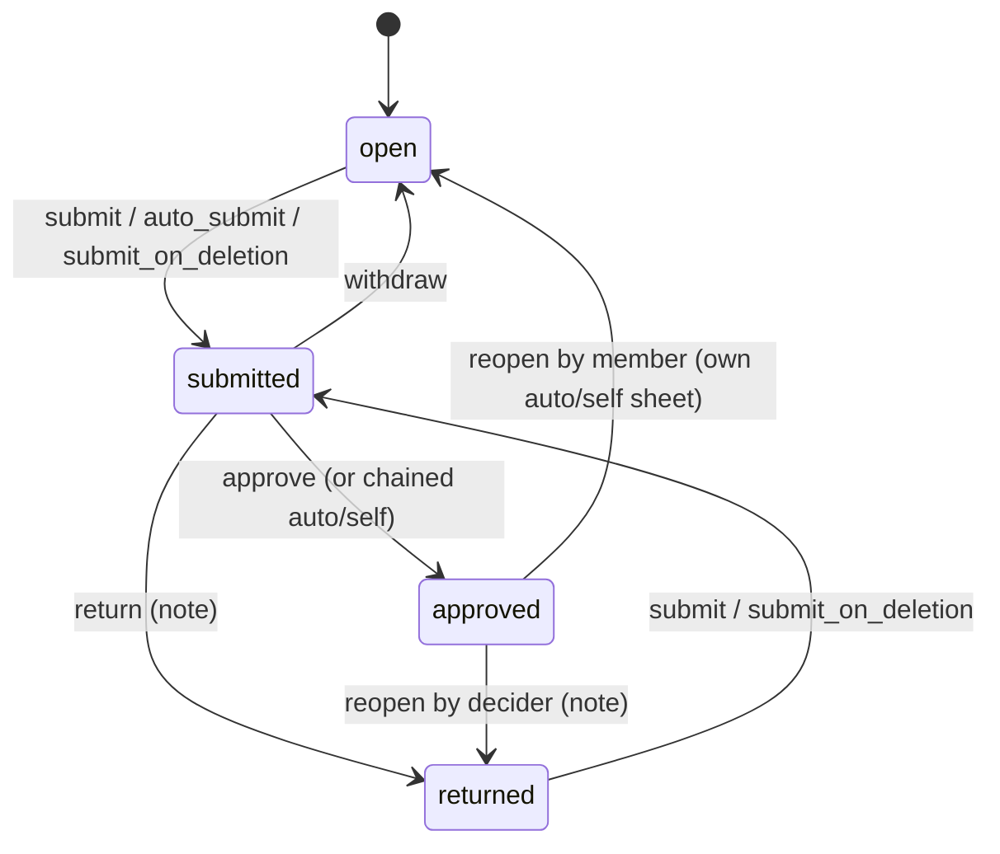

# Data Model

> **⚠️ Partly built.** M0 and M1 are applied on dev and prod. M2 and M3 are written (untracked in `supabase/migrations/` until prod applies them) and **applied to dev only** (2026-10-06). Where the files differ from this design, [As Built in M2 and M3](#as-built-in-m2-and-m3) records it and the sections below are corrected.

> **Last updated:** 2026-10-06 · **Status:** draft

Time keeps one ledger, `time_entries` (today's `task_time_logs`, renamed). Each entry is tagged with the context it was logged for and lands on a `timesheet`: one per person × sheet scope × period. Approval, freezing and settlement happen on the sheet, not on the entry. Policies stack in layers (workspace, team, contract), billing claims entries through a reservation table instead of a column, and every relation is service-role only. All objects live in `public`. Each object is tagged with the migration that creates or changes it (M0 to M5, see [migrations and rollout](./migrations-and-rollout.md), which is also the only place verification SQL lives). The renames table at the end maps every old name to its new one.

Part of the [time management proposal](./README.md).

## Objects at a Glance

| Object | Kind | Created / changed | Notes |
|---|---|---|---|
| `time_entries` | table | renamed M3 from `task_time_logs`; columns M1; `status` dropped M5 | The single time ledger |
| `time_entry_segments` | table | renamed M3 from `task_time_log_segments` | Display only |
| `time_entry_comments` | table | renamed M3 from `time_log_comments` | |
| `task_time_logs`, `task_time_log_segments`, `time_log_comments` | compatibility views | M3, dropped M5 | For the old backend only |
| `timesheets`, `timesheet_events` | tables | M1 | One sheet per person × sheet scope × period (CHANGE-2) |
| `time_policies`, `time_policy_events` | tables | M1; M3 makes `time_policy_events.policy_id` nullable (`ON DELETE SET NULL`) and adds `scope`, `team_id`, `workspace_id` | Workspace and team layers plus their audit log, which now outlives a deleted override |
| `user_time_preferences`, `time_logging_defaults` | tables | M1 | Display timezone; remembered "For" choice |
| `invoice_time_entries` | table | M1 | Billing reservation (CHANGE-6); there is no `billed_invoice_id` column |
| `time_entries_status_archive_<M5 date>` | table | M5 | One-time archive of `status` |
| `engagement_time_settings` | existing table | M1 adds 3 columns | Contract layer |
| `engagement_time_approvals`, `engagement_time_approval_items` | existing tables, 0 rows | dropped M3 | Replaced by `timesheets` |
| `team_member_rates`, `payouts`, `invoice_line_items` | existing tables | M1 adds RLS and REVOKE | Names kept |

## As Built in M2 and M3

The M2/M3 files implement this page with these decisions (D-numbers are the PR-1 build plan's; each is also applied in the section it names).

| # | Topic | As built |
|---|---|---|
| D10 | `p_freeze` shape | `{ "<timesheet id>": { "<entry id>": {payable_seconds, rate_snapshot, rate_type_snapshot, currency_snapshot, amount_snapshot} } }`. Every entry of the sheet must be present (else `STALE_REVISION {reason:'entry_set'}`); `payable_seconds` may exceed `duration_seconds` by at most 900; only the NULL-ness of `amount_snapshot` is read, SQL recomputes the amount. A key that is not a uuid is `freeze_invalid` |
| D11 | Decider sets | `time_scope_deciders(...) RETURNS SETOF uuid` is the single source; counts are `count(*)` over it. `time_timesheet_deciders(id)` and `time_approval_queue_ids(user, status, since)` build on it |
| D12 | Cost money | Structural, `time_sheet_has_cost_money(id)`: a team entry whose team has `member_rates_enabled` and whose workspace has `time_team_rules`, or an assignment entry with a `talent_engagement_id` — not "a non-zero rate" |
| D13 | Submit timing | `submit` from `open` on a route other than `auto`/`self` is refused before the period's last local day (`too_early`); `auto`/`self` may submit early; resubmit from `returned` and `submit_on_deletion` have no timing rule |
| D14 | `submit_on_deletion` with no other decider | Never `self`. No money → `auto` (cron job 4 finishes it); money → stays `submitted` on its scope |
| D15 | `request_reopen` | Allowed when `decision_kind IN ('manual','legacy')` |
| D16 | `status` mirror | Approve, reopen (both kinds) **and return** mirror into `time_entries.status`; every mirror statement is filtered `engagement_assignment_id IS NULL` (trg_20 fires on `UPDATE OF status`). Return: `status='pending' WHERE status='approved' AND payout_id IS NULL AND payable_seconds IS NULL` |
| D17 | Owed for deletion | `account_deletion_*_has_open_time` count approved-unpaid team entries only for teams with `payouts_enabled`; submitted sheets always count |
| D18 | M2 markers | By fact on every grouped row (personal rows never marked) |
| D19 | trg_30 columns | `started_at, member_user_id, context_kind, context_ref, team_id, workspace_id, engagement_assignment_id, timesheet_id` |
| D20 | trg_40 hardening | `FOR SHARE` on the sheet; `payout_id` only under `app.time_settlement`, `payable_seconds`/`amount_snapshot`/`legacy_status` only under `app.time_freeze`, on every row (locked or not) |
| D21 | M2 prechecks | Also: no non-personal row with NULL `member_user_id`; the `work_item` biconditional holds; `timesheets` empty; `time_legacy_backfill` absent |
| D22 | Test clean-up | `time_test_cleanup` refuses unless the project title is `LIKE 'itest %'` or `LIKE '[QA]%'` (`TIME_TEST_CLEANUP_FORBIDDEN`); `tg_invoice_time_entries_guard` lets a DELETE through under `app.time_maintenance` |
| D23 | Policy audit on DELETE | See [`time_policy_events`](#policies-contract-layer-preferences-m1) below and `time_policy_delete` |
| D65 | Freeze caps | Computed in TypeScript (`p_freeze`); the policy `weekly_limit_minutes` of a workspace or team never cuts payable time. See [Freeze](#freeze) |
| — | Internal helpers | `time_apply_freeze`, `time_clear_freeze` and `time_route_sheet` are revoked from `service_role` as well (only `time_timesheet_transition` calls them, plus `time_sheet_routing_preview` for `time_route_sheet`; both are SECURITY DEFINER). Every other new function follows the grant rule in [SQL Functions](#sql-functions) |
| — | Errors | Every new raise goes through `time_raise(code, detail)`: `message` is the bare code, `details` is JSON text. No detail key is named `message`, `status`, `path` or `timestamp` except `TIME_PERIOD_LOCKED {timesheet_id, status}`, which the backend re-keys to `sheet_status` (D50) |
| — | View column order | The `task_time_logs` view follows prod ordinal order (`payout_id, rate_type_snapshot, break_minutes`), not the order first written |

## `time_entries`

| Column | Fate | Notes |
|---|---|---|
| `id`, `started_at`, `ended_at`, `duration_seconds`, `paused_at`, `break_seconds`, `source`, `created_at`, `updated_at` | keep | `duration_seconds` is net of breaks |
| `break_minutes` | keep, deprecated | DTOs still accept it; drop once the API stops reading it |
| `member_user_id` (profiles SET NULL), `member_display_name_snapshot` | keep | Account deletion writes "Deleted user" |
| `project_id` (SET NULL), `task_id` (SET NULL) | keep | `project_id` required on INSERT (trg_10) |
| `rate_snapshot`, `rate_type_snapshot` (`hourly\|fixed`), `currency_snapshot`, `work_type_snapshot` | keep, **redefined** | **Cost side only** (CHANGE-3). The save-time value is a display estimate; the rate is re-resolved at freeze (CHANGE-4). A consultant's own client-engagement time has `rate_snapshot = 0`. |
| `payout_id` (payouts SET NULL) | keep | Paid = `payout_id IS NOT NULL OR legacy_status='paid_outside'` (CHANGE-5) |
| `engagement_assignment_id` (RESTRICT) | keep | Only when `context_kind='assignment'` |
| `team_id` (teams SET NULL) | keep, **redefined** | Only when `context_kind='team'` |
| `flagged_reason` | keep | Free text, no CHECK. New values `auto_stopped_24h`, `stopped_by_assignment_end` |
| **`context_kind`** | new M1 | text NOT NULL `assignment\|team\|workspace\|personal`. A reporting tag; the sheet comes from the scope (CHANGE-2) |
| **`workspace_id`** | new M1 | FK workspaces SET NULL (`time_entries_workspace_id_fkey`); only when `context_kind='workspace'` |
| **`context_ref`** | new M1 | uuid copy of the context id. FK SET NULL never touches it; it changes only with `context_kind` and the context FK, through an explicit context change (L2) |
| **`context_label_snapshot`** | new M1 | Team or workspace name, or the governing engagement's hirer `engagement_parties.display_name_snapshot`. Re-snapshotted on every context change |
| **`timesheet_id`** | new M1 | FK timesheets RESTRICT (`time_entries_timesheet_id_fkey`). NULL exactly when personal; filled from M2 |
| **`work_item`** | new M1 | text NOT NULL DEFAULT `'task'`: `task\|meeting\|review\|admin\|other`. `'task'` exactly when `task_id IS NOT NULL` (from M2) |
| **`note`** | new M1 | ≤ 2000 characters |
| **`payable_seconds`** | new M1 | Cost-payable seconds, frozen at sheet approval (round, then cap). Cleared on reopen |
| **`amount_snapshot`** numeric(14,2) | new M1 | Hourly: `round(payable_seconds/3600 × rate_snapshot, 2)`. NULL for `fixed` and for a client-only governing engagement. Display only; payout totals are recomputed (CHANGE-23) |
| **`legacy_status`** | new M1 | `rejected\|paid_outside`, written by migrations only. A decider reopen clears `rejected` (D12) |
| `reviewed_by` / `reviewed_at` / `review_note` | **rename M3** | `legacy_reviewed_*`, a frozen audit trail |
| `status` | **drop M5** | Written only by the old backend, the M2/M3 payout RPCs and (until M5) `time_timesheet_transition`'s mirror writes. New code never reads it |

**Predicates** (CHANGE-5). Every hours and money consumer uses these and sums `payable_seconds`, never `duration_seconds`.

| Name | SQL |
|---|---|
| Approved | `payable_seconds IS NOT NULL AND legacy_status IS DISTINCT FROM 'rejected'` |
| Paid | `payout_id IS NOT NULL OR legacy_status = 'paid_outside'` |
| Billed | `EXISTS (SELECT 1 FROM invoice_time_entries r WHERE r.entry_id = e.id)` |
| Owed | Approved `AND context_kind = 'team' AND payout_id IS NULL AND legacy_status IS NULL` |

```sql
-- M1 (on task_time_logs, final names already)
CONSTRAINT time_entries_context_kind_check  CHECK (context_kind IN ('assignment','team','workspace','personal')),
CONSTRAINT time_entries_work_item_check     CHECK (work_item IN ('task','meeting','review','admin','other')),  -- tightened M2
CONSTRAINT time_entries_legacy_status_check CHECK (legacy_status IS NULL OR legacy_status IN ('rejected','paid_outside')),
CONSTRAINT time_entries_frozen_check        CHECK (payable_seconds IS NULL OR (ended_at IS NOT NULL AND payable_seconds >= 0)),
CONSTRAINT time_entries_amount_check        CHECK (amount_snapshot IS NULL OR payable_seconds IS NOT NULL),
CONSTRAINT time_entries_note_length         CHECK (note IS NULL OR char_length(note) <= 2000)

-- M2 (added fully validated, after the backfill; L4)
CONSTRAINT time_entries_context_check CHECK (CASE context_kind
  WHEN 'personal'   THEN num_nonnulls(team_id, workspace_id, engagement_assignment_id, context_ref, timesheet_id) = 0
  WHEN 'team'       THEN num_nonnulls(engagement_assignment_id, workspace_id) = 0 AND context_ref IS NOT NULL
                         AND timesheet_id IS NOT NULL AND (team_id IS NULL OR team_id = context_ref)
  WHEN 'workspace'  THEN num_nonnulls(engagement_assignment_id, team_id) = 0 AND context_ref IS NOT NULL
                         AND timesheet_id IS NOT NULL AND (workspace_id IS NULL OR workspace_id = context_ref)
  WHEN 'assignment' THEN num_nonnulls(team_id, workspace_id) = 0 AND engagement_assignment_id = context_ref
                         AND timesheet_id IS NOT NULL END),
-- M2 replaces the M1 work_item check (L49)
CONSTRAINT time_entries_work_item_check CHECK (work_item IN ('task','meeting','review','admin','other')
                                               AND ((work_item = 'task') = (task_id IS NOT NULL)))
-- kept (renamed M5): end_after_start (ended_at > started_at), duration_non_negative, break_minutes_check,
-- break_seconds_non_negative, rate_snapshot_check, rate_type_snapshot_check, source_check,
-- work_type_snapshot_check; status_check drops with the column in M5
```

- **No overlap constraint.** 6 legacy entries overlap, so overlap is a backend warning only.
- A deleted task nulls `task_id`; trg_10 (BEFORE UPDATE OF `task_id`) sets `work_item='other'` in the same row, so the biconditional CHECK never blocks a task deletion.

### Indexes

| Index | Definition | Created / replaces |
|---|---|---|
| `uq_time_entries_one_running_per_member` | UNIQUE `(member_user_id) WHERE ended_at IS NULL` | M1; replaces `uq_task_time_logs_one_active_per_member_project` (dropped M5) |
| `time_entries_timesheet_idx` | `(timesheet_id)` | M1 |
| `time_entries_assignment_started_idx` | `(engagement_assignment_id, started_at) WHERE engagement_assignment_id IS NOT NULL` | M1; replaces `idx_task_time_logs_engagement_assignment` |
| `time_entries_team_started_idx` | `(team_id, started_at DESC)` | M1; replaces `task_time_logs_team_status_started_idx` |
| `time_entries_cost_rollup_idx` | `(project_id, rate_type_snapshot, started_at) WHERE payable_seconds IS NOT NULL` | M1; replaces `idx_task_time_logs_cost_rollup` |
| `time_entries_owed_idx` | `(team_id, member_user_id) WHERE payable_seconds IS NOT NULL AND payout_id IS NULL AND legacy_status IS NULL` | M1 |
| `time_entries_{member_started, project_member_started, task_started, payout}_idx` | as today | renamed M5 (see [Renames](#constraints-indexes-triggers-policies)) |
| `idx_task_time_logs_project_status_started` | | dropped M5 |

### Triggers

BEFORE triggers fire in name order, hence the numeric prefixes. M1 renames the two existing triggers (L50) so the order holds from M1 on.

| # | Trigger (function) | Fires | Created |
|---|---|---|---|
| 10 | `trg_time_entries_10_context` (`tg_time_entries_context`) | BEFORE INSERT, UPDATE OF `context_kind, context_ref, team_id, workspace_id, engagement_assignment_id, project_id, member_user_id, task_id, work_item` | M1 |
| 20 | `trg_time_entries_20_assignment_guard` (`tg_time_entries_assignment_guard`) | BEFORE INSERT, UPDATE OF `engagement_assignment_id, member_user_id, project_id, started_at, ended_at, status`; `status` leaves the list in M5 | renamed M1; rebuilt M5 |
| 30 | `trg_time_entries_30_timesheet` (`tg_time_entries_timesheet`) | BEFORE INSERT, UPDATE OF `started_at, member_user_id, context_kind, context_ref, team_id, workspace_id, engagement_assignment_id, timesheet_id` (D19) | M2 |
| 40 | `trg_time_entries_40_lock` (`tg_time_entries_lock`) | BEFORE UPDATE OR DELETE | M2; rebuilt M3 (renamed keys), M5 |
| 90 | `trg_time_entries_90_updated_at` (`set_time_entries_updated_at`) | BEFORE UPDATE | renamed M1 |

**10 · `tg_time_entries_context`** (CHANGE-14, L1, L2, L17, L49, L58)

| Step | Behaviour |
|---|---|
| Derive (INSERT, `context_kind` NULL) | Old-backend writes through table or view: `assignment` if `engagement_assignment_id`, else `team` if `team_id`, else `workspace` if `workspace_id`, else `personal`. Sets `context_ref` from the matching FK and snapshots `context_label_snapshot`. |
| Derive (UPDATE) | A context FK changing to non-NULL while the caller left `context_kind`/`context_ref` alone re-derives both. This keeps the old backend's project move (`team-time.service.ts:760-783`) consistent. If the caller sets kind or ref, the FK must match (the CHECK enforces it after the triggers). An FK going to NULL never touches `context_ref`. |
| `work_item` | On INSERT and any `task_id` change: `'other'` when `task_id IS NULL AND work_item='task'`; `'task'` when `task_id IS NOT NULL`. |
| Validate | On INSERT, and on UPDATE when `project_id`, `team_id`/`context_ref` or `member_user_id` changes to a **non-NULL** value. Skipped under `app.time_maintenance='on'`. A stop (`ended_at` change) is never validated. |

Validation rules:

| Case | Requires | Error |
|---|---|---|
| any | `project_id` not NULL, and the member has a `project_access` row on the project or is `projects.owner_id`. The floor is **viewer** on purpose (L1); the editor rule (`time.log`) lives in TypeScript, so old-backend viewer inserts keep working during the window. | `TIME_ENTRY_NO_PROJECT_ACCESS` |
| `team` | a `project_teams` row for (project, team) and a `team_members` row for (team, member) | `TIME_ENTRY_NOT_ON_PROJECT_TEAM` |
| `workspace` | `projects.workspace_id = context_ref` and a `workspace_members` row | `TIME_ENTRY_NOT_WORKSPACE_MEMBER` |
| change **into** an assignment | `created_at ≥ assignment.created_at`; the `started_at ≥ assignment.started_at` bound is trg_20's (L58) | `LOGGING_FOR_INVALID` |

> **⚠️ Deviation from L1.** The database does not require the curated `project_team_members` row. That requirement lives in TypeScript (resolver step 3, see [backend](./backend.md)), the same way the editor rule does. The old backend's `resolveTeamRate` falls back to `project_teams ∩ team_members` with no curated row (`team-time.service.ts:2481-2499`), so a curated-row floor in the DB would break old-backend logging for those users from M1 until step 6. Pairs that log today without a curated row are counted by the L1b verification query; D16 (decided 2026-10-02) back-fills `project_team_members` for those pairs in M1, so they keep the team option.

**20 · `tg_time_entries_assignment_guard`.** Today's body (`20260814021000:441-487`), renamed in M1 unchanged. Its `OLD.status` branch (`APPROVED_TIME_ASSIGNMENT_LOCKED`) stays until M5, when trg_40 covers it and it is removed.

**30 · `tg_time_entries_timesheet`**

| Case | Result |
|---|---|
| Personal | `timesheet_id := NULL` |
| UPDATE with new `member_user_id` NULL | no change (L17) |
| UPDATE keeping member and context, current sheet's period still holds the new local start date (sheet timezone) | keep the sheet; sheet bounds never move |
| Otherwise | `(scope_kind, scope_ref, policy_workspace_id) := time_sheet_scope_for(context_kind, context_ref, project_id)`; `timesheet_id := time_ensure_timesheet(member, scope_kind, scope_ref, policy_workspace_id, started_at)` |
| Caller sets `timesheet_id` directly | ignored outside `app.time_maintenance` (the trigger recomputes it); under maintenance a caller-set sheet passes through |
| Target sheet not `open`/`returned` (read `FOR SHARE`) | `TIME_PERIOD_LOCKED {timesheet_id, status}`, mapped by the backend to `TIMESHEET_LOCKED {reason:'period', sheet_status}` |

**40 · `tg_time_entries_lock`.** An entry is **locked** when its sheet is `submitted` or `approved`, or `payable_seconds`, `payout_id` or `legacy_status` is set, or an `invoice_time_entries` row exists for it. DELETE of a locked entry raises `TIME_ENTRY_LOCKED {entry_id, reason}` with `reason` in `paid | billed | legacy | frozen | sheet_submitted | sheet_approved`. UPDATE raises it too unless `to_jsonb(NEW) - allowed = to_jsonb(OLD) - allowed`, where *allowed* is below. Independently of the lock, on **every** row a `payout_id` change outside `app.time_settlement` raises `reason: settlement_only`, and a `payable_seconds`/`amount_snapshot`/`legacy_status` change outside `app.time_freeze` raises `reason: freeze_only` (D20). The sheet is read `FOR SHARE`, which can deadlock with a transition; the backend retries a `40P01` once.

| Allowed change | Condition |
|---|---|
| `updated_at`, `member_display_name_snapshot` | always |
| `project_id`, `task_id` (with `work_item → 'other'`), `member_user_id`, `team_id`, `workspace_id`, `payout_id`, `legacy_reviewed_by` going value → NULL | only when the referenced row no longer exists (FK SET NULL); a deliberate write cannot pass as a cascade |
| `payout_id` | under `app.time_settlement='on'` |
| `payable_seconds`, `amount_snapshot`, `rate_snapshot`, `rate_type_snapshot`, `currency_snapshot`, `legacy_status` `rejected → NULL` (decider reopen) | under `app.time_freeze='on'` |
| `status`, `reviewed_by/_at/_note` | until M5 only. The M3 rebuild switches these keys to `legacy_reviewed_*`, because `to_jsonb` keys follow renamed columns |

`app.time_maintenance='on'` bypasses the whole check.

**90 · `set_time_entries_updated_at`** sets `NEW.updated_at = now()` and returns early under `app.time_maintenance='on'`. The M1 and M2 backfills therefore keep each legacy row's `updated_at`, which M2 uses as the `decided_at` fallback and M4 as its "changed since M2" test.

## `time_entry_segments`, `time_entry_comments`

- **Renamed M3:** `task_time_log_segments` → `time_entry_segments`, `time_log_comments` → `time_entry_comments`, each `log_id` → `entry_id` (FK CASCADE kept).
- **Policies dropped M3:** "Users can read allowed time log segments" (`20260810150000:45`); "Users can read allowed time log comments" and "Users can add allowed time log comments" (`20260528000010:26,49`). Both tables become service-role only; `web/` never queries them.
- Segments stay display only. Reads and writes follow the parent sheet through `can_view_timesheet` (CHANGE-17).
- `trg_time_log_comments_updated_at` → `trg_time_entry_comments_updated_at` (M3); its function `handle_notifications_updated_at()` is unchanged.

## `timesheets`, `timesheet_events` (M1)

```sql
CREATE EXTENSION IF NOT EXISTS btree_gist WITH SCHEMA extensions;   -- 1.7 available on prod, not installed
CREATE TABLE public.timesheets (
  id uuid PRIMARY KEY DEFAULT gen_random_uuid(),
  member_user_id uuid REFERENCES public.profiles(id) ON DELETE SET NULL,
  member_display_name_snapshot text,
  scope_kind text NOT NULL CHECK (scope_kind IN ('workspace','team','engagement')),
  scope_ref uuid NOT NULL,                                                 -- never nulled
  team_id uuid REFERENCES public.teams(id) ON DELETE SET NULL,             -- team scope only
  workspace_id uuid REFERENCES public.workspaces(id) ON DELETE SET NULL,   -- workspace scope only
  engagement_id uuid REFERENCES public.engagements(id) ON DELETE RESTRICT, -- engagement scope only (governing engagement)
  scope_label_snapshot text NOT NULL,
  policy_workspace_id uuid REFERENCES public.workspaces(id) ON DELETE SET NULL, -- approver/plan/report dimension
  period_kind text NOT NULL CHECK (period_kind IN ('weekly','biweekly','semi_monthly','monthly')),
  period_start date NOT NULL,
  period_end date NOT NULL,
  timezone text NOT NULL,
  week_start smallint NOT NULL CHECK (week_start BETWEEN 1 AND 7),
  policy_snapshot jsonb NOT NULL DEFAULT '{}',          -- written at submit (L40): workspace + team layers, sources
  status text NOT NULL DEFAULT 'open' CHECK (status IN ('open','submitted','returned','approved')),
  approver_scope text CHECK (approver_scope IN ('team','workspace','hirer','auto','self')),  -- frozen at submit
  revision integer NOT NULL DEFAULT 0,
  submitted_at timestamptz,
  submitted_by uuid REFERENCES public.profiles(id) ON DELETE SET NULL,
  submission_kind text CHECK (submission_kind IN ('manual','auto','on_deletion','legacy')),
  decided_at timestamptz,
  decided_by uuid REFERENCES public.profiles(id) ON DELETE SET NULL,
  decision_kind text CHECK (decision_kind IN ('manual','auto','self','legacy')),
  decision_note text CHECK (decision_note IS NULL OR char_length(decision_note) <= 2000),
  overtime_approved boolean NOT NULL DEFAULT false,
  total_seconds integer,                                -- sum(duration_seconds) at submit (informational)
  payable_seconds integer,                              -- sum(payable_seconds) at approval; what totals show
  origin text NOT NULL DEFAULT 'app' CHECK (origin IN ('app','legacy_migration')),
  created_at timestamptz NOT NULL DEFAULT now(),
  updated_at timestamptz NOT NULL DEFAULT now(),
  CONSTRAINT timesheets_period_check CHECK (period_end >= period_start),
  CONSTRAINT timesheets_scope_check CHECK (CASE scope_kind
     WHEN 'workspace'  THEN num_nonnulls(team_id, engagement_id) = 0 AND (workspace_id IS NULL OR workspace_id = scope_ref)
     WHEN 'team'       THEN num_nonnulls(workspace_id, engagement_id) = 0 AND (team_id IS NULL OR team_id = scope_ref)
     WHEN 'engagement' THEN num_nonnulls(team_id, workspace_id) = 0 AND engagement_id = scope_ref END),
  CONSTRAINT timesheets_state_check CHECK (
     (status = 'open' OR (submitted_at IS NOT NULL AND submission_kind IS NOT NULL AND approver_scope IS NOT NULL))
     AND (status <> 'approved' OR (decided_at IS NOT NULL AND decision_kind IS NOT NULL AND payable_seconds IS NOT NULL))
     AND (status <> 'returned' OR decision_note IS NOT NULL)),
  CONSTRAINT timesheets_no_overlap EXCLUDE USING gist (
     member_user_id WITH =, scope_kind WITH =, scope_ref WITH =,
     daterange(period_start, period_end, '[]') WITH &&)
);
CREATE INDEX timesheets_queue_idx     ON public.timesheets (approver_scope, scope_ref, period_start DESC) WHERE status = 'submitted';
CREATE INDEX timesheets_member_idx    ON public.timesheets (member_user_id, period_start DESC);
CREATE INDEX timesheets_policy_ws_idx ON public.timesheets (policy_workspace_id) WHERE status = 'submitted';

CREATE TABLE public.timesheet_events (   -- append-only by contract; Enterprise audit-export source
  id bigint GENERATED ALWAYS AS IDENTITY PRIMARY KEY,
  timesheet_id uuid NOT NULL REFERENCES public.timesheets(id) ON DELETE CASCADE,
  actor_user_id uuid REFERENCES public.profiles(id) ON DELETE SET NULL,
  event text NOT NULL CHECK (event IN ('submitted','auto_submitted','withdrawn','approved','returned',
                                       'reopened','reopen_requested','legacy_import')),
  from_status text,
  to_status text NOT NULL,
  note text,
  total_seconds integer,
  payable_seconds integer,
  revision integer NOT NULL,
  created_at timestamptz NOT NULL DEFAULT now());
CREATE INDEX timesheet_events_timesheet_idx ON public.timesheet_events (timesheet_id, created_at);
```

### Sheet Scope

Computed by `time_sheet_scope_for` (CHANGE-2).

| Entry `context_kind` | `scope_kind` / `scope_ref` | `policy_workspace_id` | Label |
|---|---|---|---|
| `assignment` | `engagement` / governing engagement = `coalesce(talent_engagement_id, client_engagement_id)` | workspace of the contract that activated the engagement (`contracts.workspace_id` via `engagements.activated_by_contract_id`), else the hirer party team's `teams.workspace_id`, else NULL (platform default). **Never** `projects.workspace_id`: an engagement sheet spans projects, so a project-derived value would depend on which entry created the sheet. `contracts.workspace_id` is nullable, and `origin='legacy'` engagements have no activating contract. | hirer `display_name_snapshot` |
| `team` | `team` / `team_id`, **only while** the team has a `time_policies` row (any override) **and** `team.workspace_id` has `time_team_rules`; otherwise `workspace` / `team.workspace_id` | `team.workspace_id` | team or workspace name |
| `workspace` | `workspace` / W | W | workspace name |
| `team`, team with no workspace | `team` / `team_id` | NULL | team name |
| `team`, team row gone | `team` / `context_ref` | NULL | `Deleted team` |
| `personal` | no sheet | | |

### Approver Scope at Submit

Frozen on the sheet by `time_timesheet_transition`, implementing the [model](./README.md)'s routing table with CHANGE-9.

| Base scope | `approver_scope` |
|---|---|
| engagement scope, governing engagement is a talent engagement | `hirer` |
| engagement scope, governing engagement is a client engagement | `auto` |
| team scope whose override has `approver_scope='team'` | `team`, otherwise `workspace` |
| workspace scope | `workspace` |

- **Cost money exists** (D12, `time_sheet_has_cost_money`) structurally: a team entry whose team has `member_rates_enabled` **and** whose workspace has `time_team_rules`, or an assignment entry whose assignment has a `talent_engagement_id`. No rate is resolved for this test. This is the same definition as [backend › approver routing](./backend.md).
- `policy_snapshot.approval_required = false` yields `auto` only when no cost money exists.
- If the base scope has no eligible decider other than the member (`count(time_scope_deciders(...)) = 0`): no cost money → `self` for `submit`/`auto_submit`, `auto` for `submit_on_deletion` (D14, never `self`); cost money on a team scope → retry with `workspace` (`can_manage_workspace(policy_workspace_id)`, member excluded); if still nobody qualifies, the sheet stays `submitted` on the base scope (`fallback:'wait'`; UI: "No one else can approve this").
- Routing is computed by the internal `time_route_sheet(sheet, action)` and written at every submit action as `policy_snapshot.routing = {base, cost_money, deciders_count, fallback}`. `time_sheet_routing_preview(id, action)` returns the same answer without writing; cron job 3 uses it to skip manual-route sheets.

### Transitions

All go through `time_timesheet_transition`: row lock (`ORDER BY id FOR UPDATE`; revisions pair with ids by original index), `expected_revision` check (`STALE_REVISION`), one `timesheet_events` row appended per step, `revision` bumped per step (a chained submit → approved is +2). A non-NULL actor who is neither the member nor `can_view_timesheet` gets `TIMESHEET_NOT_FOUND`. A NULL actor is valid only for `auto_submit`, `submit_on_deletion` and `approve` on an `auto`/`self` sheet (cron job 4, D09). The first failing sheet aborts the batch. `TIMESHEET_TRANSITION_INVALID.reason` is one of `action`, `arguments`, `note_too_long`, `not_allowed`, `state`, `empty`, `running_entry`, `too_early`, `not_auto`, `note_required`, `freeze_required`, `freeze_invalid`, `use_request_reopen`; every per-sheet refusal carries `timesheet_id`. Notes are stored trimmed (blank = no note); more than 2000 characters is `note_too_long`.



| Action | From → to | Actor | Rules |
|---|---|---|---|
| `submit` | open/returned → submitted, then approved when scope is `auto`/`self` and `p_freeze` has the sheet | member | Refused while an entry runs (`running_entry`) or with 0 entries (`empty`). From `open` on a manual route, refused before the period's last local day (`too_early`, D13). Writes `policy_snapshot` (with `routing`), `approver_scope`, `total_seconds`, `submission_kind='manual'`, clears the decision fields |
| `auto_submit` | open → submitted (→ approved) | NULL (time cron) | Only sheets resolving to `auto`/`self` (`not_auto` otherwise), no running entry. `submission_kind='auto'`, event `auto_submitted` |
| `submit_on_deletion` | open/returned → submitted | NULL (`delete_account`) | `submission_kind='on_deletion'`; never chains; `self` never chosen (D14) |
| `withdraw` | submitted → open | member | Clears like the member reopen. Event `withdrawn` |
| `approve` | submitted → approved | `can_decide_timesheet` → `decision_kind='manual'`; or NULL actor on `auto`/`self` → kind = scope | `p_freeze` required (`freeze_required`); no running entry. Freezes (below). `p_approve_overtime` → `overtime_approved` |
| `return` | submitted → returned | `can_decide_timesheet` | Note required (`note_required`). `approver_scope` kept. Return mirror (D16) |
| `reopen` (decider) | approved → returned | `can_decide_timesheet`, scope `team`/`workspace`/`hirer` | Note required. `time_clear_freeze` clears the freeze and `legacy_status='rejected'`, resets `overtime_approved`. `TIMESHEET_HAS_SETTLED_ENTRIES {reason: paid \| billed}` if any entry has `payout_id`, `legacy_status='paid_outside'` or a reservation (paid is checked first) |
| `reopen` (member) | approved → open | member | Own `auto`/`self` sheets only (`use_request_reopen` otherwise). Refused if any entry is reserved, paid or has any `legacy_status` (`reason: legacy`, L33). Clears `approver_scope`, `policy_snapshot`, every submit and decision field and both totals |
| `request_reopen` | approved → approved | member | `decision_kind IN ('manual','legacy')` (D15). Event `reopen_requested`, `revision + 1` only |

**`status` mirror (until M5).** While `time_entries.status` exists, approve writes `status='approved'` (or `'rejected'` for `legacy_status='rejected'`), reopen (both kinds) writes `status='pending'` on every entry whose freeze it clears, and **return** writes `status='pending' WHERE status='approved' AND payout_id IS NULL AND payable_seconds IS NULL` (old-backend per-entry approvals inside the returned sheet). Every mirror statement is filtered `engagement_assignment_id IS NULL`, because trg_20 fires on `UPDATE OF status` (D16). Otherwise a decider reopen of a legacy-approved sheet clears `payable_seconds` but leaves `status='approved'`, and the payout RPC's fallback (A1) makes the returned entries payable between step 6 and M5. M5 removes the writes.

### Freeze

Runs on approve, and on a submit that chains to auto/self (CHANGE-4, L10, L12, L63). `TimesheetsService` computes steps 1–4 in TypeScript (`TimeRatesService`, `ratesInForceOn`, `settingsInForceOn`) and passes them as `p_freeze` keyed by sheet id. The RPC checks that the payload's entry ids equal the sheet's entries and applies them under `SET LOCAL app.time_freeze='on'`. An auto/self submit without `p_freeze` (`submit_on_deletion`, or a SQL-side `auto_submit`) stays `submitted` for cron job 4. Only the legacy freezes (M2, M4) are computed in SQL. Per entry, for local start date `d` in the sheet timezone:

| Step | Rule |
|---|---|
| 1. Rate | Legacy entries (`created_at` before the first `legacy_import` event) keep their stored `rate_snapshot` (D13). **team:** the `team_member_rates` row for (team, member, project) with `start_date ≤ d ≤ coalesce(end_date, ∞)`; 0 when `member_rates_enabled=false` or the workspace lacks `time_team_rules`. **assignment:** the governing talent engagement's `cost`/`hour` rate in force on `d` (same rule as `ratesInForceOn`, `engagements.service.ts:124-134`), picking `rate_kind` (`cost` for freeze, `billing` for invoices) and `work_type = entry.work_type_snapshot` before a `work_type IS NULL` row (`engagement_time_rates.work_type`, `20260814021000:70-71`). A `month`/`fixed` unit gives `rate_type_snapshot='fixed'`; a client-only governing engagement gives `rate_snapshot=0`. **workspace:** 0. |
| 2. Round | Per entry to `rounding_minutes`, nearest increment, ties up (D14). From the contract settings in force on `d` (`settingsInForceOn`) for engagement scope, otherwise `policy_snapshot`. |
| 3. Cap | Cut `payable_seconds` to the remaining allowance, latest entries first, unless `p_approve_overtime` (the over-cap seconds are still reported). Only two sources cut (D65): (a) the **contract** `weekly_limit_minutes` in force on `d`, on engagement sheets only and only when the value comes from `engagement_time_settings` — per (worker, governing engagement) across all linked projects, over the engagement sheet's week; (b) team `weekly_limit_hours` / `monthly_limit_hours` from `team_member_rates` — per (member, team) over the sheet timezone's week, then calendar month; entries under different rate rows in one window take the strictest cap. Payable time already approved on other sheets in the window counts against the cap. A workspace or team **policy** `weekly_limit_minutes` never cuts payable time: it is a review indicator and a write-time warning only. |
| 4. Amount | Hourly: `amount_snapshot = round(payable_seconds/3600.0 × rate_snapshot, 2)`. NULL for `fixed` or a client-only governing engagement. |
| 5. Sheet totals | `timesheets.payable_seconds = sum(payable_seconds)` over approved entries |

### `trg_timesheets_guard`

`tg_timesheets_guard`, BEFORE INSERT, UPDATE, DELETE (CHANGE-14, L17, L47).

| Rule | Detail |
|---|---|
| INSERT | must be `status='open'` |
| Immutable | `id`, `scope_kind`, `scope_ref`, `engagement_id`, `period_*`, `timezone`, `week_start`, `origin`, `created_at`. `member_user_id`, `team_id`, `workspace_id`, `policy_workspace_id` may change only to NULL, only when the referenced row is gone. `member_display_name_snapshot` may change (account deletion). `approver_scope` is frozen at submit: it changes only on the way into `submitted`, or clears when a sheet reopens to `open` |
| Status | changes follow the transition table only |
| DELETE | only an `open` sheet with no entries, or under `app.time_maintenance` |
| `decision_kind='manual'` | `can_decide_timesheet(id, decided_by)` and `decided_by ≠ member_user_id` |
| `self` | `decided_by = member_user_id` |
| `auto` | `decided_by IS NULL` |
| `legacy` | skips the decider check and allows `decided_by IS NULL` (1 prod sheet's latest reviewer is the member; 3 have none). This lives here; `can_decide_timesheet` never special-cases legacy |
| Legacy import | under `app.time_maintenance='on'` with `origin='legacy_migration'`, `open → submitted` and `open → approved` are allowed directly |

`decided_by` is checked at transition time, not by a CHECK, so a later SET NULL never breaks the row.

## Policies, Contract Layer, Preferences (M1)

```sql
CREATE TABLE public.time_policies (
  id uuid PRIMARY KEY DEFAULT gen_random_uuid(),
  scope text NOT NULL CONSTRAINT time_policies_scope_values_check   -- default name would clash
    CHECK (scope IN ('workspace','team')),
  workspace_id uuid REFERENCES public.workspaces(id) ON DELETE CASCADE,
  team_id uuid REFERENCES public.teams(id) ON DELETE CASCADE,
  tracking_enabled boolean,                 -- workspace rows: whether the workspace option is offered (plan checked separately)
  period_kind text CHECK (period_kind IN ('weekly','biweekly','semi_monthly','monthly')),
  week_start smallint CHECK (week_start BETWEEN 1 AND 7),
  timezone text,                            -- validated against pg_timezone_names by trg_time_policies_guard
  period_anchor date,                       -- biweekly only; isodow must equal week_start
  approval_required boolean,
  approver_scope text CHECK (approver_scope IN ('team','workspace')),  -- team rows only; NULL = workspace
  allow_manual_entries boolean,
  retroactive_days integer CHECK (retroactive_days BETWEEN 0 AND 3650),  -- 0 = no limit
  rounding_minutes smallint CHECK (rounding_minutes IN (0,5,6,10,15,30)),
  weekly_limit_minutes integer CHECK (weekly_limit_minutes > 0),
  reminder_days smallint CHECK (reminder_days BETWEEN 0 AND 14),
  hidden_presets text[] NOT NULL DEFAULT '{}'
    CHECK (hidden_presets <@ ARRAY['meeting','review','admin','other']::text[]),
  created_by uuid REFERENCES public.profiles(id) ON DELETE SET NULL,
  updated_by uuid REFERENCES public.profiles(id) ON DELETE SET NULL,
  created_at timestamptz NOT NULL DEFAULT now(),
  updated_at timestamptz NOT NULL DEFAULT now(),
  CONSTRAINT time_policies_scope_check CHECK (
    (scope='workspace' AND workspace_id IS NOT NULL AND team_id IS NULL AND approver_scope IS NULL
       AND num_nulls(tracking_enabled, period_kind, week_start, timezone, approval_required,
                     allow_manual_entries, rounding_minutes, reminder_days) = 0)
    OR (scope='team' AND team_id IS NOT NULL AND workspace_id IS NULL)));
CREATE UNIQUE INDEX uq_time_policies_workspace ON public.time_policies (workspace_id) WHERE scope='workspace';
CREATE UNIQUE INDEX uq_time_policies_team      ON public.time_policies (team_id)      WHERE scope='team';

CREATE TABLE public.time_policy_events (
  id bigint GENERATED ALWAYS AS IDENTITY PRIMARY KEY,
  policy_id uuid NOT NULL REFERENCES public.time_policies(id) ON DELETE CASCADE,
  actor_user_id uuid REFERENCES public.profiles(id) ON DELETE SET NULL,
  changes jsonb NOT NULL,                   -- {field: [old, new]}; full row on insert
  created_at timestamptz NOT NULL DEFAULT now());
CREATE INDEX time_policy_events_policy_idx ON public.time_policy_events (policy_id, created_at DESC);
-- M3 (D23): the audit survives a deleted override
ALTER TABLE public.time_policy_events ALTER COLUMN policy_id DROP NOT NULL,
  DROP CONSTRAINT time_policy_events_policy_id_fkey,
  ADD CONSTRAINT time_policy_events_policy_id_fkey FOREIGN KEY (policy_id)
      REFERENCES public.time_policies(id) ON DELETE SET NULL,
  ADD COLUMN scope text, ADD COLUMN team_id uuid, ADD COLUMN workspace_id uuid;   -- copies, back-filled
CREATE INDEX time_policy_events_team_idx ON public.time_policy_events (team_id, created_at DESC) WHERE team_id IS NOT NULL;
CREATE INDEX time_policy_events_workspace_idx ON public.time_policy_events (workspace_id, created_at DESC) WHERE workspace_id IS NOT NULL;

CREATE TABLE public.user_time_preferences (
  user_id uuid PRIMARY KEY REFERENCES public.profiles(id) ON DELETE CASCADE,
  timezone text NOT NULL,
  week_start smallint CHECK (week_start BETWEEN 1 AND 7),
  updated_at timestamptz NOT NULL DEFAULT now());

CREATE TABLE public.time_logging_defaults (
  user_id uuid NOT NULL REFERENCES public.profiles(id) ON DELETE CASCADE,
  project_id uuid NOT NULL REFERENCES public.projects(id) ON DELETE CASCADE,
  context_kind text NOT NULL CHECK (context_kind IN ('assignment','team','workspace','personal')),
  team_id uuid REFERENCES public.teams(id) ON DELETE CASCADE,
  workspace_id uuid REFERENCES public.workspaces(id) ON DELETE CASCADE,
  engagement_assignment_id uuid REFERENCES public.engagement_assignments(id) ON DELETE CASCADE,
  updated_at timestamptz NOT NULL DEFAULT now(),
  PRIMARY KEY (user_id, project_id),
  CONSTRAINT time_logging_defaults_context_check CHECK (CASE context_kind
    WHEN 'personal'   THEN num_nonnulls(team_id, workspace_id, engagement_assignment_id) = 0
    WHEN 'team'       THEN team_id IS NOT NULL AND num_nonnulls(workspace_id, engagement_assignment_id) = 0
    WHEN 'workspace'  THEN workspace_id IS NOT NULL AND num_nonnulls(team_id, engagement_assignment_id) = 0
    WHEN 'assignment' THEN engagement_assignment_id IS NOT NULL AND num_nonnulls(team_id, workspace_id) = 0 END));
```

| Trigger | Fires | Does |
|---|---|---|
| `trg_time_policies_guard` | BEFORE INSERT, UPDATE | Validates `timezone` against `pg_timezone_names` and the `period_anchor` weekday (`TIME_POLICY_INVALID`); refuses `approval_required=false` on a team row whose team has `member_rates_enabled=true` (`TEAM_RATES_REQUIRE_APPROVAL`); sets `updated_at`. Each rule re-checks only the columns the write changes, so an FK cascade (`created_by`/`updated_by` SET NULL on account deletion) always passes |
| `trg_time_policies_events` | AFTER INSERT, UPDATE | Appends a `time_policy_events` row with `actor_user_id = coalesce(NEW.updated_by, NEW.created_by)` (L23). No row when only `updated_at` changed; an admin confirming the policy unchanged (setting `updated_by`) does write one. Rebuilt in M3 to copy `scope`, `team_id`, `workspace_id` onto the event |
| `trg_time_policies_delete_event` (M3) | BEFORE DELETE | Appends `{policy_id, actor_user_id: coalesce(app.time_policy_actor, OLD.updated_by), changes: {deleted: true, row}, scope, team_id, workspace_id}`; the FK then nulls `policy_id` and the row stays |

**Layering** (`time_resolve_policy`). Every resolved field carries `source: default|workspace|team|contract|member`.

| Layer | Source | Notes |
|---|---|---|
| Platform default | built in | weekly, week start 1, `approval_required=true`, `allow_manual_entries=true`, `rounding_minutes=0`, `reminder_days=1`, `tracking_enabled=true` (CHANGE-11); timezone from the CHANGE-11 hints |
| Workspace | `time_policies` scope `workspace` of `policy_workspace_id` | Materialised on first need by `time_ensure_workspace_policy` |
| Team override | `time_policies` scope `team` | NULL = inherit. Ignored unless `team.workspace_id` has `time_team_rules` (stored rows survive downgrade). `approval_required` treated as true while `member_rates_enabled` |
| Contract | `engagement_time_settings` in force on the date | Every non-NULL field wins; `approval_required` derives from `approval_mode` |
| Member caps | `team_member_rates` limits | Team context only; applied at freeze |

- **Contract columns.** `engagement_time_settings` gains nullable `period_kind` (same CHECK), `timezone` and `week_start smallint CHECK (week_start BETWEEN 1 AND 7)`. NULL falls back to the policy workspace's policy, then the default. `sign_contract_position_and_activate` is not rebuilt, and the settings guard (`20260814021000:180-245`) ignores unlisted columns. Authoring comes later (D8).
- **Team columns.** `teams.retroactive_log_days` moves to team rows in M1 and is dropped in M5; Prodigitality's value is NULL so its row is NULL (L59); dev has 2 teams at 30. `teams.contract_enforcement` is dropped in M5 (D5). `time_tracking_enabled`, `member_rates_enabled`, `payouts_enabled` and `pay_period_config` stay on `teams`.

## `invoice_time_entries` (M1; CHANGE-6, L6)

```sql
CREATE TABLE public.invoice_time_entries (
  invoice_id uuid NOT NULL REFERENCES public.invoices(id) ON DELETE CASCADE,
  entry_id uuid NOT NULL REFERENCES public.task_time_logs(id) ON DELETE RESTRICT,   -- follows the M3 rename
  contract_id uuid REFERENCES public.contracts(id) ON DELETE SET NULL,
  bill_seconds integer NOT NULL CHECK (bill_seconds >= 0),
  bill_rate numeric(12,2) NOT NULL CHECK (bill_rate >= 0),
  bill_amount numeric(14,2) NOT NULL,
  currency text NOT NULL,
  created_at timestamptz NOT NULL DEFAULT now(),
  PRIMARY KEY (invoice_id, entry_id),
  CONSTRAINT uq_invoice_time_entries_entry UNIQUE (entry_id));
CREATE INDEX invoice_time_entries_contract_idx ON public.invoice_time_entries (contract_id);
```

| Topic | Rule |
|---|---|
| Lifecycle | Rows are written at composition (scheduled or manual); issue only verifies the set; void-and-replace moves rows (`UPDATE invoice_id`); a void without replacement, a draft deletion, or a recompose that drops entries deletes them. Retainer invoices (`attach_hours=false`) never reserve |
| `trg_invoice_time_entries_guard` (`tg_invoice_time_entries_guard`) | On INSERT and UPDATE OF `invoice_id`, `entry_id`: entry is Approved, `context_kind <> 'personal'`, `work_type_snapshot <> 'training'`, target invoice is `draft`, `contract_id = invoices.contract_id`; else `INVOICE_TIME_ENTRY_NOT_BILLABLE`. DELETE only while the invoice is `draft` or `void`, or the invoice row is gone (cascade), or under `app.time_maintenance` (M3 rebuild, D22, so test and QA clean-up can remove reservations) |
| Floor | `time_billing_floor(contract_id)` = `greatest(contracts.service_start_date, (SELECT min(created_at)::date FROM timesheet_events WHERE event='legacy_import'))`, NULLs ignored. The service keeps entries whose local date, in the policy timezone of `contracts.workspace_id` (NULL → the contract project's workspace), is ≤ period end and ≥ the floor |

## SQL Functions

All new functions are `SECURITY DEFINER SET search_path = public, pg_temp`, `REVOKE ALL FROM PUBLIC, anon, authenticated`, `GRANT EXECUTE TO service_role`. Trigger functions get the REVOKE only. **Exception (M3):** the internal helpers `time_apply_freeze`, `time_clear_freeze` and `time_route_sheet` are also revoked from `service_role`; Supabase's default privileges would otherwise let PostgREST call them, and the freeze helpers set `app.time_freeze`.

| Function | Signature | Created | Purpose |
|---|---|---|---|
| `time_period_for` | `(p_kind text, p_tz text, p_week_start smallint, p_anchor date, p_at timestamptz) → daterange` STABLE | M1 | Local date `d = (p_at AT TIME ZONE p_tz)::date`; period rules below |
| `time_resolve_policy` | `(p_scope_kind text, p_scope_ref uuid, p_policy_workspace_id uuid, p_at timestamptz) → jsonb` STABLE | M1 | The layers above. Plan lookup inline: `workspace_plan_state(ARRAY[ws]).effective_plan` joined to `plan_limits.bool_value`. Invalid timezone name falls back to UTC |
| `time_ensure_workspace_policy` | `(p_workspace_id uuid, p_timezone_hint text DEFAULT NULL, p_member_user_id uuid DEFAULT NULL) → uuid` | M1 | Lazy materialisation (CHANGE-11). Timezone = first valid of: hint (admin's browser), earliest owner's `user_time_preferences.timezone`, the member's preference, `UTC`. Writes platform defaults with `tracking_enabled=true` |
| `time_sheet_scope_for` | `(p_context_kind text, p_context_ref uuid, p_project_id uuid) → TABLE(scope_kind, scope_ref, policy_workspace_id, scope_label)` STABLE | M1 | [Sheet scope](#sheet-scope) table |
| `time_ensure_timesheet` | `(p_member_user_id uuid, p_scope_kind text, p_scope_ref uuid, p_policy_workspace_id uuid, p_at timestamptz) → uuid` | M1 | Steps below. Under `app.time_maintenance`, sets `origin='legacy_migration'` and `submission_kind='legacy'` (L47) |
| `can_decide_timesheet` | `(p_timesheet_id uuid, p_user_id uuid) → boolean` | M1 | Uses the **frozen** `approver_scope`, never the plan (L40); rules below. Always false for the member; never special-cases legacy |
| `can_view_timesheet` | `(p_timesheet_id uuid, p_user_id uuid) → boolean` | M1 | The member, OR `can_decide_timesheet`, OR (`scope_kind='team'` AND `can_manage_team(team_id)`). Entries, segments and comments follow (CHANGE-17) |
| `time_timesheet_transition` | `(p_ids uuid[], p_actor uuid, p_action text, p_expected_revisions integer[], p_note text DEFAULT NULL, p_approve_overtime boolean DEFAULT false, p_freeze jsonb DEFAULT NULL) → SETOF timesheets` | M3 (moved from M1, see below); rebuilt M5 | One lock path, plpgsql VOLATILE, never sets `app.time_maintenance`. All ids succeed or the batch fails (approve-bulk). Unviewable id → `TIMESHEET_NOT_FOUND`; refusals → `TIMESHEET_TRANSITION_INVALID {reason, timesheet_id}` (reasons under [Transitions](#transitions)); `STALE_REVISION {timesheet_id, expected, actual}` or `{reason:'entry_set', timesheet_id}`; `TIMESHEET_HAS_SETTLED_ENTRIES {timesheet_id, reason: paid\|billed\|legacy}`. Returns the full rows (incl. `policy_snapshot`) ordered by id |
| `time_billing_floor` | `(p_contract_id uuid) → date` STABLE | M1 | See `invoice_time_entries` |
| `account_deletion_team_has_open_time` | `(p_team_id uuid) → boolean` | M3 (moved from M1) | A `submitted` team-scope sheet on the team, or an Owed entry with `context_ref` = the team **on a team with `payouts_enabled`** (D17) |
| `account_deletion_workspace_has_open_time` | `(p_workspace_id uuid) → boolean` | M3 (moved from M1) | A `submitted` sheet with `policy_workspace_id` = the workspace, or Owed entries on its `payouts_enabled` teams (D17) |
| `time_legacy_backfill` | `(p_reconcile boolean) → TABLE(timesheet_id uuid, action text)` | M2; rebuilt M3; dropped M5 | M2 grouping and M4 reconcile; saves, sets and restores `app.time_maintenance` |
| `time_test_cleanup` | `(p_project_id uuid) → void` | M3 | Refuses unless the project title is `LIKE 'itest %'` or `LIKE '[QA]%'` (`TIME_TEST_CLEANUP_FORBIDDEN`, D22). Under `app.time_maintenance`, deletes the project's reservations, entries and their members' now-empty sheets in any status, for the harness's `h.cleanup()` (L20) |
| `account_deletion_close_running_entries_for_workspace` | `(p_workspace_id uuid) → void` LANGUAGE sql | M3 | Stops the workspace's running entries through `time_stop_running_entries`; replaces the `_logs_` version |
| `time_raise` | `(p_code text, p_detail jsonb DEFAULT '{}') → void` | M2 | `RAISE EXCEPTION USING MESSAGE = p_code, DETAIL = p_detail::text`. Every new M2/M3 error uses it |
| `time_legacy_sheet_facts`, `time_legacy_approver_scope`, `time_legacy_freeze` | `(uuid) → TABLE(...)`, `(timesheets, jsonb) → text`, `(uuid) → void` | M2 (facts and freeze rebuilt M3); drop with the backfill in M5 | Backfill helpers. The freeze writes the stored-snapshot amounts (D13; rejected = 0). `time_legacy_sheet_facts` reads `status`, so M5 must drop it |
| `time_sheet_has_cost_money` | `(p_timesheet_id uuid) → boolean` STABLE | M3 | D12, structural |
| `time_scope_deciders` | `(p_approver_scope text, p_team_id uuid, p_policy_workspace_id uuid, p_engagement_id uuid, p_member_user_id uuid) → SETOF uuid` STABLE | M3 | Candidates (team owner, team owners/admins, workspace owners/admins, the engagement's hirer party) minus the member and tombstoned profiles, filtered by `time_can_decide_scope` (D11) |
| `time_timesheet_deciders` | `(p_timesheet_id uuid) → SETOF uuid` STABLE | M3 | `time_scope_deciders` over the sheet's frozen columns |
| `time_approval_queue_ids` | `(p_user_id uuid, p_status text DEFAULT 'submitted', p_since date DEFAULT NULL) → SETOF uuid` STABLE | M3 | `submitted`: submitted sheets of others, prefiltered by managed teams, managed policy workspaces and hired talent engagements, then exact `time_can_decide_scope`. `decided`: sheets the user decided since `p_since` (default 30 days), the user's own excluded. Unordered; the backend sorts and pages |
| `time_stop_running_entries` | `(p_ids uuid[], p_at timestamptz DEFAULT now(), p_flag text DEFAULT NULL) → integer` | M3 | Folds an open pause, closes the open segment, writes the net duration and `flagged_reason = coalesce(p_flag, flagged_reason)`; only rows still running; returns the count |
| `time_apply_freeze` | `(p_timesheet_id uuid, p_freeze jsonb) → void` | M3, **internal** | Validates and applies one sheet's freeze under `app.time_freeze` (entry set, `+900` bound, legacy cut-off from the first `legacy_import`) and the approve mirror |
| `time_clear_freeze` | `(p_timesheet_id uuid) → void` | M3, **internal** | Clears `payable_seconds`, `amount_snapshot`, the `rejected` marker, then the reopen mirror |
| `time_route_sheet` | `(p_sheet timesheets, p_action text) → jsonb` STABLE | M3, **internal** | `{approver_scope, routing}` per [Approver Scope at Submit](#approver-scope-at-submit) |
| `time_sheet_routing_preview` | `(p_timesheet_id uuid, p_action text DEFAULT 'auto_submit') → jsonb` STABLE | M3 | `time_route_sheet` of the stored row, no writes; NULL for a missing id (D52, cron job 3) |
| `time_policy_delete` | `(p_policy_id uuid, p_actor uuid) → void` | M3 | Sets `app.time_policy_actor` (empty for NULL), deletes the policy row, restores the setting (D23) |
| `tg_time_policies_delete_event` | trigger | M3 | See the policy triggers table |

| Helper | Signature | Created | Purpose |
|---|---|---|---|
| `time_workspace_has_feature` | `(p_workspace_id uuid, p_key text) → boolean` STABLE | M1 | `workspace_plan_state(ARRAY[ws]).effective_plan` joined to `plan_limits.bool_value`; NULL workspace = false. The plan lookup the policy and scope functions share |
| `time_scope_label` | `(p_scope_kind text, p_scope_ref uuid) → text` STABLE | M1 | Workspace name, team name, or the governing engagement's hirer `display_name_snapshot`; `'Unknown'` when the row is gone |
| `time_can_decide_scope` | `(p_approver_scope text, p_team_id uuid, p_policy_workspace_id uuid, p_engagement_id uuid, p_member_user_id uuid, p_user_id uuid) → boolean` STABLE | M1 | The decider rules below, taking the sheet's columns directly. `can_decide_timesheet` and `trg_timesheets_guard` both call it, so the guard checks the values being written, not the stored row |

**Moved to M3 (decided 2026-10-02).** `time_timesheet_transition` and the two `account_deletion_*_has_open_time` functions have no caller before backend PR-1, and M3 rebuilds them on `time_entries` anyway. Creating them in M1 would only have put on prod a version replaced before anything could call it, so each lands once in M3, next to its first caller (PR-1 and the rebuilt `delete_account`).

| `time_period_for` kind | Period |
|---|---|
| weekly | `start = d − ((isodow(d) − week_start + 7) % 7)`, `end = start + 6` |
| biweekly | `anchor + 14·floor((d − anchor)/14)`; anchor default `2024-01-01 + (week_start − 1)` |
| semi_monthly | days 1–15, and 16 to month end |
| monthly | the calendar month |

**`time_ensure_timesheet`:** (1) return the (member, scope) sheet whose period holds `p_at`'s local date in that sheet's timezone; (2) else call `time_ensure_workspace_policy`, then `time_resolve_policy` and `time_period_for`; (3) clip bounds to the neighbouring sheets, so a policy change applies at the next boundary (E3); (4) `INSERT … ON CONFLICT DO NOTHING`, then re-select.

| `can_decide_timesheet`: frozen `approver_scope` | Who decides |
|---|---|
| `team` | `can_manage_team(team_id)`; `can_manage_workspace(policy_workspace_id)` once `team_id` is NULL (D6) |
| `workspace` | `can_manage_workspace(policy_workspace_id)`; `can_manage_team(team_id)` when `policy_workspace_id` is NULL on a team sheet (a team whose workspace was deleted: `teams.workspace_id` is SET NULL) |
| `hirer` | the `engagement_parties` hirer of `engagement_id` |
| `auto`, `self` | nobody (false) |

**GUCs.** Always `set_config(…, true)` (transaction-local), only from SQL functions or migrations; PostgREST cannot set them. `app.time_billing` does not exist.

| GUC | Set by | Lets through |
|---|---|---|
| `app.time_maintenance` | migrations, `time_legacy_backfill`, `reset_qa_fixture`, `time_test_cleanup` | Skips trg_10 validation, the trg_40 lock, the guard's legacy paths, the invoice-reservation DELETE guard and `updated_at` stamping; a caller-set `timesheet_id` passes trg_30 |
| `app.time_freeze` | `time_apply_freeze`, `time_clear_freeze` (via `time_timesheet_transition`) | Freeze columns on any entry |
| `app.time_settlement` | `create_payout_and_mark_paid`, `void_payout_and_revert`, only around their entry UPDATE | `payout_id` (and, until M5, `status` / `legacy_reviewed_*`) |
| `app.time_policy_actor` | `time_policy_delete` | The actor recorded on the `deleted` policy event |

## Other Tables Touched

| Table | Change | When |
|---|---|---|
| `engagement_assignments` | `tg_engagement_assignments_guard` (A12, L8): when both engagements are set, the talent engagement's hirer `user_id` must equal the client engagement's provider `user_id` (`ASSIGNMENT_HIRER_NOT_CLIENT_PROVIDER`) | M1 |
| `engagement_assignments` | `tg_engagement_assignment_running_timer_guard` (A3, L37): on `active → ended/cancelled` it **stops** each running entry instead of raising: `ended_at = greatest(NEW.ended_at, started_at + 1s)`, `duration_seconds` net of breaks, open segment closed, `paused_at` NULL, `flagged_reason='stopped_by_assignment_end'` | M3 |
| `teams` | `can_manage_team(p_team_id uuid, p_user_id uuid)` (A11): `CREATE OR REPLACE`, accepting `owner_id` or `team_members.role IN ('owner','admin')`. **Keeps its grants**: 6 `team_resource_*` RLS policies call it as `authenticated`. An anon-callable oracle, out of scope (L41) | M1 |
| `notification_types` | 10 rows inserted (see [M1](./migrations-and-rollout.md)) | M1 |
| `plan_limit_keys`, `plan_limits` | 6 keys added, `time_tracking` relabelled | M0 |
| `notifications` | `time_log_approval_requested` rows marked read (M2); `timesheets_imported` digests inserted (M4) | M2, M4 |

## RLS and Grants (CHANGE-18)

Every migration that creates or renames a relation runs, in the same file:

```sql
ALTER TABLE public.<t> ENABLE ROW LEVEL SECURITY;
REVOKE ALL ON public.<t> FROM anon, authenticated;
```

| Relations | Migration |
|---|---|
| `timesheets`, `timesheet_events`, `time_policies`, `time_policy_events`, `user_time_preferences`, `time_logging_defaults`, `invoice_time_entries` | M1 (new) |
| `task_time_logs`, `task_time_log_segments`, `time_log_comments`, `team_member_rates` | M1. Codifies RLS enabled by hand; prod `anon`/`authenticated` currently hold full grants, TRUNCATE included |
| `payouts`, `engagement_time_settings`, `engagement_time_rates`, `engagement_assignments`, `invoice_line_items` | M1, REVOKE only (L42). `web/src` has no `.from()` on any of them; each held full `anon`/`authenticated` grants on prod |
| sequences `timesheet_events_id_seq`, `time_policy_events_id_seq` | M1, REVOKE (default privileges grant `anon`/`authenticated` on new sequences) |
| compatibility views `task_time_logs`, `task_time_log_segments`, `time_log_comments` | M3: `WITH (security_invoker = true)` plus REVOKE |
| `time_entries_status_archive_<date>` | M5 |

- No policies are needed: all access goes through the service role.
- `engagement_time_rates` holds cost rates; prod showed full `anon`/`authenticated` grants, so M1 revokes it unconditionally.
- `set_time_entries_updated_at` stays SECURITY INVOKER but gains `SET search_path = public, pg_temp`.
- **Follow-up, out of scope:** other contract, engagement, finance and invoice tables (`contracts`, `engagements`, `engagement_parties`, `finance_*`, `invoices`, `payout_methods`, `user_rate_settings` and more) also hold full `anon`/`authenticated` grants behind RLS. They want their own REVOKE pass; a table whose policies serve authenticated clients should lose only `TRUNCATE, TRIGGER, REFERENCES`.
- Every new `time_*`, `timesheet*`, `tg_time*`, `tg_timesheets*`, `tg_invoice_time*`, `can_decide_timesheet`, `can_view_timesheet` and `account_deletion_*` function is revoked from PUBLIC, anon and authenticated, because Supabase's default privileges otherwise grant EXECUTE on new `public` functions. `can_manage_team` is the one exemption.

## Names Added Beyond the Canonical List

| Kind | Names |
|---|---|
| Triggers / functions | `trg_time_policies_guard` (`tg_time_policies_guard`), `trg_time_policies_events` (`tg_time_policies_events`), `time_workspace_has_feature`, `time_scope_label`, `time_can_decide_scope` |
| Indexes / constraints | `timesheet_events_timesheet_idx`, `time_policy_events_policy_idx`, `invoice_time_entries_contract_idx`, `uq_invoice_time_entries_entry`, `time_entries_legacy_status_check`, `time_entries_amount_check`, `time_logging_defaults_context_check` |
| Error codes | `TIMESHEET_TRANSITION_INVALID {reason}` (13 reasons, see [Transitions](#transitions)), `TIMESHEET_NOT_FOUND` (backend → 404), `TIME_POLICY_INVALID`, `INVOICE_TIME_ENTRY_NOT_BILLABLE`, `TIMESHEET_IMMUTABLE`, `TIMESHEET_DECIDER_INVALID` (a guard backstop; the backend shows it as `TIMESHEET_TRANSITION_INVALID {reason:'not_allowed'}`), `TIMESHEET_DELETE_FORBIDDEN`, `TIMESHEET_SCOPE_REQUIRED`, `TIMESHEET_ENSURE_FAILED`; M2/M3 add `TIME_ENTRY_LOCKED {entry_id, reason}`, `TIME_PERIOD_LOCKED {timesheet_id, status}`, `PAYOUT_SELF_NOT_ALLOWED`, `FIXED_RATE_NOT_PAYABLE_BY_ENTRY`, `TIME_TEST_CLEANUP_FORBIDDEN {project_id}`, and `TEAM_HAS_OPEN_TIME {team_id}` / `WORKSPACE_HAS_OPEN_TIME {workspace_id}` (bare-code message, so the account service's `includes` match still works) |
| Signature change | `time_timesheet_transition` takes `uuid[]` and `integer[]` (approve-bulk is one transaction) and `p_freeze jsonb` (the TypeScript-computed freeze, keyed by sheet id) |

## Renames

"When" is the migration that performs the rename. Constraint and FK names wait until M5 so the old backend's PostgREST embed hints (`!task_time_logs_*_fkey`) keep resolving through the views (C19). Trigger names are not hints, so they move early (L50).

### Tables, Views and Columns

| Old | New | When |
|---|---|---|
| `task_time_logs` | `time_entries`; compatibility view M3 → M5 | M3 |
| `reviewed_by` / `reviewed_at` / `review_note` | `legacy_reviewed_*` (the view aliases them back) | M3 |
| column `status` | archived to `time_entries_status_archive_<M5 date>` (`id`, `status`), then dropped | M5 |
| `task_time_log_segments`, `time_log_comments` (each `log_id`) | `time_entry_segments`, `time_entry_comments` (`entry_id`); views M3 → M5 | M3 |
| `engagement_time_approvals`, `engagement_time_approval_items` | dropped (0 rows on prod and dev; unreferenced in `backend/src` and `web/src`) | M3 |
| `teams.retroactive_log_days` | moved to `time_policies.retroactive_days` (M1), dropped | M5 |
| `teams.contract_enforcement` | dropped (C12, D5) | M5 |

### Constraints, Indexes, Triggers, Policies

Constraints all rename in M5 with explicit `ALTER … RENAME CONSTRAINT`, following `20260810140000_rename_project_finance_tables.sql`. The rule is prefix-for-prefix: `task_time_logs_*` → `time_entries_*`, `task_time_log_segments_*` → `time_entry_segments_*`, `time_log_comments_*` → `time_entry_comments_*`, with `log_id` → `entry_id` in FK names.

| Old | New / fate | When |
|---|---|---|
| `task_time_logs_pkey`; `_{break_minutes_check, break_seconds_non_negative, duration_non_negative, end_after_start, rate_snapshot_check, rate_type_snapshot_check, source_check, work_type_snapshot_check}`; `_{member_user_id, project_id, task_id, team_id, payout_id, engagement_assignment_id}_fkey` | `time_entries_{same}` | M5 |
| `task_time_logs_reviewed_by_fkey` | `time_entries_legacy_reviewed_by_fkey` | M5 |
| `task_time_logs_status_check` | dropped with the column | M5 |
| `task_time_log_segments_{pkey, kind_check, end_after_start, log_id_fkey}` | `time_entry_segments_{pkey, kind_check, end_after_start, entry_id_fkey}` | M5 |
| `time_log_comments_{pkey, author_user_id_fkey, log_id_fkey}` | `time_entry_comments_{pkey, author_user_id_fkey, entry_id_fkey}` | M5 |
| `invoice_line_items_source_log_id_fkey` | **kept** (points at `time_entries` by OID) | |
| `idx_task_time_logs_project_member_started`, `idx_task_time_logs_task_started`, `task_time_logs_member_started_idx`, `task_time_logs_payout_idx` | `time_entries_{project_member_started, task_started, member_started, payout}_idx` | M5 |
| `idx_task_time_logs_engagement_assignment`, `idx_task_time_logs_cost_rollup` (`WHERE status IN …`), `task_time_logs_team_status_started_idx`, `uq_task_time_logs_one_active_per_member_project` | replaced by the M1 indexes in [Indexes](#indexes); old dropped | M5 |
| `idx_task_time_logs_project_status_started` | dropped | M5 |
| `idx_task_time_log_segments_log_started`, `uq_task_time_log_segments_one_open_per_log`, `idx_time_log_comments_log_created` | `time_entry_segments_entry_started_idx`, `uq_time_entry_segments_one_open_per_entry`, `time_entry_comments_entry_created_idx` | M5 |
| `trg_set_task_time_logs_updated_at` | `trg_time_entries_90_updated_at` | M1 |
| `trg_task_time_logs_engagement_assignment_guard` | `trg_time_entries_20_assignment_guard` (keeps `status` in its column list until M5 recreates it) | M1; M5 |
| `trg_time_log_comments_updated_at` | `trg_time_entry_comments_updated_at` | M3 |
| `trg_engagement_time_approvals_*`, `trg_engagement_time_approval_items_guard` | dropped with their tables | M3 |
| the 3 time-log RLS policies ([segments and comments](#time_entry_segments-time_entry_comments)) | dropped; no policies remain on time tables, so M5 has no policy renames | M3 |

### Functions

| Old | New | When |
|---|---|---|
| `set_task_time_logs_updated_at` (`20260320131000:37-45`) | `set_time_entries_updated_at`: `ALTER FUNCTION … RENAME`, body replaced to skip under `app.time_maintenance` | M1 |
| `tg_task_time_logs_engagement_assignment_guard` (`20260814021000:441-487`) | `tg_time_entries_assignment_guard`: `ALTER FUNCTION … RENAME`, body unchanged; `OLD.status` branch removed M5 | M1 / M5 |
| `account_deletion_close_running_logs_for_workspace` (`20260923090200:165-178`) | `account_deletion_close_running_entries_for_workspace`, created new; old one dropped after `delete_account` is rebuilt | M3 |

**Group A: existing functions rebuilt from the latest defining body.** Their bodies name the table; the prod `pg_proc` scan confirms the set, and bodies were verified by md5 against prod.

| # | Function | Latest body | Rebuilt | Change |
|---|---|---|---|---|
| A1 | `create_payout_and_mark_paid` | `20260907090000_split_rates_and_payouts.sql:48-147` | M2, M3, M5 | **M2:** names `task_time_logs`; `SET LOCAL app.time_settlement`; payable = `context_kind = 'team' AND payout_id IS NULL AND legacy_status IS NULL AND (payable_seconds IS NOT NULL OR status='approved')` (safe only because of the [status mirror](#transitions)); total = `round(sum(coalesce(payable_seconds, duration_seconds)/3600.0 × rate_snapshot), 2)`; keeps writing `status='paid'` and `reviewed_*` (the RPC's own write, `:137-143`); refuses `rate_type_snapshot='fixed'` (`FIXED_RATE_NOT_PAYABLE_BY_ENTRY`) and `p_created_by = p_member_user_id` (`PAYOUT_SELF_NOT_ALLOWED`). **M3:** same on `time_entries` / `legacy_reviewed_*`. **M5:** no `status` writes, no fallback. Signature (incl. `p_log_ids`) and grants unchanged |
| A2 | `void_payout_and_revert` | `20260701000020_create_payouts.sql:179-214` (`000030` only changes grants) | M2, M3, M5 | Clears `payout_id` under `app.time_settlement`; M2/M3 keep writing `status='approved'` and `reviewed_*` (`:200-206`), M5 removes them |
| A3 | `tg_engagement_assignment_running_timer_guard` | `20260814021000:489-508` | M3 | On `active → ended/cancelled`, stops the running entries through `time_stop_running_entries(…, coalesce(NEW.ended_at, now()), 'stopped_by_assignment_end')` and never raises (L37) |
| A4 | `tg_engagement_time_approval_items_guard` | `20260814021000:384-439` | M3 | **Dropped** with its table, as is `tg_engagement_time_approvals_guard` (`:322-382`) |
| A5 | `account_deletion_close_running_logs_for_workspace` | `20260923090200:165-178` | M3 | Replaced (above) |
| A6 | `delete_account` | `20260923090200:211-607` (refs `:369`, `:502`) | M3 | New names. Step 2 reads the preflight and raises the first `blockers[].code` before validating the resolution. Running entries stop through `time_stop_running_entries`. A new step after the projects loop stops the user's own running entries, deletes their empty `open` sheets and calls `time_timesheet_transition(…, 'submit_on_deletion')` with actor NULL on their other `open`/`returned` sheets; step 7 also deletes `user_time_preferences` and `time_logging_defaults`; writes `'Deleted user'` to `timesheets.member_display_name_snapshot`; still refuses when payouts exist. The deciders' notices for those sheets are sent by the backend afterwards (D54) |
| A7 | `reset_qa_fixture` | `20260813120000_production_qa_fixtures.sql:47-146` | M3 | Under `app.time_maintenance`: deletes fixture reservations, entries and **every** fixture-member sheet in any status (events cascade). Paid test: `payout_id IS NOT NULL OR legacy_status IS NOT NULL` |
| A8 | `account_deletion_purge_team` | `20260923090200:70-99` | M3 | `TEAM_HAS_OPEN_TIME` when `account_deletion_team_has_open_time` |
| A9 | `account_deletion_purge_workspace` | `20260923090200:128-163` | M3 | `WORKSPACE_HAS_OPEN_TIME` |
| A10 | `account_deletion_preflight` | `20260923090100:79-283` | M3 | `ws`/`tm` gain `has_open_time`; `can_delete = NOT (is_paid OR has_payouts OR has_open_time)`; both decision objects gain `has_open_time`; a new top-level `blockers` array lists `{kind:'workspace', id, name, code:'WORKSPACE_HAS_OPEN_TIME'}` for sole-member owned workspaces with open time and `{kind:'team', …, code:'TEAM_HAS_OPEN_TIME'}` for owned teams that would be purged (those leave `will_be_deleted.teams`). `preflight_token` stays `md5(decisions)`, so every user's token changes once at deploy |
| A11 | `can_manage_team` | `20260901160000:52-68` | M1 | Role owner/admin; same signature, grants kept |
| A12 | `tg_engagement_assignments_guard` | `20260814020000:444-534` | M1 | `ASSIGNMENT_HIRER_NOT_CLIENT_PROVIDER` |

**Group B: created in M1/M2, naming the entries table.** Written against `task_time_logs`, which keeps that name until M3 and then becomes a view without the new columns, so M3 `CREATE OR REPLACE`s each on `time_entries`. The M3 `prosrc` check fails if any is missed.

| Function | Created | Rebuilt |
|---|---|---|
| `tg_time_entries_lock` | M2 | M3 (`legacy_reviewed_*` keys), M5 (no `status` / reviewer allowance) |
| `time_timesheet_transition` | M3 | M5. The M3 body carries the [status mirror](#transitions) (approve writes `status='approved'`, or `'rejected'` for `legacy_status='rejected'`; reopen writes `status='pending'` on every entry whose freeze it clears; return writes `status='pending'` on old per-entry approvals); M5 removes it |
| `time_legacy_backfill`, `time_legacy_sheet_facts`, `time_legacy_freeze` | M2 | M3 |
| `tg_timesheets_guard`, `tg_invoice_time_entries_guard` | M1 | M3 |
| `account_deletion_team_has_open_time`, `account_deletion_workspace_has_open_time` | M3 | — |

`tg_time_entries_timesheet` and `time_legacy_approver_scope` name no entry table and no reviewer column, so M3 does not rebuild them. M3 produces each carried-over body from its M2/M1 source with exactly four substitutions (`task_time_logs` → `time_entries`, `reviewed_by`/`reviewed_at`/`review_note` → `legacy_*`), and a carry-over diff during the PR-1 build checked it.

**Dropped:** `tg_engagement_time_approvals_guard`, `tg_engagement_time_approval_items_guard`, `account_deletion_close_running_logs_for_workspace` (M3); `time_legacy_backfill` and its three helpers (M5).

### Names Kept on Purpose

| Name | Why |
|---|---|
| `team_member_rates` | A team-owned rate card, not a child of entries; gains RLS and REVOKE |
| `invoice_line_items.source_log_id` | Generic and always NULL today; renaming needs its own window |
| literal `source_type='time_log'`, export `kind=time_logs`, `time_log_*` notification types | Data/API contracts and history; `time_log_*` types are no longer emitted |
| `user_rate_settings` | Marketplace seller rate card, unrelated |
| `TIME_LOG_ASSIGNMENT_*`, `TIME_LOG_OUTSIDE_ASSIGNMENT_WINDOW` (trg_20) | Raised by an unchanged body; mapped by the backend |

### Code-Level Renames

| Old | New |
|---|---|
| API `/api/team-time/*` | `/api/time/*`; the alias stays until the L18 gate, then answers 410 `APP_UPDATE_REQUIRED` |
| `backend/src/modules/execution/team-time/` (`TeamTimeModule`) | `execution/time/` (`TimeModule`) |
| web `services/team-time.service.ts`, type `TaskTimeLog`, query prefix `["team-time"]`, `TimeLogDetailModal` | `services/time.service.ts`, `TimeEntry` (deprecated `TaskTimeLog` alias during the move), `["time"]`, `TimeEntryDetailModal` |
| `scripts/seed_dev_project_finance.mjs:253`, `scripts/seed_finance_demo.mjs:248,596`, `backend/test/integration/qa-fixture.integration-spec.ts:85,117,143` | `time_entries` with `context_kind`; required before M5 (L19) |
