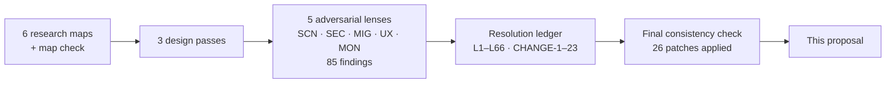

# Pressure-Test Log

> **⚠️ Proposed — not built.**

> **Last updated:** 2026-10-02 · **Status:** draft

This page records how the time management design was attacked and what changed because of it. The method had five stages. First, six research maps of the current code were written, and a check pass verified them against the repo. Next came three successive design passes. The first complete design then went to five adversarial reviews, one per lens: scenarios (SCN), security and privacy (SEC), migration and deploy (MIG), UX confusion (UX) and money correctness (MON). Every finding was resolved in a **resolution ledger**. Duplicates across lenses merged into one row (L-n), and the most severe lens set that row's severity. Wording every page must share was fixed as CHANGE-1 to CHANGE-23. Last, a final consistency check read all pages against each other and against the repo, and its 26 patches were applied. The user decisions in [Decided](./README.md) were never reopened. Where a finding pushed against one, the decision stayed and conditions were added to it (MD-6 → L18). The other pages cite these ids (L-n, CHANGE-n, C-n, D#, E#), and this page explains them.

Part of the [time management proposal](./README.md).

**Other ids.** E# cases live in [edge cases and tests](./edge-cases-and-tests.md); A1–A12 are the rebuilt functions in the [data model renames](./data-model.md#functions); D1–D16 are the decisions in the [README](./README.md#design-decisions-d1d16-decided-2026-10-02). C-n ids number choices made in the design passes, before the lens reviews; the pages cite these:

| Id | Choice |
|---|---|
| C1 | `workspace` is its own context kind, not a team fallback |
| C2 | On Pro, team time is approved by workspace admins (D1) |
| C8 | One SQL path (`time_sheet_scope_for` + `time_ensure_timesheet` via `trg_time_entries_30_timesheet`) files every entry on its sheet |
| C12 | `teams.contract_enforcement` and the contract gate are retired (D5) |
| C15 | Existing functions are rebuilt from their latest defining body, verified by md5 against prod (Group A) |
| C17 | M1 seeds Prodigitality's workspace and team policy rows |
| C19 | Constraint and FK names keep their old names until M5, so old embed hints resolve |
| C21 | A timesheet is person × sheet scope × period (added by U1 / L26) |

Page keys used in the tables: [model](./README.md), [data](./data-model.md), [mig](./migrations-and-rollout.md), [backend](./backend.md), [ux](./ux.md), [tests](./edge-cases-and-tests.md).

## Findings By Lens

The reviews found 85 issues: 6 blockers, 46 major and 33 minor. 75 were accepted, and 10 were partially accepted with the rejected part stated. None was rejected outright.

| Lens | Blocker | Major | Minor | Accepted | Partially accepted |
|---|---|---|---|---|---|
| SCN: scenarios | 2 | 12 | 8 | 21 | 1 |
| SEC: security and privacy | 1 | 5 | 6 | 11 | 1 |
| MIG: migration and deploy | 2 | 6 | 9 | 14 | 3 |
| UX: confusion | 0 | 11 | 5 | 12 | 4 |
| MON: money correctness | 1 | 12 | 5 | 17 | 1 |
| **Total** | **6** | **46** | **33** | **75** | **10** |

## Cross-Cutting Changes

These 23 changes fix the wording every page uses. A page that disagrees with one of them is wrong. Changes marked † were later amended by a consistency patch.

| # | Change | Rule |
|---|---|---|
| CHANGE-1 † | Project-access floor | Every option needs `time.log` (editor and above). A team, assignment or workspace ownership never stands in for `project_access`. The DB refuses a member with no `project_access` row who is not `projects.owner_id` (`TIME_ENTRY_NO_PROJECT_ACCESS`), and a team entry whose member is not on that attached team (`TIME_ENTRY_NOT_ON_PROJECT_TEAM`; patch 1). |
| CHANGE-2 | Timesheet = person × sheet scope × period | Sheet scope: `engagement` (governing engagement); `team` only while the team has an active Business override (applied only while its workspace has `time_team_rules`); else `workspace` (`team.workspace_id`, or W). `context_kind` is a reporting tag. Approver scope frozen at submit: `team`, `workspace`, `hirer`, `auto`, `self`. The resolver auto-picks options with the same sheet scope and rate source. |
| CHANGE-3 | Governing engagement, cost-side money | Talent engagement, else client engagement; it sets approval, period, rounding and limits. Entry money is cost side only. Billing is priced at composition from the client engagement's rates in force on each entry's local date and stored on `invoice_time_entries`. |
| CHANGE-4 | Freeze | At approval (or auto/self submit), re-resolve rate, rounding and cap per entry for its local start date. Order: round, then cap, then amount. The saved rate is an estimate. Workspace and team layers come from `policy_snapshot` (written at submit), the contract layer from `settingsInForceOn`. Legacy entries freeze from their stored snapshot. |
| CHANGE-5 | Predicates | Approved = `payable_seconds IS NOT NULL AND legacy_status IS DISTINCT FROM 'rejected'`. Paid = `payout_id IS NOT NULL OR legacy_status='paid_outside'`. Billed = an `invoice_time_entries` row. Owed = approved, team context, `payout_id IS NULL`, `legacy_status IS NULL`. Totals sum `payable_seconds`, never `duration_seconds`. |
| CHANGE-6 | Billing | Hours reserved at composition, one invoice per entry (`UNIQUE(entry_id)`). The reservation moves to a void replacement and is released on a void without replacement, a draft deletion or a recompose. Eligible: approved, unreserved, local date ≤ period end and ≥ `time_billing_floor(contract)`. Earlier hours get their own line. Scope per L7. Reopen refused while reserved. |
| CHANGE-7 † | Talent identity and client hours | The worker is shown only to the worker and provider-side parties (talent engagement hirer and provider, client engagement provider). Everyone else sees "Delivery team". Clients see approved hours only, never identity, at `least(invoice.hours_detail_level, client_hours_detail_level)`, on the invoice and in Project › Time "Client hours" when the level is not `none`. Legacy contracts are `none`. Roster masking is keyed on assignment workers, not `origin` (patch 12). |
| CHANGE-8 | Axis 7 text | Workspace owners and admins decide `workspace`-scope sheets for their `policy_workspace_id`. They read person, interval, duration and work-item kind. Titles and notes appear only with `access.time` on that project, otherwise "A project you can't open". This covers cross-workspace teams, and the attach dialog says so. |
| CHANGE-9 | No self-dealing with money | `self`/`auto` apply only where no cost money exists: workspace sheets, team sheets with member rates off, and engagements whose governing engagement is a client engagement. Otherwise the decision falls back to other workspace admins, or the sheet waits. No one records a payout to themselves. Members may reopen their own auto/self sheets until billed or paid. The time cron auto-submits auto/self sheets `reminder_days` (≥ 1) after period end. |
| CHANGE-10 † | Bare Time | `/time` and `/time/timesheets/<id>` sit outside any slug. Only `/w/<slug>/settings/time` and `/w/<slug>/teams/<id>/time` carry one. Notification links point straight at these. `FloatingActiveTimer` does not add `/time` (patch 17). |
| CHANGE-11 | Policy defaults | Weekly, Monday, `approval_required=true`, `allow_manual_entries=true`, `rounding_minutes=0`, `reminder_days=1`, and `tracking_enabled=true` where the plan has `time_tracking`. The row is created lazily. Its timezone is the first available of: the editing admin's browser, then the earliest owner's `user_time_preferences.timezone`, then the entry member's, then `UTC`. Owners and admins confirm it on their first Time visit. |
| CHANGE-12 | Resolver order | 0 guest → none, `time.log` required · 1 load project · 2 assignments (worker active in window, governing engagement active, settings in force, not `disabled`) · 3 teams (`project_teams` + `project_team_members`; time-off/off-plan → `unavailable`; assignment team or hirer-party team suppressed) · 4 workspace only if step 3 found no team at all, needs `workspace_members`, `tracking_enabled`, `time_tracking` · 5 `required` contract terms drop non-assignment options · 6 personal if 2–4 left nothing available · 7 collapse same scope + rate source, else remembered default as confirm-prefill · 8 alias fallback. Writes never cached. |
| CHANGE-13 † | Migration and deploy sequence | 0 pause `heal-orphaned-logs`, merge PR-0 · 1 M0 · 2 M1 + old-shape UPDATE smoke · 3 PR-1 held unmerged · 4 M2, M3 on dev, verify, embed check, `sync … check` · 5 M2, M3 on prod back to back · 6 merge PR-1 (backend-only), smoke `/api/time/me/overview` · 7 merge web PR; OTA publishes in that run when `OTA_PUBLISH_ENABLED` is set (patch 11) · 8 M4 · 9 Cloud Scheduler for `POST /api/time/cron/run` · 10 M5 after L19 · 11 alias retirement after L18. Every file: `SET LOCAL lock_timeout='5s'`, an invariant precheck, `NOTIFY pgrst, 'reload schema'`, committed only after both databases applied it. |
| CHANGE-14 | Trigger semantics | `_10_context` derives kind, ref, label and `work_item`; validates only on INSERT or a non-NULL change of project, team or member; skips under `app.time_maintenance`. `_30_timesheet` ignores member → NULL and needs an open/returned target. `_40_lock` locks on a submitted/approved sheet, `payable_seconds`, `payout_id`, `legacy_status` or a reservation. It allows `updated_at`, the display-name snapshot, FK SET NULL, `payout_id` under `app.time_settlement`, freeze columns under `app.time_freeze`, and until M5 `status` and `legacy_reviewed_*`. `trg_timesheets_guard` allows FK SET NULL; legacy decisions skip the decider check. |
| CHANGE-15 | State vocabulary | `open/submitted/returned/approved`. Words: "time entry", "timesheet", "For", "Just me", "Return/Returned" (never "reject"), "Delivery team". |
| CHANGE-16 | Compatibility gates | M5 and alias retirement use L19 and L18 exactly. The `pg_stat` precheck and "native_build_min alone" are removed. |
| CHANGE-17 | Read authorization | `can_view_timesheet` governs sheets, entries, segments and comments. Every miss is 404. Request ids must come from resolved options. Guests get 404. |
| CHANGE-18 | Grants | New tables: RLS on and REVOKE from anon and authenticated in the same migration. New functions: REVOKE from PUBLIC, anon and authenticated. `can_manage_team` keeps its grants. `payouts`, `engagement_time_settings` and `engagement_assignments` are revoked in M1. |
| CHANGE-19 | No money in notifications | No time notification `message`, push or email carries an amount. |
| CHANGE-20 | Account deletion | Open/returned sheets are submitted on deletion. Team and workspace purges refuse while time is open. Tombstoned recipients get nothing. |
| CHANGE-21 | Plan-gate placement | `time_billable_invoices` is enforced at create/sign of hourly contracts and on the cut-off editor (or `time_payouts`), never on composing signed contracts. Wind-down verbs, contract time, personal time and reads of own data stay ungated. |
| CHANGE-22 | Long timers | Notice at 10 h. At 24 h the cron auto-stops and flags `auto_stopped_24h`. Ending an assignment or engagement stops the entry (`stopped_by_assignment_end`) and never refuses. |
| CHANGE-23 | Rounding and cents | Per entry, nearest increment, ties up (pending D14). Payout totals round once on the sum. Invoice lines round per line, and the total is the sum of lines. |

## Every Finding

Verdicts: **accept**, **partial** (the rejected part is named). The resolution names the ledger row. † marks a resolution a consistency patch later amended (patch number given).

### Scenarios (SCN)

| Id | Sev | Verdict | Resolution | Pages |
|---|---|---|---|---|
| F1 | blocker | accept | L1 †1: step 0 `time.log`; team needs a `project_team_members` row (in TypeScript); DB floor `TIME_ENTRY_NO_PROJECT_ACCESS` / `_NOT_ON_PROJECT_TEAM` (team ∩ `team_members` only) | [model](./README.md), [data](./data-model.md), [backend](./backend.md), [tests](./edge-cases-and-tests.md) |
| F2 | blocker | accept | L2: `context_kind`/`context_ref`/FK change only together, only between open/returned sheets; FK SET NULL never touches `context_ref`; re-snapshot rate, type, currency, label; trg_30 moves the entry | [data](./data-model.md), [backend](./backend.md), [ux](./ux.md) |
| F3 | major | accept | L8: talent-branch `POST /api/engagements/:id/assignments` auto-sets `client_engagement_id`; several → `ASSIGNMENT_CLIENT_ENGAGEMENT_REQUIRED`; M1 guard adds `ASSIGNMENT_HIRER_NOT_CLIENT_PROVIDER` | [backend](./backend.md), [data](./data-model.md), [mig](./migrations-and-rollout.md) |
| F4 | major | accept | L35: `assignment.team_id` defaults to the hirer's `engagement_parties.team_id`; step 3 suppresses that team; "Under agreements" report section | [backend](./backend.md), [ux](./ux.md) |
| F5 | major | accept | L22 †12: "Delivery team" rows; roster mask keyed on assignment workers, not `origin` | [backend](./backend.md), [ux](./ux.md), [tests](./edge-cases-and-tests.md) |
| F6 | major | accept | L7: legacy contracts bill provider-team entries only | [backend](./backend.md), [tests](./edge-cases-and-tests.md) |
| F7 | major | accept | L6: `invoice_time_entries` reserved at composition; local-date catch-up with a floor | [data](./data-model.md), [backend](./backend.md), [tests](./edge-cases-and-tests.md) |
| F8 | major | accept | L33 †5: member reopens own auto/self sheet (→ `open`); time cron auto-submits after grace | [model](./README.md), [data](./data-model.md), [backend](./backend.md), [ux](./ux.md) |
| F9 | major | accept | L37: governing engagement must be `active` with settings in force; end stops timers (`stopped_by_assignment_end`), never refuses | [backend](./backend.md), [data](./data-model.md), [tests](./edge-cases-and-tests.md) |
| F10 | major | accept | L38: remembered default is a one-tap confirm-prefill when scope or rate differ; alias still uses it | [backend](./backend.md), [ux](./ux.md) |
| F11 | major | accept | L39: `delete_account` submits sheets (`on_deletion`); purges refuse `TEAM_HAS_OPEN_TIME` / `WORKSPACE_HAS_OPEN_TIME`; tombstones skipped | [data](./data-model.md), [backend](./backend.md), [tests](./edge-cases-and-tests.md) |
| F12 | major | accept | L28: default on with `time_tracking`; lazy row; timezone hints; confirm card | [model](./README.md), [data](./data-model.md), [ux](./ux.md) |
| F13 | major | accept | L40: `policy_snapshot` at submit; frozen `approver_scope`; no plan check on decide | [model](./README.md), [data](./data-model.md) |
| F14 | major | accept | L21: Axis 7 redaction plus attach-dialog consent copy | [backend](./backend.md), [ux](./ux.md) |
| F15 | minor | accept | L58: change into an assignment only when `created_at ≥ assignment.created_at` and `started_at ≥ assignment.started_at` | [backend](./backend.md), [ux](./ux.md) |
| F16 | minor | accept | L10: re-resolve at freeze | [data](./data-model.md), [backend](./backend.md) |
| F17 | minor | accept | L50: trigger renames in M1 | [data](./data-model.md), [mig](./migrations-and-rollout.md) |
| F18 | minor | accept + D13 | L59: facts corrected; legacy freeze from snapshot, display gated | [model](./README.md), [mig](./migrations-and-rollout.md) |
| F19 | minor | accept | L22: one client-hours surface keyed on the engagement level | [backend](./backend.md), [ux](./ux.md) |
| F20 | minor | partial | L60: writes never cached, so the eviction list is rejected as unneeded; detach rules adopted (E30) | [backend](./backend.md), [tests](./edge-cases-and-tests.md) |
| F21 | minor | accept | L34: an unavailable team suppresses workspace | [backend](./backend.md) |
| F22 | minor | accept | L61: 24 h auto-stop, `auto_stopped_24h`; 10 h notice stays (E1) | [backend](./backend.md), [tests](./edge-cases-and-tests.md) |

### Security and privacy (SEC)

| Id | Sev | Verdict | Resolution | Pages |
|---|---|---|---|---|
| S1 | blocker | accept | L1 †1: editor rule in TS, viewer floor in DB, `GET /time/projects/:projectId/work-items` asserts `access.roadmap` | [backend](./backend.md), [data](./data-model.md) |
| S2 | major | partial | L21: (a)(c)(d)(e) adopted; (b) rerouting cross-workspace team sheets to team managers rejected (breaks the Pro rule, decision 4) | [backend](./backend.md), [ux](./ux.md), [tests](./edge-cases-and-tests.md) |
| S3 | major | accept | L3, L22: governing engagement = talent first; identity to provider side only | [data](./data-model.md), [backend](./backend.md) |
| S4 | major | accept | L23: self/auto only without cost money; `TEAM_RATES_REQUIRE_APPROVAL`; `PAYOUT_SELF_NOT_ALLOWED`; `time_policy_events` | [model](./README.md), [data](./data-model.md) |
| S5 | major | accept | L24: `can_view_timesheet`; 404; ids from resolved options; `approve-bulk` all-or-nothing | [backend](./backend.md), [data](./data-model.md) |
| S6 | major | accept | L25: `members.manage` at call time, else `access_needed: true` | [backend](./backend.md) |
| S7 | minor | accept | L41: `can_manage_team` keeps its grants; anon-callable oracle noted, out of scope | [data](./data-model.md) |
| S8 | minor | accept | L42: wider grant regex, `pg_proc` ACL check, three tables revoked in M1 | [data](./data-model.md), [mig](./migrations-and-rollout.md) |
| S9 | minor | accept | L43: no amount in any time notification | [backend](./backend.md), [tests](./edge-cases-and-tests.md) |
| S10 | minor | accept | L44: guests get 404; overview `can_log:false` | [backend](./backend.md), [model](./README.md) |
| S11 | minor | accept | L45: `costVisible` export columns; same authority query as the screen | [backend](./backend.md) |
| S12 | minor | accept | L46: new `EngagementsService` exports are the only composition inputs | [backend](./backend.md) |

### Migration and deploy (MIG)

| Id | Sev | Verdict | Resolution | Pages |
|---|---|---|---|---|
| MD-1 | blocker | accept (option a) | L4: M1 fills all four context columns; CHECK, trg_30 and trg_40 move to M2; old-shape UPDATE smoke | [mig](./migrations-and-rollout.md) |
| MD-2 | blocker | accept | L5 †11: PR-1 held unmerged; backend-only push, then the web push, whose run publishes the OTA | [mig](./migrations-and-rollout.md) |
| MD-3 | major | accept | L15 †8: payout RPCs rebuilt in M2, M3 and M5; `status` written until M5 | [data](./data-model.md), [mig](./migrations-and-rollout.md) |
| MD-4 | major | partial | L16: degraded rollback documented; heal neutralised before M1; the trigger loophole for legacy submitted sheets rejected | [mig](./migrations-and-rollout.md) |
| MD-5 | major | accept | L17: validate only non-NULL changes; skip under maintenance; FK SET NULL allowed | [data](./data-model.md) |
| MD-6 | major | partial | L18: `native_build_min` kept (user decision) as one of three conditions; 410 stub; D15 | [backend](./backend.md), [mig](./migrations-and-rollout.md), [model](./README.md) |
| MD-7 | major | accept | L19: revisions, alias counter and repo grep replace `pg_stat` | [mig](./migrations-and-rollout.md) |
| MD-8 | major | accept | L20: fixture clears all sheets; `time_test_cleanup`; state specs dev only | [data](./data-model.md), [tests](./edge-cases-and-tests.md) |
| MD-9 | minor | accept | L41: `CREATE OR REPLACE`, same signature, grants kept | [data](./data-model.md) |
| MD-10 | minor | accept | L47: legacy decisions skip the decider check; maintenance-mode origin | [data](./data-model.md), [mig](./migrations-and-rollout.md) |
| MD-11 | minor | partial → D12 | L48: rejected week imported as approved with the marker (decided, D12) | [mig](./migrations-and-rollout.md), [model](./README.md) |
| MD-12 | minor | accept | L49: trg_10 normalises `work_item`; tightened CHECK in M2 | [data](./data-model.md), [mig](./migrations-and-rollout.md) |
| MD-13 | minor | accept | L50: guard trigger renamed in M1 | [data](./data-model.md), [mig](./migrations-and-rollout.md) |
| MD-14 | minor | accept | L51: `lock_timeout='5s'` in every file | [mig](./migrations-and-rollout.md) |
| MD-15 | minor | accept | L52: embed check on dev after M3 | [mig](./migrations-and-rollout.md) |
| MD-16 | minor (process-critical) | accept | L30: never `sync … apply`; commit after both databases; invariant prechecks | [mig](./migrations-and-rollout.md) |
| MD-17 | minor | accept | L53: plan keys become M0 | [mig](./migrations-and-rollout.md) |

### UX confusion (UX)

| Id | Sev | Verdict | Resolution | Pages |
|---|---|---|---|---|
| U1 | major | accept | L26: timesheet = person × sheet scope × period (new C21) | [model](./README.md), [data](./data-model.md), [backend](./backend.md), [ux](./ux.md) |
| U2 | major | accept | L27: bare `/time` routes, no slug logic | [ux](./ux.md), [backend](./backend.md) |
| U3 | major | partial | L28: default on, confirm card; "[Turn on] [Not now]" rejected (an opt-in breaks the no-flags rule) | [model](./README.md), [ux](./ux.md) |
| U4 | major | accept | L29: no UTC default; day strip in the context timezone | [ux](./ux.md) |
| U5 | major | accept | L31: "Just me" for editors and above (D2 → b) | [backend](./backend.md), [ux](./ux.md) |
| U6 | major | accept | L32: legacy notifications marked read, imported history, digest, banner | [mig](./migrations-and-rollout.md), [backend](./backend.md), [ux](./ux.md) |
| U7 | major | accept | L33: `reminder_days=1`; auto-submit auto/self sheets | [backend](./backend.md), [ux](./ux.md) |
| U8 | major | partial | L34: unavailable team suppresses workspace; folding the team toggle into the policy deferred | [backend](./backend.md) |
| U9 | major | accept | L22: Time nav gate; one client surface | [backend](./backend.md), [ux](./ux.md) |
| U10 | major | accept | L35: `team_id` default; "Under agreements" report section | [backend](./backend.md), [ux](./ux.md) |
| U11 | major | accept | L36: approver mode by behaviour | [ux](./ux.md), [backend](./backend.md) |
| U12 | minor | accept | L54: wildcard rules; payouts and rates `silent` | [ux](./ux.md), [tests](./edge-cases-and-tests.md) |
| U13 | minor | partial | L55: "Mine" becomes a link; dropping the Finance `time-logs` tab rejected (book roles need it) | [ux](./ux.md) |
| U14 | minor | accept | L56: four states with sublabels | [model](./README.md), [ux](./ux.md) |
| U15 | minor | partial | L57: "For" in UI, `logging_for` kept in the API; tag only when it differs | [ux](./ux.md) |
| U16 | minor | accept | L27 †17: drop `/work-items`; `/time` is simply not added to the timer allowlist (E80) | [ux](./ux.md), [tests](./edge-cases-and-tests.md) |

### Money correctness (MON)

| Id | Sev | Verdict | Resolution | Pages |
|---|---|---|---|---|
| M1 | blocker | partial | L3: governing engagement and cost-only entry money; `bill_*` entry columns rejected in favour of `invoice_time_entries` | [data](./data-model.md), [backend](./backend.md) |
| M2 | major | accept | L9 †20: per-entry `ratesInForceOn` billing; month/fixed lines | [backend](./backend.md) |
| M3 | major | accept | L10: re-resolve at freeze | [data](./data-model.md), [backend](./backend.md) |
| M4 | major | accept | L6: local-date catch-up with `time_billing_floor`; "Earlier hours" line | [backend](./backend.md) |
| M5 | major | accept | L6: reservation at composition; void moves it | [data](./data-model.md), [backend](./backend.md) |
| M6 | major | accept | L7: provider-team entries bill on engagement contracts | [backend](./backend.md) |
| M7 | major | accept | L8: `client_engagement_id` on talent assignments | [backend](./backend.md) |
| M8 | major | accept | L11: approved predicate; sum `payable_seconds`; 677.18 h check | [data](./data-model.md), [backend](./backend.md), [mig](./migrations-and-rollout.md) |
| M9 | major | accept | L12: limit scope and window; round then cap; `approve_overtime` | [data](./data-model.md), [backend](./backend.md), [ux](./ux.md) |
| M10 | major | accept | L13: gate at create/sign only | [backend](./backend.md), [model](./README.md) |
| M11 | major | accept | L14: "Billing and pay cut-offs" stays outside the Payouts gate | [ux](./ux.md), [backend](./backend.md) |
| M12 | major | accept | L15 †8: payout RPC rebuilt in M2 with the `status='approved'` fallback | [data](./data-model.md), [mig](./migrations-and-rollout.md) |
| M13 | major | accept | L22: `least()` detail level; never identity; legacy `none` | [backend](./backend.md), [ux](./ux.md) |
| m1 | minor | accept | L62: `FIXED_RATE_NOT_PAYABLE_BY_ENTRY` | [backend](./backend.md), [data](./data-model.md) |
| m2 | minor | accept + D14 | L63: totals round once; line rounding; nearest, ties up | [backend](./backend.md), [model](./README.md) |
| m3 | minor | accept | L64: "Amount at approval" per currency (E22) | [ux](./ux.md), [tests](./edge-cases-and-tests.md) |
| m4 | minor | accept | L6: hybrid counts for `LEGACY_CONTRACT_AMBIGUOUS`; retainers never reserve | [backend](./backend.md) |
| m5 | minor | accept | L65: `until` and cut-offs in the team timezone (`time-periods.ts`) | [backend](./backend.md) |

## Ledger Detail

The finding rows above name each ledger row. Rows whose detail is not already spelled out in a CHANGE are condensed here. The pages hold the full design.

| Row | Detail |
|---|---|
| L1 | Ordering of teams: `project_teams.is_primary DESC, attached_at, team_id`. Floor is viewer, not editor, so old-backend viewer inserts keep working during the window. `TIME_ENTRY_NOT_ON_PROJECT_TEAM` replaces `TIME_ENTRY_TEAM_NOT_ON_PROJECT` and `TIME_ENTRY_NOT_TEAM_MEMBER`. Prod viewers lose logging; count Prodigitality curated members below editor on the apply date. |
| L3 | A consultant's own client-engagement time has `rate_snapshot = 0`, `amount_snapshot = NULL`. Finance cost reads only `amount_snapshot`. |
| L4 | `time_entries_context_check` is added fully validated after the backfill, in M2. |
| L5 | No commit touches `backend/**` and `web/**` together. |
| L6 | `invoice_time_entries` PK `(invoice_id, entry_id)`, `UNIQUE (entry_id)`, `invoice_id` FK CASCADE, `entry_id` FK RESTRICT. Drop `time_entries.billed_invoice_id` and the `app.time_billing` GUC. Issue verifies the reserved set only. Guard `tg_invoice_time_entries_guard`: approved and `context_kind <> 'personal'`. `time_billing_floor(contract_id)` = `greatest(contracts.service_start_date, min(timesheet_events.created_at)::date WHERE event='legacy_import')`. Reopen refused with `TIMESHEET_HAS_SETTLED_ENTRIES`. |
| L7 | Engagement contract bills (a) assignments with `client_engagement_id = contract.engagement_id`, (b) team entries whose `team_id` is the provider party's `engagement_parties.team_id`, on a project with an active `engagement_project_links` row. Legacy contract: the provider seat's `contract_positions.team_id`, else a team whose `owner_id` is the seat user; never `workspace`, `personal` or other teams. Zero or several → `LEGACY_CONTRACT_AMBIGUOUS`. |
| L8 | The guard rebuild uses latest body `20260814020000:444-534`. `rate_snapshot` on such an entry is the talent cost rate. |
| L9 | Lines grouped by `(task, bill_rate)`. Legacy contracts keep `contract.client_hourly_rate`. `assertNoInternalRates` unchanged. Engagement cost rates in `month`/`fixed` freeze as `rate_type_snapshot='fixed'`, `amount_snapshot = NULL`. |
| L10 | Team: the `team_member_rates` row with `start_date ≤ d ≤ coalesce(end_date, ∞)`, 0 when `member_rates_enabled=false` or no `time_team_rules`. Engagement: `ratesInForceOn` (cost) and `settingsInForceOn`. Workspace: 0. Legacy rows exempt. |
| L11 | M2 verification: approved hours equal the old `approved+paid` hours (677.18 h on 2026-10-02; recompute on the apply date). |
| L12 | Contract `weekly_limit_minutes` per (worker, governing engagement) across linked projects over the sheet's week. Team `weekly_limit_hours`/`monthly_limit_hours` per (member, team). `approve_overtime: true` → `timesheets.overtime_approved`. Writes keep warning; `HOUR_CAP_EXCEEDED` only where `overtime_requires_approval` blocks today. |
| L13 | `BILLING_HOURS_REQUIRES_PLAN` at create/sign of `time_based`/`hybrid` hourly contracts. A downgrade never zeroes a scheduled draft (E11). |
| L14 | `pay_period_config` stays in Team › Settings › Time; editable with `time_billable_invoices` or `time_payouts`. |
| L15 | M2 payable = `payout_id IS NULL AND legacy_status IS NULL AND (payable_seconds IS NOT NULL OR (payable_seconds IS NULL AND status='approved'))`; total = `round(sum(coalesce(payable_seconds, duration_seconds)/3600.0 × rate_snapshot), 2)`; sets `app.time_settlement`; refuses `fixed` and self-payouts. M3 names `time_entries` and `legacy_reviewed_*`. M5 drops the `status` writes and fallback; verify no `public` body names both `time_entries` and `status`. The `status='paid'` write is the RPC's own. |
| L16 | Pre-M5 rollback = "read, approve, stop and start in the current week only". Heal: pause its Cloud Scheduler job if present; PR-0 returns `{healed:0}`. |
| L18 | Three conditions, all required: current bundle `native_build_min` ≥ the first native build whose baked-in bundle calls `/api/time`; 30 consecutive days of 0 alias hits; `ota-stat` shows no active device on a pre-`/api/time` bundle. Then `/api/team-time/*` answers 410 `APP_UPDATE_REQUIRED`. |
| L19 | Gate M5 on: no Cloud Run revision older than step 6 holds traffic (`gcloud run revisions list`); alias counter 0; grep `task_time_log\|time_log_comments` over `backend/src`, `backend/test`, `scripts`, `web/src` = 0. Fix `scripts/seed_dev_project_finance.mjs`, `scripts/seed_finance_demo.mjs`, `qa-fixture.integration-spec.ts` first. |
| L20 | `reset_qa_fixture` deletes every fixture-member sheet under `app.time_maintenance`. `time_test_cleanup(p_project_id uuid)` is service-role only, for `h.cleanup()`. State, lock, payout-reopen and reservation specs run on dev only. |
| L21 | `ENTRY_SELECT` drops `email` except self and team-manager views. Attach-dialog copy: "Time this team logs here is approved in <team workspace>. Approvers who can't open this project see hours only." |
| L22 | Hirer money rights cover only that hirer's talent engagement. "Who can log time here" omits assignment workers for non-parties. The Time nav and route need `time.log` OR `time.view_team_logs` OR a client level not `none`. |
| L23 | Team sheet with rates whose only decider is the member: falls back to `can_manage_workspace(policy_workspace_id)` without the member, else stays `submitted` ("No one else can approve this. Add a workspace admin."). |
| L24 | `can_view_timesheet(id, user)` = member, or `can_decide_timesheet`, or (`can_manage_team(team_id)` and `scope_kind='team'`). Personal entries are member-only. |
| L25 | Client-engagement self-assignment needs the caller's existing `time.log`. Copy: "Ask a project admin to add <name>". |
| L28 | The Prodigitality seed keeps `tracking_enabled=false`. Card: "Acme tracks time weekly from Monday in Asia/Manila. [Looks right] [Change]". |
| L29 | Under "All", the day strip uses `user_time_preferences` (device timezone), labelled "Your time (Asia/Manila)" when a card uses another timezone. |
| L30 | Keep the M1 `btree_gist` query: `check` misses the `extensions` schema. |
| L31 | Why? popover: "Your workspace's plan doesn't include timesheets; this time is just for you." |
| L32 | M2 marks every `time_log_approval_requested` read. Imported sheets: `submission_kind='legacy'`, "Imported from per-entry review". M4: one `timesheets_imported` per decider. Banner: "Your time is now grouped into timesheets. Past weeks were sent for approval for you." (localStorage dismissal). |
| L33 | Auto-submit `max(reminder_days,1)` days after period end, skipping running entries; `submission_kind='auto'`, event `auto_submitted`. Member reopen until any entry is reserved, paid or has `legacy_status`. The invoice cron no longer auto-submits. |
| L34 | `unavailable: team_time_off \| plan`; personal stays allowed per L31. |
| L36 | Approver mode when (`approvals_waiting > 0` or a decider anywhere) and 0 entries in 30 days: timer bar collapses to "Start timer", Waiting for you first, overview returns `approver_mode`. |
| L37 | Rebuild `tg_engagement_assignment_running_timer_guard` (latest `20260814021000:489-508`) in M3: stop at `NEW.ended_at`, flag, backend sends `timer_auto_stopped`. End/terminate ends active assignments in the same transaction. |
| L39 | Rebuild `account_deletion_purge_team` (`20260923090200:70-99`), `_purge_workspace` (`:128-163`), `account_deletion_preflight` (`20260923090100:79+`). Helpers `account_deletion_team_has_open_time` / `_workspace_has_open_time` count submitted sheets or approved-unpaid team entries. |
| L41 | `can_manage_team(p_team_id uuid, p_user_id uuid)`; 6 RLS policies on `team_resource_*` call it as `authenticated`. |
| L42 | Regex `^(time_\|timesheet\|task_time\|team_member_rates\|user_time_preferences\|invoice_time_entries)`. No anon, authenticated or PUBLIC EXECUTE on new `time_*`, `timesheet*`, `can_decide_timesheet`, `can_view_timesheet`. |
| L43 | `time_payout_recorded` message "A payment was recorded for your time" (`payouts.service.ts:647`); a spec asserts no money number in any time `message`. |
| L46 | `assignmentIdsForClientEngagement(engagementId)`, `policyWorkspaceFor(engagementId)`, `hirerPartyTeamId(engagementId)`. |
| L47 | 1 legacy sheet's reviewer is the member; 3 have `decided_by IS NULL`. `time_ensure_timesheet` sets `origin='legacy_migration'`, `submission_kind='legacy'` under maintenance. |
| L48 | Reopen still allowed: `rejected` does not block it (only `paid_outside`, payouts and reservations do). |
| L49 | `work_item='other'` when `task_id IS NULL AND work_item='task'`. M2 CHECK `time_entries_work_item_check CHECK (work_item IN (…) AND ((work_item='task') = (task_id IS NOT NULL)))`. |
| L50 | `trg_task_time_logs_engagement_assignment_guard` → `trg_time_entries_20_assignment_guard`; `trg_set_task_time_logs_updated_at` → `trg_time_entries_90_updated_at`. The guard keeps `status` in its column list until M5. |
| L52 | Embeds to check: `team-time.service.ts:36-39,71,1215,2241-2242` (incl. `reviewer:profiles!task_time_logs_reviewed_by_fkey` and `!inner`), `finance-export.service.ts:131`, `invoice-composition.service.ts:169`, `payouts.service.ts:391,459-460`, `financials.service.ts:396`, `time_log_comments_author_user_id_fkey`. Any failure stops the rollout. |
| L54 | Single-segment `*` in `SURFACE_RULES`; `["/teams/*/time/payouts","silent"]`, `["/teams/*/time/manage-rates","silent"]` before `["/teams","app"]`. |
| L55 | Link "Your time on this project →" to `/time?project=<id>`; "Everyone" stays. |
| L56 | Confirmed and Self-approved are Approved sublabels; Paid is an entry badge; "Paid outside Proyekto" and "Not approved (legacy)" in entry detail only; "Open until Oct 5" stays. |
| L57 | Popover title "Who approves this time"; labels truncated from real data. |
| L59 | Prodigitality `retroactive_log_days` is NULL (team row inherits); `member_rates_enabled` and `payouts_enabled` are false, so "keeps payouts" was struck. |
| L60 | Only `GET logging-for` and picker reads use the 30 s Redis cache, evicted on policy writes. Team detach: drafts stay submittable; stop changes only `ended_at`. |
| L63 | `amount_snapshot` is display only; invoice line = `round(bill_seconds_sum/3600 × bill_rate, 2)`. |

### Repo facts verified while resolving

| Row | Fact | Source |
|---|---|---|
| L1 | `resolveTeamRate` selects `project_team_members` with `project_teams!…(is_primary, attached_at)`; `startLog` asserts `viewer` | `team-time.service.ts:2453-2462`, `:429` |
| L1 | Curated members get `project_access` defaulting to `editor`, may be `viewer` | `project-teams.service.ts:67-76,130` |
| L5 | Backend, web and OTA workflows run on push to `main` with path filters and `workflow_dispatch`; OTA gated on `OTA_PUBLISH_ENABLED` | `.github/workflows/` |
| L6 | `voidInvoice` copies line items into a replacement; composition at draft creation; UTC `T00:00Z` period filter | `invoices.service.ts:1013-1097`, `:374,:453`; `invoice-composition.service.ts:174-189` |
| L7 | `UNCONTRACTED_WORKER_REQUIRES_TALENT_ENGAGEMENT` guard | `20260814020000_engagement_core.sql:526-533` |
| L14 | `period_source === 'team_config'` | `invoice-scheduler.service.ts:178,271` |
| L15 | `create_payout_and_mark_paid` writes `status='paid'`, `reviewed_*` itself; `void_payout_and_revert` writes `status='approved'` | `20260907090000:137-143`, `20260701000020:200-206` |
| L18 | `native_build_min` filters offered bundles | `mobile-updates.service.ts:92` |
| L22 | Per-invoice `hours_detail_level` defaults to `summary`; `access.time` from viewer up | `invoices.service.ts:328`, `project-permissions.ts:451` |
| L27 | `toWorkspacePath` rewrites only `/dashboard`, `/teams` (not `/teams/me`), `/workspace`; `/work-items` only redirects | `workspacePaths.ts:51-78` |
| L35 | `engagement_parties.team_id` exists; signing inserts `team_members` for the hirer's seat team | `20260923090300`, `20261001100000:362-366` |
| L39 | `delete_account` tombstones `profiles` (`deleted_at = now()`) | `20260923090200:514-535` |
| L54 | `/teams` is `app`; matching is prefix-only | `platformSurfaces.ts:121` |

**Facts the reviewers re-checked and confirmed (L66):** the C15 bodies by md5; the 7-function `prosrc` scan; 64 person-weeks with 0 mixed weeks; RLS and REVOKE are needed; the engagement approval tables are safe to drop; the views stay auto-updatable. **Two corrections:** the latest `create_payout_and_mark_paid` body is `20260907090000:48-147`, not the `:343-442` the database map gave; `payouts.service.ts` lives at `backend/src/modules/marketplace/payouts/`.

**Decisions this log produced:** D12 (legacy rejected week), D13 (legacy amounts), D14 (rounding direction), D15 (shells below 7000), and from the consistency check D16 (back-fill `project_team_members`). D2, D4 and D11 were resolved during review. The user decided D1–D16 on 2026-10-02, accepting every recommendation; see [Design decisions](./README.md#design-decisions-d1d16-decided-2026-10-02).

## Final Consistency Check

The last pass read every page against the others and against the repo. It re-verified the six riskiest claims read-only:

| # | Claim | Result |
|---|---|---|
| 1 | Latest `create_payout_and_mark_paid` is `20260907090000:48-147`, status write at `:137-143` (`:91-96` is the `status='approved'` lock filter) | correct |
| 2 | The DB team floor is safe for the old backend | **wrong**: `resolveTeamRate` falls back to `project_teams ∩ team_members` with no curated row (`team-time.service.ts:2481-2499`) |
| 3 | The assignment grant can insert an origin-tagged `project_access` row | **wrong**: one row per (project, user) (`project_access_project_user_unique`, `20260507000130`); `origin` is a label only |
| 4 | OTA ships only by `workflow_dispatch` | **wrong**: `mobile-ota-deploy.yml` runs on every `web/**` push (`:25-29`); `if: vars.OTA_PUBLISH_ENABLED != ''` (`:51`) gates dispatch too |
| 5 | `FloatingActiveTimer` needs a segment-safe `/time` exclusion | **wrong**: it is an allowlist (`:16-23`) matched after `stripWorkspacePrefix` (`:68-69`) |
| 6 | Engagement time settings and contracts match the design | **partly wrong**: talent engagements are forced to `provider_submit_hirer_approve` with detail `none`, client engagements to `none` (`20260814021000:208-215`); `engagement_time_rates.work_type` exists (`:70-71`); `contracts.workspace_id` is nullable (`20260930100000:25`); `origin='legacy'` engagements have no `activated_by_contract_id` (`20260814020000:40-59`) |

Also confirmed: `can_manage_team` is `20260901160000:52-68`, `LANGUAGE sql`, `role='admin'` only, a single definition. `void_payout` in `000030` only changes grants. `set_task_time_logs_updated_at` is not shared. Only two triggers exist on `task_time_logs`. Plan keys unknown to code are tolerated as drift (`entitlements.logic.ts:151-175`).

> **⚠️ Patches 1, 8 and 12 fix real production breaks:** the old-backend team-logging floor, the reopen-then-pay fallback, and the single-row `project_access` grant and mask. Patches 3–5, 7 and 13 resolve cross-page contradictions: who computes the freeze and the RPC signature, the reopen target state, the policy-workspace fallback, and the UX API assumptions. Patch 1 is a deliberate deviation from L1.

| # | Patch | Landed in |
|---|---|---|
| 1 | DB team floor needs `project_teams` + `team_members` (not `project_team_members`); the curated rule stays in TypeScript (step 3). CHANGE-1 quote reworded. Test: member not on team → `TIME_ENTRY_NOT_ON_PROJECT_TEAM`; uncurated via API → 403 `NO_LOGGING_CONTEXT`. Deviation from L1 | [data](./data-model.md), [model](./README.md), [tests](./edge-cases-and-tests.md) |
| 2 | L1b verification query counts fallback loggers who become "Just me" at step 6; new D16 | [mig](./migrations-and-rollout.md), [model](./README.md) |
| 3 | `time_timesheet_transition` gains `p_freeze jsonb DEFAULT NULL`; `TimesheetsService` computes freeze steps 1–4 in TS and the RPC checks entry ids and applies them under `app.time_freeze`; auto/self submit without `p_freeze` waits for cron job 4; only legacy freezes (M2, M4) run in SQL | [data](./data-model.md) |
| 4 | Resolver signature `time_resolve_policy(p_scope_kind, p_scope_ref, p_policy_workspace_id, p_at)` | [backend](./backend.md) |
| 5 | Member reopen of own auto/self sheet → `open` (note optional, event `reopened`); state diagrams split; "Reopened by you" is an Open sublabel | [model](./README.md), [ux](./ux.md) |
| 6 | "Cost money exists" = team entry with `member_rates_enabled` **and** `time_team_rules`, or any talent-engagement entry; the impossible `approval_mode='none'` talent bullet deleted (`TALENT_TIME_POLICY_INVALID`) | [data](./data-model.md) |
| 7 | Engagement policy workspace: activating contract's `contracts.workspace_id`, else hirer party team's `teams.workspace_id`, else NULL, never `projects.workspace_id`; invoice eligibility NULL → the contract project's workspace | [data](./data-model.md), [backend](./backend.md) |
| 8 | Until M5, approve writes `status='approved'` (`'rejected'` for legacy rejected) and reopen writes `status='pending'`, closing the reopen-then-pay hole; transition rebuilt in M3 and M5; rollback text updated | [data](./data-model.md), [backend](./backend.md), [mig](./migrations-and-rollout.md) |
| 9 | Test plan points at the single Verification SQL block (its copy drifted in 7 places) | [tests](./edge-cases-and-tests.md) |
| 10 | Plan-key changes split: PR-1 (backend + M0) and the web PR; M0 notes the cosmetic `unknown_to_code` drift until step 7 | [model](./README.md), [mig](./migrations-and-rollout.md) |
| 11 | Step 7: the web push triggers web and OTA deploys together; do not also dispatch; unset variable → no OTA, L18 cannot pass | [mig](./migrations-and-rollout.md), [model](./README.md), [ux](./ux.md) |
| 12 | Assignment grant is an upsert on `project_access (project_id, user_id)`: raise to editor only if lower, set `has_direct_grant=true`, never touch `origin`; mask keyed on assignment workers (E35) | [backend](./backend.md), [ux](./ux.md), [tests](./edge-cases-and-tests.md) |
| 13 | UX API aligned: `policy_unconfirmed`; `time_client_hours_level` on `my-permissions`; `unavailable[]` = `team_time_off\|plan\|contract_disabled\|engagement_inactive\|no_settings`; `GET /time/approvals?status=submitted\|decided&since=`; `PUT /time/me/preferences`; timesheet items carry `origin`, `submission_kind` | [ux](./ux.md), [backend](./backend.md) |
| 14 | `timesheets_imported` links to `/time#waiting` (title "Timesheets waiting"); `time_payout_recorded` links to `/time` | [backend](./backend.md), [mig](./migrations-and-rollout.md), [ux](./ux.md) |
| 15 | Step 0: no `project_access` row and not owner → 404 | [model](./README.md) |
| 16 | Route files `_execution/time/index.tsx` (optional `time/route.tsx` layout) and `time/timesheets/$timesheetId.tsx` | [ux](./ux.md) |
| 17 | E80 rewritten: `/time` is not added to `TIMER_VISIBLE_PATH_PREFIXES`, so no exclusion is needed | [tests](./edge-cases-and-tests.md), [ux](./ux.md) |
| 18 | Renames A1 cites `:137-143` | [data](./data-model.md) |
| 19 | M2 takes `ACCESS EXCLUSIVE` up front (validated ADD/DROP CONSTRAINT need it) | [mig](./migrations-and-rollout.md) |
| 20 | Rate pick by `rate_kind` (`cost` freeze, `billing` invoice) and `work_type = entry.work_type_snapshot` before `work_type IS NULL` | [data](./data-model.md), [backend](./backend.md) |
| 21 | `issueInvoice` checks per line `round(Σ bill_seconds/3600, 2)` = quantity | [backend](./backend.md) |
| 22 | E27: rows carry the policy-workspace tag when it differs from the viewer's workspace; L57 applies to the chip only | [tests](./edge-cases-and-tests.md) |
| 23 | `TIME_ENTRY_NO_PROJECT_ACCESS` copy "You don't have access to this project." | [ux](./ux.md) |
| 24 | Test additions: `effective-permissions.spec.ts`, `my-permissions`, `assertCanManageTeam`, `entitlement.guard` deletion; web navigation, permission catalog, tour fixture, `NotificationBell` tests | [tests](./edge-cases-and-tests.md) |
| 25 | Docs row for `09-mobile/store-readiness.md` (L54) | [tests](./edge-cases-and-tests.md) |
| 26 | The legacy decider skip lives in `trg_timesheets_guard`, not `can_decide_timesheet` | [backend](./backend.md) |

## Rollout Note

Nothing in this log ships behind a feature flag. The user's rule is that new user-visible features ship on by default, which is why U3's opt-in "[Turn on] [Not now]" was rejected. Ordering and safety come from the migration sequence and the L18/L19 gates in [migrations and rollout](./migrations-and-rollout.md).
