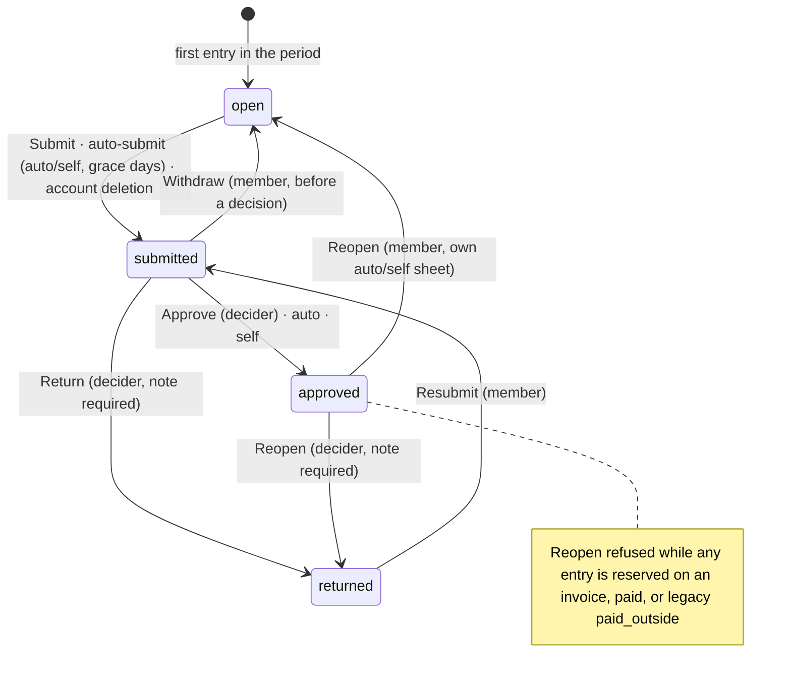

# UX

> **⚠️ Proposed — not built.**

> **Last updated:** 2026-10-02 · **Status:** draft

Time leaves the team pages for one personal **Time** page at a bare `/time` (L27, CHANGE-10), where everyone logs, submits and approves, whatever the time is for. A card is one person's **sheet scope** for one period (L26, CHANGE-2); each entry's **For** tag says who approves it (L57); there are four statuses (L56); approvers who don't log get approver mode, not an empty week (L36); client hours are one identity-free surface (L22, CHANGE-7). Team pages keep Report, Rates, Payouts and pay cut-offs (L14), and every old link redirects. Component paths are under `web/src/`, and `file:n` is a line in that file; L-n, CHANGE-n, D# and E# ids are explained in the [pressure-test log](./pressure-test-log.md).

Part of the [time management proposal](./README.md).

## Personas

The **Time** item sits in the primary sidebar (`components/layout/sidebar/executionNavigation.ts`, Clock icon, after Meetings). It shows when `GET /api/time/me/overview` returns `can_log`, `approvals_waiting > 0`, or a non-empty `workspace_time_admin[]`. Its badge is `approvals_waiting`. Guests get `can_log:false` and a 404 on every time route (L44), so they never see it.

| # | Persona | Lands on | Can do | Empty state and notes |
|---|---|---|---|---|
| P1 | Solo Free owner | `/time`, timer bar and list, no cards ("Just me" has no sheets) | Timer, Add time, edit, delete, presets | "Track time on your tasks. Start a timer from any task, or add time you've already worked." One dismissible owner-only `PlanLimitNotice`: "Timesheets and approvals come with Pro." |
| P1b | Free member, editor on the owner's project (L31) | `/time`, "Just me" | As P1 | **Why?**: "Your workspace's plan doesn't include timesheets; this time is just for you." |
| P2 | Small Pro owner who logs | `/time`, a workspace card ("Acme") | P1 + submit, Waiting for you, workspace policy | Confirm card on first visit (L28). Sole approver: "You're the only one who can approve time here. Your timesheets send and approve themselves 1 day after each week ends, until someone else can approve." Allowed because a workspace sheet carries no cost money (CHANGE-9). |
| P3 | Team member who only logs | `/time`. Pro: the workspace card, entries tagged with the team in **For**. Business team override (Prodigitality's seed): the team card ("Prodigitality Services I…"). | Log, submit, withdraw, fix Returned, ask to reopen, comment | "You log time for Prodigitality Services Inc. Team. Start a timer from a task, or add time." Today's uncurated fallback loggers keep the team option: M1 back-fills their `project_team_members` rows (D16). |
| P4 | Team lead (Business override) | `/time` with a "Waiting for you (N)" pill and section (hidden at N = 0) | P3 + approve, return, bulk approve, reopen; team Report, Rates, Payouts | Their own sheet with rates goes to the workspace admins (L23). |
| P5 | Consultant who approves talent | Approver mode (L36) if nothing logged in 30 days, else normal page + pill | Approve or return, entry detail, "View terms" (web) | "You're all caught up. Timesheets sent to you will show up here." |
| P6 | Talent on a contract | `/time`, entries from every workspace | Log on the agreement chip, submit to the hirer | "When you're placed on a project, you'll be able to log time for it here." Never plan-gated. |
| P7 | Workspace admin who never logs | Approver mode; with nothing waiting, the confirm card then one policy card per `workspace_time_admin[]` item | Edit policy, approve workspace sheets, workspace report (Business) | Never an empty week: "You're all caught up." above the policy cards. |
| P8 | Client party | No sidebar item unless they log elsewhere; Project › Time only when the client level is not `none` (L22) | Read approved **Client hours** | Rows read "Delivery team". Legacy contracts are `none`, so the item is hidden. |
| P9 | Team member with no seat in the team's workspace | As P3/P4 | As P3/P4 | The plan is checked on the context's workspace, never a seat. |
| P10 | Internal viewer or commenter | No timer buttons; `TaskTimerInline.tsx` explains | Read own past entries | "You're a viewer on this project. Ask a project admin for editor access to log time." Prod viewers lose logging (L1). |
| P11 | Accountant (finance-book role) | Finance › team › Time | Team report with costs (`view_costs`) | Not a team manager; the Finance mount stays for them (L55). |
| P12 | Anonymous guest | — | Nothing | API returns 404 (L44). |

## The Time Page

**Route files (CHANGE-10):** `routes/_execution/time/index.tsx` (plus an optional `time/route.tsx` layout with `<Outlet/>`) and `routes/_execution/time/timesheets/$timesheetId.tsx`, following `_execution/engagements/{route,index}.tsx`. A sibling `time.tsx` would become the parent layout of the review route. Both render in the same `_execution` shell as `/meetings` and `/command-center`. Accounts with no workspace (12 of 43 prod profiles) still reach the page.

| Search param | Effect |
|---|---|
| `?for=<kind>:<id>` | Filters to one context (`assignment:<id>`, `team:<id>`, `workspace:<id>`, `personal`) and sets the day strip's timezone and week start |
| `?project=<id>` | Filters to one project. Target of "Your time on this project →". |
| `?week=YYYY-MM-DD` | The view week, so the view can be linked |
| `?entry=<id>` | Opens `TimeEntryDetailModal`. A miss shows "This time entry doesn't exist or you can't open it." (404, CHANGE-17) |
| `#waiting` | Scrolls to Waiting for you |

**Normal mode (desktop):**

```
┌ Time ─────────────────────────────────────────── [⏳ Waiting for you · 3] ┐
│ ● 01:12:44  Fix login bug · Acme Website   For: [Prodigitality Servic… ▾] │ timer bar
│                                                          [❚❚ Pause] [■ Stop]│
│ [▶ Start timer]  [+ Add time]               For: [All ▾]   [List | Month] │
├────────────────────────────────────────────────────────────────────────────┤
│ ‹  Sep 29 – Oct 5, 2026  ›   This week         Your time (Asia/Manila) ⓘ   │
│  Mon    Tue    Wed    Thu      Fri    Sat   Sun      Week                  │
│  6:30   8:10   7:45   9:20 ⚠   3:00   –     –       34:45                  │ day strip
├────────────────────────────────────────────────────────────────────────────┤
│ TIMESHEETS IN THIS WEEK                                                    │
│ ▣ Prodigitality Servic…  Sep 29–Oct 5   28:45   Open · until Oct 5 [Submit]│
│ ▣ Acme Corp · agreement  Sep 22–28       6:00   Returned · "Split Thu" [Fix]│
│ ▣ Acme                   Oct 1–15        4:00   Open · sends itself Oct 17 │
├────────────────────────────────────────────────────────────────────────────┤
│ ▸ Needs review (1)  one entry ran over 10h                                 │
│ Thu Oct 2 ─────────────────────────────────────────────────── 9:20 ⚠ ──────│
│  #  Task              Project      For                In    Out    Dur     │
│  1  Fix login bug     Acme Web     [Prodigitality S…] 09:00 12:30  3:30  ⋯ │
│  2  ◦ Meeting         Acme Web     [Acme Corp 🔒]     13:00 14:00  1:00  ⋯ │
├────────────────────────────────────────────────────────────────────────────┤
│ WAITING FOR YOU (3)                                     [Approve selected] │
│ ☐ Maria Santos   Prodigitality Servic… · Sep 22–28   38:15   2 days ago ⚠1 │
│ ☐ Leo Cruz       Acme Corp · Sep 22–28               12:00   today         │
└────────────────────────────────────────────────────────────────────────────┘
```

**Approver mode** applies when the overview returns `approver_mode: true`: (`approvals_waiting > 0` or the caller is a decider anywhere) **and** 0 entries logged in the last 30 days (L36). The timer bar collapses to one **Start timer** button, and the day strip and list are not rendered. The first logged entry switches back to normal mode on the next overview fetch.

```
┌ Time ─────────────────────────────────────────────────── [▶ Start timer] ┐
│ WAITING FOR YOU (3)                                     [Approve selected]│
│ ☐ Maria Santos   Prodigitality Servic… · Sep 22–28   38:15  2 days ago ⚠1 │
│ ☐ Ana Lim        Acme · Sep 22–28                    40:00  today   ⏱ +2h │
├───────────────────────────────────────────────────────────────────────────┤
│ DECIDED IN THE LAST 30 DAYS                                               │
│ ✓ Maria Santos   Sep 15–21   40:00   Approved by you · Sep 23             │
│ ↩ Leo Cruz       Sep 15–21    9:30   Returned by you · "Add task names"   │
├───────────────────────────────────────────────────────────────────────────┤
│ ┌ Acme · Weekly · starts Monday · Asia/Manila · Approval required ─────┐  │ only when
│ │                                              [Edit time policy]      │  │ nothing waits
│ └──────────────────────────────────────────────────────────────────────┘  │
└───────────────────────────────────────────────────────────────────────────┘
```

**One-time cards, shown above the timer bar:**

| Card | Who | Condition | Copy and action |
|---|---|---|---|
| Policy confirm (L28, CHANGE-11) | Workspace owners and admins | A `workspace_time_admin[]` item has `policy_unconfirmed: true` | Tracking on: "Acme tracks time weekly from Monday in Asia/Manila. [Looks right] [Change]". Tracking off (the Prodigitality seed): "Prodigitality Workspace has workspace time off. People who aren't on a team can only track time for themselves. [Looks right] [Change]". **Looks right** sends `PUT /time/policies/workspaces/:id` with the values shown, taking the timezone from the admin's browser. **Change** opens `/w/<slug>/settings/time`. |
| Legacy grouping (L32) | Loggers | `GET /time/me/timesheets` returns a sheet with `origin='legacy_migration'` | "Your time is now grouped into timesheets. Past weeks were sent for approval for you. [Got it]". Stored in localStorage key `time-legacy-banner-dismissed`, with reads and writes in try/catch. If storage is unavailable, the banner shows again. |

**Day strip and view week (L29):**

| `?for=` | Timezone and week start | Label |
|---|---|---|
| A context | That context's resolved policy (sheet timezone, `week_start`) | "Acme Corp time (America/New_York)", only when it differs from the user's own timezone |
| All (default) | `user_time_preferences` (timezone, `week_start`), falling back to the device timezone and Monday | "Your time (Asia/Manila)", only when a visible card uses another timezone. Tooltip ⓘ: "Timesheets count days in their own timezone." |

- `‹ ›` steps a week and "This week" jumps back. `j`/`k` move between weeks and `t` goes to today.
- A day over 8 h shows ⚠, the same rule as today's live day total. Clicking a day filters the list to it.
- The logging side has no hours-per-cell grid, because entries are intervals and a grid would invent start times. The only grid is on the review screen, read-only.

**Timesheet cards.** There is one card for each sheet that overlaps the view week, labelled by sheet scope (CHANGE-2) from `scope_label_snapshot`:

| `scope_kind` | Web label | Native label |
|---|---|---|
| `workspace` | Workspace name ("Acme") | Same |
| `team` (only with an active Business override) | Team name, cut to 22 characters + "…", with a full-name tooltip | Same |
| `engagement` | Counterparty + " · agreement" ("Acme Corp · agreement") | Counterparty only ("Acme Corp") |

Card states are under [Submit, Return, Reopen](#submit-return-reopen). A card routed `auto` or `self` shows "Open · sends itself <date>", where the date is period end + `max(reminder_days,1)` days (L33).

**Pieces to reuse:**

| Piece | Reuses | Change |
|---|---|---|
| Day table | `components/team-time/TeamMyLogsList.tsx`, as the uncommitted edit leaves it: day groups, `REVIEW_GROUP_KEY`, `accentClass`, `useVisibleColumns` (`:113-132`), the skeleton, `.time-row-in` in `styles.css` | Add a **For** column, folded into the task cell below `lg`. The accent bar shows sheet status. Rows lock when the sheet is Submitted or Approved, or the entry is paid, billed or legacy (CHANGE-14). |
| Month view | `calendar/TimeLogCalendar.tsx`, `DayLogsModal.tsx`, `TimeViewToggle.tsx` | The localStorage scope becomes `me` |
| Entry detail | `TimeLogDetailModal.tsx`, renamed `TimeEntryDetailModal` | Drop the `teamId`/`primaryTeamId` dependency. Legacy markers show here only (L56). |
| Timer and forms | `useActiveTimer.ts`, `TeamTimeModals.tsx` (2067 lines), `useTimeTaskCreation.ts` | Add the For step and presets. Query prefix becomes `["time", …]`. Fold `["team",id]` and `["teams","detail",id]` into one key. |
| Hour warnings | `HourCapBanner.tsx` | Fed from the context policy and the governing engagement's limit (L12) |
| Periods | `log-period.ts`, `TeamLogsPeriodFilter.tsx` | Week navigation only. The cut-off UI stays in team settings (L14). |
| Service and types | `services/team-time.service.ts` (698 lines) | Becomes `services/time.service.ts`. `TaskTimeLog` becomes `TimeEntry`. |

**Timer:**

| Behaviour | Rule |
|---|---|
| Picker order | Project → Task (search, inline create through `useTimeTaskCreation`) or a preset → **For**. Only projects where the caller has `time.log` and at least one option are listed (CHANGE-1, CHANGE-12). The default is the most recently logged project. The For step follows the [For chip](#for-chip) rules. |
| Switching | Starting while a timer runs asks "Stop *Fix login bug* (1:12) and start this?" with **Switch**. There are never two timers. |
| Locked period | "This week's Prodigitality timesheet is submitted. Withdraw it to add time." with an inline **Withdraw** (`TIMESHEET_LOCKED {reason: period}`) |
| Pause and resume | Keep today's optimistic segments |
| Long timers (CHANGE-22) | At 10 h the row joins Needs review and `timer_running_long` is sent. At 24 h the cron stops it: "Stopped automatically after 24 hours. Check the end time." When an assignment or engagement ends: "Stopped when your agreement with Acme ended." |

**Quick add:** `[ Task or preset ▾ ] [ 1:30 ] [ Yesterday ▾ ] [For: Prodigitality S… ▾] [Add]   More options →`

- The duration accepts `1:30`, `90m` or `1.5h`. The start defaults to the end of that day's last entry, or 09:00 in the context's timezone.
- **More options** opens `ManualLogModal` for exact in and out times and breaks.
- A disabled control gives its reason inline: "Manual time is off in your agreement with Acme." (`MANUAL_ENTRIES_DISABLED`) or "Prodigitality accepts time up to 7 days back." (`RETROACTIVE_WINDOW`).

### For Chip

| Options on this project (after CHANGE-12 step 7) | Behaviour |
|---|---|
| 0 | The project is absent from the picker and task timer buttons are not rendered. `TaskTimerInline.tsx` shows "You can't log time on this project" with a **Why?** popover. |
| 1, or several sharing a sheet scope and rate source | Picked automatically, never asked. The chip shows read-only, with "Only option on this project" or "Same approver and rate either way". |
| 2+ differing in sheet scope or rate source (in practice, two agreements) | **First time:** a radio list, agreements first, with "Use for new time on this project" ticked (sends `PUT logging-for`). **Afterwards:** the remembered option is preselected but never applied silently (L38). The primary button names it ("Start for Acme Corp" / "Add for Acme Corp"), so one tap confirms. `TaskTimerButton` opens this popover instead of starting at once. |

**Unavailable options** (`unavailable[]`) are greyed in the chip menu with a reason. A curated team that is unavailable still blocks the workspace option (L34), so its members see "Just me", never the workspace name.

| `unavailable` reason | Copy |
|---|---|
| `team_time_off` | "Prodigitality has time tracking off for this team." |
| `plan` | "Prodigitality's plan doesn't include timesheets." |
| `contract_disabled` | "Time tracking is off in your agreement with Acme." |
| `engagement_inactive` | "Your agreement with Acme has ended." |
| `no_settings` | "Your agreement with Acme has no time terms for this date." |

**Why? reasons** when there are 0 options:

| Cause | Copy |
|---|---|
| No `time.log` (viewer or commenter) | "You're a viewer on this project. Ask a project admin for editor access to log time." |
| `required` agreement terms and no assignment | "Time on this project is logged under an agreement, and you aren't on one." |
| Guest | Never rendered |

**Chip details:**

| Item | Rule |
|---|---|
| Icons | Team: `Users` + team name. Workspace: `Building` + workspace name. Agreement: `Briefcase` + counterparty, with no "contract" wording on native (`contractBannerText.ts`). Just me: `User` + "Just me". |
| Workspace tag (L57) | A grey tag with the project's workspace name, shown only when the project's workspace differs from the context's `policy_workspace_id` (as with cross-workspace teams). This rule is for the chip only. Approval rows and dashboard rows instead tag the sheet's policy workspace when it differs from the viewer's current workspace (E27). |
| Label length | Cut from real data: chips at 22 characters, cards at 32, each + "…" with a full-label tooltip |
| Locked chip | 🔒 "Submitted Oct 6. Withdraw to change." |
| Bulk "Change For…" | Works on selected rows whose current and target sheets are both Open or Returned (L2). A change *into* an agreement skips entries logged before it, with the rows disabled: "Logged before this agreement started on Sep 15." (L58). The dialog says "Rates are re-estimated for the new choice." |

**"Who approves this time" popover**, opened from any chip:

```
Who approves this time
Goes to: Prodigitality Services Inc. Team's owners and admins
Timesheet: weekly · starts Monday · Asia/Manila
Rules: set by Prodigitality Services Inc. Team (team override)
Manual time up to 7 days back · No rounding
```

Each line carries its `source` (`default | workspace | team | contract | member`). For an agreement it reads "Set by your agreement with Acme Corp" and links "View terms →" (web only).

**Presets:** "Not on a task" offers Meeting · Review · Admin · Other (`work_item`). The workspace policy can hide individual presets. Preset rows show ◦. "From a meeting" comes later.

**Mobile (< 640 px):** the timer bar is a sticky top card (a single "Start timer" pill in approver mode). The day strip becomes 7 horizontally scrolling chips with the timezone label below. Cards stack. `useVisibleColumns` cuts the table to Task + Dur, folding project, in time and For into the task cell. A FAB opens Start timer / Add time. Waiting for you becomes full-width rows linking to the review screen, and bulk approve stays.

## Submit, Return, Reopen



**Status words (L56, CHANGE-15).** There are four states; everything else is a sublabel or a badge.

| Status | Sublabels | Rows |
|---|---|---|
| **Open** | "until Oct 5" (before the last day) · "sends itself Oct 6" (`auto`/`self`) · "overdue" (past period end, manual routing) · "Reopened by you" (member reopen of an own `auto`/`self` sheet) | Editable |
| **Submitted** | "Waiting on Ana Reyes" / "Waiting on Acme's owners and admins" · "Imported from per-entry review" (`submission_kind='legacy'`) · "Sent automatically Oct 6" (`auto`) · "Sent when the account was closed" (`on_deletion`) · "No one else can approve this. Add a workspace admin." (no eligible decider, L23) | Locked |
| **Returned** | "Returned by Ana · 'Split Thursday'" · "Reopened by Ana · '…'" | Editable; the button becomes **Resubmit** |
| **Approved** | "Confirmed" (client-engagement sheet, `approver_scope='auto'`) · "Self-approved" (`decision_kind='self'`) · "Overtime approved" (`overtime_approved`) · "Imported" (`decision_kind='legacy'`) | Locked |

| Entry badge | Shown when | Where |
|---|---|---|
| **Paid** | `payout_id IS NOT NULL` | Row and detail, web and native |
| **Billed** | An `invoice_time_entries` row exists | Row and detail, web only, for cost viewers |
| "Paid outside Proyekto" | `legacy_status='paid_outside'` (the 4 legacy entries) | Entry detail only |
| "Not approved (legacy)" | `legacy_status='rejected'` (the 1 legacy entry, D12) | Entry detail only; counts 0 payable |

The accent bar uses theme tokens, never hex: grey for Submitted, green for Approved, amber for Returned, blue for the Paid badge. Locked rows keep only "View details" and "Comment" in "⋯", and their hover quick actions are hidden.

**Submit flow:**

1. A card shows **Submit** from the last day of its period ("Open · until Oct 5" before that). `auto` and `self` cards also show Submit, so a member can send early.
2. The **Submit sheet** shows per-day totals in the sheet's timezone, who it goes to (table below), **blockers** (a timer running inside the period), and **acknowledged warnings** the member ticks to continue: Needs-review entries, days over 8 h, entries added after the day, and over-limit hours. Example: "Your agreement with Acme allows 40h a week. You logged 43h 30m. The 3h 30m over needs Ana's approval." The limit sums every linked project of the governing engagement (L12).
3. Rows lock on submit. Toast: "Sent to Prodigitality Services Inc. Team for approval." (or "Approved · 38:15" for `auto`/`self`).
4. **Withdraw** works until a decision and clears the deciders' notification.
5. **Reminders and auto-submit (L33):** `timesheet_reminder` goes out `reminder_days` (default 1) after period end. The cron submits `auto` and `self` sheets at the same point unless one holds a running entry. The welcome line keeps its "Submit last week" nudge.

| `approver_scope` | "Goes to" copy |
|---|---|
| `team` | "Goes to Prodigitality Services Inc. Team's owners and admins" |
| `workspace` | "Goes to Acme's workspace owners and admins" |
| `hirer` | "Goes to Ana Reyes" |
| `auto` (client engagement) | "Submitting confirms these hours for your agreement with Acme Corp." |
| `self` | "You're the only approver here, so this approves itself." |
| None eligible | "No one else can approve this. Add a workspace admin." (it stays Submitted) |

**Returned:** the card turns amber with the note. **Fix** filters the list to that sheet and unlocks the rows. The note stays in the history.

**Reopen:**

| Case | Who | How | Native copy |
|---|---|---|---|
| Approved, routed `team`/`workspace`/`hirer` | Decider | **Reopen** with a required note; the sheet goes to Returned | Same |
| Approved, routed `auto`/`self` | The member (L33) | **Reopen** with an optional note; the sheet goes to Open, "Reopened by you" (event `reopened`) | Same |
| Approved, routed to someone else | Member | **Ask to reopen** with a note to the deciders (`timesheet_reopen_requested`) | Same |
| An entry is in a payout | Nobody | "This timesheet is in payout #12. Void the payout to reopen." | "This time has already been paid. Reopen it on the web." |
| An entry is reserved on a draft invoice | Nobody | "These hours are on draft invoice INV-0042. Remove them from the draft to reopen." | "This time is already being billed. Reopen it on the web." |
| An entry is on an issued invoice | Nobody | "Billed on invoice INV-0042. Void it without a replacement to reopen." | As the draft-invoice row |
| A legacy `paid_outside` entry | Nobody | "Includes time paid outside Proyekto, so it can't be reopened." | Same |

Every refused case comes from `TIMESHEET_HAS_SETTLED_ENTRIES` (L6). A `rejected` legacy entry does not block reopen (L48).

## Approvals

Approvals happen on the Time page, in "Waiting for you" or approver mode. `/inbox` stays DM chat. Approvers arrive through the sidebar badge, the dashboard card, notifications (which link to `/time/timesheets/<id>`), and the `timesheets_imported` digest (which links to `/time#waiting`).

**Review screen** at `/time/timesheets/<id>`. The submitter, the decider and a team manager who can view (`can_view_timesheet`) share the URL. Anyone else gets a 404 card: "This timesheet doesn't exist or you can't open it."

```
← Time
Maria Santos · Prodigitality Services Inc. Team · Sep 22 – 28, 2026 (Asia/Manila)
Submitted Sep 29, 10:14 · 38:15 · 3 projects                [Return…] [Approve…]
Rules at submit: weekly · team owners & admins approve · manual time up to 7 days back
┌──────────────────────────┬─────┬─────┬─────┬──────┬─────┬────┬────┬───────┐
│                          │ Mon │ Tue │ Wed │ Thu  │ Fri │ Sat│ Sun│ Total │
│ Acme Website             │ 4:00│ 6:30│ 5:15│ 8:10⚠│ 3:00│    │    │ 26:55 │
│ Internal ops             │ 2:00│ 1:30│ 2:00│ 3:30 │     │    │    │  9:00 │
│ Projects you can't open  │ 1:00│     │ 0:20│      │ 1:00│    │    │  2:20 │
│ Total                    │ 7:00│ 8:00│ 7:35│11:40⚠│ 4:00│    │    │ 38:15 │
└──────────────────────────┴─────┴─────┴─────┴──────┴─────┴────┴────┴───────┘
⚠ Thu is 11h 40m · 1 entry over 10h · 2 entries added later        [Show flagged]
⏱ Weekly limit 40h (Prodigitality) · 38:15 logged · within limit
Estimated cost: PHP 6,885.00 · USD 120.00 (final at approval)   ← cost viewers only
Entries ▾  (grouped table, read-only; a row opens TimeEntryDetailModal)
History: Imported from per-entry review Sep 29 · Returned Sep 30 "Split Thu" · Resubmitted Oct 1
```

| Element | Rule |
|---|---|
| Header line 2 | "Submitted …" follows `submission_kind`: Imported, Sent automatically, or Sent when the account was closed |
| Rules line | From `policy_snapshot`, written at submit (L40). For an agreement: "Rules from your agreement with Acme Corp · [View terms →]" (web only). |
| Grid redaction (L21, CHANGE-8) | A reader without `access.time` on a project sees its hours merged into "Projects you can't open". Their entries list shows only interval, duration and work-item kind; task title and note read "A project you can't open". Under Axis 7 a decider never sees another person's email. |
| Cell click | Filters entries to that project and day; merged cells filter to the merged rows |
| Amounts (L64) | "Estimated cost" per currency before approval, "Amount at approval" after. Only when `costVisible`. Never on native for agreement sheets. Never to client-side admins. |
| Over the limit (L12) | Adds the panel below. Rounding happens per entry first, then the cap. Ticking sends `approve_overtime: true` and sets "Overtime approved". |
| Approve… | Dialog with an optional note (and the overtime box when it applies). Toast: "Approved · 38:15 frozen". |
| Return… | Note required. Placeholder "What should Maria change?"; button **Return to Maria**. |
| Submitter's view | Withdraw (while Submitted), Reopen (own `auto`/`self` sheet) or Ask to reopen, in place of the decision buttons |
| Stale revision | "Maria changed this timesheet while you were looking. [Review the latest]" (`STALE_REVISION`, using `expected_revision`) |
| Entry comments | Reuse the `TimeLogDetailModal` thread. Comments never unlock anything. |
| Mobile | Stacked day cards with per-project lines, and a sticky bottom bar `[Return] [Approve]` |

```
⏱ Weekly limit 40h in the agreement with Acme Corp · 43:30 logged · 3:30 over
   ☐ Approve the 3h 30m over the limit
   Left unticked, 40:00 is approved for payment; the extra time stays on record.
```

**Bulk approve:**

- Waiting-for-you rows have checkboxes, and **Approve selected** stays visible.
- Flagged sheets can't be selected ("Has flags. Open it to review."), nor can over-limit sheets ("Over the limit. Open it to decide the overtime.").
- There is no bulk Return, because every return needs its own note.
- `approve-bulk` is all-or-nothing (L24). On failure: "Nothing was approved: Leo Cruz's timesheet changed. [Review]".
- The per-member grouping and floating bar come from `components/team-time/TeamApprovalsInbox.tsx` (843 lines), rebuilt around timesheets.
- **Retired:** per-entry review and `TeamLogsStatusTabs`; the dead `TeamApprovalsGrid.tsx` (1253 lines), `CellSelectionScoreboard.tsx`, `useTableCellSelection.ts` and the comment in `RowActionsMenu.tsx:19`; the unused `hasAnyActiveRate` in `routes/w/$workspaceSlug/teams/$teamId/time/index.tsx`.

**Dashboard card** in the `leadContent` slot of `components/home/DashboardWidgets.tsx` (prop at `:46-49`, rendered at `:232`). It shows when N > 0, is **not filtered by workspace**, and tags a row with the sheet's policy workspace when that differs from the dashboard's workspace. It needs a fixture in `lib/tours/demo/dashboardDemoDataset.ts`.

```
┌ Waiting for your approval · 3 ──────────────────────────── Review all → ┐
│ (MS) Maria Santos   Prodigitality Servic… · Sep 22–28   38:15  2 days ago│
│ (LC) Leo Cruz       Acme Corp · Sep 22–28   [Pixel]     12:00  today     │
│ +1 more                                                                  │
└──────────────────────────────────────────────────────────────────────────┘
```

The welcome line (`DashboardWidgets.tsx:263-282`, after the meeting fragment) adds "· 3 timesheets waiting" (deciders, linking to `/time#waiting`) and "· Submit last week (28h 45m)" (loggers with an overdue Open sheet not routed `auto`/`self`, linking to `/time?week=<period_start>`).

## Settings

### Workspace Time Policy

`/w/<slug>/settings/time` (`routes/w/$workspaceSlug/settings/time.tsx`). Add a **Time** item (Clock icon) between Members and Usage in `components/workspace/settings/workspaceSettingsNavigation.ts`, and update `workspaceSettingsNavigation.test.ts`. Owners and admins edit; members read.

```
Time policy · Acme                                       [Policy | Report]
Time on workspace projects  [● On]  People on Acme projects who aren't on a team log for "Acme"
Timesheet period            (•) Weekly  ( ) Every two weeks  ( ) Twice a month (1–15, 16–end)  ( ) Monthly
Week starts on              [Monday ▾]
Timezone                    [Asia/Manila ▾]  Detected from your browser · Days and periods are counted in this timezone
Approval                    [● Required]  Approvers: workspace owners and admins
                            Custom approval chains: Enterprise
Manual time                 [● Allowed]  up to [7] days back (0 = no limit)
Rounding                    [None ▾]  (5, 6, 10, 15 or 30 min · nearest, ties round up)
Reminder                    Remind people to submit [1] day(s) after a period ends (1–14)
Presets                     ☑ Meeting ☑ Review ☑ Admin ☑ Other
History                     Changed by Ana Reyes, Oct 2: period weekly → semi-monthly   [Show all]
```

| Topic | Rule |
|---|---|
| Defaults (CHANGE-11) | Weekly, Monday, approval required, manual allowed, no rounding, reminder 1 day, tracking on when the plan has `time_tracking`. Before a row exists the page shows these with the editor's browser timezone; the first save materialises the row. "Detected from your browser" shows only until then. |
| Free | Controls sit behind a card `PlanLimitNotice` for `time_tracking`. Timezone and week start stay editable. "Everyone can still track time just for themselves." stays. |
| Period, timezone or week-start change | Applies from the next period start: "Applies from Mon Oct 6. Open timesheets keep their dates." (L40) |
| Rounding | Nearest increment, ties up (CHANGE-23), pending D14. If D14 picks "up", only the hint text changes. |
| History | Reads `time_policy_events` (L23) |
| Report tab | `?tab=report` is the workspace `TimeReport` ([Reports](#reports)); `PlanLimitNotice` without `time_reports_export` |

### Team Override

Extends `routes/w/$workspaceSlug/teams/$teamId/settings/time.tsx` (576 lines).

```
Time · Prodigitality Services Inc. Team
Time tracking        [● On]   Members log time for this team on attached projects
── Team rules (Business) ─────────────────────────────────────────────────
Approvers            ( ) Workspace owners and admins   (•) This team's owners and admins
Timesheet period     Use Prodigitality Workspace's policy (Weekly · Mon · Asia/Manila)   [Override]
Manual time          Use workspace policy (allowed)                                       [Override]
Retroactive window   Use workspace policy (no limit)                                      [Override]
Rounding             Use workspace policy (none)                                          [Override]
Approval             [● Required]  Stays on while member rates are on
── Money ─────────────────────────────────────────────────────────────────
Member rates         [○ Off]
Payouts              [○ Off]   (under member rates)
Billing and pay cut-offs   PayPeriodSettingsCard
```

| Topic | Rule |
|---|---|
| Inheritance | Inherited rows are muted, "Use <workspace>'s policy (…)". An overridden row reads "Override for this team". |
| Approval with member rates (L23) | The switch is disabled. A write turning it off is refused with `TEAM_RATES_REQUIRE_APPROVAL`: "Approval stays on while member rates are on." |
| Without Business | Team rules sit behind an inline `PlanLimitNotice` (`time_team_rules`). Stored overrides are kept: "Saved rules apply again when Acme is on Business." Payouts sit behind `time_payouts`. |
| Billing and pay cut-offs (L14) | Stay here, renamed from the pay-period card. Editable by the team owner when the team's workspace has `time_billable_invoices` or `time_payouts`; otherwise read-only with a `PlanLimitNotice`. |
| Retroactive window | Becomes an override row. `teams.retroactive_log_days` is dropped in M5. |
| Removed (C12) | The `contract_enforcement` dial and `engagements/finance/team/$teamId/addons.tsx:64,147-152` |
| Team time off | "Members can't log for this team while time is off. They can still track time just for themselves." (L34) |

### Agreement Terms

Read-only. They appear in the For popover, the review-screen rules line and Project settings › Time. Period, timezone and week start come from the new nullable `engagement_time_settings` columns, falling back to the policy of the engagement's policy workspace (`policyWorkspaceFor`: the activating contract's workspace, else the hirer party team's workspace, else the platform default), never the project's workspace.

```
Terms from your agreement with Acme Corp
Approval: Ana Reyes approves · Manual time: allowed · Rounding: 15 min
Weekly limit: 40h · Period: weekly, Monday, Asia/Manila · Client sees: summary
These come from the signed terms and override team and workspace rules.
[View terms →]   (web only)
```

### Project Surfaces

| Surface | Change |
|---|---|
| Project settings › Time (`routes/_execution/project/$projectId/settings/time.tsx`, 372 lines) | **"Who can log time here"** gives a reason per person ("Maria (Prodigitality Services Inc. Team)", "You (editor · just you)"). Assignment workers ("Leo (agreement with Pixel Studio)") are listed **only** for provider-side parties (L22). It ends "Viewers and commenters can't log time." **"Client sees"** shows the agreement's `client_hours_detail_level`, read-only. The "Block logging past a limit" switch (`:352`) stays, relabelled "Block time past a limit (otherwise people just get a warning)"; `HOUR_CAP_EXCEEDED` fires only when it is on. `RateBudgetCalculator.tsx` stays. |
| Project people | `components/project/people/AttachTeamDialog.tsx` adds the consent line (L21): "Time this team logs here is approved in <team workspace>. Approvers who can't open this project see hours only." In `PersonRow.tsx`, a member who is the worker of an assignment on this project, under an engagement where the viewer is not a provider-side party, reads **"Delivery team member"** (L22, E35). The mask is keyed on the assignment, never on `project_access.origin`: that table holds one row per (project, user), and `origin` is only a descriptive label. |
| Permission catalog (`components/project/permissions/permissionCatalog.ts`) | Add `time.log`, "Log time" ("Start timers and add time on this project."), granted at editor and above and requiring `access.time`. Reword `access.time` (`:82-84`) to "See time on this project." and `time.view_team_logs` (`:352-356`) to "See everyone's time on this project, not just your own." |
| Engagement page (`routes/_execution/engagements/$engagementId.tsx`, web only) | **"Assign to project"** asks "Which client agreement is this work for?" when more than one client agreement qualifies (`ASSIGNMENT_CLIENT_ENGAGEMENT_REQUIRED`), and with `access_needed: true` adds "Ask a project admin to add Leo." (L25). **"End assignment"** warns "Ending this stops Leo's running timer at the end time." (L37) |
| Account deletion (`/settings/delete-account`) | Adds "Your open timesheets will be sent for approval when you delete your account." Preflight refusals: `TEAM_HAS_OPEN_TIME` ("Prodigitality Services Inc. Team still has timesheets waiting or time that hasn't been paid. Finish them first.") and `WORKSPACE_HAS_OPEN_TIME` (the same with the workspace name). |

## Reports

One `TimeReport` component, built from `TeamLogsPanel` parts (filters, `TeamLogsStatsCard`, export).

| Aspect | Rule |
|---|---|
| Filters | Range (in the scope's policy timezone), person, project, For, status |
| Group by | Person, project, task, day, week |
| Totals (L11, CHANGE-5) | **Approved** sums `payable_seconds`. **Not yet approved** sums the duration of entries with no `payable_seconds`, shown separately and never added to Approved or money. **Billable** is approved hours of billable work types. **Cost** sums `amount_snapshot`, for cost viewers only. |
| Export | `/time/reports/export` (Business, `time_reports_export`) uses the screen's authority query and column gating (L45): `rate_snapshot` and `amount_snapshot` only when `costVisible`; note, project and task titles per L21; assignment identity per L22. |

| Mount | Route | Scope | Who | Cost | Identity |
|---|---|---|---|---|---|
| Team › Time | `/w/<slug>/teams/<t>/time`, sub-nav **Report · Rates · Payouts** | `context_kind='team'` entries for t, plus an hours-only **"Under agreements"** section for assignments whose `team_id` is t (L35) | Team managers (`can_manage_team`) | When member rates are on | Named. In "Under agreements", only provider-side managers see names; others see "Delivery team". |
| Project › Time · Everyone | `routes/_execution/project/$projectId/time.tsx` `?view=everyone` | Every governed context on the project, in sections ("Prodigitality Services… · team", "Acme · workspace", "Acme Corp · agreement") | `time.view_team_logs` | That context's deciders or `view_costs`; **never client-side admins** | Assignment rows named for provider-side parties only, else "Delivery team". Personal entries never appear. |
| Project › Time · Client hours | Same route, `?view=client` | Approved hours per agreement at the engagement's `client_hours_detail_level` | Client party, when the level is not `none` | Never | Never: always "Delivery team" |
| Finance › team › Time | `/engagements/finance/team/<t>/time-logs` (tab renamed "Time" in `TeamFinanceChrome.tsx:40,70,236-238`) | As Team › Time | Finance-book roles | `view_costs` | As Team › Time |
| Workspace report | `/w/<slug>/settings/time?tab=report` | Sheets whose `policy_workspace_id` is W | W owners and admins with `time_reports_export` | `view_costs` | Named; project, task and note follow L21 redaction |
| Engagement › Time | `/engagements/<id>` section (web only) | `scope=engagement:<id>` | Parties to the engagement | Hirer: its own talent engagement only (L22) | Provider-side parties |

**Project › Time page:**

```
Time · Acme Website                                   Your time on this project →
[Everyone] [Client hours]     Sep 1 – 30 ▾   Person ▾   For ▾   Status ▾   [Export]
PRODIGITALITY SERVICES… · team        Approved 120:30 · Not yet approved 14:00 · PHP 54,225.00
  Maria Santos   62:15   …
DELIVERY TEAM · agreement with Acme Corp            Approved 38:00   (hours only)
```

| Change | Detail |
|---|---|
| "Mine" replaced (L55) | By the link "Your time on this project →" to `/time?project=<id>` |
| `primaryTeamId` removed (`time.tsx:160-163`, `:943-960`) | The raw `href="/teams/${primaryTeamId}/time/payouts"` (`:627`) becomes a `toWorkspacePath` link inside each team section; `PayMemberModal` opens per team section |
| Nav and route gate (L22) | `components/project/projectNavItems.ts:212-219` is relabelled "Time" and shown when `time.log` OR `time.view_team_logs` OR `time_client_hours_level ≠ none`, all read from `GET /api/projects/:id/my-permissions`. The route uses the same composite, replacing `RequireProjectAccess access="time"`. A user with only `time.log` lands on a link card: "Your time on this project lives in Time. [Open →]" |
| Empty state (replaces "No team is attached…" at `:638-642`) | "No time on this project yet. Editors and above can track time here.", linking to Settings › Time "Who can log time here" |
| Contract-enforcement banner (`:143-151`, `:971-990`) | Removed with C12 |
| Client hours view | **summary:** hours by week per agreement. **detailed:** date, task and hours per entry. Never notes, identity, cost or rate. |

## Routes and Redirects

New route files (CHANGE-10):

| Route file | Path |
|---|---|
| `routes/_execution/time/index.tsx` (+ optional `routes/_execution/time/route.tsx` layout with `<Outlet/>`) | `/time` |
| `routes/_execution/time/timesheets/$timesheetId.tsx` | `/time/timesheets/<id>` |
| `routes/w/$workspaceSlug/settings/time.tsx` | `/w/<slug>/settings/time[?tab=report]` |
| `routes/w/$workspaceSlug/teams/$teamId/time/route.tsx` (rebuilt) | `/w/<slug>/teams/<t>/time`, sub-nav Report · Rates · Payouts |

**Redirect map.** Old links keep working; nothing returns 404.

| Old | Who | New |
|---|---|---|
| `/w/:s/teams/:t/time` (index) | Team manager | Renders the Report in place (`index.tsx` stops redirecting) |
| `/w/:s/teams/:t/time` (index) | Member | `/time?for=team:<t>` |
| `/w/:s/teams/:t/time` (index) | Neither | The no-access reason card (today's `route.tsx:131-157`) |
| `…/time/my-logs` | Anyone | `/time?for=team:<t>`; `?member=`, `?preset/from/to` dropped |
| `…/time/my-logs?log=X` | Anyone | `/time?for=team:<t>&entry=X` |
| `…/time/team-logs?log=X` | Anyone | `/time/timesheets/<sheet holding X>` when `can_view_timesheet`, else `/time?entry=X` (a 404 card if not their own) |
| `…/time/team-logs?member=U` | Team manager | `/w/:s/teams/:t/time?person=U` (the Report) |
| `…/time/team-logs` (no params; the stored approval links, `teamTimePath(…,'team-logs')` at `team-time.service.ts:1973`) | Decider | `/time#waiting` |
| `…/time/team-logs` (no params) | Others | `/time` |
| `…/time/log/:id` | Anyone | `/time?entry=:id` |
| `…/time/manage-rates[/:u]` | Team manager | Unchanged, under the Rates sub-nav |
| `…/time/payouts` | Team manager | Unchanged, under the Payouts sub-nav |
| Bare `/teams/:t/time/**` shells (`routes/_execution/teams/$teamId/time/*`) | Anyone | Kept. They forward through `routes/_execution/teams/$teamId.tsx:10-40` to the slugged path, then the rows above. Push links still write these (`lib/pushLink.test.ts:17`). |
| Bare `/teams/:t/settings/time` | Anyone | Kept; forwards to `/w/:s/teams/:t/settings/time` |
| `/project/:p/time?view=team` | Anyone | `?view=everyone` |
| `/project/:p/time?view=mine` (or no view, for a user with only `time.log`) | Anyone | `/time?project=<p>` |
| `/engagements/finance/team/:t/time-logs` | Finance-book roles | Same path; the body becomes `TimeReport` |

There are no new forwarding shells. `/time` is **not** added to `toWorkspacePath` (`lib/workspacePaths.ts:51-78`), which keeps `/teams/me`-style personal pages bare. `legacyRoutePaths.ts` needs no entries, because the route shells are the mechanism.

## Chrome

| File | Change | Test |
|---|---|---|
| `components/layout/sidebar/executionNavigation.ts` | Add `{key:"time", to:"/time", label:"Time", icon:Clock, match:"prefix"}` after `meetings`. `SidebarContent` drops it unless the overview allows it and badges it with `approvals_waiting`. | Navigation test |
| `components/layout/Header.tsx` `validPaths` (`:17-44`) | Add `"/time"` | — |
| `components/team-time/FloatingActiveTimer.tsx` | It is an allowlist (`TIMER_VISIBLE_PATH_PREFIXES`, `:16-23`, matched after `stripWorkspacePrefix`, `:68-69`). Add `/meetings`, `/task-board` and `/notifications`. **Do not add** `/work-items` (it only redirects) or `/time` (that page has its own bar); no exclusion is needed, and Timeline pages keep the timer through `/project` (E80). The "My Logs" link (`:234-241`, team-only today) becomes **"Open in Time"** → `/time?entry=<id>` for every context. | New unit test for `shouldShowOnPath` |
| `components/layout/sidebar/TeamSidebarGroup.tsx:57-67` | "Time" for team managers when team time is on, linking to the Report. Members see no team Time item. | — |
| `components/team/overview/TeamPropertiesPanel.tsx:121-124` | Managers → the Report (`toWorkspacePath`); members → `/time?for=team:<id>` | — |
| `components/workspace/settings/workspaceSettingsNavigation.ts` | Add a Time item | `workspaceSettingsNavigation.test.ts` |
| `components/project/projectNavItems.ts:212-219` | Label "Time"; composite gate (L22) | `projectNavItems.test.ts:26-36` |
| `components/finance/team/TeamFinanceChrome.tsx:40,70,236-238` | Tab label "Time" (id stays `time-logs`) | `TeamFinanceChrome.test.tsx` |
| `api/axios.ts:117-126` | Keep the `/api/team-time` 403-silencing rule while the alias lives. New picker endpoints never 403; they return `options: []`. | `api/axios.test.ts:100` |
| `routes/_execution/workspaceRedirectStubs.test.ts:173-175` | Cases for the redirect map | — |
| `lib/pushLink.test.ts` | Add `/time/timesheets/x` and `/time?entry=x` (both returned unchanged) | — |

Every refusal on these pages renders a reason card, so a refusal never looks like an empty page. A 404 renders "doesn't exist or you can't open it".

## Notifications

Bell and list labels go in `components/layout/NotificationBell.tsx:24-30` and `routes/notifications.tsx:46-105`. Push titles go in `backend/src/modules/shared/push/notification-push.ts:29-33`. No message carries an amount (CHANGE-19).

| Type | Bell / list label | Push title | Body (`content.message`) | `link_url` |
|---|---|---|---|---|
| `timesheet_submitted` | Timesheet to review | Same | "Maria sent 38h 15m for Prodigitality Services Inc. Team · Sep 22–28" | `/time/timesheets/<id>` |
| `timesheet_returned` | Timesheet returned | Same | "Ana returned Sep 22–28: 'Split Thursday'" | `/time/timesheets/<id>` |
| `timesheet_approved` | Timesheet approved | Same | "Ana approved Sep 22–28 (38h 15m)" | `/time/timesheets/<id>` |
| `timesheet_reopened` | Timesheet reopened | Same | "Ana reopened Sep 22–28: '<note>'" | `/time/timesheets/<id>` |
| `timesheet_reopen_requested` | Reopen requested | Same | "Maria asked to reopen Sep 22–28" | `/time/timesheets/<id>` |
| `timesheet_reminder` | Time to submit | Same | "Your Prodigitality Services Inc. Team timesheet for Sep 22–28 is ready" (`auto`/`self`: "…sends itself tomorrow") | `/time/timesheets/<id>` |
| `timer_running_long` | Timer still running | Same | "Fix login bug has run 10 hours" | `/time?entry=<id>` |
| `timer_auto_stopped` | Timer stopped | Same | "Your timer on Fix login bug was stopped after 24 hours. Check the end time." / "…stopped when your agreement with Acme Corp ended." | `/time?entry=<id>` |
| `time_payout_recorded` | Payment recorded | Same | "A payment was recorded for your time" | `/time` |
| `timesheets_imported` | Timesheets moved | Timesheets waiting | "32 timesheets moved from per-entry review are waiting" | `/time#waiting` |
| `time_log_comment_added` (kept) | New comment on your time | Same | "Ana commented on Fix login bug" | `/time?entry=<id>` |
| Historical `time_log_approval_requested`, `_approved`, `_rejected`, `_pending`, `_day_rejected` | Today's label prefixed "(older)" | Titles added for these types | Unchanged | Through the redirect map |

- Delete the phantom push titles `time_log_marked_paid` and `time_log_marked_rejected` (`notification-push.ts:30-31`).
- Email goes out for `submitted` (60-minute delay), `returned`, `reminder` and `time_payout_recorded`. Each needs a `notification-email-registry.ts` entry and its parity spec.
- Recipients whose profile is tombstoned get nothing (CHANGE-20).

## Mobile

`lib/platformSurfaces.ts` is default-deny.

| Rule | Where | Why |
|---|---|---|
| `["/time","app"]` | `app` block | Covers `/time` and `/time/timesheets/<id>` |
| `["/teams/*/time/payouts","silent"]` | Before `["/teams","app"]` (`platformSurfaces.ts:121`) | Payouts are money surfaces (L54) |
| `["/teams/*/time/manage-rates","silent"]` | Before `["/teams","app"]` | Rates are money surfaces |
| (existing) `["/settings","app"]` | — | Covers `/w/<slug>/settings/time`; `/settings/usage` and `/settings/billing` stay `commerce` |
| (existing) `["/engagements","marketplace"]` | — | Finance › team › Time and the engagement page stay hidden |

- **Matcher change (L54):** `isUnder` (`:134-136`) becomes a segment matcher in which `*` matches exactly one segment. Rules stay longest-first, so the wildcard rules come before `/teams`. Update `platformSurfaces.test.ts` (`:92-98` cover the team-time paths) and the snapshot.
- **Team sub-nav on native** shows **Report** only; `filterNavByPlatform` drops Rates and Payouts.
- **Agreement sheets stay on mobile**, because a talent's own hours are execution work. Native strips every amount on agreement contexts (including the review screen's Estimated cost and Amount lines), the Billed badge, "View terms" and every `/engagements` link, and the words "contract", "rate", "payout" and "invoice".
- **Layout:** the < 640 px Time page layout; on the review screen, stacked day cards and the sticky decision bar.
- **Old bundles:** swipe-closed or below-minimum shells keep calling `/api/team-time/*` through the alias, and their per-entry review returns 410 `TIMESHEETS_REPLACED_REVIEW` ("Update the app to approve timesheets."). After alias retirement (L18), new bundles map `APP_UPDATE_REQUIRED` (410) to a full-screen "Update Proyekto to keep tracking time" card. Shells below 7000 are D15.
- **Shipping (CHANGE-13, deploy step 7):** the web-PR merge (a `web/**` push) triggers `web-deploy.yml` and `mobile-ota-deploy.yml` together (`:25-29`). With `OTA_PUBLISH_ENABLED` set, the OTA publishes in that run; do not also dispatch, or a duplicate bundle ships. Dispatch only to republish with a non-default `native_build_min`. If the variable is unset, neither path publishes (`:51` gates both), every shell stays on the alias until OTA is enabled or a native release ships, and the L18 gate cannot pass before then. The UI ships on by default, with no feature flag; see [migrations and rollout](./migrations-and-rollout.md).

## Copy

**Product name:** always "Proyekto" ("Paid outside Proyekto", "Update Proyekto").

**Words (CHANGE-15):**

| Use | Never |
|---|---|
| time entry (noun) | "log" as a noun, "time log" |
| **For** (column and chip); popover "Who approves this time" | "Logging for", "context" |
| Just me | "personal context" |
| Return / Returned | reject / rejected |
| Approve / Approved; sublabels Confirmed and Self-approved | — |
| Delivery team / Delivery team member | The talent's name, for non-parties |
| agreement (in time copy, web and native) | "contract" on native |

Also used as-is: timesheet, Start timer / Add time, Submit / Withdraw / Resubmit, Reopen / Ask to reopen, Waiting for you, A project you can't open / Projects you can't open. Decisions name people ("Return to Maria", "Goes to Ana Reyes"). Native never says "contract", "rate", "payout" or "invoice"; it writes "your agreement with Acme" and "already paid" / "already being billed".

**Plan copy** names tiers only, through `components/billing/PlanLimitNotice.tsx`. No prices, "per user", "/month" or pricing links (`docs.content.test.ts`); write "for each person".

| Key | Web | Native |
|---|---|---|
| `time_tracking` | "Timesheets and approvals are part of Pro. Upgrade Acme to send time for approval." | "Timesheets and approvals aren't on Acme's current plan. A workspace owner can change this on the web." |
| `time_billable_invoices` (contract create or sign, L13) | "Billing hours on invoices is part of Pro. You can still sign a retainer or fixed-fee contract." | Hidden (marketplace) |
| `time_billable_invoices` / `time_payouts` (cut-off editor) | "Billing and pay cut-offs are part of Pro (billing) or Business (payouts)." | Hidden |
| `time_team_rules` | "Team approvers and team time rules are part of Business." | "Team time rules aren't on Acme's current plan." |
| `time_payouts` | "Payouts are part of Business." | Hidden (`silent`) |
| `time_reports_export` | "Workspace-wide time reports and export are part of Business." | Same, without a link |
| `time_audit_export` | "Time audit export is part of Enterprise." | Hidden |
| `time_approval_chains` | "Custom approval chains: Enterprise" (label only) | Same |
| Downgrade | "Acme's plan no longer includes timesheets. Your existing time is safe, and open timesheets can still be decided." | Same |

**Error codes as shown to people.** Codes whose copy appears earlier on this page reuse it: `TIMER_ALREADY_RUNNING` (the Switch prompt), `TIMESHEET_HAS_SETTLED_ENTRIES` (the reopen table, web and native), `STALE_REVISION` ("<Name> changed this timesheet…"), `TEAM_RATES_REQUIRE_APPROVAL`, `ASSIGNMENT_CLIENT_ENGAGEMENT_REQUIRED`, `TEAM_HAS_OPEN_TIME` / `WORKSPACE_HAS_OPEN_TIME` (account deletion), `TIMESHEETS_REPLACED_REVIEW` and `APP_UPDATE_REQUIRED` (410s, see Mobile), and every 404 under `/time` ("…doesn't exist or you can't open it."). `LOGGING_FOR_REQUIRED` opens the For picker. Rows marked *hidden* never render on native.

| Code | Web copy |
|---|---|
| `LOGGING_FOR_INVALID` | "That choice isn't available any more. Pick again." |
| `NO_LOGGING_CONTEXT` | "You can't log time on this project." + Why? |
| `TIME_ENTRY_NO_PROJECT_ACCESS` | "You don't have access to this project." The DB floor fires only when there is no access row; editor-level refusals are `NO_LOGGING_CONTEXT`. |
| `TIME_ENTRY_NOT_ON_PROJECT_TEAM` | "You're not on Prodigitality Services Inc. Team for this project." |
| `TIME_ENTRY_NOT_WORKSPACE_MEMBER` | "You need a seat in Acme to log time for it." |
| `TIMESHEET_LOCKED {entry}` / `{period}` | "This entry is on a submitted or approved timesheet." / "This week's <label> timesheet is submitted. Withdraw it to add time." |
| `MANUAL_ENTRIES_DISABLED` | "Manual time is off for <label>." |
| `RETROACTIVE_WINDOW` | "<label> accepts time up to N days back." |
| `HOUR_CAP_EXCEEDED` | "This goes past the 40h weekly limit for <label>." |
| `PAYOUT_SELF_NOT_ALLOWED` (*hidden*) | "Someone else on the team has to record your payment." |
| `FIXED_RATE_NOT_PAYABLE_BY_ENTRY` (*hidden*) | "Fixed-fee time is paid as a manual payment, not by entry." |
| `BILLING_HOURS_REQUIRES_PLAN` (*hidden*) | The `time_billable_invoices` plan copy |
| `LEGACY_CONTRACT_AMBIGUOUS` (*hidden*) | "More than one team could bill hours on this contract. Set the provider's team on the contract first." |
| `ASSIGNMENT_HIRER_NOT_CLIENT_PROVIDER` (*hidden*) | "This agreement's hirer doesn't deliver the client agreement on this project." |

**Formats:** `h:mm` in tables and "38h 15m" in sentences. Periods as "Sep 22–28", with the year only when it isn't the current year and the timezone only when it differs from the user's own. Money as `PHP 6,885.00`, one line per currency.

| Action | Toast |
|---|---|
| Submit | "Sent to <approver> for approval." |
| Approve | "Approved · 38:15 frozen" |
| Return | "Returned to Maria" |
| Withdraw | "Withdrawn. You can edit again." |
| Reopen | "Reopened. Maria can edit again." (member reopen of an own sheet: "Reopened. You can edit again.") |
| Bulk approve | "Approved 3 timesheets" |

## API Surface This UX Relies On

These shapes are adopted in [backend endpoints](./backend.md).

| Need | Shape |
|---|---|
| Confirm card (L28) | Each `GET /time/me/overview` `workspace_time_admin[]` item is `{workspace_id, name, slug, has_time_tracking, policy_unconfirmed}`. `policy_unconfirmed` is true while the policy row is missing or `updated_by IS NULL`. |
| Project Time gate (L22) | `GET /api/projects/:id/my-permissions` adds `time_client_hours_level: 'none'\|'summary'\|'detailed'`; `time.log` and `time.view_team_logs` come from the same permissions |
| Waiting and decided lists | `GET /time/approvals?status=submitted\|decided&since=<date>` |
| Day strip under "All" (L29) | The overview seeds a missing `user_time_preferences` row from `?tz=`. `PUT /time/me/preferences {timezone, week_start?}` (self) edits it from the Time page's ⚙ menu ("Your time: Asia/Manila · weeks start Monday"). |
| Legacy banner (L32) | Each `GET /time/me/timesheets` item includes `origin` and `submission_kind` |
| Unavailable reasons | `unavailable[]` items are `{kind, id, label, reason}` with `reason` one of `team_time_off\|plan\|contract_disabled\|engagement_inactive\|no_settings` |
